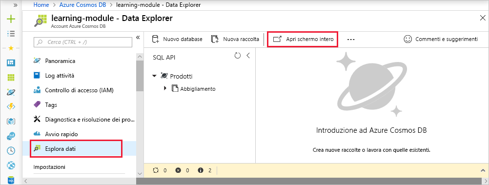
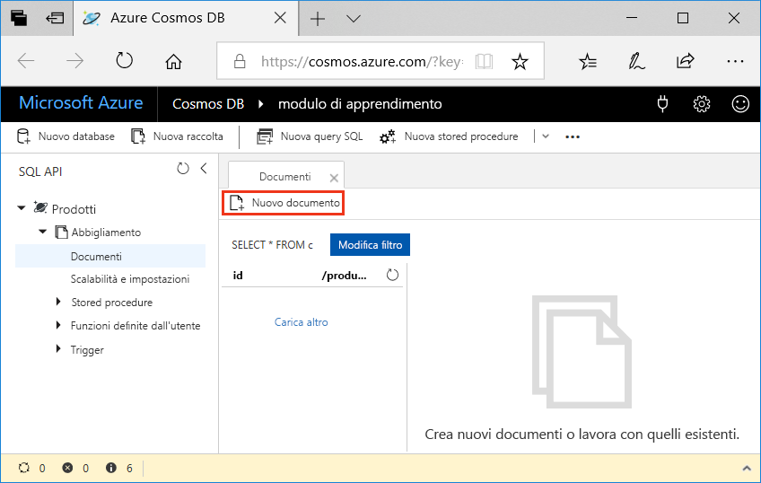
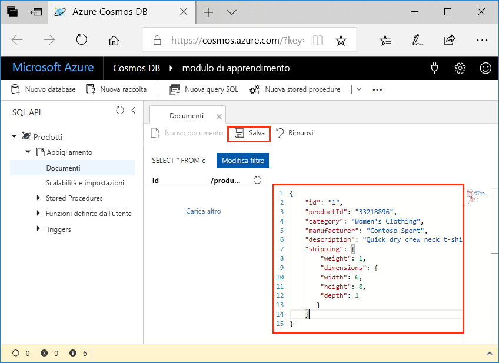

Aggiunta di dati a Azure Cosmos DB database è semplice. Si apre il portale di Azure, si passa al database e si usa Esplora dati per aggiungere documenti JSON al database. Sono disponibili anche modalità più avanzate per l'aggiunta di dati, ma si inizierà con Esplora dati dal momento che è un ottimo strumento per acquisire familiarità con le funzionalità e i meccanismi interni di Azure Cosmos DB.

## <a name="what-is-the-data-explorer"></a>Che cos'è Esplora dati?
Esplora dati di Azure Cosmos DB è uno strumento incorporato nel portale di Azure che consente di gestire i dati archiviati in un database di Azure Cosmos DB. Fornisce un'interfaccia utente per visualizzazione ed esplorazione di raccolte di dati, nonché per la modifica di documenti all'interno del database, la query sui dati e la creazione e l'esecuzione di stored procedure.

## <a name="add-data-using-the-data-explorer"></a>Aggiungere dati con Esplora dati

1. Accedi per il [portale di Azure](https://portal.azure.com/?azure-portal=true), fare clic su **tutti i servizi** > **database** > **Azure Cosmos DB**. Selezionare quindi l'account, fare clic su **Esplora dati**, quindi fare clic su **aperto a schermo intero**.
 
   

2. Nella casella **Apri a schermo intero** fare clic su **Apri**.

    Il browser Web visualizza la nuova finestra di Esplora dati a schermo intero, che offre maggior spazio e un ambiente dedicato per l'uso del database.

3. Per creare un nuovo documento JSON, nel riquadro di API SQL, espandere la **prodotti** > **Clothing**, fare clic su **documenti**, quindi fare clic su **nuovo documento** .

   

4. Aggiungere ora un documento alla raccolta con la struttura seguente. Copiare e incollare il codice seguente nella scheda **Documenti**:

     ```
    {
        "id": "1",
        "productId": "33218896",
        "category": "Women's Clothing",
        "manufacturer": "Contoso Sport",
        "description": "Quick dry crew neck t-shirt",
        "price": "14.99",
        "shipping": {
            "weight": 1,
            "dimensions": {
            "width": 6,
            "height": 8,
            "depth": 1
           }
        }
    }
     ```

5. Dopo avere aggiunto il codice JSON alla scheda **Documenti**, fare clic su **Salva**.

    

6. Creare e salvare un documento più scegliendo **nuovo documento** anche in questo caso e copiando l'oggetto JSON seguente in Esplora dati e facendo clic su **salvare**.

     ```
    {
        "id": "2",
        "productId": "33218897",
        "category": "Women's Outerwear",
        "manufacturer": "Contoso",
        "description": "Black wool pea-coat",
        "price": "49.99",
        "shipping": {
            "weight": 2,
            "dimensions": {
            "width": 8,
            "height": 11,
            "depth": 3
           }
        }
    }
     ```

7. Verificare che i documenti siano stati salvati facendo clic su **Documenti** nel menu a sinistra. 

    In Esplora dati i due documenti vengono visualizzati nella scheda **Documenti**.

## <a name="summary"></a>Riepilogo

In questo modulo sono stati aggiunti due documenti al database usando Esplora dati, ognuno dei quali rappresenta un prodotto nel catalogo. Esplora dati è un buon metodo per creare e modificare documenti, oltre che per iniziare a usare Azure Cosmos DB.  
