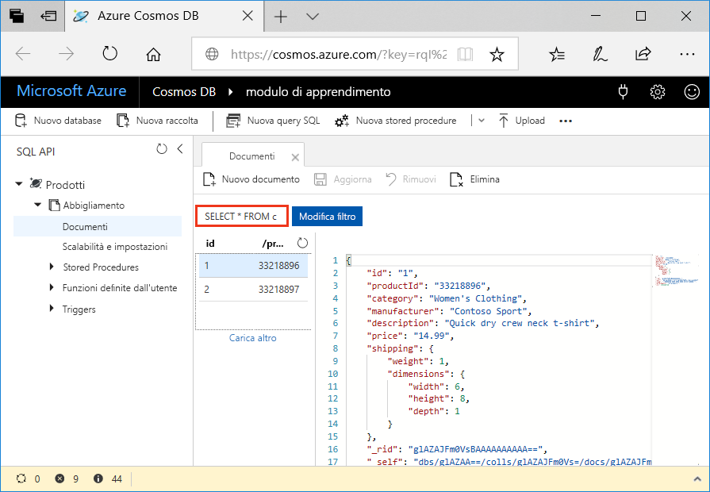
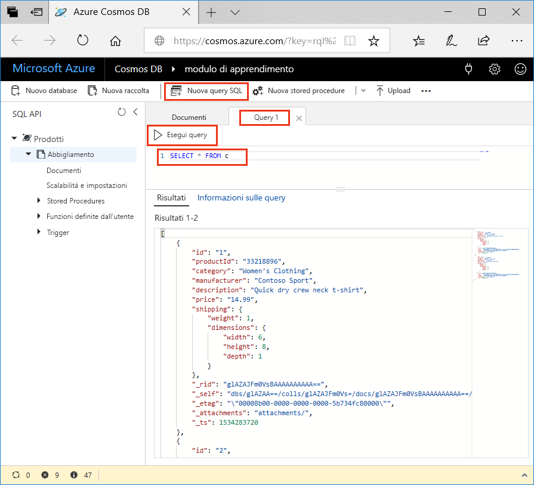
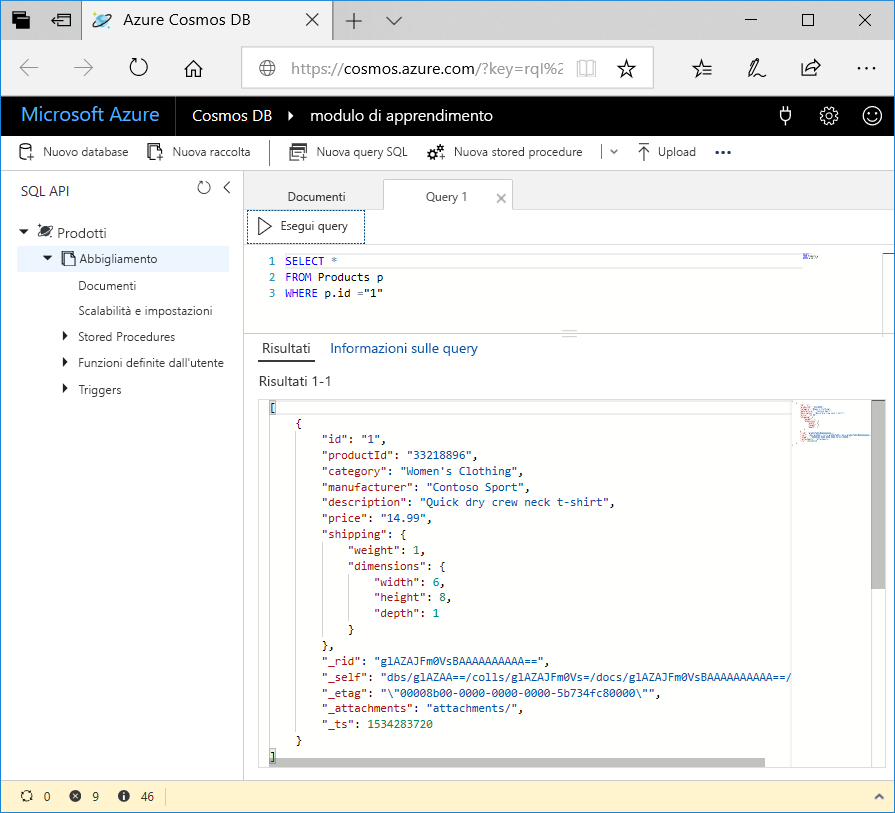

<span data-ttu-id="0775e-101">Ora che si è appreso quali tipi di query è possibile creare, si userà Esplora dati nel portale di Azure per recuperare e filtrare i dati dei prodotti.</span><span class="sxs-lookup"><span data-stu-id="0775e-101">Now that you've learned about what kinds of queries you can create, let's use the Data Explorer in the Azure portal to retrieve and filter your product data.</span></span>

<span data-ttu-id="0775e-102">Si noti che per impostazione predefinita nella finestra Esplora dati la query nella scheda **Documento** è impostata su `SELECT * FROM c`, come illustrato nella figura seguente.</span><span class="sxs-lookup"><span data-stu-id="0775e-102">In your Data Explorer window, note that by default, the query on the **Document** tab is set to `SELECT * FROM c` as shown in the following image.</span></span> <span data-ttu-id="0775e-103">La query predefinita recupera e visualizza tutti i documenti nella raccolta.</span><span class="sxs-lookup"><span data-stu-id="0775e-103">This default query retrieves and displays all documents in the collection.</span></span>



## <a name="create-a-new-query"></a><span data-ttu-id="0775e-105">Creare una nuova query</span><span class="sxs-lookup"><span data-stu-id="0775e-105">Create a new query</span></span>

1. <span data-ttu-id="0775e-106">In Esplora dati fare clic su **Nuova query SQL**.</span><span class="sxs-lookup"><span data-stu-id="0775e-106">In Data Explorer, click **New SQL Query**.</span></span> <span data-ttu-id="0775e-107">Si noti che la query predefinita nella nuova scheda **Query 1** è nuovamente `SELECT * from c`, che restituirà tutti i documenti nella raccolta.</span><span class="sxs-lookup"><span data-stu-id="0775e-107">Note that the default query on the new  **Query 1** tab is again `SELECT * from c`, which will return all documents in the collection.</span></span> 

1. <span data-ttu-id="0775e-108">Fare clic su **Esegui query**.</span><span class="sxs-lookup"><span data-stu-id="0775e-108">Click **Execute Query**.</span></span> <span data-ttu-id="0775e-109">Questa query restituisce tutti i risultati nel database.</span><span class="sxs-lookup"><span data-stu-id="0775e-109">This query returns all results in the database.</span></span>

    

2. <span data-ttu-id="0775e-111">A questo punto è possibile eseguire alcune query illustrate nell'unità precedente.</span><span class="sxs-lookup"><span data-stu-id="0775e-111">Now, let's run some of the queries discussed in the previous unit.</span></span> <span data-ttu-id="0775e-112">Nella scheda della query eliminare `SELECT * from c`, copiare e incollare la query seguente e quindi fare clic su **Esegui query**:</span><span class="sxs-lookup"><span data-stu-id="0775e-112">On the query tab, delete `SELECT * from c`, copy and paste the following query, and then click **Execute Query**:</span></span>

    ```sql
    SELECT * 
    FROM Products p 
    WHERE p.id ="1"
    ```

    <span data-ttu-id="0775e-113">I risultati restituiscono il prodotto dove `productId` è 1.</span><span class="sxs-lookup"><span data-stu-id="0775e-113">The results return the product whose `productId` is 1.</span></span>

    

3. <span data-ttu-id="0775e-115">Eliminare la query precedente, copiare e incollare la query seguente e fare clic su **Esegui query**.</span><span class="sxs-lookup"><span data-stu-id="0775e-115">Delete the previous query, copy and paste the following query, and click **Execute Query**.</span></span> <span data-ttu-id="0775e-116">Questa query restituisce il prezzo, la descrizione e l'ID prodotto per tutti i prodotti, ordinati in base al prezzo, in ordine crescente.</span><span class="sxs-lookup"><span data-stu-id="0775e-116">This query returns the price, description, and product ID for all products, ordered by price, in ascending order.</span></span>
 
    ```sql
    SELECT p.price, p.description, p.productId 
    FROM Products p 
    ORDER BY p.price ASC
    ```

## <a name="summary"></a><span data-ttu-id="0775e-117">Riepilogo</span><span class="sxs-lookup"><span data-stu-id="0775e-117">Summary</span></span>

<span data-ttu-id="0775e-118">Sono state ora completate alcune query di base sui dati in Azure Cosmos DB.</span><span class="sxs-lookup"><span data-stu-id="0775e-118">You have now completed some basic queries on your data in Azure Cosmos DB.</span></span> 