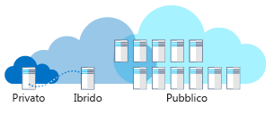

Si supponga di lavorare in un'azienda che opera nel settore sanitario.Imagine you work at a healthcare company. Sono disponibili sistemi legacy, sistemi line-of-business e piani futuri per nuovi sistemi.You have legacy systems, line of business systems, and future plans for new systems. Si è sentito parlare dei vantaggi del cloud computing.You've heard there are advantages to using cloud computing. Come si può scegliere il modello di distribuzione migliore per soluzioni diverse di cloud pubblico, privato o ibrido?How do you choose the best deployment model for different solutions: public, private, or hybrid cloud?

## Cos'è il cloud computing?What is cloud computing?

Il cloud computing è il provisioning di servizi e applicazioni su richiesta tramite Internet.Cloud computing is the provisioning of services and applications on demand over the internet. I server, le applicazioni, i dati e altre risorse vengono forniti come servizio.Servers, applications, data, and other resources are provided as a service. 

I dettagli dei servizi sono nascosti all'utente.To the user, the details of the services are abstracted. È possibile effettuare rapidamente il provisioning delle risorse di calcolo e usare il servizio con interventi minimi di gestione.You can quickly provision computing resources and use the service with minimal management. Non è corretto pensare al cloud computing come a un data center disponibile tramite Internet.You shouldn't think of cloud computing as a datacenter available through the internet. Il cloud computing usa la virtualizzazione, hardware commerciale e processi automatizzati per offrire un'esperienza utente self-service ai clienti, in modo analogo a un servizio di pubblica utilità.Cloud computing uses virtualization, commodity hardware, and automated processes to provide a self-service user experience to customers similar to a public utility.

Esistono tre modelli di distribuzione per il cloud computing: cloud pubblico, cloud privato e cloud ibrido.There are three deployment models for cloud computing: public cloud, private cloud, and hybrid cloud. La figura seguente mostra una panoramica di questi modelli di distribuzione.The following illustration shows an overview of these deployment models.

#### Pubblico, privato o ibridoPublic versus Private versus Hybrid

> [!VIDEO https://www.microsoft.com/videoplayer/embed/RE2yEv7]

## Cloud pubblicoPublic cloud

I cloud pubblici rappresentano il modo più comune di distribuzione del cloud computing.Public clouds are the most common way of deploying cloud computing. I servizi vengono offerti attraverso la rete Internet pubblica e sono disponibili per chiunque voglia acquistarli.Services are offered over the public internet and available to anyone who wants to purchase them. Le risorse del cloud, ad esempio i server e l'archiviazione, sono di proprietà e gestite da un provider di servizi cloud di terze parti e vengono offerte tramite Internet.The cloud resources such as servers and storage are owned and operated by a third-party cloud service provider and delivered over the internet. I servizi possono essere gratuiti o venduti su richiesta, in modo da consentire ai clienti di pagare solo per i cicli della CPU, lo spazio di archiviazione o la larghezza di banda utilizzati.Services may be free or sold on demand, allowing customers to pay only per usage for the CPU cycles, storage, or bandwidth they consume. Microsoft Azure è un esempio di cloud pubblico.Microsoft Azure is an example of a public cloud. 

Si immagini che la propria società che opera nel settore sanitario voglia realizzare un sito Web per la registrazione.Let's imagine your healthcare company needs an enrollment website. Il sito deve adattarsi ed essere reattivo durante i picchi di registrazioni in diversi momenti nel corso dell'anno.The site needs to scale and be responsive during peak enrollment various times during the year. I clienti accedono al sito da località globali.Your customers access the site from global locations. È possibile usare il cloud pubblico per la scalabilità automatica per soddisfare le richieste al momento dei picchi di registrazioni.You can use the public cloud to automatically scale up to meet demand at peak enrollment. Quando il traffico del sito è basso, il sito può essere ridimensionato riducendo le risorse per risparmiare.When site traffic is low, your site can scale down to save costs. Il sito è reattivo ai picchi della domanda e si pagano risorse aggiuntive solo quando necessario.Your site is responsive at peak demand, and you only pay for more resources when needed. È anche possibile distribuire il sito Web in più aree geografiche per migliorare l'affidabilità e la velocità di risposta.You can also deploy your website in multiple geographic regions to increase reliability and responsiveness.

Durante lo sviluppo del sito Web, gli sviluppatori vogliono creare più ambienti di sviluppo per velocizzare il processo di sviluppo.During the development of your website, developers want to create multiple development environments to speed their development process. Gli sviluppatori possono usare il cloud pubblico per effettuare rapidamente il provisioning di macchine virtuali per ambienti sandbox per sviluppare una soluzione.Developers can use the public cloud to quickly provision virtual machines for sandboxed environments to develop a solution. Quando gli sviluppatori non hanno più bisogno di un ambiente, possono eliminarlo.When the developers no longer need an environment, they can delete it.

### Perché scegliere un cloud pubblico?Why public cloud?

I cloud pubblici possono essere distribuiti più rapidamente rispetto alle infrastrutture locali e con una piattaforma scalabile quasi all'infinito.Public clouds can be deployed faster than on-premises infrastructures and with an almost infinitely scalable platform. Tutti i dipendenti di una società possono usare la stessa applicazione da qualsiasi ufficio o succursale con il dispositivo preferito, purché abbiano accesso a Internet.Every employee of a company can use the same application from any office or branch using their device of choice as long as they can access the internet. 

Esempi dei motivi per usare il cloud pubblico:Examples of why you would use public cloud:

- **Utilizzo del servizio tramite il modello su richiesta o con sottoscrizione:** il modello su richiesta o con sottoscrizione consente di pagare per la parte di CPU, archiviazione e altre risorse usate o prenotate.**Service consumption through on-demand or subscription model:** The on-demand or subscription model allows you to pay for the portion of CPU, storage, and other resources that you use or reserve.
- **Nessun investimento anticipato per l'hardware:** non occorre acquistare, gestire e mantenere aggiornato l'hardware e l'infrastruttura applicativa in locale.**No up-front investment of hardware:** No requirement to purchase, manage, and maintain on-premises hardware and application infrastructure. Il provider di servizi cloud è interamente responsabile per la gestione e la manutenzione del sistema.The cloud service provider is held responsible for all management and maintenance of the system. 
- **Automazione:** è possibile effettuare velocemente il provisioning delle risorse di infrastruttura tramite un portale Web, script o automaticamente.**Automation:** Quickly provision infrastructure resources using a web portal, scripts, or via automation. 
- **Dispersione geografica:** è possibile archiviare i dati vicino agli utenti o in località specifiche, senza la necessità di gestire i propri data center.**Geographic dispersity:** Store data near your users, or in desired locations without having to maintain your own datacenters.
- **Manutenzione dell'hardware ridotta:** la manutenzione dell'hardware è una responsabilità del provider di servizi.**Reduced hardware maintenance:** The service provider is responsible for hardware maintenance.

## Cloud privatoPrivate cloud

Un cloud privato è costituito da risorse di calcolo usate esclusivamente da utenti di un'azienda o un'organizzazione.A private cloud consists of computing resources used exclusively by users from one business or organization. Può essere collocato fisicamente nel data center locale dell'organizzazione oppure ospitato da un provider di servizi di terze parti.It can be physically located at your organization’s on-site datacenter, or it can be hosted by a third-party service provider. Il termine cloud privato non deve essere considerato semplicemente un nuovo nome per definire i data center locali tradizionali.The term private cloud should not be considered a rebranding of traditional on-premises datacenters. Un cloud privato usa l'infrastruttura e i servizi locali per offrire vantaggi simili a quelli del cloud pubblico.A private cloud uses on-premises infrastructure and services to provide similar benefits of the public cloud. Usa una piattaforma di astrazione per fornire servizi *tipo cloud*, ad esempio i cluster Kubernetes o un ambiente cloud completo, come Azure Stack.It uses an abstraction platform to provide *cloud-like* services such as Kubernetes clusters or a complete cloud environment like Azure Stack. L'organizzazione è responsabile di acquisto, configurazione e manutenzione dell'hardware.The organization is responsible for the purchase, configuration, and maintenance of the hardware. La comunicazione tra i sistemi avviene in genere con un'infrastruttura di rete di proprietà dell'azienda e gestita dall'azienda.Communication between the systems is usually on the network infrastructure that the business owns and maintains. Ad esempio, una rete interna privata o una connessione dedicata in fibra ottica tra edifici.For example, a private internal network or a dedicated fiber optic connection between buildings.

Si supponga di lavorare in un'azienda del settore sanitario e di avere un'applicazione usata in uno dei data center dell'azienda.Imagine you work at healthcare company and you have an application that is in use at one of your datacenters. L'ambiente operativo non può essere replicato nel cloud pubblico.The operating environment can't be replicated in the public cloud. Subentra una nuova richiesta di accedere ai dati in un altro dei data center dell'azienda.You have a new requirement to access data at another one of your datacenters. Il database che contiene i dati deve rimanere nell'altro sito, per conformità alle normative.The database containing the data needs to remain at the other site because of regulatory compliance. Questo scenario è un cloud privato.This scenario is a private cloud. Sono disponibili due data center di proprietà dell'organizzazione.You have two datacenters your organization owns. È possibile usare una VPN del cloud pubblico tramite Internet per connettere i data center.You could use a public cloud VPN over the internet to connect the datacenters. Questo scenario verrebbe comunque considerato un cloud privato perché la soluzione è privata per l'organizzazione.However, the scenario would be considered a private cloud since the solution is private to the organization.

### Perché scegliere un cloud privato?Why private cloud?

Un cloud privato può offrire una maggiore flessibilità a un'organizzazione.A private cloud can provide more flexibility to an organization. L'organizzazione può personalizzare il proprio ambiente cloud per soddisfare specifiche esigenze aziendali.Your organization can customize its cloud environment to meet specific business needs. Dato che le risorse non sono condivise con altri, sono possibili livelli elevati di sicurezza e controllo.Since resources are not shared with others, high levels of control and security are possible. Inoltre, i cloud privati possono offrire buoni livelli di efficienza e scalabilità.Also, private clouds can provide a level of scalability and efficiency.

Esempi dei motivi per usare il cloud privato:Examples of why you would use private cloud:

- **Ambiente pre-esistente:** un ambiente operativo esistente che non può essere replicato nel cloud pubblico.**Pre-existing environment:** An existing operating environment that can't be replicated in the public cloud. Investimenti hardware notevoli e dipendenti con competenze specifiche.A large investment in hardware and employees with solution expertise. Una grande organizzazione può scegliere di commodotizzare le risorse di calcolo.A large organization may choose to commoditize their computing resources.
- **Applicazioni legacy:** applicazioni legacy business critical che non possono essere facilmente ricollocate fisicamente.**Legacy applications:** Business-critical legacy applications that can't easily be physically relocated.
- **Sovranità e sicurezza dei dati:** possono esistere confini politici e requisiti legali che impongono la posizione fisica dei dati.**Data sovereignty and security:** Political borders and legal requirements may dictate where data can physically exist.
- **Conformità alle normative/certificazione:** conformità HIPAA o PCI.**Regulatory compliance / certification:**  PCI or HIPAA compliance. Data center locale certificato.Certified on-premises datacenter.

## Cloud ibridoHybrid cloud

Un cloud ibrido è un ambiente di elaborazione che combina un cloud pubblico e un cloud privato, consentendo la condivisione tra i cloud di dati e applicazioni.A hybrid cloud is a computing environment that combines a public cloud and a private cloud by allowing data and applications to be shared between them. Quando la domanda di elaborazione e calcolo è fluttuante, il cloud computing ibrido offre alle aziende la possibilità di ridimensionare facilmente la propria infrastruttura locale fino al cloud pubblico per gestire eventuali overflow, senza concedere ai data center di terze parti l'accesso a tutti i dati proprietari.When computing and processing demand fluctuates, hybrid cloud computing gives businesses the ability to seamlessly scale their on-premises infrastructure up to the public cloud to handle any overflow - without giving third-party datacenters access to the entirety of their data. Le organizzazioni possono usufruire della flessibilità e della potenza di calcolo del cloud pubblico per attività di calcolo semplici e non sensibili, mantenendo le applicazioni e i dati business critical in locale, ben protetti da un firewall aziendale.Organizations gain the flexibility and computing power of the public cloud for basic and non-sensitive computing tasks, while keeping business-critical applications and data on-premises, safely behind a company firewall.

L'uso di un cloud ibrido consente di evitare investimenti per gestire picchi di breve durata della domanda.Using a hybrid cloud helps eliminate the need to make up-front capital expenditures to handle short-term spikes in demand. Offre anche la flessibilità di decidere quali risorse mantenere in locale e quali usare nel cloud.It also has the flexibility to manage which resources are local versus resources in the cloud. Le aziende pagano solo le risorse che usano temporaneamente invece di dover acquistare, programmare e gestire ulteriori risorse e apparecchiature, che potrebbero rimanere inattive per lunghi periodi di tempo.Companies pay only for resources they temporarily use instead of having to purchase, program, and maintain additional resources and equipment that could remain idle over long periods of time. L'integrazione avviene in genere tramite una VPN sicura tra il provider di servizi cloud, come Azure, e i data center locali.Integration is generally through a secure VPN between cloud providers like Azure and on-premises datacenters.

Si supponga di lavorare in un'azienda del settore sanitario e di avere un'applicazione con la quale i clienti possono accedere alle loro informazioni sanitarie.Imagine you work at healthcare company and you have an application where customers can access their healthcare information. Una normativa richiede che i dati rimangano in una posizione fisica.A regulation requires that the data needs to remain at a physical location. Il sito Web del cliente deve essere efficiente nel rispondere a molti utenti globali.The customer website needs to be responsive to their many global users.  Come soluzione, il database può essere ospitato in un data center locale e il sito Web può essere ospitato nel cloud pubblico.As a solution, the database could be hosted in an on-premises datacenter and the website could be hosted in the public cloud. Viene usata una VPN tra il data center locale e il cloud pubblico.A VPN is used between the on-premises datacenter and the public cloud. Questo scenario viene considerato un cloud ibrido.This scenario would be considered a hybrid cloud.

### Perché scegliere un cloud ibrido?Why hybrid cloud?

Il cloud ibrido consente alle organizzazioni di controllare e mantenere un'infrastruttura privata per gli asset riservati.Hybrid cloud allows your organization to control and maintain a private infrastructure for sensitive assets. Offre anche la flessibilità di sfruttare le risorse aggiuntive nel cloud pubblico all'occorrenza.It also gives you the flexibility to take advantage of additional resources in the public cloud when you need them. Grazie alla possibilità di ricorrere alle risorse nel cloud pubblico quando servono, si paga per potenza di calcolo aggiuntiva solo quando necessario.With the ability to scale to the public cloud, you pay for extra computing power only when needed. La transizione al cloud risulta inoltre facilitata.It can also ease transitioning to the cloud. È possibile eseguire la migrazione in modo graduale per i vari carichi di lavoro nel corso del tempo.You can migrate gradually by phasing in workloads over time.

Esempi dei motivi per usare il cloud ibrido:Examples of why you would use hybrid cloud:

- **Investimenti hardware esistenti:** per motivi aziendali è richiesto l'uso di un ambiente operativo e di hardware esistenti.**Existing hardware investment:** Business reasons require that you use an existing operating environment and hardware.
- **Requisiti legali:** una normativa richiede che i dati rimangano in una posizione fisica.**Regulatory requirements:** Regulation requires that the data needs to remain at a physical location.
- **Ambiente operativo univoco:** un cloud pubblico non può replicare un ambiente operativo legacy.**Unique operating environment:** Public cloud can't replicate a legacy operating environment.
- **Migrazione:**: spostare i carichi di lavoro nel cloud nel corso del tempo.**Migration:** Move workloads to the cloud over time.
