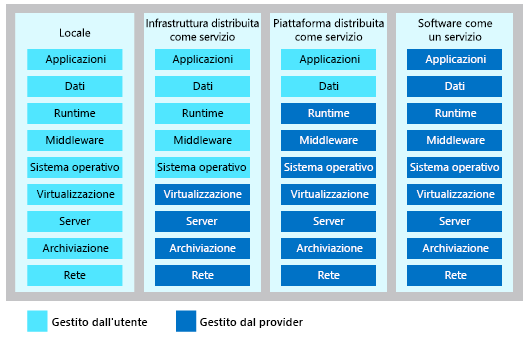

Le risorse di calcolo del cloud vengono distribuite con tre modelli di servizio diverso.Cloud computing resources are delivered using three different service models.

- **IaaS (Infrastructure-as-a-service)** offre un'infrastruttura di calcolo di accesso immediato di cui è possibile effettuare il provisioning e che può essere gestita tramite Internet.**Infrastructure-as-a-service (IaaS)** provides instant computing infrastructure that you can provision and managed over the Internet.
- **PaaS (Platform-as-a-service)** offre ambienti di sviluppo e distribuzione pronti che è possibile usare per fornire servizi cloud personalizzati.**Platform as a service (PaaS)** provides ready-made development and deployment environments that you can use to deliver your own cloud services.
- **SaaS (Software-as-a-service)** offre applicazioni tramite Internet come servizio basato sul Web.**Software as a service (SaaS)** delivers applications over the Internet as a web-based service.

Per la scelta di un modello di servizio, valutare quale parte deve essere responsabile per la risorsa di calcolo.When choosing a service model, consider which party should be responsible for the computing resource. In base allo scenario, è possibile decidere quante responsabilità di gestione condivise si vogliono assumere.Based on your scenario, you can decide how much shared management responsibility you want.

## IaaSIaaS

IaaS (Infrastructure-as-a-service) è un'infrastruttura di calcolo di accesso immediato di cui è viene effettuato il provisioning e che viene gestita tramite Internet.Infrastructure as a service is an instant computing infrastructure, provisioned and managed over the Internet. IaaS consente di ridimensionare rapidamente le risorse per soddisfare la domanda e pagare solo per le risorse usate.IaaS enables you to quickly scale resources to meet demand and only pay for what you use. IaaS consente di evitare i costi e le complicazioni legati all'acquisto e alla gestione di server fisici propri e di altri elementi dell'infrastruttura del data center.IaaS avoids the expense and complexity of buying and managing your own physical servers and other datacenter infrastructure. Ogni risorsa viene offerta come un componente del servizio separato e si *noleggiano* le risorse fino a quando servono.Each resource is offered as a separate service component, and you *rent* the resource as long as you need it. Di conseguenza, il modello IaaS è molto flessibile.As a result, IaaS is very flexible. È possibile eseguire il provisioning dell'infrastruttura comune, ad esempio macchine virtuali, archiviazione, subnet virtuali, firewall, e VPN per creare una soluzione.You can provision common infrastructure such as VMs, storage, virtual subnets, firewalls, and VPN's to build a solution. Non è necessario gestire le appliance e i server fisici.You don't need to manage physical servers and appliances. Tuttavia, si è responsabili direttamente della configurazione e della gestione dei componenti.However, you are responsible for direct management configuring and managing the components. Ad esempio, la configurazione dei firewall, l'aggiornamento del sistema operativo delle macchine virtuali, l'aggiornamento dei sistemi DBMS e dei runtime.For example, configuring firewalls, updating VM OS's, updating DBMS's, and runtimes.

### Scenari comuniCommon scenarios 

Si supponga che la propria società che opera nel settore sanitario abbia la necessità di eseguire una versione speciale di software desktop.Let's imagine your healthcare company has a need to run a special version of desktop software. Il software è supportato solo in una versione specifica di un sistema operativo e sono necessari un solo utente e una licenza.The software is only supported on a specific version of an operating system and only one user and license is required. È possibile creare una macchina virtuale con il software richiesto.You can create a virtual machine with the required software. L'utente può usare desktop remoto per connettersi alla macchina virtuale per usare il software.The user can use remote deskop to connect to the virtual machine to use the software.

Si consideri un altro scenario.Let's imagine another scenario. I team di sviluppo devono avere a disposizione vari ambienti di sviluppo univoci.Your development teams need several unique development environments. Durante il ciclo di sviluppo, hanno la necessità di testare diverse versioni del prodotto.Through the development cycle, they need to test various versions of the product. Gli sviluppatori possono eseguire il provisioning degli ambienti all'occorrenza.The developers can provision environments when needed. Quando un ambiente non è più necessario, può essere eliminato facilmente.When an environment is no longer needed, it can be easily deleted.

Alcuni altri scenari comuni includono:Some other common scenarios include:

**Hosting di siti Web:** se serve maggiore controllo per l'hosting di un sito Web, l'esecuzione di siti Web con il modello IaaS può essere un'opzione migliore rispetto all'hosting Web tradizionale.**Website hosting:** If you want more control of hosting a website, running websites using IaaS may be a better option than traditional web hosting.

**App Web:** IaaS fornisce tutta l'infrastruttura per supportare le app Web, tra cui archiviazione, server Web e server applicazioni e risorse di rete.**Web apps:** IaaS provides all the infrastructure to support web apps, including storage, web and application servers, and networking resources. Le organizzazioni possono distribuire rapidamente app Web con il modello IaaS e ridimensionare facilmente l'infrastruttura quando la richiesta per le app è imprevedibile.Organizations can quickly deploy web apps on IaaS and easily scale infrastructure up and down when demand for the apps is unpredictable.

**Archiviazione, backup e ripristino:** la gestione dell'archiviazione può essere complessa e richiedere notevoli investimenti di capitale e personale esperto per la gestione dei dati e per soddisfare i requisiti legali e di conformità.**Storage, backup, and recovery:** Storage management can be complex requiring a large capital investment and skilled staff to manage data and meet legal and compliance requirements. IaaS può essere utile per semplificare la pianificazione, la gestione, richieste imprevedibili ed esigenze di archiviazione in continua crescita.IaaS can help simplify planning, managment, unpredictable demand, and steadily growing storage needs.

**Calcoli ad alte prestazioni:** in presenza di un carico di lavoro che richiede calcoli ad alte prestazioni, è possibile eseguire il carico di lavoro nel cloud evitando di anticipare costi per l'hardware e pagando solo a consumo quando necessario.**High-performance computing:** If you have a workload that requires high-performance computing, you can run the workload in the cloud avoiding the up-front cost of the hardware and only pay for the usage when needed. 

**Analisi dei big data:** con set di dati di grandi dimensioni che contengono modelli, tendenze e associazioni potenzialmente preziosi, IaaS può offrire la potenza di elaborazione per eseguire il data mining nei set di dati per individuare i modelli.**Big data analysis:** If you have large data sets that contain potentially valuable patterns, trends, and associations, IaaS can provide the processing power to mine data sets to locate patterns.

### VantaggiAdvantages

**Elimina le spese in conto capitale e riduce i costi correnti:** IaaS consente di evitare la spesa iniziale per la configurazione e la gestione di un data center locale e rappresenta quindi un'opzione conveniente per le startup e le aziende che vogliono mettere alla prova idee innovative.**Eliminates capital expense and reduces ongoing cost:** IaaS sidesteps the upfront expense of setting up and managing an on-site datacenter, making it an economical option for start-ups and businesses testing new ideas. Non appena si decide di lanciare un nuovo prodotto o una nuova iniziativa, l'infrastruttura di calcolo necessaria può essere pronta in minuti o ore, anziché richiedere giorni o settimane o persino mesi, come nel caso di una configurazione interna.As soon as you’ve decided to launch a new product or initiative, the necessary computing infrastructure can be ready in minutes or hours, rather than the days or weeks—and sometimes months—it could take to set up internally.

**Migliora la continuità aziendale e il ripristino di emergenza :** implementare soluzioni per disponibilità elevata, continuità aziendale e ripristino di emergenza è costoso, perché richiede una quantità significativa di tecnologia e personale.**Improves business continuity and disaster recovery:** Achieving high availability, business continuity, and disaster recovery is expensive, since it requires a significant amount of technology and staff. Ma con un contratto di servizio (SLA) appropriato, IaaS può ridurre questi costi e consentire l'accesso alle applicazioni e ai dati come di consueto durante un'emergenza o un'interruzione del servizio.But with the right service level agreement (SLA) in place, IaaS can reduce this cost and access applications and data as usual during a disaster or outage.

**Rispondere più velocemente a condizioni aziendali mutevoli:** IaaS consente di aumentare rapidamente le risorse per rispondere a picchi della domanda per l'applicazione, ad esempio durante un periodo festivo, quindi ridurle nuovamente quando l'attività diminuisce per risparmiare.**Respond quicker to shifting business conditions:** IaaS enables you to quickly scale up resources to accommodate spikes in demand for your application— during the holidays, for example—then scale resources back down again when activity decreases to save money. Dato che non è necessario configurare l'infrastruttura prima di poter sviluppare e distribuire le app, è possibile renderle disponibili più rapidamente agli utenti con IaaS.Because you don’t need to first set up the infrastructure before you can develop and deliver apps, you can get them to users faster with IaaS.

**Aumentare stabilità, affidabilità e supportabilità:** con IaaS non vi è alcuna necessità di gestire e aggiornare software e hardware o risolvere i problemi delle apparecchiature.**Increase stability, reliability, and supportability:** With IaaS there’s no need to maintain and upgrade software and hardware or troubleshoot equipment problems. Con il contratto appropriato, il provider di servizi garantisce che l'infrastruttura sia affidabile e che soddisfi i contratti di servizio.With the appropriate agreement in place, the service provider assures that your infrastructure is reliable and meets SLAs.

## PaaSPaaS

PaaS (Platform-as-a-service) è un ambiente di sviluppo e distribuzione completo nel cloud.Platform as a service is a complete development and deployment environment in the cloud. Con PaaS è possibile sviluppare e distribuire semplici app basate sul cloud fino ad applicazioni aziendali sofisticate abilitate per il cloud.With PaaS, you can to build and deploy everything from simple cloud-based apps to sophisticated, cloud-enabled enterprise applications. Le risorse vengono acquistate da un provider di servizi cloud con pagamento a consumo e sono accessibili tramite una connessione Internet sicura.You purchase the resources from a cloud service provider on a pay-as-you-go basis and access them over a secure Internet connection. Come IaaS, un ambiente PaaS include l'infrastruttura, ad esempio i server, l'archiviazione e la rete.Like IaaS, PaaS includes infrastructure such as servers, storage, and networking. Include inoltre il middleware, gli strumenti di sviluppo e altri servizi.In addition, it also includes middleware, development tools, and other services. PaaS supporta il ciclo di vita completo delle applicazioni Web: sviluppo, test, distribuzione, gestione e aggiornamento.PaaS supports the complete web application lifecycle: building, testing, deploying, managing, and updating. Con PaaS non occorre gestire le licenze software, il middleware e l'infrastruttura dei servizi.PaaS removes the need to manage software licenses, middleware, and infrastructure of the services. Rimane invece necessario gestire le applicazioni e i servizi sviluppati, mentre la gestione di tutto il resto è in genere a carico del provider dei servizi cloud.You manage the applications and services you develop, and the cloud service provider typically manages everything else.

### Scenari comuniCommon scenarios

Si immagini che la propria società che opera nel settore sanitario voglia realizzare un sito Web per descrivere un prodotto.Let's imagine your healthcare company needs a website to describe a product. Gli sviluppatori vogliono usare PHP.Your developers want to use PHP. Con PaaS, gli sviluppatori hanno la possibilità di *creare un'app Web*.Using PaaS, your developers have the option to *create a web app*. I dettagli dell'infrastruttura, ad esempio la creazione di una macchina virtuale, l'installazione di un server Web e l'installazione del middleware non rientrano tra le attività da completare.The infrastructure details such as creating a virtual machine, installing a web server, and installing middleware are abstracted away. Non è necessario preoccuparsi del sistema operativo o del tipo di hardware fisico richiesti.You don't need to care what operating system it runs on or what physical hardware is required. Gli sviluppatori distribuiscono i file del sito Web nel cloud e il sito Web è disponibile su Internet.Your developers deploy the website files to the cloud and your website is available on the Interenet.

Si consideri un altro scenario.Let's imagine another scenario. L'azienda necessita di un database SQL per supportare gli analisti dei dati per un progetto speciale.Your company needs a SQL database to support data analysts for a special project. Non si dispone dell'infrastruttura per soddisfare la richiesta.You don't have infrastructure to accomodate the request. È possibile eseguire rapidamente il provisioning di un server SQL nel cloud che soddisfa le esigenze del progetto.You can quickly provision a SQL Server in the cloud that meets the need of the project. Gli analisti dei dati possono connettersi al server oppureThe data analyts can connect to the server or. Il database di SQL Server viene fornito come servizio.The SQL Server database is provided as a service. Pertanto, non occorre preoccuparsi di aggiornamenti, patch di sicurezza o dell'ottimizzazione dello spazio di archiviazione fisico per letture e scritture.Therefore, you don't worry about updates, security patches, or optimizing physical storage for reads and writes.

Alcuni altri scenari comuni includono:Some other common scenarios include:

**Framework di sviluppo:** PaaS fornisce un framework su cui si possono basare gli sviluppatori per sviluppare o personalizzare applicazioni basate sul cloud.**Development framework:** PaaS provides a framework that developers can build upon to develop or customize cloud-based applications. Analogamente al modo in cui si crea una macro di Excel, PaaS consente agli sviluppatori di creare applicazioni usando componenti software predefiniti.Similar to the way you create an Excel macro, PaaS lets developers create applications using built-in software components. Le funzionalità del cloud, ad esempio scalabilità, disponibilità elevata e multi-tenant sono incluse e si riduce così la quantità di codice che gli sviluppatori devono scrivere.Cloud features such as scalability, high-availability, and multi-tenant capability are included, reducing the amount of coding that developers must do.

**Analisi o business intelligence:** gli strumenti di analisi forniti come servizio consentono di analizzare i dati ed eseguire operazioni di data mining.**Analytics or business intelligence:** Analysis tools provided as a service allow you to analyze and mine data. Le organizzazioni possono trovare informazioni dettagliate e modelli per stimare i risultati per migliorare le previsioni, le decisioni per la progettazione dei prodotti, il ritorno sugli investimenti e altre decisioni aziendali.Organizations can find insights and patterns to predict outcomes to improve forecasting, product design decisions, investment returns, and other business decisions.

### VantaggiAdvantages

Offrendo un'infrastruttura distribuita come servizio, PaaS garantisce vantaggi simili a quelli del modello IaaS.By delivering infrastructure as a service, PaaS has similar advantages as IaaS. Ma le funzionalità aggiuntive, tra cui middleware, strumenti di sviluppo e altri strumenti aziendali, garantiscono ulteriori vantaggi:But its additional features including middleware, development tools, and other business tools provide additional advantages:

**Riduzione dei tempi di sviluppo:** gli strumenti di sviluppo PaaS possono ridurre i tempi di sviluppo per le nuove applicazioni.**Reduced development time:** PaaS development tools can reduce development time for new applications. Gli sviluppatori possono usare componenti applicativi pre-codificati integrati nella piattaforma, ad esempio flusso di lavoro, servizi di directory, funzionalità di sicurezza e ricerca.Developers can use pre-coded application components built into the platform, such as workflow, directory services, security features, and search. I componenti PaaS possono offrire nuove potenzialità al team di sviluppo senza dover assumere personale con le competenze necessarie.Platform as a service components can give your development team new capabilities without you needing to add staff having the required skills.

**Sviluppo per più piattaforme:** alcuni provider di servizi offrono opzioni di sviluppo per più piattaforme, ad esempio desktop, dispositivi mobili e browser, rendendo lo sviluppo di app multipiattaforma più veloce e più semplice.**Develop for multiple platforms:** Some service providers give you development options for multiple platforms, such as desktop, mobile devices, and browsers making cross-platform apps quicker and easier to develop.

**Uso conveniente di strumenti sofisticati:** grazie al modello di pagamento a consumo, sia i singoli che le organizzazioni hanno la possibilità di usare strumenti avanzati di sviluppo, business intelligence e analisi, che non potrebbero permettersi di acquistare.**Use sophisticated tools affordably:** A pay-as-you-go model makes it possible for individuals or organizations to use sophisticated development software and business intelligence and analytics tools that they could not afford to purchase outright.

**Supporto di team di sviluppo distribuiti geograficamente:** dato che si accede all'ambiente di sviluppo tramite Internet, i team di sviluppo possono collaborare ai progetti anche quando i membri del team si trovano in località remote.**Support geographically distributed development teams:** Because the development environment is accessed over the Internet, development teams can work together on projects even when team members are in remote locations.

**Gestione efficiente del ciclo di vita delle applicazioni:** PaaS offre tutte le funzionalità necessarie per supportare il ciclo di vita completo delle applicazioni Web, ovvero sviluppo, test, distribuzione, gestione e aggiornamento all'interno dello stesso ambiente integrato.**Efficiently manage the application lifecycle:** PaaS provides all of the capabilities that you need to support the complete web application lifecycle: building, testing, deploying, managing, and updating within the same integrated environment.

## SaaSSaaS

Il modello SaaS (Software-as-a-service) consente agli utenti di connettersi ad app basate sul cloud ed usarle tramite Internet.Software as a service allows users to connect to and use cloud-based apps over the Internet. Esempi comuni sono gli strumenti di posta elettronica, per il calendario e per l'ufficio, come Microsoft Office 365.Common examples are email, calendaring, and office tools such as Microsoft Office 365. SaaS offre una soluzione software completa che è possibile acquistare con pagamento al consumo da un provider di servizi cloud.SaaS provides a complete software solution that you purchase on a pay-as-you-go basis from a cloud service provider. Si *noleggia* l'uso di un'applicazione per l'organizzazione.You *rent* the use of an application for your organization. Gli utenti si connettono al servizio tramite Internet, in genere con un Web browser.Your users connect to the service over the Internet, usually with a web browser. Tutta l'infrastruttura sottostante, il middleware, il software delle app e i dati delle app si trovano nel data center del provider di servizi.All of the underlying infrastructure, middleware, app software, and app data are located in the service provider’s data center. Il provider di servizi gestisce hardware e software e, con un contratto di servizio appropriato, garantirà la disponibilità e la sicurezza dell'app e anche dei dati.The service provider manages the hardware and software, and with the appropriate service agreement, will ensure the availability and the security of the app and your data as well. Le soluzioni SaaS consentono all'organizzazione di essere rapidamente operativa con un'app con costi iniziali minimi.SaaS allows your organization to get quickly up and running with an app at minimal upfront cost.

Gli utenti che hanno usato un servizio di posta elettronica basato sul Web, come Outlook, Hotmail o Yahoo!If you’ve used a web-based email service such as Outlook, Hotmail, or Yahoo! Mail, hanno già usato un tipo di soluzione SaaS.Mail, then you’ve already used a form of SaaS. Con questi servizi, si accede all'account personale tramite Internet, spesso da un Web browser.With these services, you log into your account over the Internet, often from a web browser. Il software di posta elettronica si trova nella rete del provider di servizi e anche i messaggi vengono archiviati in tale rete.The email software is located on the service provider’s network, and your messages are stored there as well. È possibile accedere alla posta elettronica e ai messaggi archiviati da un Web browser su qualsiasi computer o dispositivo connesso a Internet.You can access your email and stored messages from a web browser on any computer or Internet-connected device.

### Scenari comuniCommon scenarios

Si immagini che una società che opera nel settore sanitario abbia necessità di una soluzione CRM (Customer Relationship Management) per il team di vendita.Let's imagine your healthcare company requires a customer relationship management (CRM) solution for its sales team. Il team è globale.The team is global. È possibile usare un provider CRM SaaS per implementare rapidamente una soluzione per il team di vendita dell'organizzazione.You can use a SaaS CRM provider to quickly implement a solution to your organization's sales team.

Per l'uso nell'organizzazione, è possibile noleggiare app per la produttività, ad esempio posta elettronica, collaborazione e calendario, e applicazioni aziendali sofisticate, ad esempio CRM, ERP (Enterprise Resource Planning) e per la gestione dei documenti.For organizational use, you can rent productivity apps, such as email, collaboration, and calendaring; and sophisticated business applications such as customer relationship management (CRM), enterprise resource planning (ERP), and document management. Si paga per l'uso di queste app tramite abbonamenti o in base al livello di utilizzo.You pay for the use of these apps by subscription or according to the level of use.

### VantaggiAdvantages

**Ottenere l'accesso ad applicazioni sofisticate:** per fornire app SaaS agli utenti, non occorre acquistare, installare, aggiornare o gestire qualsiasi hardware, middleware o software.**Gain access to sophisticated applications:** To provide SaaS apps to users, you don’t need to purchase, install, update, or maintain any hardware, middleware, or software. Grazie al modello SaaS, anche le applicazioni aziendali più avanzate come soluzioni ERP e CRM, diventano abbordabili per le organizzazioni che non dispongono delle risorse per acquistare, distribuire e gestire l'infrastruttura e il software necessari autonomamente.SaaS makes even sophisticated enterprise applications, such as ERP and CRM, affordable for organizations that lack the resources to buy, deploy, and manage the required infrastructure and software themselves.
Si paga solo per le risorse usate.Pay only for what you use. È anche possibile risparmiare, perché il servizio SaaS aumenta o riduce le risorse automaticamente in base al livello di utilizzo.You also save money because the SaaS service automatically scales up and down according to the level of usage.

**Usare software client gratuito:** gli utenti possono eseguire la maggior parte delle App SaaS direttamente dal Web browser senza dover scaricare e installare software.**Use free client software:** Users can run most SaaS apps directly from their web browser without needing to download and install any software. Non è necessario acquistare o distribuire software client per gli utenti.You don't need to purchase or deploy client software for your users.

**Mobilità della forza lavoro in modo semplice:** gli utenti possono accedere alle app SaaS e ai dati da qualsiasi computer o dispositivo mobile connesso a Internet.**Mobilize your workforce easily:** Users can access SaaS apps and data from any Internet-connected computer or mobile device. Il provider di servizi è responsabile della fornitura del servizio ai dispositivi.The service provider focuses on the delivery of the service to devices.

**Accedere ai dati delle app ovunque:** con i dati archiviati nel cloud, gli utenti possono accedere alle informazioni da qualsiasi computer o dispositivo mobile connesso a Internet.**Access app data from anywhere:** With data stored in the cloud, users can access their information from any Internet-connected computer or mobile device. E quando i dati delle app sono archiviati nel cloud, non si verificano perdite di dati in caso di malfunzionamento del computer o del dispositivo di un utente.And when app data is stored in the cloud, no data is lost if a user’s computer or device fails.