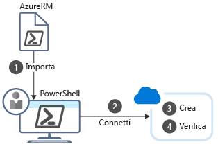

<span data-ttu-id="34194-101">PowerShell consente di scrivere i comandi ed eseguirli immediatamente.</span><span class="sxs-lookup"><span data-stu-id="34194-101">PowerShell lets you write commands and execute them immediately.</span></span> <span data-ttu-id="34194-102">Questa caratteristica è nota come **modalità interattiva**.</span><span class="sxs-lookup"><span data-stu-id="34194-102">This is known as **interactive mode**.</span></span>

<span data-ttu-id="34194-103">Ricordare che l'obiettivo complessivo dell'esempio relativo alla soluzione CRM (Customer Relationship Management) è di creare tre ambienti di test contenenti le macchine virtuali.</span><span class="sxs-lookup"><span data-stu-id="34194-103">Recall that the overall goal in the Customer Relationship Management (CRM) example is to create three test environments containing VMs.</span></span> <span data-ttu-id="34194-104">Si useranno i gruppi di risorse per verificare che le macchine virtuali siano organizzate in ambienti distinti: uno per gli unit test, uno per i test di integrazione e uno per i test di accettazione.</span><span class="sxs-lookup"><span data-stu-id="34194-104">You will use resource groups to ensure the VMs are organized into separate environments: one for unit testing, one for integration testing, and one for acceptance testing.</span></span> <span data-ttu-id="34194-105">È sufficiente creare i gruppi di risorse una sola volta, quindi la modalità interattiva di PowerShell è una scelta ottimale.</span><span class="sxs-lookup"><span data-stu-id="34194-105">You only need to create the resource groups once, which means using the interactive mode of PowerShell is a good choice.</span></span>

<span data-ttu-id="34194-106">Quando si digita un comando in PowerShell, corrisponde a un _cmdlet_ che esegue l'azione richiesta.</span><span class="sxs-lookup"><span data-stu-id="34194-106">When you type a command into PowerShell, it matches it to a _cmdlet_ which then performs the requested action.</span></span> <span data-ttu-id="34194-107">Verranno esaminati alcuni comandi comuni che è possibile usare e poi si vedrà come installare il supporto di Azure per PowerShell.</span><span class="sxs-lookup"><span data-stu-id="34194-107">We're going to look at some of the common commands you can use, and then look at installing the Azure support for PowerShell.</span></span>

## <a name="what-are-powershell-cmdlets"></a><span data-ttu-id="34194-108">Che cosa sono i cmdlet di PowerShell?</span><span class="sxs-lookup"><span data-stu-id="34194-108">What are PowerShell cmdlets?</span></span>
<span data-ttu-id="34194-109">Un comando di PowerShell viene denominato **cmdlet** (pronunciato "command-let").</span><span class="sxs-lookup"><span data-stu-id="34194-109">A PowerShell command is called a **cmdlet** (pronounced "command-let").</span></span> <span data-ttu-id="34194-110">Un cmdlet è un comando che manipola una singola funzione.</span><span class="sxs-lookup"><span data-stu-id="34194-110">A cmdlet is a command that manipulates a single feature.</span></span> <span data-ttu-id="34194-111">Il termine **cmdlet** è usato per indicare un "piccolo comando".</span><span class="sxs-lookup"><span data-stu-id="34194-111">The term **cmdlet** is intended to imply "small command".</span></span> <span data-ttu-id="34194-112">Per convenzione, gli autori di cmdlet sono invitati a mantenere i cmdlet semplici e dedicati a un unico scopo.</span><span class="sxs-lookup"><span data-stu-id="34194-112">By convention, cmdlet authors are encouraged to keep cmdlets simple and single-purpose.</span></span>

<span data-ttu-id="34194-113">Il prodotto PowerShell di base viene fornito con cmdlet utilizzabili per funzionalità quali sessioni e processi in background.</span><span class="sxs-lookup"><span data-stu-id="34194-113">The base PowerShell product ships with cmdlets that work with features such as sessions and background jobs.</span></span> <span data-ttu-id="34194-114">È possibile aggiungere moduli all'installazione di PowerShell per ottenere cmdlet in grado di manipolare altre funzionalità.</span><span class="sxs-lookup"><span data-stu-id="34194-114">You add modules to your PowerShell installation to get cmdlets that manipulate other features.</span></span> <span data-ttu-id="34194-115">Esistono ad esempio moduli di terze parti per l'uso di connessioni FTP, l'amministrazione del sistema operativo, l'accesso al file system e così via.</span><span class="sxs-lookup"><span data-stu-id="34194-115">For example, there are third-party modules to work with ftp, administer your operating system, access the file system, and so on.</span></span>

<span data-ttu-id="34194-116">I cmdlet seguono una convenzione di denominazione verbo-sostantivo, ad esempio **Get-Process**, **Format-Table** e **Start-Service**.</span><span class="sxs-lookup"><span data-stu-id="34194-116">Cmdlets follow a verb-noun naming convention; for example, **Get-Process**, **Format-Table**, and **Start-Service**.</span></span> <span data-ttu-id="34194-117">Esiste inoltre una convenzione per la scelta del verbo: "get" per il recupero di dati, "set" per l'inserimento o l'aggiornamento di dati, "format" per la formattazione di dati, "out" per l'indirizzamento dell'output a una destinazione e così via.</span><span class="sxs-lookup"><span data-stu-id="34194-117">There is also a convention for verb choice: "get" to retrieve data, "set" to insert or update data, "format" to format data, "out" to direct output to a destination, and so on.</span></span>

<span data-ttu-id="34194-118">Gli autori di cmdlet sono invitati a includere un file della Guida per ciascun cmdlet.</span><span class="sxs-lookup"><span data-stu-id="34194-118">Cmdlet authors are encouraged to include a help file for each cmdlet.</span></span> <span data-ttu-id="34194-119">Il cmdlet **Get-Help** consente di visualizzare il file della Guida per qualsiasi cmdlet.</span><span class="sxs-lookup"><span data-stu-id="34194-119">The **Get-Help** cmdlet displays the help file for any cmdlet.</span></span> <span data-ttu-id="34194-120">Ad esempio, si possono visualizzare informazioni della Guida per il cmdlet `Get-ChildItem` con l'istruzione seguente:</span><span class="sxs-lookup"><span data-stu-id="34194-120">For example, we could get help on the `Get-ChildItem` cmdlet with the following statement:</span></span>

```powershell
Get-Help Get-ChildItem -detailed
```

## <a name="what-is-a-powershell-module"></a><span data-ttu-id="34194-121">Che cos'è un modulo di PowerShell?</span><span class="sxs-lookup"><span data-stu-id="34194-121">What is a PowerShell module?</span></span>

<span data-ttu-id="34194-122">I cmdlet vengono forniti in _moduli_.</span><span class="sxs-lookup"><span data-stu-id="34194-122">Cmdlets are shipped in _modules_.</span></span> <span data-ttu-id="34194-123">Un modulo di PowerShell è una DLL che include il codice per elaborare ogni cmdlet disponibile.</span><span class="sxs-lookup"><span data-stu-id="34194-123">A PowerShell Module is a DLL that includes the code to proces each available cmdlet.</span></span> <span data-ttu-id="34194-124">Per caricare i cmdlet in PowerShell si carica il modulo in cui sono contenuti.</span><span class="sxs-lookup"><span data-stu-id="34194-124">You load cmdlets into PowerShell by loading the module they are contained in.</span></span> <span data-ttu-id="34194-125">È possibile ottenere un elenco dei moduli caricati tramite il comando `Get-Module`:</span><span class="sxs-lookup"><span data-stu-id="34194-125">You can get a list of loaded modules using the `Get-Module` command:</span></span>

```powershell
Get-Module
```

<span data-ttu-id="34194-126">L'output sarà simile al seguente:</span><span class="sxs-lookup"><span data-stu-id="34194-126">This will output something like:</span></span>

```output
ModuleType Version    Name                                ExportedCommands
---------- -------    ----                                ----------------
Manifest   3.1.0.0    Microsoft.PowerShell.Management     {Add-Computer, Add-Content, Checkpoint-Computer, Clear-Con...
Manifest   3.1.0.0    Microsoft.PowerShell.Utility        {Add-Member, Add-Type, Clear-Variable, Compare-Object...}
Binary     1.0.0.1    PackageManagement                   {Find-Package, Find-PackageProvider, Get-Package, Get-Pack...
Script     1.0.0.1    PowerShellGet                       {Find-Command, Find-DscResource, Find-Module, Find-RoleCap...
Script     2.0.0      PSReadline                          {Get-PSReadLineKeyHandler, Get-PSReadLineOption, Remove-PS...
```

## <a name="what-is-azurerm"></a><span data-ttu-id="34194-127">Che cos'è AzureRM?</span><span class="sxs-lookup"><span data-stu-id="34194-127">What is AzureRM?</span></span>
<span data-ttu-id="34194-128">**AzureRM** è il nome formale per il modulo di Azure PowerShell, che contiene i cmdlet per l'uso delle funzionalità di Azure (**RM** nel nome è l'acronimo di **Resource Manager**).</span><span class="sxs-lookup"><span data-stu-id="34194-128">**AzureRM** is the formal name for the Azure PowerShell module containing cmdlets to work with Azure features (the **RM** in the name stands for **Resource Manager**).</span></span> <span data-ttu-id="34194-129">Contiene centinaia di cmdlet che consentono di controllare praticamente ogni aspetto di ogni risorsa di Azure.</span><span class="sxs-lookup"><span data-stu-id="34194-129">It contains hundreds of cmdlets that let you control nearly every aspect of every Azure resource.</span></span> <span data-ttu-id="34194-130">È possibile lavorare con i gruppi di risorse, l'archiviazione, le macchine virtuali, Azure Active Directory, i contenitori, Machine Learning e così via.</span><span class="sxs-lookup"><span data-stu-id="34194-130">You can work with resource groups, storage, virtual machines, Azure Active Directory, containers, machine learning, and so on.</span></span> <span data-ttu-id="34194-131">Questo modulo è un componente open source [disponibile in GitHub](https://github.com/Azure/azure-powershell).</span><span class="sxs-lookup"><span data-stu-id="34194-131">This module is an open source component [available on GitHub](https://github.com/Azure/azure-powershell).</span></span>

> [!NOTE]
> <span data-ttu-id="34194-132">Il modulo Azure PowerShell è un'installazione facoltativa: i cmdlet non sono disponibili finché non si importa il modulo.</span><span class="sxs-lookup"><span data-stu-id="34194-132">The Azure PowerShell module is an optional install - the cmdlets aren't available until you import the module.</span></span>

### <a name="install-the-azurerm-module"></a><span data-ttu-id="34194-133">Installare il modulo AzureRM</span><span class="sxs-lookup"><span data-stu-id="34194-133">Install the AzureRM module</span></span>

<span data-ttu-id="34194-134">Il modulo AzureRM è disponibile da un repository globale denominato PowerShell Gallery.</span><span class="sxs-lookup"><span data-stu-id="34194-134">The AzureRM module is available from a global repository called the PowerShell Gallery.</span></span> <span data-ttu-id="34194-135">È possibile installare il modulo nel computer locale tramite il comando `Install-Module`.</span><span class="sxs-lookup"><span data-stu-id="34194-135">You can install the module onto your local machine through the `Install-Module` command.</span></span> <span data-ttu-id="34194-136">È necessaria una shell di PowerShell con privilegi elevati per installare i moduli da PowerShell Gallery.</span><span class="sxs-lookup"><span data-stu-id="34194-136">You need an elevated PowerShell shell to install modules from the PowerShell Gallery.</span></span> 

<span data-ttu-id="34194-137">::: zone pivot="windows"</span><span class="sxs-lookup"><span data-stu-id="34194-137">::: zone pivot="windows"</span></span>

<span data-ttu-id="34194-138">Per installare il modulo Azure PowerShell più recente, eseguire i comandi seguenti:</span><span class="sxs-lookup"><span data-stu-id="34194-138">To install the latest Azure PowerShell module, run the following commands:</span></span>

1. <span data-ttu-id="34194-139">Aprire il menu **Start** e digitare **Windows PowerShell**.</span><span class="sxs-lookup"><span data-stu-id="34194-139">Open the **Start** menu and type **Windows PowerShell**.</span></span>

1. <span data-ttu-id="34194-140">Fare clic con il pulsante destro del mouse sull'icona di **Windows PowerShell** e scegliere **Esegui come amministratore**.</span><span class="sxs-lookup"><span data-stu-id="34194-140">Right-click the **Windows PowerShell** icon and select **Run as administrator**.</span></span>

1. <span data-ttu-id="34194-141">Nella finestra di dialogo **Controllo account utente** selezionare **Sì**.</span><span class="sxs-lookup"><span data-stu-id="34194-141">In the **User Account Control** dialog, select **Yes**.</span></span>

1. <span data-ttu-id="34194-142">Digitare il comando seguente e quindi premere INVIO:</span><span class="sxs-lookup"><span data-stu-id="34194-142">Type the following command, and then press Enter:</span></span>

    ```powershell
    Install-Module -Name AzureRM
    ```

<span data-ttu-id="34194-143">Questo comando consente di installare il modulo per tutti gli utenti per impostazione predefinita (in base al parametro di ambito).</span><span class="sxs-lookup"><span data-stu-id="34194-143">This installs the module for all users by default (controlled by the scope parameter).</span></span> 

<span data-ttu-id="34194-144">Il comando si basa su NuGet per recuperare i componenti. A seconda della versione di NuGet installata, potrebbe essere visualizzata la richiesta di scaricare e installare la versione più recente di NuGet.</span><span class="sxs-lookup"><span data-stu-id="34194-144">The command relies on NuGet to retrieve components, depending on the version of NuGet you have installed you might get a prompt to download and install the latest version of NuGet.</span></span>

```output
NuGet provider is required to continue
PowerShellGet requires NuGet provider version '2.8.5.201' or newer to interact with NuGet-based repositories. The NuGet
 provider must be available in 'C:\Program Files (x86)\PackageManagement\ProviderAssemblies' or
'C:\Users\<username>\AppData\Local\PackageManagement\ProviderAssemblies'. You can also install the NuGet provider by running
'Install-PackageProvider -Name NuGet -MinimumVersion 2.8.5.201 -Force'. Do you want PowerShellGet to install and import
 the NuGet provider now?
```

<span data-ttu-id="34194-145">Per impostazione predefinita, PowerShell Gallery non è configurata come archivio attendibile per PowerShellGet.</span><span class="sxs-lookup"><span data-stu-id="34194-145">By default, the PowerShell gallery isn't configured as a trusted repository for PowerShellGet.</span></span> <span data-ttu-id="34194-146">La prima volta che si usa PSGallery verrà visualizzato il messaggio seguente:</span><span class="sxs-lookup"><span data-stu-id="34194-146">The first time you use the PSGallery you see the following prompt:</span></span>

```output
You are installing the modules from an untrusted repository. If you trust this repository, change its
InstallationPolicy value by running the Set-PSRepository cmdlet. Are you sure you want to install the modules from
'PSGallery'?
```

#### <a name="script-execution-failed"></a><span data-ttu-id="34194-147">Esecuzione dello script non riuscita</span><span class="sxs-lookup"><span data-stu-id="34194-147">Script execution failed</span></span>
<span data-ttu-id="34194-148">A seconda della configurazione di sicurezza, `Import-Module` potrebbe non riuscire con un errore simile al seguente.</span><span class="sxs-lookup"><span data-stu-id="34194-148">Depending on your security configuration, `Import-Module` might fail with something like the following.</span></span>

```output
import-module : File C:\Program Files (x86)\WindowsPowerShell\Modules\azurerm\6.8.1\AzureRM.psm1 cannot be loaded
because running scripts is disabled on this system. For more information, see about_Execution_Policies at
https:/go.microsoft.com/fwlink/?LinkID=135170.
At line:1 char:1
+ import-module azurerm
+ ~~~~~~~~~~~~~~~~~~~~~
    + CategoryInfo          : SecurityError: (:) [Import-Module], PSSecurityException
    + FullyQualifiedErrorId : UnauthorizedAccess,Microsoft.PowerShell.Commands.ImportModuleCommand
```

<span data-ttu-id="34194-149">Questa condizione indica in genere che esistono "restrizioni" per i criteri di esecuzione, vale a dire che non è possibile eseguire i moduli scaricati da un'origine esterna, inclusa PowerShell Gallery.</span><span class="sxs-lookup"><span data-stu-id="34194-149">This normally indicates that the execution policy is "restricted", meaning you can't execute modules you download from an external source - including the PowerShell gallery.</span></span> <span data-ttu-id="34194-150">È possibile controllare se questo è il caso eseguendo il comando `Get-ExecutionPolicy`.</span><span class="sxs-lookup"><span data-stu-id="34194-150">You can check whether this is the case by executing the command `Get-ExecutionPolicy`.</span></span> <span data-ttu-id="34194-151">Se il comando restituisce "Restricted" (Con restrizioni) eseguire le operazioni seguenti:</span><span class="sxs-lookup"><span data-stu-id="34194-151">If it returns "Restricted", then do the following:</span></span>

1. <span data-ttu-id="34194-152">Aprire un prompt dei comandi di PowerShell con privilegi elevati.</span><span class="sxs-lookup"><span data-stu-id="34194-152">Open an elevated PowerShell command prompt.</span></span>
1. <span data-ttu-id="34194-153">Usare il cmdlet `SetExecutionPolicy` per modificare i criteri impostando "RemoteSigned":</span><span class="sxs-lookup"><span data-stu-id="34194-153">Use the `SetExecutionPolicy` cmdlet to change the policy to "RemoteSigned":</span></span>

```powershell
Set-ExecutionPolicy RemoteSigned
```

<span data-ttu-id="34194-154">Verrà richiesta l'autorizzazione:</span><span class="sxs-lookup"><span data-stu-id="34194-154">This will prompt you for permission:</span></span>

```output
The execution policy helps protect you from scripts that you do not trust. Changing the execution policy might expose
you to the security risks described in the about_Execution_Policies help topic at
https:/go.microsoft.com/fwlink/?LinkID=135170. Do you want to change the execution policy?
[Y] Yes  [A] Yes to All  [N] No  [L] No to All  [S] Suspend  [?] Help (default is "N"): Y
```

<span data-ttu-id="34194-155">Dovrebbe essere poi possibile usare `Import-Module` per caricare i cmdlet.</span><span class="sxs-lookup"><span data-stu-id="34194-155">You should then be able to use `Import-Module` to load the cmdlets.</span></span>

<span data-ttu-id="34194-156">:::zone-end</span><span class="sxs-lookup"><span data-stu-id="34194-156">:::zone-end</span></span>

<span data-ttu-id="34194-157">::: zone pivot="linux,macos"</span><span class="sxs-lookup"><span data-stu-id="34194-157">::: zone pivot="linux,macos"</span></span>

<span data-ttu-id="34194-158">Per installare Azure PowerShell in Linux o macOS, vengono usati gli stessi comandi.</span><span class="sxs-lookup"><span data-stu-id="34194-158">We use the same commands to install the Azure PowerShell on either Linux or macOS.</span></span>

1. <span data-ttu-id="34194-159">In un terminale, digitare il comando seguente per avviare PowerShell Core con privilegi elevati.</span><span class="sxs-lookup"><span data-stu-id="34194-159">In a terminal, type the following command to launch PowerShell Core with elevated privileges.</span></span>

    ```bash
    sudo pwsh
    ```

1. <span data-ttu-id="34194-160">Per installare Azure PowerShell, eseguire il comando seguente nel prompt di PowerShell Core.</span><span class="sxs-lookup"><span data-stu-id="34194-160">Run the following command at the PowerShell Core prompt to install Azure PowerShell.</span></span>

    ```powershell
    Install-Module AzureRM.NetCore
    ```

1. <span data-ttu-id="34194-161">Se viene richiesto se considerare attendibili i moduli di **PSGallery**, rispondere **Sì** oppure **Sì a tutti**.</span><span class="sxs-lookup"><span data-stu-id="34194-161">If you are asked whether you trust modules from **PSGallery**, answer **Yes** or **Yes to All**.</span></span>

<span data-ttu-id="34194-162">:::zone-end</span><span class="sxs-lookup"><span data-stu-id="34194-162">:::zone-end</span></span>

### <a name="update-a-module"></a><span data-ttu-id="34194-163">Aggiornare un modulo</span><span class="sxs-lookup"><span data-stu-id="34194-163">Update a module</span></span>

<span data-ttu-id="34194-164">Se viene visualizzato un avviso o un messaggio di errore che indica che è già installata una versione del modulo Azure PowerShell, è possibile eseguire l'aggiornamento alla versione _più recente_ eseguendo il comando:</span><span class="sxs-lookup"><span data-stu-id="34194-164">If you get a warning or error message indicating that a version of the Azure PowerShell module is already installed, you can update to the _latest_ version by issuing the command:</span></span>

<span data-ttu-id="34194-165">:::zone pivot="windows"</span><span class="sxs-lookup"><span data-stu-id="34194-165">:::zone pivot="windows"</span></span>

```powershell
Update-Module -Name AzureRM
```

<span data-ttu-id="34194-166">:::zone-end</span><span class="sxs-lookup"><span data-stu-id="34194-166">:::zone-end</span></span>

<span data-ttu-id="34194-167">::: zone pivot="linux,macos"</span><span class="sxs-lookup"><span data-stu-id="34194-167">::: zone pivot="linux,macos"</span></span>

```powershell
Update-Module -Name AzureRM.NetCore
```

<span data-ttu-id="34194-168">:::zone-end</span><span class="sxs-lookup"><span data-stu-id="34194-168">:::zone-end</span></span>

<span data-ttu-id="34194-169">Come nel caso del comando `Install-Module`, rispondere **Sì** o **Sì a tutti** quando viene richiesto se considerare attendibile il modulo.</span><span class="sxs-lookup"><span data-stu-id="34194-169">As with the `Install-Module` command, answer **Yes** or **Yes to All** when prompted to trust the module.</span></span> <span data-ttu-id="34194-170">È anche possibile usare il comando `Update-Module` per installare nuovamente un modulo, se si verificano problemi.</span><span class="sxs-lookup"><span data-stu-id="34194-170">You can also use the `Update-Module` command to re-install a module if you are having trouble with it.</span></span>

## <a name="example-how-to-create-a-resource-group-with-azure-powershell"></a><span data-ttu-id="34194-171">Esempio: Come creare un gruppo di risorse con Azure PowerShell</span><span class="sxs-lookup"><span data-stu-id="34194-171">Example: How to create a resource group with Azure PowerShell</span></span>
<span data-ttu-id="34194-172">Dopo aver caricato il modulo di Azure, è possibile iniziare a utilizzare Azure.</span><span class="sxs-lookup"><span data-stu-id="34194-172">Once you have the Azure module loaded, you can begin working with Azure.</span></span> <span data-ttu-id="34194-173">Si vedrà come eseguire un'attività comune: creare un gruppo di risorse.</span><span class="sxs-lookup"><span data-stu-id="34194-173">Let's do a common task - create a Resource Group.</span></span> <span data-ttu-id="34194-174">Come è noto, i gruppi di risorse vengono usati per amministrare le risorse correlate.</span><span class="sxs-lookup"><span data-stu-id="34194-174">As you know, we use resource groups to administer related resources together.</span></span> <span data-ttu-id="34194-175">La creazione di un nuovo gruppo di risorse è una delle prime attività che verranno eseguite quando si inizia una nuova soluzione di Azure.</span><span class="sxs-lookup"><span data-stu-id="34194-175">Creating a new resource group is one of the first tasks you'll do when starting a new Azure solution.</span></span>

<span data-ttu-id="34194-176">È necessario eseguire quattro passaggi:</span><span class="sxs-lookup"><span data-stu-id="34194-176">There are four steps we need to perform:</span></span>

1. <span data-ttu-id="34194-177">Importare i cmdlet di Azure.</span><span class="sxs-lookup"><span data-stu-id="34194-177">Import the Azure cmdlets.</span></span>

1. <span data-ttu-id="34194-178">Connettersi alla sottoscrizione di Azure.</span><span class="sxs-lookup"><span data-stu-id="34194-178">Connect to your Azure subscription.</span></span>

1. <span data-ttu-id="34194-179">Creare il gruppo di risorse.</span><span class="sxs-lookup"><span data-stu-id="34194-179">Create the resource group.</span></span>

1. <span data-ttu-id="34194-180">Verificare che la creazione sia stata eseguita (vedere di seguito).</span><span class="sxs-lookup"><span data-stu-id="34194-180">Verify that creation was successful (see below).</span></span>

<span data-ttu-id="34194-181">La figura seguente mostra una panoramica di questi passaggi.</span><span class="sxs-lookup"><span data-stu-id="34194-181">The following illustration shows an overview of these steps.</span></span>



<span data-ttu-id="34194-183">Ogni passaggio corrisponde a un diverso cmdlet.</span><span class="sxs-lookup"><span data-stu-id="34194-183">Each step corresponds to a different cmdlet.</span></span>

### <a name="import-the-azure-cmdlets"></a><span data-ttu-id="34194-184">Importare i cmdlet di Azure</span><span class="sxs-lookup"><span data-stu-id="34194-184">Import the Azure cmdlets</span></span>
<span data-ttu-id="34194-185">All'avvio, per impostazione predefinita PowerShell carica solo i cmdlet di base.</span><span class="sxs-lookup"><span data-stu-id="34194-185">At startup, PowerShell loads only the core cmdlets by default.</span></span> <span data-ttu-id="34194-186">Questo significa che i cmdlet che necessari per lavorare con Azure non verranno caricati.</span><span class="sxs-lookup"><span data-stu-id="34194-186">This means the cmdlets you need to work with Azure won't be loaded.</span></span> <span data-ttu-id="34194-187">Il modo più affidabile per caricare i cmdlet necessari consiste nell'importarli manualmente all'inizio della sessione PowerShell.</span><span class="sxs-lookup"><span data-stu-id="34194-187">The most reliable way to load the cmdlets you need is to import them manually at the start of your PowerShell session.</span></span>

<span data-ttu-id="34194-188">È possibile usare il cmdlet **Import-Module** per caricare i moduli.</span><span class="sxs-lookup"><span data-stu-id="34194-188">You use the **Import-Module** cmdlet to load modules.</span></span> <span data-ttu-id="34194-189">Questo cmdlet dispone di numerosi parametri per gestire un'ampia gamma di situazioni.</span><span class="sxs-lookup"><span data-stu-id="34194-189">This cmdlet has many parameters to handle a variety of situations.</span></span> <span data-ttu-id="34194-190">Ad esempio, può caricare più moduli, una versione specifica di un modulo, parte di un modulo e così via.</span><span class="sxs-lookup"><span data-stu-id="34194-190">For example, it can load multiple modules, a specific module version, part of a module, and so on.</span></span>

<span data-ttu-id="34194-191">Ad esempio, è possibile caricare tutti i cmdlet di AzureRM con il comando seguente **in una sessione di PowerShell con privilegi elevati**:</span><span class="sxs-lookup"><span data-stu-id="34194-191">For example, we can load all the cmdlets for AzureRM with the following command **in an elevated PowerShell session**:</span></span>

<span data-ttu-id="34194-192">:::zone pivot="windows"</span><span class="sxs-lookup"><span data-stu-id="34194-192">:::zone pivot="windows"</span></span>

```powershell
Import-Module AzureRM
```

<span data-ttu-id="34194-193">:::zone-end</span><span class="sxs-lookup"><span data-stu-id="34194-193">:::zone-end</span></span>

<span data-ttu-id="34194-194">::: zone pivot="linux,macos"</span><span class="sxs-lookup"><span data-stu-id="34194-194">::: zone pivot="linux,macos"</span></span>

```powershell
Import-Module AzureRM.NetCore
```

<span data-ttu-id="34194-195">:::zone-end</span><span class="sxs-lookup"><span data-stu-id="34194-195">:::zone-end</span></span>

> [!TIP]
> <span data-ttu-id="34194-196">Se si lavora con Azure PowerShell di frequente, vi sono due modi in cui è possibile automatizzare il processo di caricamento dei moduli.</span><span class="sxs-lookup"><span data-stu-id="34194-196">If you find that you work with Azure PowerShell frequently, there are two ways you can automate the module-loading process.</span></span> <span data-ttu-id="34194-197">È possibile aggiungere una voce al proprio profilo PowerShell per importare il modulo di Azure all'avvio oppure usare le versioni più recenti di PowerShell, che carica automaticamente il modulo contenente quando si usa un cmdlet.</span><span class="sxs-lookup"><span data-stu-id="34194-197">You can add an entry to your PowerShell profile to import the Azure module at startup or use the latest versions of PowerShell, which loads the containing module automatically when you use a cmdlet.</span></span>

### <a name="connect"></a><span data-ttu-id="34194-198">Connessione</span><span class="sxs-lookup"><span data-stu-id="34194-198">Connect</span></span>
<span data-ttu-id="34194-199">Quando si lavora con un'installazione locale di Azure PowerShell, sarà necessario eseguire l'autenticazione prima di poter eseguire i comandi di Azure.</span><span class="sxs-lookup"><span data-stu-id="34194-199">When you are working with a local install of Azure PowerShell, you will need to authenticate before you can execute Azure commands.</span></span> <span data-ttu-id="34194-200">Il cmdlet **Connect-AzureRmAccount** richiede le credenziali di Azure e quindi esegue la connessione alla sottoscrizione di Azure.</span><span class="sxs-lookup"><span data-stu-id="34194-200">The **Connect-AzureRmAccount** cmdlet prompts for your Azure credentials and then connects to your Azure subscription.</span></span> <span data-ttu-id="34194-201">Il cmdlet include numerosi parametri facoltativi, ma se tutto quello che occorre è un prompt interattivo, non sono necessari parametri:</span><span class="sxs-lookup"><span data-stu-id="34194-201">It has many optional parameters, but if all you need is an interactive prompt, no parameters are needed:</span></span>

```powershell
Connect-AzureRmAccount
```

<span data-ttu-id="34194-202">È necessario ripetere questi passaggi per ogni nuova sessione di PowerShell avviata, perché questo modulo non fa parte del set di base.</span><span class="sxs-lookup"><span data-stu-id="34194-202">You'll need to repeat these steps for every new PowerShell session you start since this module is not part of the core set.</span></span>


### <a name="working-with-subscriptions"></a><span data-ttu-id="34194-203">Utilizzo delle sottoscrizioni</span><span class="sxs-lookup"><span data-stu-id="34194-203">Working with subscriptions</span></span>
<span data-ttu-id="34194-204">Se si usa Azure da poco, probabilmente si avrà una singola sottoscrizione.</span><span class="sxs-lookup"><span data-stu-id="34194-204">If you are new to Azure, you probably only have a single subscription.</span></span> <span data-ttu-id="34194-205">Tuttavia, se si usa Azure già da tempo, è possibile che siano state create più sottoscrizioni di Azure.</span><span class="sxs-lookup"><span data-stu-id="34194-205">But if you have been using Azure for a while, you may have created multiple Azure subscriptions.</span></span> <span data-ttu-id="34194-206">È possibile configurare Azure PowerShell per eseguire comandi su una determinata sottoscrizione.</span><span class="sxs-lookup"><span data-stu-id="34194-206">You can configure Azure PowerShell to execute commands against a particular subscription.</span></span>

<span data-ttu-id="34194-207">È possibile usare attivamente una sola sottoscrizione alla volta.</span><span class="sxs-lookup"><span data-stu-id="34194-207">You can only be in one subscription at a time.</span></span> <span data-ttu-id="34194-208">Usare il cmdlet `Get-AzureRmContext` per determinare quale sottoscrizione è attiva.</span><span class="sxs-lookup"><span data-stu-id="34194-208">Use the `Get-AzureRmContext` cmdlet to determine which subscription is active.</span></span> <span data-ttu-id="34194-209">Se non è quella corretta, è possibile modificarla.</span><span class="sxs-lookup"><span data-stu-id="34194-209">If it's not the correct one, you can change it.</span></span>

1. <span data-ttu-id="34194-210">Ottenere un elenco di tutti i nomi di sottoscrizione nell'account con il comando `Get-AzureRmSubscription`.</span><span class="sxs-lookup"><span data-stu-id="34194-210">Get a list of all subscription names in your account with the `Get-AzureRmSubscription` command.</span></span> 

2. <span data-ttu-id="34194-211">Cambiare la sottoscrizione passando il nome di quella da selezionare.</span><span class="sxs-lookup"><span data-stu-id="34194-211">Change the subscription by passing the name of the one to select.</span></span>

```powershell
Select-AzureRmSubscription -Subscription "Visual Studio Enterprise"
```

### <a name="get-a-list-of-all-resource-groups"></a><span data-ttu-id="34194-212">Ottenere un elenco di tutti i gruppi di risorse</span><span class="sxs-lookup"><span data-stu-id="34194-212">Get a list of all Resource Groups</span></span>

<span data-ttu-id="34194-213">È possibile recuperare un elenco di tutti i gruppi di risorse nella sottoscrizione attiva:</span><span class="sxs-lookup"><span data-stu-id="34194-213">You can retrieve a list of all Resource Groups in the active subscription:</span></span>

```powershell
Get-AzureRmResourceGroup
```

<span data-ttu-id="34194-214">Per ottenere una visualizzazione più concisa, è possibile inviare l'output da `Get-AzureRmResourceGroup` al cmdlet `Format-Table` usando una barra verticale "|".</span><span class="sxs-lookup"><span data-stu-id="34194-214">To get a more concise view, you can send the output from the `Get-AzureRmResourceGroup` to the `Format-Table` cmdlet using a pipe '|'.</span></span>

```powershell
Get-AzureRmResourceGroup | Format-Table
```

<span data-ttu-id="34194-215">L'output sarà simile al seguente:</span><span class="sxs-lookup"><span data-stu-id="34194-215">This will output something like:</span></span>

```output
ResourceGroupName                  Location       ProvisioningState Tags TagsTable ResourceId
-----------------                  --------       ----------------- ---- --------- ----------
cloud-shell-storage-southcentralus southcentralus Succeeded                        /subscriptions/xxxxxxxx-d3ce-4172...
ExerciseResources                  eastus         Succeeded                        /subscriptions/xxxxxxxx-d3ce-4172...
```

### <a name="create-a-resource-group"></a><span data-ttu-id="34194-216">Creare un gruppo di risorse</span><span class="sxs-lookup"><span data-stu-id="34194-216">Create a Resource Group</span></span>

<span data-ttu-id="34194-217">Come è noto, le risorse create in Azure verranno sempre inserite in gruppo di risorse ai fini della gestione.</span><span class="sxs-lookup"><span data-stu-id="34194-217">As you know, when you are creating resources in Azure, you will always place them into a resource group for management purposes.</span></span> <span data-ttu-id="34194-218">La creazione di un nuovo gruppo di risorse è spesso una delle prime attività che verranno eseguite quando si inizia una nuova applicazione.</span><span class="sxs-lookup"><span data-stu-id="34194-218">A resource group is often one of the first things you will create when starting a new application.</span></span>

<span data-ttu-id="34194-219">È possibile creare gruppi di risorse con il cmdlet `New-AzureRmResourceGroup`.</span><span class="sxs-lookup"><span data-stu-id="34194-219">You can create resource groups with the `New-AzureRmResourceGroup` cmdlet.</span></span> <span data-ttu-id="34194-220">È necessario specificare un nome e una posizione.</span><span class="sxs-lookup"><span data-stu-id="34194-220">You must specify a name and location.</span></span> <span data-ttu-id="34194-221">Il nome deve essere univoco all'interno della sottoscrizione.</span><span class="sxs-lookup"><span data-stu-id="34194-221">The name must be unique within your subscription.</span></span> <span data-ttu-id="34194-222">La posizione determina dove vengono archiviati i metadati per il gruppo di risorse (questo aspetto può essere importante per motivi di conformità).</span><span class="sxs-lookup"><span data-stu-id="34194-222">The location determines where the metadata for your resource group will be stored (which may be important to you for compliance reasons).</span></span> <span data-ttu-id="34194-223">Si usano stringhe come "Stati Uniti occidentali", "Europa settentrionale" o "India occidentale" per specificare la posizione.</span><span class="sxs-lookup"><span data-stu-id="34194-223">You use strings like "West US", "North Europe", or "West India" to specify the location.</span></span> <span data-ttu-id="34194-224">Come la maggior parte dei cmdlet di Azure, `New-AzureRmResourceGroup` presenta numerosi parametri facoltativi, ma la sintassi di base è la seguente:</span><span class="sxs-lookup"><span data-stu-id="34194-224">As with most of the Azure cmdlets, `New-AzureRmResourceGroup` has many optional parameters; however, the core syntax is:</span></span>

```powershell
New-AzureRmResourceGroup -Name <name> -Location <location>
```

> [!NOTE]
> <span data-ttu-id="34194-225">Tenere presente che si lavorerà nella sandbox di Azure che crea automaticamente il gruppo di risorse.</span><span class="sxs-lookup"><span data-stu-id="34194-225">Remember, we will be working in the Azure sandbox which creates the Resource Group for you.</span></span> <span data-ttu-id="34194-226">Il comando precedente verrebbe usato quando si lavora nella propria sottoscrizione.</span><span class="sxs-lookup"><span data-stu-id="34194-226">The above command would be used if you work in your own subscription.</span></span>

### <a name="verify-the-resources"></a><span data-ttu-id="34194-227">Verificare le risorse</span><span class="sxs-lookup"><span data-stu-id="34194-227">Verify the resources</span></span>
<span data-ttu-id="34194-228">Il cmdlet `Get-AzureRmResource` elenca le risorse di Azure.</span><span class="sxs-lookup"><span data-stu-id="34194-228">The `Get-AzureRmResource` lists your Azure resources.</span></span> <span data-ttu-id="34194-229">Questo comando è utile in questo contesto per verificare se è stata completata la creazione del gruppo di risorse.</span><span class="sxs-lookup"><span data-stu-id="34194-229">This is useful here to verify whether creation of the resource group was successful.</span></span>

```powershell
Get-AzureRmResource
```

<span data-ttu-id="34194-230">Come per il comando `Get-AzureRmResourceGroup`, è possibile ottenere una visualizzazione più concisa tramite il cmdlet `Format-Table`.</span><span class="sxs-lookup"><span data-stu-id="34194-230">Like the `Get-AzureRmResourceGroup` command, you can get a more concise view through the `Format-Table` cmdlet.</span></span> <span data-ttu-id="34194-231">In questo caso si userà una versione abbreviata `ft`:</span><span class="sxs-lookup"><span data-stu-id="34194-231">Here we will use a shorthand version `ft`:</span></span>

```powershell
Get-AzureRmResource | ft
```

<span data-ttu-id="34194-232">È anche possibile filtrare per gruppi di risorse specifiche, in modo da elencare solo le risorse associate a tali gruppi:</span><span class="sxs-lookup"><span data-stu-id="34194-232">You can also filter it to specific resource groups to only list resources associated with that group:</span></span>

```powershell
Get-AzureRmResource -ResourceGroup ExerciseResources
```

### <a name="creating-an-azure-virtual-machine"></a><span data-ttu-id="34194-233">Creazione di una macchina virtuale di Azure</span><span class="sxs-lookup"><span data-stu-id="34194-233">Creating an Azure Virtual Machine</span></span>

<span data-ttu-id="34194-234">Un'altra attività comune che è possibile eseguire con PowerShell è la creazione di macchine virtuali.</span><span class="sxs-lookup"><span data-stu-id="34194-234">Another common task that could be done with PowerShell is to create VMs.</span></span>

<span data-ttu-id="34194-235">Azure PowerShell include il cmdlet `New-AzureRmVm` per creare una macchina virtuale.</span><span class="sxs-lookup"><span data-stu-id="34194-235">Azure PowerShell provides the `New-AzureRmVm` cmdlet to create a virtual machine.</span></span> <span data-ttu-id="34194-236">Il cmdlet dispone di diversi parametri che consentono di gestire le numerose impostazioni di configurazione della macchina virtuale.</span><span class="sxs-lookup"><span data-stu-id="34194-236">The cmdlet has many parameters to let it handle the large number of VM configuration settings.</span></span> <span data-ttu-id="34194-237">La maggior parte dei parametri ha valori predefiniti accettabili, pertanto è necessario specificare solo cinque elementi:</span><span class="sxs-lookup"><span data-stu-id="34194-237">Most of the parameters have reasonable default values so we only need to specify five things:</span></span>

- <span data-ttu-id="34194-238">**ResourceGroupName**: il gruppo di risorse in cui verrà inserita la nuova macchina virtuale.</span><span class="sxs-lookup"><span data-stu-id="34194-238">**ResourceGroupName**: The resource group into which the new VM will be placed.</span></span>
- <span data-ttu-id="34194-239">**Name**: il nome della macchina virtuale in Azure.</span><span class="sxs-lookup"><span data-stu-id="34194-239">**Name**: The name of the VM in Azure.</span></span>
- <span data-ttu-id="34194-240">**Location**: la posizione geografica in cui verrà eseguito il provisioning della macchina virtuale.</span><span class="sxs-lookup"><span data-stu-id="34194-240">**Location**: Geographic location where the VM will be provisioned.</span></span>
- <span data-ttu-id="34194-241">**Credential**: un oggetto contenente il nome utente e la password per l'account di amministratore della macchina virtuale.</span><span class="sxs-lookup"><span data-stu-id="34194-241">**Credential**: An object containing the username and password for the VM admin account.</span></span> <span data-ttu-id="34194-242">Si userà il cmdlet `Get-Credential`.</span><span class="sxs-lookup"><span data-stu-id="34194-242">We will use the `Get-Credential` cmdlet.</span></span> <span data-ttu-id="34194-243">Questo cmdlet richiederà nome utente e password e assemblerà queste informazioni in un oggetto credenziale.</span><span class="sxs-lookup"><span data-stu-id="34194-243">This cmdlet will prompt for a username and password and package it into a credential object.</span></span>
- <span data-ttu-id="34194-244">**Image**: immagine del sistema operativo da usare per la macchina virtuale.</span><span class="sxs-lookup"><span data-stu-id="34194-244">**Image**: The operating system image to use for the VM.</span></span> <span data-ttu-id="34194-245">Si tratta spesso di una distribuzione Linux o di Windows Server.</span><span class="sxs-lookup"><span data-stu-id="34194-245">This is often a Linux distribution, or Windows Server.</span></span>

```powershell
   New-AzureRmVm 
       -ResourceGroupName <resource group name> 
       -Name <machine name> 
       -Credential <credentials object> 
       -Location <location> 
       -Image <image name>
```

<span data-ttu-id="34194-246">È possibile specificare questi parametri direttamente per il cmdlet come illustrato in precedenza.</span><span class="sxs-lookup"><span data-stu-id="34194-246">You can supply these parameters directly to the cmdlet as shown above.</span></span> <span data-ttu-id="34194-247">In alternativa, si possono usare altri cmdlet per configurare la macchina virtuale, ad esempio `Set-AzureRmVMOperatingSystem`, `Set-AzureRmVMSourceImage`, `Add-AzureRmVMNetworkInterface` e `Set-AzureRmVMOSDisk`.</span><span class="sxs-lookup"><span data-stu-id="34194-247">Alternatively, other cmdlets can be used to configure the virtual machine, such as `Set-AzureRmVMOperatingSystem`, `Set-AzureRmVMSourceImage`, `Add-AzureRmVMNetworkInterface`, and `Set-AzureRmVMOSDisk`.</span></span>

<span data-ttu-id="34194-248">Di seguito è riportato un esempio in cui il cmdlet `Get-Credential` viene collegato con il parametro `-Credential`:</span><span class="sxs-lookup"><span data-stu-id="34194-248">Here's an example that strings the `Get-Credential` cmdlet together with the `-Credential` parameter:</span></span>

```powershell
New-AzureRmVM -Name MyVm -ResourceGroupName ExerciseResources -Credential (Get-Credential) ...
```

<span data-ttu-id="34194-249">Il suffisso `AzureRmVM` è specifico dei comandi basati su macchina virtuale in PowerShell.</span><span class="sxs-lookup"><span data-stu-id="34194-249">The `AzureRmVM` suffix is specific to VM-based commands in PowerShell.</span></span> <span data-ttu-id="34194-250">Sono disponibili moli altri comandi:</span><span class="sxs-lookup"><span data-stu-id="34194-250">There are several others you can use:</span></span>

| <span data-ttu-id="34194-251">Comando</span><span class="sxs-lookup"><span data-stu-id="34194-251">Command</span></span> | <span data-ttu-id="34194-252">Descrizione</span><span class="sxs-lookup"><span data-stu-id="34194-252">Description</span></span> |
|---------|-------------|
| `Remove-AzureRmVM` | <span data-ttu-id="34194-253">Elimina una macchina virtuale di Azure.</span><span class="sxs-lookup"><span data-stu-id="34194-253">Deletes an Azure VM.</span></span> |
| `Start-AzureRmVM` | <span data-ttu-id="34194-254">Avvia una macchina virtuale arrestata.</span><span class="sxs-lookup"><span data-stu-id="34194-254">Start a stopped VM.</span></span> |
| `Stop-AzureRmVM` | <span data-ttu-id="34194-255">Arresta una macchina virtuale in esecuzione.</span><span class="sxs-lookup"><span data-stu-id="34194-255">Stop a running VM.</span></span> |
| `Restart-AzureRmVM` | <span data-ttu-id="34194-256">Riavvia una macchina virtuale.</span><span class="sxs-lookup"><span data-stu-id="34194-256">Restart a VM.</span></span> |
| `Update-AzureRmVM` | <span data-ttu-id="34194-257">Aggiorna la configurazione per una macchina virtuale.</span><span class="sxs-lookup"><span data-stu-id="34194-257">Updates the configuration for a VM.</span></span> |

#### <a name="example-getting-the-information-for-a-vm"></a><span data-ttu-id="34194-258">Esempio: recupero delle informazioni per una macchina virtuale</span><span class="sxs-lookup"><span data-stu-id="34194-258">Example: getting the information for a VM</span></span>

<span data-ttu-id="34194-259">È possibile elencare le macchine virtuali nella sottoscrizione con il comando `Get-AzureRmVM -Status`.</span><span class="sxs-lookup"><span data-stu-id="34194-259">You can list the VMs in your subscription with the `Get-AzureRmVM -Status` command.</span></span> <span data-ttu-id="34194-260">Questo comando consente anche di specificare una macchina virtuale con la proprietà `-Name`.</span><span class="sxs-lookup"><span data-stu-id="34194-260">This can also specify a VM with the `-Name` property.</span></span> <span data-ttu-id="34194-261">Qui la proprietà viene assegnata a una variabile di PowerShell:</span><span class="sxs-lookup"><span data-stu-id="34194-261">Here we assign it to a PowerShell variable:</span></span>

```powershell
$vm = Get-AzureRmVM  -Name MyVM -ResourceGroupName ExerciseResources
```

<span data-ttu-id="34194-262">L'aspetto interessante è che si tratta di un _oggetto_ con cui è possibile interagire.</span><span class="sxs-lookup"><span data-stu-id="34194-262">The interesting thing is this is an _object_ you can interact with.</span></span> <span data-ttu-id="34194-263">Ad esempio, si può prendere questo oggetto, apportare modifiche e quindi eseguire il push delle modifiche in Azure con il comando `Update-AzureRmVM`:</span><span class="sxs-lookup"><span data-stu-id="34194-263">For example, you can take that object, make changes and then push changes back to Azure with the `Update-AzureRmVM` command:</span></span>

```powershell
$ResourceGroupName = "ExerciseResources"
$vm = Get-AzureRmVM  -Name MyVM -ResourceGroupName $ResourceGroupName
$vm.HardwareProfile.vmSize = "Standard_DS3_v2"

Update-AzureRmVM -ResourceGroupName $ResourceGroupName  -VM $vm
```

<span data-ttu-id="34194-264">La modalità interattiva di PowerShell è appropriata per le attività occasionali.</span><span class="sxs-lookup"><span data-stu-id="34194-264">PowerShell's interactive mode is appropriate for one-off tasks.</span></span> <span data-ttu-id="34194-265">In questo esempio, si userà probabilmente lo stesso gruppo di risorse per tutta la durata del progetto, pertanto è ragionevole crearlo in modalità interattiva.</span><span class="sxs-lookup"><span data-stu-id="34194-265">In our example, we'll likely use the same resource group for the lifetime of the project, which means creating it interactively is reasonable.</span></span> <span data-ttu-id="34194-266">La modalità interattiva è spesso più veloce e semplice per questa attività che scrivere uno script ed eseguirlo una sola volta.</span><span class="sxs-lookup"><span data-stu-id="34194-266">Interactive mode is often quicker and easier for this task than writing a script and executing that script exactly once.</span></span>