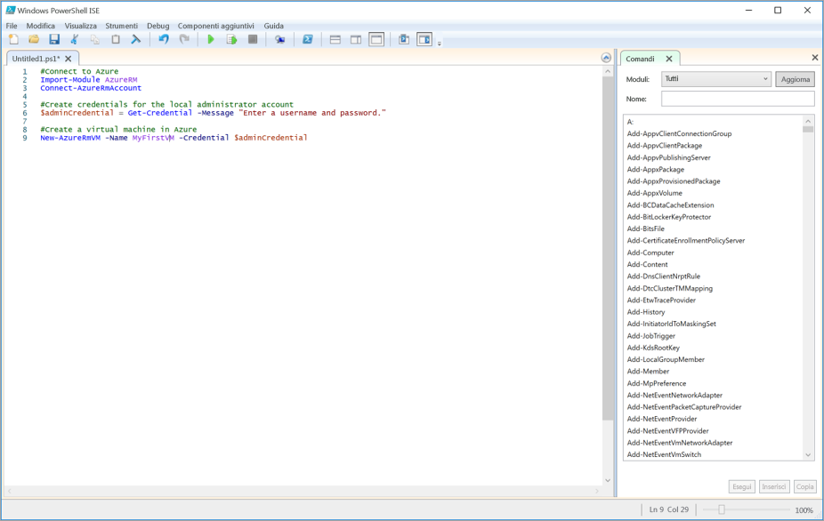

<span data-ttu-id="20131-101">Le attività complesse o ripetitive spesso richiedono una notevole quantità di tempo di amministrazione.</span><span class="sxs-lookup"><span data-stu-id="20131-101">Complex or repetitive tasks often take a great deal of administrative time.</span></span> <span data-ttu-id="20131-102">Le organizzazioni preferiscono automatizzare queste attività per ridurre i costi ed evitare gli errori.</span><span class="sxs-lookup"><span data-stu-id="20131-102">Organizations prefer to automate these tasks to reduce costs and avoid errors.</span></span>

<span data-ttu-id="20131-103">Questo aspetto è importante nell'esempio relativo all'azienda CRM (Customer Relationship Management).</span><span class="sxs-lookup"><span data-stu-id="20131-103">This is important in the Customer Relationship Management (CRM) company example.</span></span> <span data-ttu-id="20131-104">In questo caso, il software viene testato su più macchine virtuali Linux, che è necessario eliminare e ricreare continuamente.</span><span class="sxs-lookup"><span data-stu-id="20131-104">There, you test your software on multiple Linux Virtual Machines (VMs) that you need to continuously delete and recreate.</span></span> <span data-ttu-id="20131-105">Si vuole usare uno script di PowerShell per automatizzare la creazione delle macchine virtuali, invece di crearle manualmente ogni volta come appena descritto.</span><span class="sxs-lookup"><span data-stu-id="20131-105">You want to use a PowerShell script to automate the creation of the VMs vs. creating them manually each time like we just did.</span></span>

<span data-ttu-id="20131-106">Oltre al funzionamento di base per la creazione di una macchina virtuale, sono previsti alcuni requisiti aggiuntivi per lo script.</span><span class="sxs-lookup"><span data-stu-id="20131-106">Beyond the core operation of creating a VM you have a few additional requirements for your script.</span></span> 
- <span data-ttu-id="20131-107">Poiché verranno create più macchine virtuali, si vuole inserire la creazione all'interno di un ciclo</span><span class="sxs-lookup"><span data-stu-id="20131-107">You will create multiple VMs, so you want to put the creation inside a loop</span></span>
- <span data-ttu-id="20131-108">È necessario creare le macchine virtuali in tre diversi gruppi di risorse, pertanto il nome del gruppo di risorse deve essere passato allo script come parametro</span><span class="sxs-lookup"><span data-stu-id="20131-108">You need to create VMs in three different resource groups, so the name of the resource group should be passed to the script as a parameter</span></span>

<span data-ttu-id="20131-109">In questa sezione verrà descritto come scrivere ed eseguire uno script di Azure PowerShell che soddisfi questi requisiti.</span><span class="sxs-lookup"><span data-stu-id="20131-109">In this section, you will see how to write and execute an Azure PowerShell script that meets these requirements.</span></span>

## <a name="what-is-a-powershell-script"></a><span data-ttu-id="20131-110">Che cos'è uno script di PowerShell?</span><span class="sxs-lookup"><span data-stu-id="20131-110">What is a PowerShell script?</span></span>
<span data-ttu-id="20131-111">Uno script di PowerShell è un file di testo contenente comandi e costrutti di controllo.</span><span class="sxs-lookup"><span data-stu-id="20131-111">A PowerShell script is a text file containing commands and control constructs.</span></span> <span data-ttu-id="20131-112">I comandi sono chiamate di cmdlet.</span><span class="sxs-lookup"><span data-stu-id="20131-112">The commands are invocations of cmdlets.</span></span> <span data-ttu-id="20131-113">I costrutti di controllo sono funzionalità di programmazione fornite da PowerShell, quali cicli, variabili, parametri, commenti e così via.</span><span class="sxs-lookup"><span data-stu-id="20131-113">The control constructs are programming features like loops, variables, parameters, comments, etc. supplied by PowerShell.</span></span>

<span data-ttu-id="20131-114">I file di script di PowerShell hanno un'estensione **ps1**.</span><span class="sxs-lookup"><span data-stu-id="20131-114">PowerShell script files have a **.ps1** file extension.</span></span> <span data-ttu-id="20131-115">È possibile creare e salvare questi file con qualsiasi editor di testo.</span><span class="sxs-lookup"><span data-stu-id="20131-115">You can create and save these files with any text editor.</span></span> 

> [!TIP]
> <span data-ttu-id="20131-116">Se si scrivono script di PowerShell in Windows, è possibile usare l'ambiente Windows PowerShell Integrated Scripting Environment (ISE).</span><span class="sxs-lookup"><span data-stu-id="20131-116">If you’re writing PowerShell scripts under Windows, you can use the Windows PowerShell Integrated Scripting Environment (ISE).</span></span> <span data-ttu-id="20131-117">Questo editor offre funzionalità come la colorazione della sintassi e un elenco dei cmdlet disponibili.</span><span class="sxs-lookup"><span data-stu-id="20131-117">This editor provides features such as syntax coloring and a list of available cmdlets.</span></span>
>
<span data-ttu-id="20131-118">Lo screenshot seguente mostra il Windows PowerShell Integrated Scripting Environment (ISE) con uno script di esempio per connettersi ad Azure e creare una macchina virtuale in Azure.</span><span class="sxs-lookup"><span data-stu-id="20131-118">The following screenshot shows the Windows PowerShell Integrated Scripting Environment (ISE) with a sample script to connect to Azure and create a virtual machine in Azure.</span></span>

>

<span data-ttu-id="20131-120">Dopo avere scritto lo script, eseguirlo dalla riga di comando di PowerShell passando il nome del file preceduto da un punto e una barra rovesciata:</span><span class="sxs-lookup"><span data-stu-id="20131-120">Once you have written the script, execute it from the PowerShell command line by passing the name of the file preceded by a dot and a backslash:</span></span>

```powershell
.\myScript.ps1
```

## <a name="powershell-techniques"></a><span data-ttu-id="20131-121">Tecniche di PowerShell</span><span class="sxs-lookup"><span data-stu-id="20131-121">PowerShell techniques</span></span>
<span data-ttu-id="20131-122">PowerShell offre numerose funzionalità disponibili nei tipici linguaggi di programmazione.</span><span class="sxs-lookup"><span data-stu-id="20131-122">PowerShell has many features found in typical programming languages.</span></span> <span data-ttu-id="20131-123">È possibile definire variabili, usare rami e cicli, acquisire parametri della riga di comando, scrivere funzioni, aggiungere commenti e così via.</span><span class="sxs-lookup"><span data-stu-id="20131-123">You can define variables, use branches and loops, capture command-line parameters, write functions, add comments, and so on.</span></span> <span data-ttu-id="20131-124">Saranno necessarie tre funzionalità per il nostro script: variabili, cicli e parametri.</span><span class="sxs-lookup"><span data-stu-id="20131-124">We will need three features for our script: variables, loops, and parameters.</span></span>

### <a name="variables"></a><span data-ttu-id="20131-125">Variabili</span><span class="sxs-lookup"><span data-stu-id="20131-125">Variables</span></span>
<span data-ttu-id="20131-126">Come indica nell'ultima unità, PowerShell supporta le variabili.</span><span class="sxs-lookup"><span data-stu-id="20131-126">As you saw in the last unit, PowerShell supports variables.</span></span> <span data-ttu-id="20131-127">Usare **$** per dichiarare una variabile e **=** per assegnare un valore.</span><span class="sxs-lookup"><span data-stu-id="20131-127">Use **$** to declare a variable and **=** to assign a value.</span></span> <span data-ttu-id="20131-128">Ad esempio:</span><span class="sxs-lookup"><span data-stu-id="20131-128">For example:</span></span>

```powershell
$loc = "East US"
$iterations = 3
```

<span data-ttu-id="20131-129">Le variabili possono contenere oggetti.</span><span class="sxs-lookup"><span data-stu-id="20131-129">Variables can hold objects.</span></span> <span data-ttu-id="20131-130">Ad esempio, la definizione seguente imposta la variabile **adminCredential** sull'oggetto restituito dal cmdlet **Get-Credential**.</span><span class="sxs-lookup"><span data-stu-id="20131-130">For example, the following definition sets the **adminCredential** variable to the object returned by the **Get-Credential** cmdlet.</span></span>

```powershell
$adminCredential = Get-Credential
```

<span data-ttu-id="20131-131">Per ottenere il valore archiviato in una variabile, usare il prefisso **$** e il relativo nome, come mostrato di seguito:</span><span class="sxs-lookup"><span data-stu-id="20131-131">To obtain the value stored in a variable, use the **$** prefix and its name as shown below:</span></span> 

```powershell
$loc = "East US"
New-AzureRmResourceGroup -Name "MyResourceGroup" -Location $loc
```

### <a name="loops"></a><span data-ttu-id="20131-132">Loop</span><span class="sxs-lookup"><span data-stu-id="20131-132">Loops</span></span>
<span data-ttu-id="20131-133">PowerShell dispone di diversi cicli: **For**, **Do...While**, **For...Each** e così via.</span><span class="sxs-lookup"><span data-stu-id="20131-133">PowerShell has several loops: **For**, **Do...While**, **For...Each**, and so on.</span></span> <span data-ttu-id="20131-134">Il ciclo **For** è quello più adatto alle nostre esigenze, perché eseguirà un cmdlet per un numero fisso di volte.</span><span class="sxs-lookup"><span data-stu-id="20131-134">The **For** loop is the best match for our needs because we will execute a cmdlet a fixed number of times.</span></span>

<span data-ttu-id="20131-135">La sintassi di base è illustrata di seguito. L'esempio viene eseguito per due iterazioni e ogni volta visualizza il valore di **i**.</span><span class="sxs-lookup"><span data-stu-id="20131-135">The core syntax is shown below; the example runs for two iterations and prints the value of **i** each time.</span></span> <span data-ttu-id="20131-136">Gli operatori di confronto sono **-lt** per "minore di", **-le** per "minore o uguale a", **eq** per "uguale a", **ne** per "diverso da" e così via.</span><span class="sxs-lookup"><span data-stu-id="20131-136">The comparison operators are written **-lt** for "less than", **-le** for "less than or equal", **eq** for "equal", **ne** for "not equal", etc.</span></span>

```powershell
For ($i = 1; $i -lt 3; $i++)
{
    $i
}
```

### <a name="parameters"></a><span data-ttu-id="20131-137">Parametri</span><span class="sxs-lookup"><span data-stu-id="20131-137">Parameters</span></span>
<span data-ttu-id="20131-138">Quando si esegue uno script, è possibile passare argomenti dalla riga di comando.</span><span class="sxs-lookup"><span data-stu-id="20131-138">When you execute a script, you can pass arguments on the command line.</span></span> <span data-ttu-id="20131-139">È possibile specificare nomi per ogni parametro in modo da consentire allo script di estrarre i valori.</span><span class="sxs-lookup"><span data-stu-id="20131-139">You can provide names for each parameter to help the script extract the values.</span></span> <span data-ttu-id="20131-140">Ad esempio:</span><span class="sxs-lookup"><span data-stu-id="20131-140">For example:</span></span>

```powershell
.\setupEnvironment.ps1 -size 5 -location "East US"
```

<span data-ttu-id="20131-141">Nello script, i valori vengono acquisiti nelle variabili.</span><span class="sxs-lookup"><span data-stu-id="20131-141">Inside the script, you capture the values into variables.</span></span> <span data-ttu-id="20131-142">In questo esempio, viene stabilita la corrispondenza dei parametri in base al nome:</span><span class="sxs-lookup"><span data-stu-id="20131-142">In this example, the parameters are matched by name:</span></span>

```powershell
param([string]$location, [int]$size)
```

<span data-ttu-id="20131-143">È possibile omettere i nomi dalla riga di comando.</span><span class="sxs-lookup"><span data-stu-id="20131-143">You can omit the names from the command line.</span></span> <span data-ttu-id="20131-144">Ad esempio:</span><span class="sxs-lookup"><span data-stu-id="20131-144">For example:</span></span>

```powershell
.\setupEnvironment.ps1 5 "East US"
```

<span data-ttu-id="20131-145">Nello script è possibile basarsi sulla posizione per la corrispondenza quando i parametri non sono denominati:</span><span class="sxs-lookup"><span data-stu-id="20131-145">Inside the script, you rely on position for matching when the parameters are unnamed:</span></span>

```powershell
param([int]$size, [string]$location)
```

<span data-ttu-id="20131-146">Si possono accettare questi parametri come input e usare un ciclo per creare un set di macchine virtuali dai parametri specificati.</span><span class="sxs-lookup"><span data-stu-id="20131-146">We could take these parameters as input, and use a loop to create a set of VMs from the given parameters.</span></span> <span data-ttu-id="20131-147">Si proverà a eseguire queste operazioni nella prossima unità.</span><span class="sxs-lookup"><span data-stu-id="20131-147">We'll try that next.</span></span>

<span data-ttu-id="20131-148">La combinazione di PowerShell e Azure PowerShell offre tutti gli strumenti necessari per l'automazione di Azure.</span><span class="sxs-lookup"><span data-stu-id="20131-148">The combination of PowerShell and Azure PowerShell gives you all the tools you need to automate Azure.</span></span> <span data-ttu-id="20131-149">Nell'esempio relativo a CRM, sarà possibile creare più macchine virtuali Linux usando un parametro per mantenere lo script generico e un ciclo per evitare la ripetizione del codice.</span><span class="sxs-lookup"><span data-stu-id="20131-149">In our CRM example, we will be able to create multiple Linux VMs using a parameter to keep the script generic and a loop to avoid repeated code.</span></span> <span data-ttu-id="20131-150">Questo significa che un'operazione precedentemente complessa ora può essere eseguita in un unico passaggio.</span><span class="sxs-lookup"><span data-stu-id="20131-150">This means that a formerly complex operation can now be executed in a single step.</span></span>