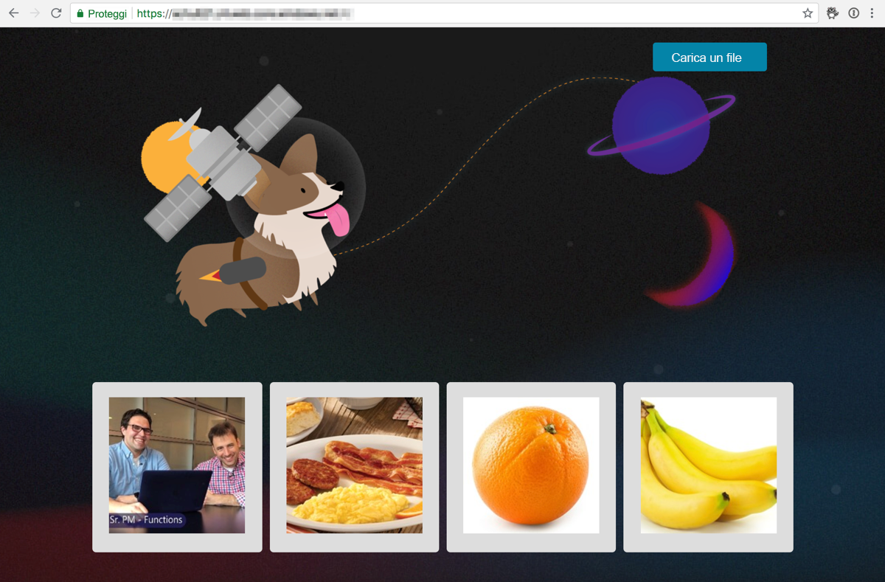
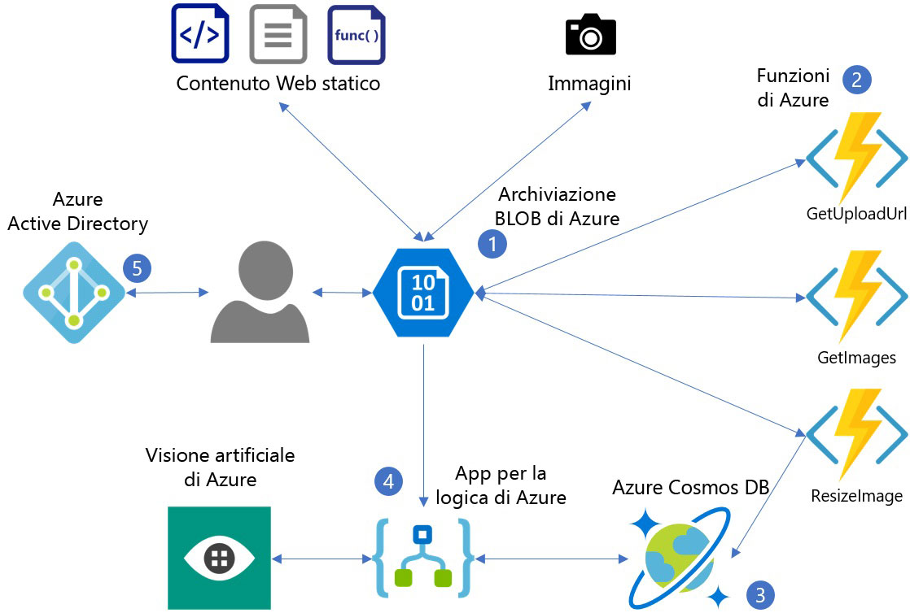
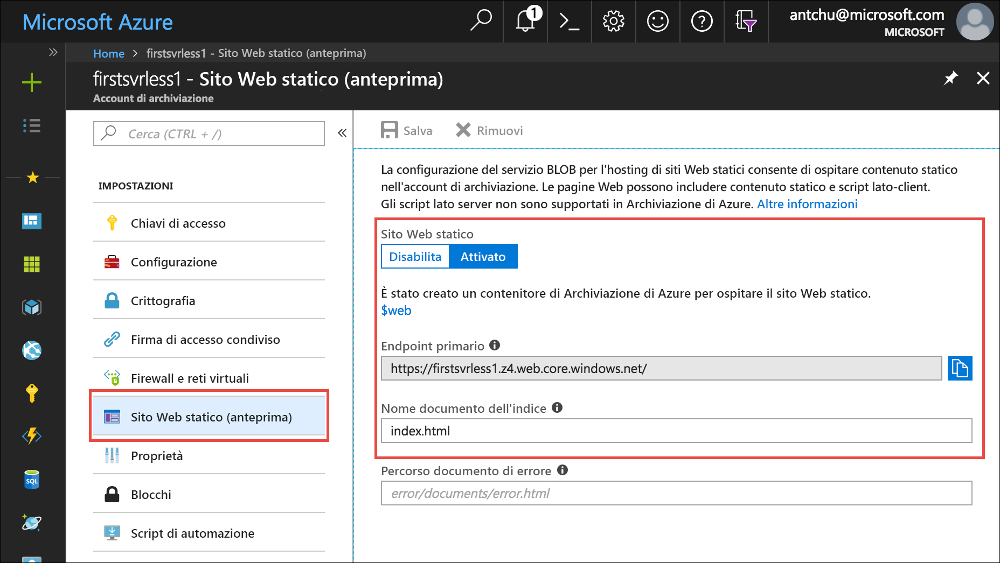
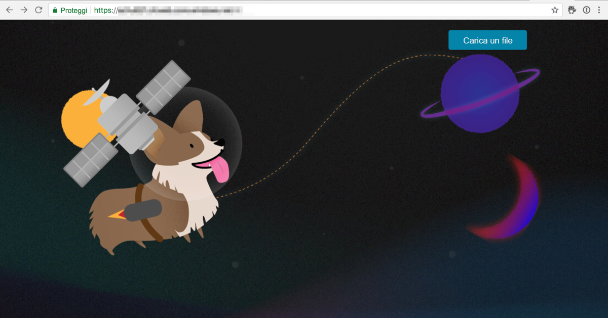

In questo modulo verrà distribuita un'applicazione Web semplice che presenta un'interfaccia utente basata su HTML. Un back-end serverless consente all'applicazione di caricare le immagini e generare automaticamente le didascalie relative.



Il diagramma seguente illustra i servizi di Azure usati dall'applicazione.



1. Archiviazione BLOB di Azure gestisce il contenuto Web statico (HTML, CSS o JS) e archivia le immagini.
2. Funzioni di Azure gestisce i caricamenti delle immagini, il ridimensionamento e l'archiviazione dei metadati.
3. Azure Cosmos DB archivia i metadati delle immagini.
4. App per la logica di Azure recupera le didascalie delle immagini dall'API Visione artificiale di Servizi cognitivi.
5. Azure Active Directory gestisce l'autenticazione degli utenti.

Archiviazione BLOB di Azure è un servizio economico e altamente scalabile che può essere usato per ospitare file statici. In questo modulo l'archiviazione BLOB verrà usata per gestire contenuti statici, ad esempio HTML, JavaScript o CSS, per l'app Web che verrà compilata.

## <a name="create-an-azure-storage-account"></a>Creare un account di Archiviazione di Azure
<!---TODO: Update for sandbox?--->

Un account di Archiviazione di Azure è una risorsa di Azure che consente di archiviare tabelle, code, file, BLOB (oggetti) e dischi delle macchine virtuali.

1. Selezionare il pulsante **Enter focus mode** (Accedi a modalità messa a fuoco) per avviare Azure Cloud Shell (Bash). Questo pulsante si trova nella parte superiore destra o nella parte inferiore della pagina, a seconda dell'ampiezza della finestra del browser. La modalità messa a fuoco ancora una finestra di Cloud Shell sul lato destro della finestra del browser, in modo da potere eseguire con facilità i comandi illustrati nell'esercitazione.

1. Un gruppo di risorse di Azure è un contenitore con risorse di Azure correlate per facilitare la gestione. Creare un nuovo gruppo di risorse denominato **first-serverless-app**.

    ```azurecli
    az group create -n first-serverless-app -l westcentralus
    ```

1. Il contenuto statico, come ad esempio file HTML, CSS e JavaScript, per questa esercitazione è ospitato nell'archiviazione BLOB. L'archiviazione BLOB richiede un account di archiviazione. Creare un account di archiviazione di uso generico v2 (GPv2) nel gruppo di risorse. Sostituire `<storage account name>` con un nome univoco.

    ```azurecli
    az storage account create -n <storage account name> -g first-serverless-app --kind StorageV2 -l westcentralus --https-only true --sku Standard_LRS
    ```
    
1. Usare la barra di ricerca nella parte superiore del [portale di Azure](https://portal.azure.com/?azure-portal=true) per trovare l'account di archiviazione appena creato. Aprire l'account.

1. Nel riquadro di spostamento a sinistra selezionare **Sito Web statico (anteprima)** per configurare un contenitore per l'hosting di siti Web statici.
    - Selezionare **Abilitato** per abilitare il sito Web statico.
    - Immettere **index.html** come nome del documento di indice. Nella finestra è già presente *index.html* in grigio, ma si tratta solo di testo di esempio. È comunque necessario immettere **index.html** nella finestra.
    - Fare clic su **Salva**.
    
    

1. Salvare l'**Endpoint primario** in una posizione da cui poterlo copiare facilmente durante l'esecuzione dell'esercitazione. L'endpoint è l'URL dell'applicazione Web.

## <a name="upload-the-web-application"></a>Caricare l'applicazione Web

1. I file di origine per l'applicazione che si compila in questa esercitazione si trovano in un [repository GitHub](https://github.com/Azure-Samples/functions-first-serverless-web-application). Passare alla home directory in Cloud Shell e clonare il repository.

    ```azurecli
    cd ~
    git clone https://github.com/Azure-Samples/functions-first-serverless-web-application
    ```

    Il repository viene clonato in `/home/<username>/functions-first-serverless-web-application`.

1. L'applicazione Web sul lato client si trova nella cartella **www** e viene compilata con il framework JavaScript Vue.js. Aprire la cartella **www** ed eseguire i comandi **npm** per installare le dipendenze dell'applicazione e compilarla. Il completamento dell'ultimo di questi comandi potrebbe richiedere alcuni minuti.

    ```azurecli
    cd ~/functions-first-serverless-web-application/www
    npm install
    npm run generate
    ```

    L'applicazione viene generata nella cartella **dist**.

1. Passare dalla directory corrente alla directory **dist** e caricare l'applicazione nel contenitore BLOB **$web**.

    ```azurecli
    cd dist
    az storage blob upload-batch -s . -d \$web --account-name <storage account name>
    ```

1. Per visualizzare l'applicazione, aprire l'URL dell'endpoint primario dei siti Web statici in un Web browser.

    


## <a name="summary"></a>Riepilogo

In questa unità è stato creato un gruppo di risorse denominato **first-serverless-app** contenente un account di archiviazione. Un contenitore BLOB denominato **$web** nell'account di archiviazione archivia il contenuto statico per l'applicazione Web e rende il contenuto disponibile pubblicamente. Si vedrà ora come usare una funzione serverless per caricare immagini nell'archiviazione BLOB da questa applicazione Web.