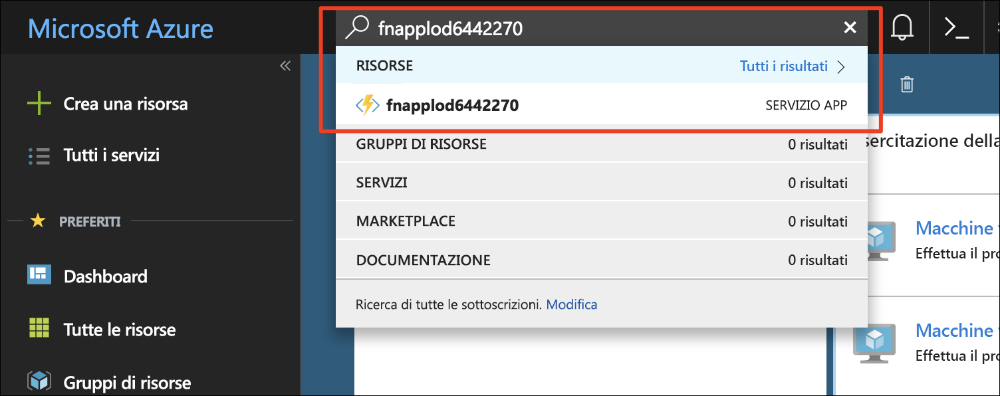
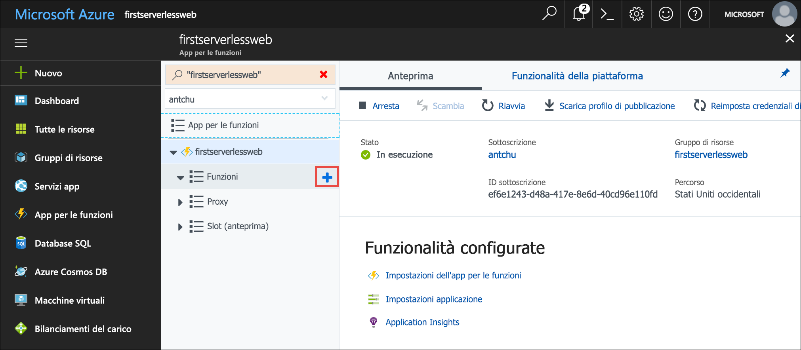
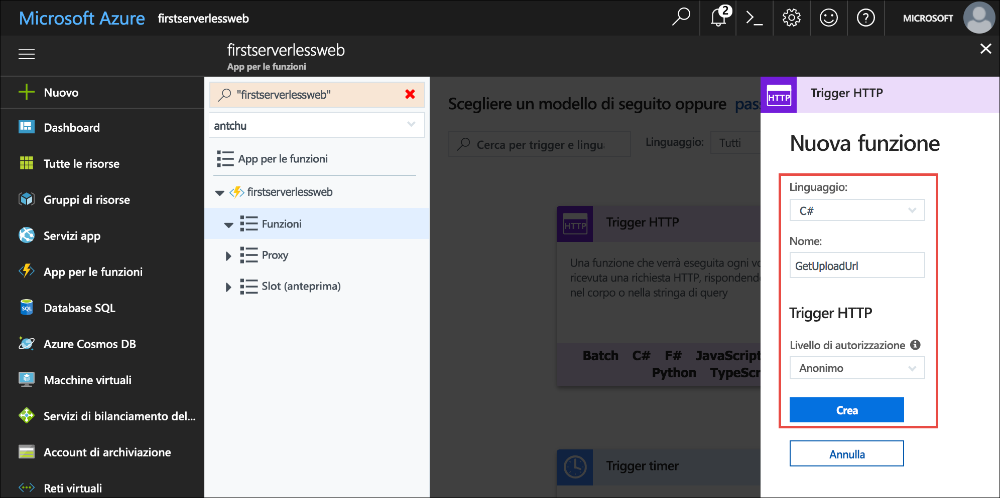
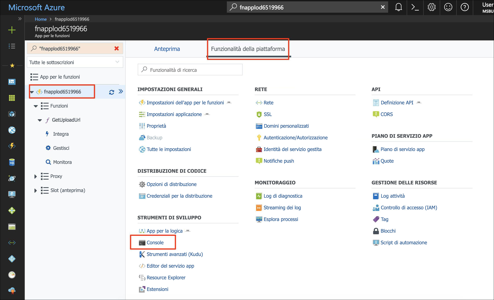
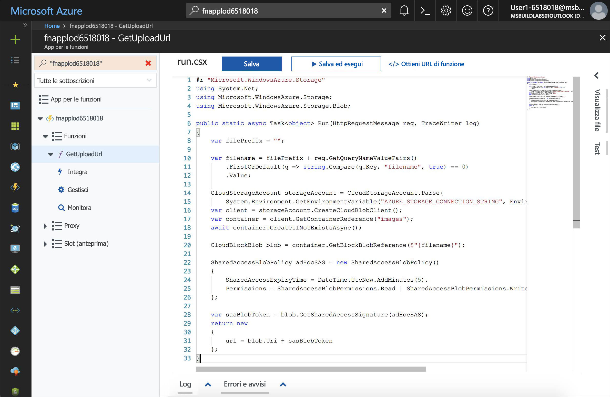
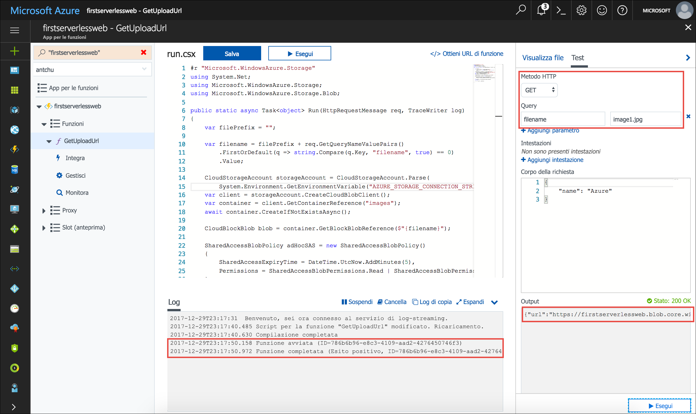
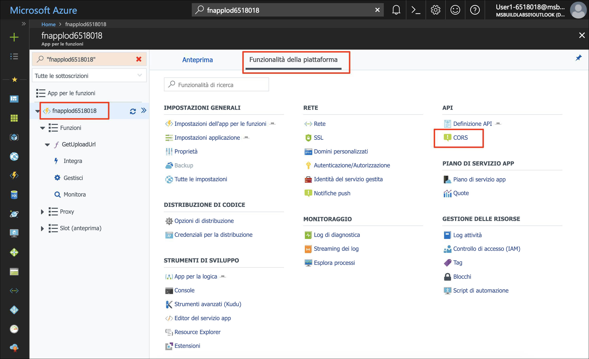
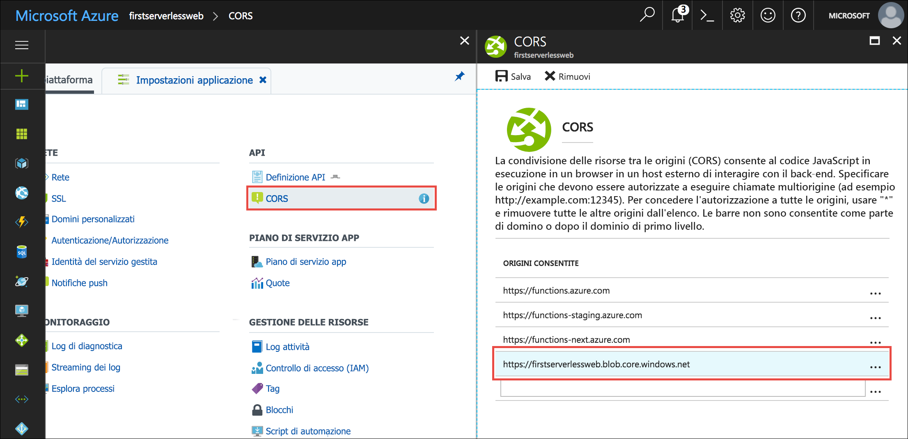

L'applicazione che si sta creando è una raccolta di foto. che usa JavaScript lato client per chiamare API per caricare e visualizzare immagini. In questa unità, si creerà un'API usando una funzione senza server che genera un URL del periodo di tempo limitato per caricare un'immagine. L'applicazione web Usa questo URL per caricare un immagine su archiviazione Blob usando il [API REST di archiviazione Blob](https://docs.microsoft.com/rest/api/storageservices/blob-service-rest-api).

## <a name="create-a-blob-storage-container-for-images"></a>Creare un contenitore di archiviazione BLOB per le immagini

L'applicazione richiede un contenitore di archiviazione separato per caricare e ospitare immagini.

1. Verificare di essere ancora connessi a Azure Cloud Shell (Bash). In caso contrario, selezionare **Enter focus mode** (Accedi a modalità messa a fuoco) per aprire una finestra di Cloud Shell.

1.  Creare un nuovo contenitore nell'account di archiviazione denominato **immagini** nell'account di archiviazione con accesso pubblico a tutti i BLOB.

    ```azurecli
    az storage container create -n images --account-name <storage account name> --public-access blob
    ```

## <a name="create-a-function-app"></a>Creare un'app per le funzioni

Funzioni di Azure è un servizio per l'esecuzione di funzioni serverless. Una funzione serverless può essere attivata (chiamata) da eventi come una richiesta HTTP o la creazione di un BLOB in un contenitore di archiviazione.

App per le funzioni è un contenitore per uno o più funzioni senza server.

- Creare una nuova app per le funzioni con un nome univoco nel **first-app senza server** gruppo di risorse creato in precedenza. App per le funzioni richiedono un account di archiviazione. In questa unità, si userà l'account di archiviazione creato nell'ultima unità.

    ```azurecli
    az functionapp create -n <function app name> -g <rgn>[Sandbox resource group name]</rgn> -s <storage account name>
    ```

## <a name="create-an-http-triggered-serverless-function"></a>Creare una funzione serverless attivata da HTTP

Per caricare un'immagine in modo sicuro nell'archiviazione BLOB, l'applicazione Web della raccolta foto invia alla funzione serverless una richiesta HTTP di generazione di un URL temporaneo. La funzione viene attivata da una richiesta HTTP e usa Azure Storage SDK per generare e restituire l'URL protetto.

1. Dopo aver creato l'app per le funzioni, cercarlo nel [portale di Azure](https://portal.azure.com/?azure-portal=true) usando la **ricerca** casella. Fare clic sull'app e aprirla.

    

1. Nel riquadro di spostamento a sinistra della finestra dell'applicazione funzioni, scegliere **funzioni** e fare clic sul segno più (+) per creare una nuova funzione senza server.

    

1. Fare clic su **Funzione personalizzata** per visualizzare un elenco di modelli di funzione.

1. Trovare il **HttpTrigger** modello e fare clic sul linguaggio c# o JavaScript.

1. Usare i valori seguenti per creare una funzione che genera un URL di caricamento BLOB:

    | Impostazione      |  Valore consigliato   | Descrizione                                        |
    | --- | --- | ---|
    | **Linguaggio** | C# o JavaScript | Selezionare il linguaggio che si vuole usare. |
    | **Assegnare un nome alla funzione** | GetUploadUrl | Immettere questo nome esattamente come illustrato in modo che l'applicazione possa individuare la funzione. |
    | **Livello di autorizzazione** | Anonimo | Consente alla funzione di essere accessibili pubblicamente. |

    

1. Fare clic su **Crea** per creare la funzione.

::: zone pivot="csharp"
1. (C#) Quando viene visualizzato il codice sorgente di funzione, sostituire tutto il contenuto nel **Run. csx** file con il contenuto nel [ **csharp/GetUploadUrl/run.csx** ](https://raw.githubusercontent.com/Azure-Samples/functions-first-serverless-web-application/master/csharp/GetUploadUrl/run.csx) file.

::: zone-end

::: zone pivot="javascript"
1. (JavaScript) Questa funzione richiede il pacchetto `azure-storage` da npm. Il pacchetto genera il token di firma di accesso condiviso (SAS) necessario per compilare l'URL protetto. Per installare il pacchetto npm, fare clic sull'app Funzioni nel riquadro di spostamento di sinistra e fare clic su **Funzionalità della piattaforma**.

1. (JavaScript) Fare clic su **Console** per visualizzare una finestra della console.

    

1. (JavaScript) Assicurarsi che la directory corrente sia **d:\home\site\wwwroot** eseguendo il comando `cd d:\home\site\wwwroot`.

1. (JavaScript) Eseguire il comando `npm init -y` per creare un file **package.json** vuoto.

1. (JavaScript) Eseguire il comando `npm install --save azure-storage` nella console per installare il pacchetto. Salvare il pacchetto come **package.json**. Il completamento dell'operazione potrebbe richiedere alcuni minuti.

1. (JavaScript) Fare clic sulla funzione (**GetUploadUrl**) nel riquadro di spostamento a sinistra per visualizzare la funzione. Sostituire tutto il contenuto del file **index.js** con il contenuto del file [**javascript/GetUploadUrl/index.js**](https://raw.githubusercontent.com/Azure-Samples/functions-first-serverless-web-application/master/javascript/GetUploadUrl/index.js).

    

::: zone-end

1. Fare clic su **Log** sotto la finestra del codice per espandere il pannello dei log.

1. Fare clic su **Salva**. Verificare nel pannello dei log che la funzione sia stata compilata correttamente.

La funzione genera un URL di firma di accesso condiviso che consente di caricare un file nell'archiviazione Blob. L'URL di firma di accesso condiviso è valido per un breve periodo di tempo e consente solo un singolo file da caricare. Consultare la documentazione di archiviazione Blob per altre informazioni in merito [come usare le firme di accesso condiviso](https://docs.microsoft.com/azure/storage/common/storage-dotnet-shared-access-signature-part-1).


## <a name="add-an-environment-variable-for-the-storage-connection-string"></a>Aggiungere una variabile di ambiente per la stringa di connessione di archiviazione

La funzione appena creata richiede una stringa di connessione per l'account di archiviazione in modo da poter generare l'URL SAS. Invece di codificare la stringa di connessione come hardcoded nel corpo della funzione, è possibile memorizzarla come impostazione dell'applicazione. Le impostazioni dell'applicazione sono accessibili come variabili di ambiente da tutte le funzioni nell'app per le funzioni.

1. In Cloud Shell eseguire una query sulla stringa di connessione dell'account di archiviazione e salvarla in una variabile Bash denominata **STORAGE_CONNECTION_STRING**.

    ```azurecli
    export STORAGE_CONNECTION_STRING=$(az storage account show-connection-string -n <storage account name> -g first-serverless-app --query "connectionString" --output tsv)
    ```

    Verificare che la variabile sia impostata correttamente.

    ```azurecli
    echo $STORAGE_CONNECTION_STRING
    ```

1. Creare una nuova impostazione dell'applicazione denominata **AZURE_STORAGE_CONNECTION_STRING** usando il valore salvato nel passaggio precedente.

    ```azurecli
    az functionapp config appsettings set -n <function app name> -g first-serverless-app --settings AZURE_STORAGE_CONNECTION_STRING=$STORAGE_CONNECTION_STRING -o table
    ```

    Verificare che l'output del comando contenga la nuova impostazione dell'applicazione con il valore corretto.


## <a name="test-the-serverless-function"></a>Testare la funzione serverless

Oltre alla creazione e alla modifica delle funzioni, il portale di Azure offre uno strumento predefinito anche per il test delle funzioni.

1. Per testare la funzione HTTP serverless, fare clic sulla scheda **Test** sulla destra della finestra del codice per espandere il pannello di test.

1. Modificare **Metodo HTTP** in **GET**.

1. In **Query** fare clic su **Aggiungi parametro** e aggiungere il parametro seguente:

    | Nome      |  Valore   | 
    | --- | --- |
    | **filename** | image1.jpg |

1. Fare clic su **Esegui** nel pannello di test per inviare una richiesta HTTP alla funzione.

1. La funzione restituisce un URL di caricamento nell'output. L'esecuzione della funzione viene visualizzata nel pannello dei log.

    


## <a name="configure-cors-in-the-function-app"></a>Configurare CORS nell'app per le funzioni

Poiché il front-end di funzione è ospitato nell'archiviazione Blob, ha un nome di dominio diverso da quella dell'app di funzione. Per JavaScript lato client per la chiamata della funzione che è stato creato, l'app per le funzioni deve essere configurata per la cross-origin resource sharing (CORS).

1. Nel riquadro di spostamento a sinistra della finestra dell'applicazione (funzione), fare clic sul nome dell'app per le funzioni.

1. Fare clic su **Funzionalità della piattaforma** per visualizzare un elenco di funzionalità avanzate.

1. Sotto **API** fare clic su **CORS**.

    

1. Aggiungere un'entità origin Consenti per l'URL del sito web che è stato creato nell'unità di precedente e omettere la barra finale (/). Ad esempio: `https://firstserverlessweb.z4.web.core.windows.net`.

    

1. Fare clic su **Salva**.

::: zone pivot="csharp"
1. (C#) Tornare alla funzione `GetUploadUrl` e selezionare la scheda **Integrazione**.

1. (C#) In **Metodi HTTP selezionati** selezionare **OPTIONS**.

    **GET**, **POST** e **OPTIONS** devono essere tutti selezionati. CORS usa il metodo **OPTIONS**, che non è selezionato per impostazione predefinita per le funzioni C#.  

1. (C#) Fare clic su **Salva**.

::: zone-end

1. Sempre nel portale di Azure, passare all'app di funzione. Selezionare la scheda **Panoramica**. Fare clic su **Riavvia** per assicurarsi che le modifiche per CORS abbiano effetto.

## <a name="configure-cors-in-the-storage-account"></a>Configurare CORS nell'account di archiviazione

Poiché l'app per le funzioni semplifica anche le chiamate JavaScript lato client nell'archivio Blob per caricare i file, è necessario configurare l'account di archiviazione per CORS.

- Eseguire il comando seguente per consentire a tutte le origini di caricare file nell'account di archiviazione:

    ```azurecli
    az storage cors add --methods OPTIONS PUT --origins '*' --exposed-headers '*' --allowed-headers '*' --services b --account-name <storage account name>
    ```


## <a name="modify-the-web-app-to-upload-images"></a>Modificare l'app Web per caricare immagini

L'app Web recupera le impostazioni da un file denominato **settings.js**. Nei passaggi seguenti viene creato il file usando Cloud Shell. Si imposta `window.apiBaseUrl` all'URL dell'app per le funzioni e `window.blobBaseUrl` all'URL dell'endpoint di archiviazione Blob di Azure.

1. In Cloud Shell assicurarsi che la directory corrente sia la cartella **www/dist**.

    ```azurecli
    cd ~/functions-first-serverless-web-application/www/dist
    ```

1. Aprire l'Editor di Cloud Shell, digitando il comando `code`.

    ```azurecli
    code
    ```

1. Nella finestra Cloud Shell sotto l'editor di query URL dell'app per le funzioni.

    ```azurecli
    echo "https://"$(az functionapp show -n <function app name> -g first-serverless-app --query "defaultHostName" --output tsv)
    ```

1. Aggiungere la riga seguente nella finestra dell'editor, usando l'URL dell'app (funzione) recuperato nel passaggio precedente.

    ```
    window.apiBaseUrl = '<function app url>'
    ```

1. Nella finestra Cloud Shell sotto l'editor di query dell'URL dell'endpoint archiviazione Blob di Azure.

    ```azurecli
    echo $(az storage account show -n <storage account name> -g first-serverless-app --query primaryEndpoints.blob -o tsv | sed 's/\/$//')
    ```

1. Aggiungere una seconda riga nella finestra dell'editor, usando l'URL dell'endpoint di archiviazione recuperato nel passaggio precedente.

    ```
    window.blobBaseUrl = '<blob storage endpoint url>'
    ```

1. Salvare il file come **settings.js** e chiudere l'editor.

1. Verificare che il file sia stato scritto correttamente e che ora contenga 2 righe.

    ```azurecli
    cat settings.js
    ```

1. Caricare il file nell'archivio BLOB.

    ```azurecli
    az storage blob upload -c \$web --account-name <storage account name> -f settings.js -n settings.js
    ```

## <a name="test-the-web-application"></a>Testare l'applicazione Web

A questo punto, l'applicazione della raccolta può caricare un'immagine nell'archiviazione BLOB, ma non può ancora visualizzare le immagini. Tenterà di chiamare una funzione `GetImages` che non esiste ancora perché verrà creata in un modulo successivo. La chiamata avrà esito negativo e la pagina Web apparirà bloccata su "Analisi", ma l'immagine selezionata verrà caricata correttamente.

È possibile verificare che un'immagine sia stata caricata correttamente controllando il contenuto del contenitore **images** nel portale di Azure.

1. In una finestra del browser passare all'applicazione. Selezionare un file di immagine e caricarlo. Il file viene caricato ma, poiché non è stata ancora aggiunta la possibilità di visualizzare le immagini, la foto caricata non viene visualizzata nell'app. La pagina Web appare bloccata su "Analyzing image..." (Analisi immagine in corso...). Questo problema verrà risolto in seguito.

1. In Cloud Shell verificare che l'immagine sia stata caricata nel contenitore **images**.

    ```azurecli
    az storage blob list --account-name <storage account name> -c images -o table
    ```

1. Prima di passare all'esercitazione successiva, eliminare tutti i file nel contenitore **images**.

    ```azurecli
    az storage blob delete-batch -s images --account-name <storage account name>
    ```

## <a name="summary"></a>Riepilogo

In questa unità è stata creata un'app Funzioni di Azure ed è stato illustrato come usare una funzione serverless per consentire a un'applicazione Web di caricare immagini nell'archivio BLOB. Successivamente, si apprenderà come creare un'anteprima per le immagini caricate con una funzione senza server attivate dal blob.