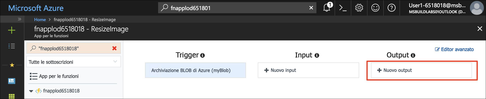
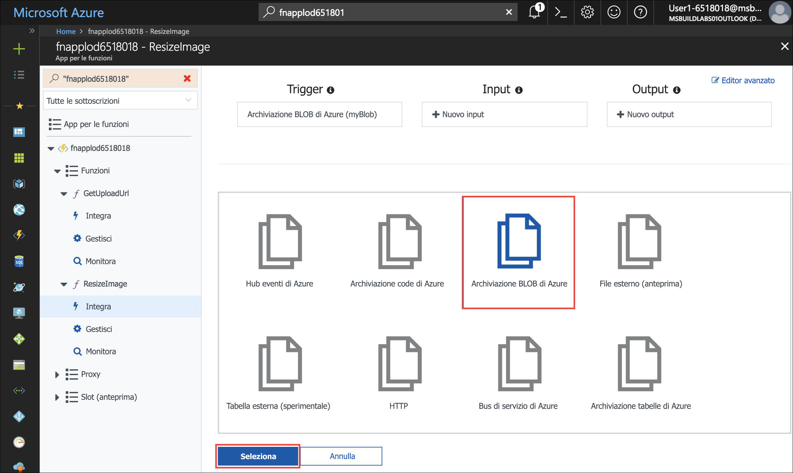
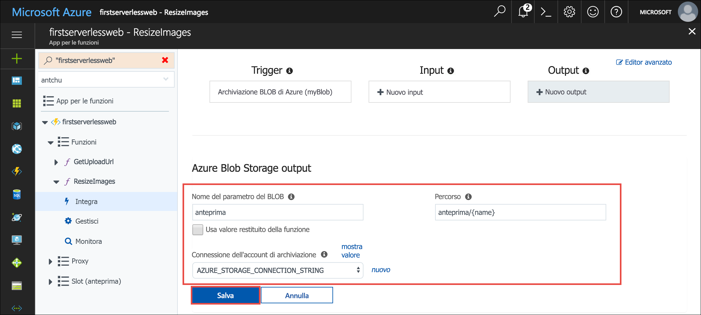
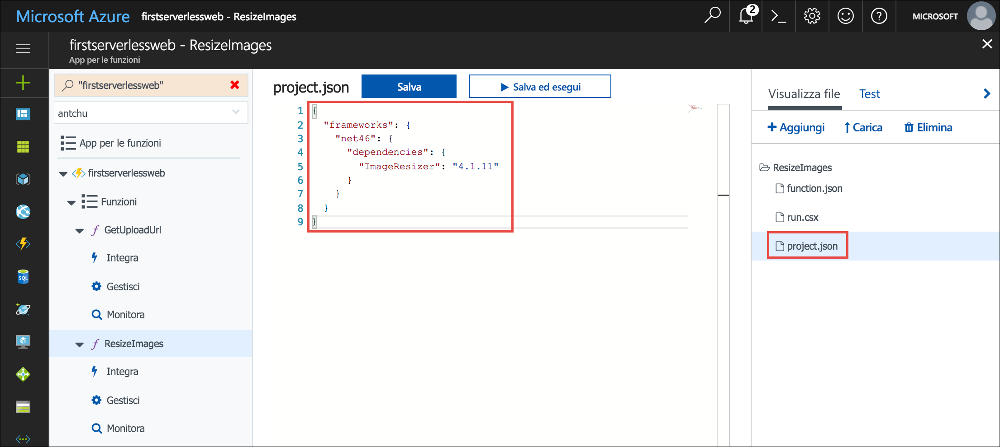

Nell'unità precedente si è visto come una funzione serverless possa facilitare il caricamento sicuro di immagini nell'archiviazione BLOB da un'applicazione Web. In questo modulo si creerà un'altra funzione serverless che controllerà il caricamento di immagini e creerà le relative anteprime.

## <a name="create-a-blob-storage-container-for-thumbnails"></a>Creare un contenitore di archiviazione BLOB per le anteprime

Le immagini con le dimensioni originali vengono archiviate in un contenitore denominato **images**. È necessario un altro contenitore per archiviare le anteprime di tali immagini.

Creare un nuovo contenitore denominato **thumbnails** nell'account di archiviazione con accesso pubblico a tutti i BLOB.

```azurecli
az storage container create -n thumbnails --account-name <storage account name> --public-access blob
```

## <a name="create-a-blob-triggered-serverless-function"></a>Creare una funzione serverless attivata dal BLOB

Un trigger definisce come viene richiamata una funzione. La funzione che verrà creata ora viene attivata dal BLOB. La funzione viene richiamata automaticamente quando un BLOB (file immagine) viene caricato nel contenitore **images**. Una funzione deve avere un trigger. I trigger hanno dati associati, in genere il payload che ha attivato la funzione.

Le associazioni definiscono il modo in cui una funzione legge o scrive i dati in Azure o in servizi di terze parti. Questa funzione crea una versione di anteprima dell'immagine che la attiva e salva l'anteprima in un contenitore denominato *thumbnails*.

1. Accedere al [portale di Azure](https://portal.azure.com/triplecrownlabs.onmicrosoft.com?azure-portal=true) usando lo stesso account con cui si è attivata la sandbox.

1. Aprire l'app per le funzioni. È possibile usare la casella **Cerca** nella parte superiore del portale per trovarla in base al nome.

1. Nella finestra dell'app Funzioni nel riquadro di spostamento a sinistra scegliere **Funzioni** e fare clic sul segno più (+) per creare una nuova funzione serverless. Se viene visualizzata una pagina della guida introduttiva, fare clic su **Funzione personalizzata** per visualizzare un elenco di modelli di funzione.

1. Individuare il modello **BlobTrigger** e selezionarlo.

1. Usare questi valori per creare una funzione che crea anteprime quando vengono caricate immagini:

    | Impostazione      |  Valore consigliato   | Descrizione                                        |
    | --- | --- | ---|
    | **Linguaggio** | C# o JavaScript | Scegliere il linguaggio preferito. |
    | **Assegnare un nome alla funzione** | ResizeImage | Immettere questo nome esattamente come illustrato in modo che l'applicazione possa individuare la funzione. |
    | **Percorso** | images/{name} | Esegue la funzione quando viene visualizzato un file nel contenitore **images**. |
    | **Informazioni account di archiviazione** | AZURE_STORAGE_CONNECTION_STRING | Usare la variabile di ambiente creata in precedenza con la stringa di connessione. |

    

1. Fare clic su **Crea** per creare la funzione.

1. Quando la funzione è stata creata, fare clic su **Integrazione** per visualizzarne le associazioni di trigger, input e output.

1. Fare clic su **Nuovo output** per creare una nuova associazione di output.

    

1. Selezionare **Archiviazione BLOB di Azure** e fare clic su **Seleziona**. Può essere necessario scorrere verso il basso per vedere il pulsante **Seleziona**.

    

1. Immettere i valori seguenti:

    | Impostazione      |  Valore consigliato   | Descrizione                                        |
    | --- | --- | ---|
    | **Nome del parametro del BLOB** | thumbnail | La funzione usa il parametro con questo nome per scrivere l'anteprima. |
    | **Usa valore restituito della funzione** | No |  |
    | **Percorso** | thumbnails/{name} | Le anteprime vengono scritte in un contenitore denominato **thumbnails**. |
    | **Connessione dell'account di archiviazione** | AZURE_STORAGE_CONNECTION_STRING | Usare la variabile di ambiente creata in precedenza con la stringa di connessione. |

    

1. Fare clic su **Salva** per salvare le modifiche.

::: zone pivot="javascript"

11. Fare clic su **Editor avanzato** nell'angolo superiore destro della finestra per visualizzare il codice JSON che rappresenta le associazioni.

1. Nell'associazione `blobTrigger` aggiungere una proprietà denominata `dataType` con valore `binary`. In questo modo, viene configurata l'associazione per il passaggio dei contenuti del BLOB alla funzione come dati binari.

    ```json
    {
        "name": "myBlob",
        "type": "blobTrigger",
        "direction": "in",
        "path": "images/{name}",
        "connection": "AZURE_STORAGE_CONNECTION_STRING",
        "dataType": "binary"
    }
    ```

1. Fare clic su **Salva** per creare la nuova associazione.

::: zone-end

::: zone pivot="csharp"

11. Selezionare il nome della funzione **ResizeImage** nel riquadro di spostamento a sinistra per aprire il codice sorgente della funzione.

1. La funzione richiede un pacchetto NuGet chiamato **ImageResizer** per generare le anteprime. I pacchetti NuGet vengono aggiunti alle funzioni C# tramite un file **project.json**. Per creare il file, fare clic su **Visualizza file** a destra per visualizzare i file che costituiscono la funzione.

1. Fare clic su **Aggiungi** per aggiungere un nuovo file denominato **project.json**. Premere **INVIO** al termine per aggiungere il file.

1. Copiare il contenuto del file [**/csharp/ResizeImage/project.json**](https://raw.githubusercontent.com/Azure-Samples/functions-first-serverless-web-application/master/csharp/ResizeImage/project.json) nel file appena creato. Salvare il file. I pacchetti vengono ripristinati automaticamente quando il file viene aggiornato.

    

1. In **Visualizza file** selezionare **run.csx**. Sostituirne il contenuto con quello del file [**/csharp/ResizeImage/run.csx**](https://raw.githubusercontent.com/Azure-Samples/functions-first-serverless-web-application/master/csharp/ResizeImage/run.csx).

1. Fare clic su **Log** sotto la finestra del codice per espandere il pannello dei log.

1. Fare clic su **Salva**. Verificare nel pannello dei log che la funzione sia stata salvata correttamente e che non vi siano errori.

::: zone-end

::: zone pivot="javascript"

14. Questa funzione richiede il pacchetto `jimp` di npm per ridimensionare la foto. Per installare il pacchetto npm, fare clic sul nome dell'app Funzioni nel riquadro di spostamento di sinistra e fare clic su **Funzionalità della piattaforma**.

1. Fare clic su **Console** per visualizzare una finestra della console.

1. Eseguire il comando `npm install jimp` nella console. Il completamento dell'operazione potrebbe richiedere alcuni minuti.

1. Fare clic sulla funzione **ResizeImage** nel riquadro di spostamento a sinistra per visualizzare la funzione. Sostituire tutto il contenuto del file **index.js** con il contenuto del file [**javascript/ResizeImage/index.js**](https://raw.githubusercontent.com/Azure-Samples/functions-first-serverless-web-application/master/javascript/ResizeImage/index.js).

1. Fare clic su **Log** sotto la finestra del codice per espandere il pannello dei log.

1. Fare clic su **Salva**. Verificare nel pannello dei log che la funzione sia stata salvata correttamente e che non vi siano errori.

::: zone-end

## <a name="test-the-serverless-function"></a>Testare la funzione serverless

1. Aprire l'applicazione in un browser. Selezionare un file di immagine e caricarlo. Il file viene caricato ma, poiché non è stata ancora aggiunta la possibilità di visualizzare le immagini, la foto caricata non viene visualizzata nell'app.

1. In Cloud Shell verificare che l'immagine sia stata caricata nel contenitore **images**.

    ```azurecli
    az storage blob list \
        --account-name <storage account name> \
        -c images \
        -o table
    ```

1. Verificare che sia stata creata l'anteprima in un contenitore denominato **thumbnails**.

    ```azurecli
    az storage blob list \
        --account-name <storage account name> \
        -c thumbnails \
        -o table
    ```

1. Ottenere l'URL per l'anteprima.

    ```azurecli
    az storage blob url \
        --account-name <storage account name> \
        -c thumbnails \
        -n <filename> \
        --output tsv
    ```

    Aprire l'URL in un browser e verificare che l'anteprima sia stata creata correttamente.

1. Prima di passare alla prossima unità, eliminare tutti i file nei contenitori **images** e **thumbnails**.

    ```azurecli
    az storage blob delete-batch \
        -s images \
        --account-name <storage account name>
    ```

    ```azurecli
    az storage blob delete-batch \
        -s thumbnails \
        --account-name <storage account name>
    ```

## <a name="summary"></a>Riepilogo

In questa unità è stata creata una funzione serverless in modo da creare un'anteprima ogni volta che viene caricata un'immagine in un contenitore di archiviazione BLOB. Si osserverà ora come usare Azure Cosmos DB per archiviare ed elencare i metadati delle immagini.