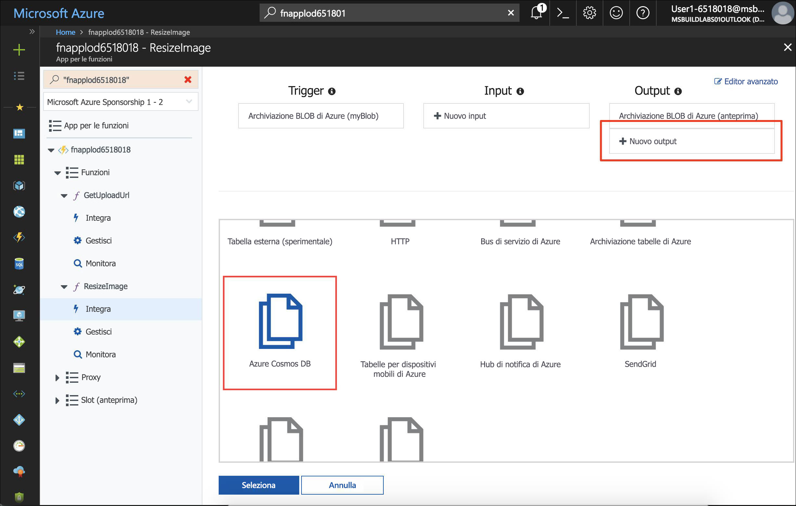
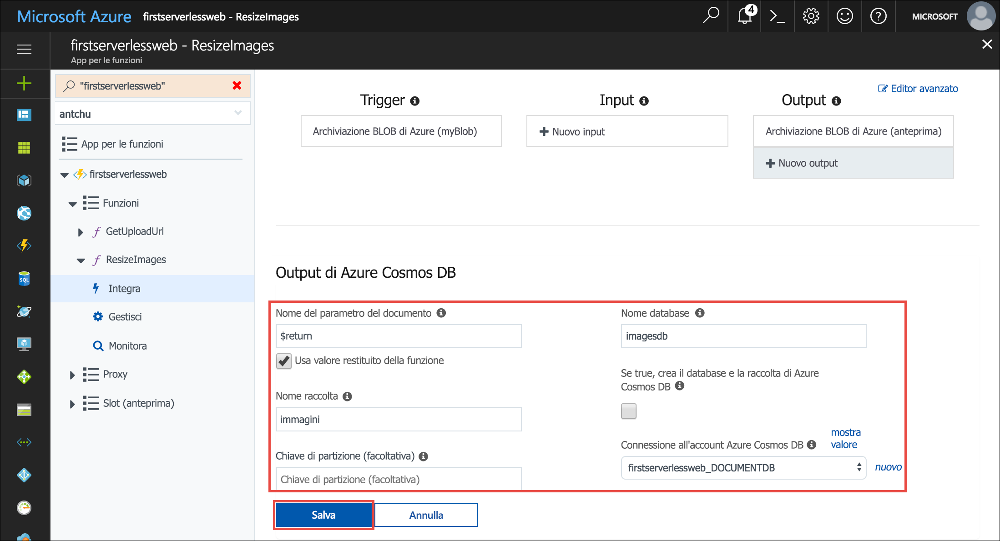
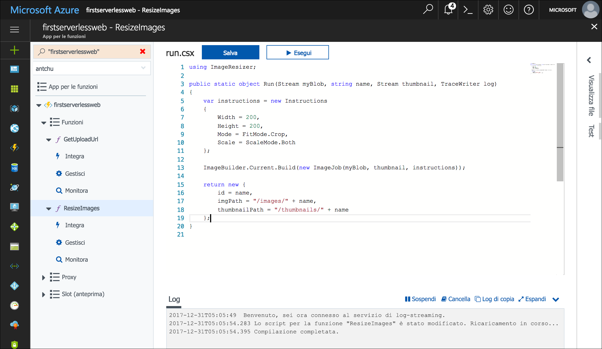
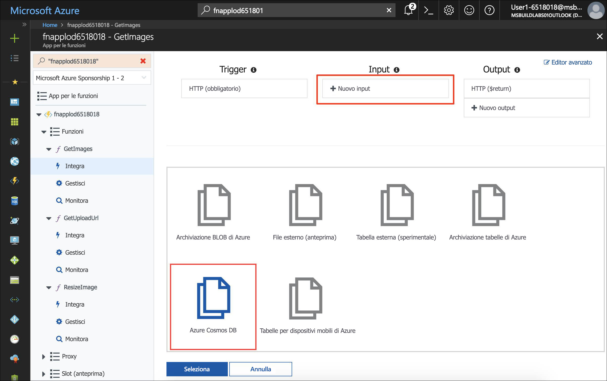
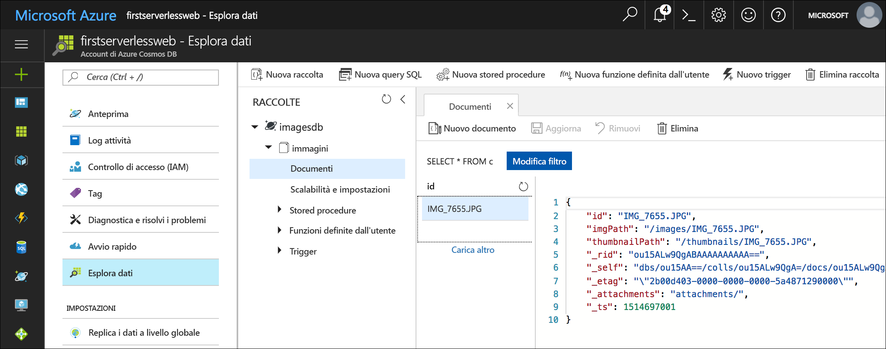

<span data-ttu-id="7f70d-101">Azure Cosmos DB è il database di Microsoft multimodello, serverless, distribuito a livello globale.</span><span class="sxs-lookup"><span data-stu-id="7f70d-101">Azure Cosmos DB is Microsoft's serverless, globally distributed, multi-model database.</span></span> <span data-ttu-id="7f70d-102">In questo modulo si vedrà come usare Funzioni di Azure per memorizzare e recuperare i metadati delle immagini come documenti JSON in Azure Cosmos DB.</span><span class="sxs-lookup"><span data-stu-id="7f70d-102">In this module, you learn how to use Azure Functions to store and retrieve image metadata as JSON documents in Azure Cosmos DB.</span></span>

## <a name="create-an-azure-cosmos-db-account-database-and-collection"></a><span data-ttu-id="7f70d-103">Creare un account, un database e una raccolta Azure Cosmos DB</span><span class="sxs-lookup"><span data-stu-id="7f70d-103">Create an Azure Cosmos DB account, database, and collection</span></span>

<span data-ttu-id="7f70d-104">Un account Azure Cosmos DB è una risorsa di Azure che contiene database Azure Cosmos DB.</span><span class="sxs-lookup"><span data-stu-id="7f70d-104">An Azure Cosmos DB account is an Azure resource that contains Azure Cosmos DB databases.</span></span>

1. <span data-ttu-id="7f70d-105">Verificare di essere ancora connessi a Cloud Shell.</span><span class="sxs-lookup"><span data-stu-id="7f70d-105">Ensure you're still signed into Cloud Shell.</span></span> <span data-ttu-id="7f70d-106">In caso contrario, selezionare **Enter focus mode** (Accedi a modalità messa a fuoco) per aprire una finestra di Cloud Shell.</span><span class="sxs-lookup"><span data-stu-id="7f70d-106">If you aren't, select **Enter focus mode** to open a Cloud Shell window.</span></span> 

1. <span data-ttu-id="7f70d-107">Creare un account Azure Cosmos DB con un nome univoco nello stesso gruppo di risorse delle altre risorse di questa esercitazione.</span><span class="sxs-lookup"><span data-stu-id="7f70d-107">Create an Azure Cosmos DB account with a unique name in the same resource group as the other resources in this tutorial.</span></span>

    ```azurecli
    az cosmosdb create -g first-serverless-app -n <cosmos db account name>
    ```

1. <span data-ttu-id="7f70d-108">Dopo avere creato l'account Azure Cosmos DB, creare un nuovo database denominato **imagesdb** nell'account.</span><span class="sxs-lookup"><span data-stu-id="7f70d-108">After the Azure Cosmos DB account is created, create a new database named **imagesdb** in the account.</span></span>

    ```azurecli
    az cosmosdb database create -g first-serverless-app -n <cosmos db account name> --db-name imagesdb
    ```

1. <span data-ttu-id="7f70d-109">Dopo la creazione del database, creare una nuova raccolta denominata **images** nel database con una velocità effettiva di 400 unità richiesta (UR).</span><span class="sxs-lookup"><span data-stu-id="7f70d-109">After the database is created, create a new collection named **images** in the database with a throughput of 400 request units (RUs).</span></span>

    ```azurecli
    az cosmosdb collection create -g first-serverless-app -n <cosmos db account name> --db-name imagesdb --collection-name images --throughput 400
    ```


## <a name="save-a-document-to-azure-cosmos-db-when-a-thumbnail-is-created"></a><span data-ttu-id="7f70d-110">Salvare un documento in Azure Cosmos DB quando viene creata un'anteprima</span><span class="sxs-lookup"><span data-stu-id="7f70d-110">Save a document to Azure Cosmos DB when a thumbnail is created</span></span>

<span data-ttu-id="7f70d-111">L'associazione di output di Azure Cosmos DB consente di creare documenti in una raccolta Azure Cosmos DB da Funzioni di Azure.</span><span class="sxs-lookup"><span data-stu-id="7f70d-111">The Azure Cosmos DB output binding lets you create documents in an Azure Cosmos DB collection from Azure Functions.</span></span> <span data-ttu-id="7f70d-112">Nei passaggi che seguono viene configurata un'associazione di output di Azure Cosmos DB nella funzione **ResizeImage** e viene modificata la funzione in modo che restituisca un documento (oggetto) da salvare.</span><span class="sxs-lookup"><span data-stu-id="7f70d-112">In the following steps, you configure an Azure Cosmos DB output binding in the **ResizeImage** function and modify the function to return a document (object) to be saved.</span></span>

1. <span data-ttu-id="7f70d-113">Aprire l'app Funzioni nel portale di Azure.</span><span class="sxs-lookup"><span data-stu-id="7f70d-113">Open the function app in the Azure portal.</span></span>

1. <span data-ttu-id="7f70d-114">Nel riquadro di spostamento di sinistra espandere la funzione **ResizeImage** e selezionare **Integrazione**.</span><span class="sxs-lookup"><span data-stu-id="7f70d-114">In the left navigation, expand the **ResizeImage** function, and then select **Integrate**.</span></span>

1. <span data-ttu-id="7f70d-115">Sotto **Output** fare clic su **Nuovo output**.</span><span class="sxs-lookup"><span data-stu-id="7f70d-115">Under **Outputs**, click **New Output**.</span></span>

1. <span data-ttu-id="7f70d-116">Individuare l'elemento **Azure Cosmos DB** e selezionarlo.</span><span class="sxs-lookup"><span data-stu-id="7f70d-116">Find the **Azure Cosmos DB** item and select it.</span></span> <span data-ttu-id="7f70d-117">Fare clic su **Seleziona**.</span><span class="sxs-lookup"><span data-stu-id="7f70d-117">Then click **Select**.</span></span>

    

1. <span data-ttu-id="7f70d-119">Compilare i campi sotto **Azure Cosmos DB output** (Output Azure Cosmos DB) con i valori seguenti.</span><span class="sxs-lookup"><span data-stu-id="7f70d-119">Fill out the fields under **Azure Cosmos DB output** with the following values.</span></span>

    | <span data-ttu-id="7f70d-120">Impostazione</span><span class="sxs-lookup"><span data-stu-id="7f70d-120">Setting</span></span>      |  <span data-ttu-id="7f70d-121">Valore consigliato</span><span class="sxs-lookup"><span data-stu-id="7f70d-121">Suggested value</span></span>   | <span data-ttu-id="7f70d-122">Descrizione</span><span class="sxs-lookup"><span data-stu-id="7f70d-122">Description</span></span>                                        |
    | --- | --- | ---|
    | <span data-ttu-id="7f70d-123">**Nome del parametro del documento**</span><span class="sxs-lookup"><span data-stu-id="7f70d-123">**Document parameter name**</span></span> | <span data-ttu-id="7f70d-124">Selezionare **Usa valore restituito della funzione**.</span><span class="sxs-lookup"><span data-stu-id="7f70d-124">Select **Use function return value**.</span></span> | <span data-ttu-id="7f70d-125">Il valore della casella di testo viene impostato automaticamente su **$return**.</span><span class="sxs-lookup"><span data-stu-id="7f70d-125">The value in the box is automatically set to **$return**.</span></span> |
    | <span data-ttu-id="7f70d-126">**Nome database**</span><span class="sxs-lookup"><span data-stu-id="7f70d-126">**Database name**</span></span> | <span data-ttu-id="7f70d-127">imagesdb</span><span class="sxs-lookup"><span data-stu-id="7f70d-127">imagesdb</span></span> | <span data-ttu-id="7f70d-128">Usare il nome del database creato in precedenza.</span><span class="sxs-lookup"><span data-stu-id="7f70d-128">Use the name of the database that you created.</span></span> |
    | <span data-ttu-id="7f70d-129">**Nome raccolta**</span><span class="sxs-lookup"><span data-stu-id="7f70d-129">**Collection name**</span></span> | <span data-ttu-id="7f70d-130">images</span><span class="sxs-lookup"><span data-stu-id="7f70d-130">images</span></span> | <span data-ttu-id="7f70d-131">Usare il nome della raccolta creata in precedenza.</span><span class="sxs-lookup"><span data-stu-id="7f70d-131">Use the name of the collection that you created.</span></span> |

1. <span data-ttu-id="7f70d-132">Accanto a **Connessione all'account Azure Cosmos DB** fare clic su **nuova**.</span><span class="sxs-lookup"><span data-stu-id="7f70d-132">Next to **Azure Cosmos DB account connection**, click **new**.</span></span> <span data-ttu-id="7f70d-133">Selezionare l'account Azure Cosmos DB creato in precedenza.</span><span class="sxs-lookup"><span data-stu-id="7f70d-133">Select the Azure Cosmos DB account that you previously created.</span></span>

    

1. <span data-ttu-id="7f70d-135">Fare clic su **Salva** per creare l'associazione di output di Azure Cosmos DB.</span><span class="sxs-lookup"><span data-stu-id="7f70d-135">Click **Save** to create the Azure Cosmos DB output binding.</span></span>

1. <span data-ttu-id="7f70d-136">Fare clic sul nome della funzione **ResizeImage** a sinistra per aprire la funzione.</span><span class="sxs-lookup"><span data-stu-id="7f70d-136">Click on the **ResizeImage** function name on the left to open the function.</span></span>

1. <span data-ttu-id="7f70d-137">**C#**</span><span class="sxs-lookup"><span data-stu-id="7f70d-137">**C#**</span></span>

    1. <span data-ttu-id="7f70d-138">(C#) Cambiare il tipo restituito dalla funzione da **void** a **object**.</span><span class="sxs-lookup"><span data-stu-id="7f70d-138">(C#) Change the return type of the function from **void** to **object**.</span></span>

    1. <span data-ttu-id="7f70d-139">(C#) Alla fine della funzione, aggiungere il blocco di codice seguente per restituire il documento da salvare:</span><span class="sxs-lookup"><span data-stu-id="7f70d-139">(C#) At the end of the function, add the following code block to return the document to be saved:</span></span>
    
        ```csharp
        return new {
            id = name,
            imgPath = "/images/" + name,
            thumbnailPath = "/thumbnails/" + name
        };
        ```
    
        

1. <span data-ttu-id="7f70d-141">**JavaScript**</span><span class="sxs-lookup"><span data-stu-id="7f70d-141">**JavaScript**</span></span>

    <span data-ttu-id="7f70d-142">(JavaScript) Modificare l'istruzione `context.done()` nella clausola `else` per restituire il documento da salvare in Azure Cosmos DB.</span><span class="sxs-lookup"><span data-stu-id="7f70d-142">(JavaScript) Change the `context.done()` statement in the `else` clause to return the document to be saved to Azure Cosmos DB.</span></span>

    ```javascript
    if (error) {
        context.done(error);
    } else {
        context.bindings.thumbnail = stream;
        context.done(null, {
            id: context.bindingData.name,
            imgPath: "/images/" + context.bindingData.name,
            thumbnailPath: "/thumbnails/" + context.bindingData.name
        });
    }
    ```

1. <span data-ttu-id="7f70d-143">Fare clic su **Log** sotto la finestra del codice per espandere il pannello dei log.</span><span class="sxs-lookup"><span data-stu-id="7f70d-143">Click **Logs** below the code window to expand the logs panel.</span></span>

1. <span data-ttu-id="7f70d-144">Fare clic su **Salva**.</span><span class="sxs-lookup"><span data-stu-id="7f70d-144">Click **Save**.</span></span> <span data-ttu-id="7f70d-145">Verificare nel pannello dei log che la funzione sia stata salvata correttamente e che non vi siano errori.</span><span class="sxs-lookup"><span data-stu-id="7f70d-145">Check the logs panel to ensure the function is successfully saved and there are no errors.</span></span>


## <a name="create-a-function-to-list-images-from-azure-cosmos-db"></a><span data-ttu-id="7f70d-146">Creare una funzione per elencare le immagini da Azure Cosmos DB</span><span class="sxs-lookup"><span data-stu-id="7f70d-146">Create a function to list images from Azure Cosmos DB</span></span>

<span data-ttu-id="7f70d-147">L'applicazione Web richiede un'API per recuperare i metadati delle immagini da Azure Cosmos DB.</span><span class="sxs-lookup"><span data-stu-id="7f70d-147">The web application requires an API to retrieve image metadata from Azure Cosmos DB.</span></span> <span data-ttu-id="7f70d-148">Con la procedura seguente verrà creata una funzione attivata da HTTP che usa un'associazione di input di Azure Cosmos DB per eseguire una query sulla raccolta di database.</span><span class="sxs-lookup"><span data-stu-id="7f70d-148">In the following steps, you create an HTTP-triggered function that uses an Azure Cosmos DB input binding to query the database collection.</span></span>

1. <span data-ttu-id="7f70d-149">Nell'app Funzioni passare il puntatore del mouse su **Funzioni** a sinistra e fare clic sul segno + per creare una nuova funzione.</span><span class="sxs-lookup"><span data-stu-id="7f70d-149">In your function app, point to **Functions** on the left and click the plus sign (+) to create a new function.</span></span>

1. <span data-ttu-id="7f70d-150">Individuare il modello **HttpTrigger** e selezionarlo.</span><span class="sxs-lookup"><span data-stu-id="7f70d-150">Find the **HttpTrigger** template and select it.</span></span>

1. <span data-ttu-id="7f70d-151">Usare questi valori per creare una funzione che genera un URL per ottenere le immagini:</span><span class="sxs-lookup"><span data-stu-id="7f70d-151">Use these values to create a function that generates a get images URL:</span></span>

    | <span data-ttu-id="7f70d-152">Impostazione</span><span class="sxs-lookup"><span data-stu-id="7f70d-152">Setting</span></span>      |  <span data-ttu-id="7f70d-153">Valore consigliato</span><span class="sxs-lookup"><span data-stu-id="7f70d-153">Suggested value</span></span>   | <span data-ttu-id="7f70d-154">Descrizione</span><span class="sxs-lookup"><span data-stu-id="7f70d-154">Description</span></span>                                        |
    | --- | --- | ---|
    | <span data-ttu-id="7f70d-155">**Assegnare un nome alla funzione**</span><span class="sxs-lookup"><span data-stu-id="7f70d-155">**Name your function**</span></span> | <span data-ttu-id="7f70d-156">GetImages</span><span class="sxs-lookup"><span data-stu-id="7f70d-156">GetImages</span></span> | <span data-ttu-id="7f70d-157">Immettere questo nome esattamente come illustrato in modo che l'applicazione possa individuare la funzione.</span><span class="sxs-lookup"><span data-stu-id="7f70d-157">Enter this name exactly as shown, so the application can discover the function.</span></span> |
    | <span data-ttu-id="7f70d-158">**Livello di autorizzazione**</span><span class="sxs-lookup"><span data-stu-id="7f70d-158">**Authorization level**</span></span> | <span data-ttu-id="7f70d-159">Anonimo</span><span class="sxs-lookup"><span data-stu-id="7f70d-159">Anonymous</span></span> | <span data-ttu-id="7f70d-160">Consente l'accesso pubblico alla funzione.</span><span class="sxs-lookup"><span data-stu-id="7f70d-160">Allow the function to be accessed publicly.</span></span> |

1. <span data-ttu-id="7f70d-161">Fare clic su **Crea**.</span><span class="sxs-lookup"><span data-stu-id="7f70d-161">Click **Create**.</span></span>

1. <span data-ttu-id="7f70d-162">Dopo la creazione della nuova funzione, fare clic su **Integrazione** sotto il nome della funzione nel riquadro di spostamento di sinistra.</span><span class="sxs-lookup"><span data-stu-id="7f70d-162">When the new function is created, click **Integrate** under the function name on the left navigation.</span></span>

1. <span data-ttu-id="7f70d-163">Fare clic su **Nuovo input** e selezionare **Azure Cosmos DB**.</span><span class="sxs-lookup"><span data-stu-id="7f70d-163">Click **New Input** and select **Azure Cosmos DB**.</span></span> 

    

1. <span data-ttu-id="7f70d-165">Fare clic su **Seleziona**.</span><span class="sxs-lookup"><span data-stu-id="7f70d-165">Click **Select**.</span></span>

1. <span data-ttu-id="7f70d-166">Inserire i valori seguenti:</span><span class="sxs-lookup"><span data-stu-id="7f70d-166">Fill out the following values:</span></span>

    | <span data-ttu-id="7f70d-167">Impostazione</span><span class="sxs-lookup"><span data-stu-id="7f70d-167">Setting</span></span>      |  <span data-ttu-id="7f70d-168">Valore consigliato</span><span class="sxs-lookup"><span data-stu-id="7f70d-168">Suggested value</span></span>   | <span data-ttu-id="7f70d-169">Descrizione</span><span class="sxs-lookup"><span data-stu-id="7f70d-169">Description</span></span>                                        |
    | --- | --- | ---|
    | <span data-ttu-id="7f70d-170">**Nome del parametro del documento**</span><span class="sxs-lookup"><span data-stu-id="7f70d-170">**Document parameter name**</span></span> | <span data-ttu-id="7f70d-171">documents</span><span class="sxs-lookup"><span data-stu-id="7f70d-171">documents</span></span> | <span data-ttu-id="7f70d-172">Corrisponde al nome del parametro nella funzione.</span><span class="sxs-lookup"><span data-stu-id="7f70d-172">Matches the parameter name in the function.</span></span> |
    | <span data-ttu-id="7f70d-173">**Nome database**</span><span class="sxs-lookup"><span data-stu-id="7f70d-173">**Database name**</span></span> | <span data-ttu-id="7f70d-174">imagesdb</span><span class="sxs-lookup"><span data-stu-id="7f70d-174">imagesdb</span></span> |  |
    | <span data-ttu-id="7f70d-175">**Nome raccolta**</span><span class="sxs-lookup"><span data-stu-id="7f70d-175">**Collection name**</span></span> | <span data-ttu-id="7f70d-176">images</span><span class="sxs-lookup"><span data-stu-id="7f70d-176">images</span></span> |  |
    | <span data-ttu-id="7f70d-177">**SQL query**</span><span class="sxs-lookup"><span data-stu-id="7f70d-177">**SQL query**</span></span> | <span data-ttu-id="7f70d-178">select \* from c order by c._ts desc</span><span class="sxs-lookup"><span data-stu-id="7f70d-178">select \* from c order by c._ts desc</span></span> | <span data-ttu-id="7f70d-179">Ottiene i documenti, a cominciare dal più recente.</span><span class="sxs-lookup"><span data-stu-id="7f70d-179">Get documents, latest documents first.</span></span> |
    | <span data-ttu-id="7f70d-180">**Connessione all'account Azure Cosmos DB**</span><span class="sxs-lookup"><span data-stu-id="7f70d-180">**Azure Cosmos DB account connection**</span></span> | <span data-ttu-id="7f70d-181">Selezionare la stringa di connessione esistente.</span><span class="sxs-lookup"><span data-stu-id="7f70d-181">Select existing the connection string.</span></span> |  |

1. <span data-ttu-id="7f70d-182">Fare clic su **Salva** per creare l'associazione di input.</span><span class="sxs-lookup"><span data-stu-id="7f70d-182">Click **Save** to create the input binding.</span></span>

1. <span data-ttu-id="7f70d-183">**C#**</span><span class="sxs-lookup"><span data-stu-id="7f70d-183">**C#**</span></span>

    <span data-ttu-id="7f70d-184">Fare clic sul nome della funzione per aprire la finestra del codice.</span><span class="sxs-lookup"><span data-stu-id="7f70d-184">Click the function name to open the code window.</span></span> <span data-ttu-id="7f70d-185">Sostituire tutto il file **run.csx** con il contenuto del file [**/csharp/GetImages/run.csx**](https://raw.githubusercontent.com/Azure-Samples/functions-first-serverless-web-application/master/csharp/GetImages/run.csx).</span><span class="sxs-lookup"><span data-stu-id="7f70d-185">Replace all of the **run.csx** file with the content in the [**/csharp/GetImages/run.csx**](https://raw.githubusercontent.com/Azure-Samples/functions-first-serverless-web-application/master/csharp/GetImages/run.csx) file.</span></span>

1. <span data-ttu-id="7f70d-186">**JavaScript**</span><span class="sxs-lookup"><span data-stu-id="7f70d-186">**JavaScript**</span></span>

    <span data-ttu-id="7f70d-187">Fare clic sul nome della funzione per aprire la finestra del codice.</span><span class="sxs-lookup"><span data-stu-id="7f70d-187">Click the function name to open the code window.</span></span> <span data-ttu-id="7f70d-188">Sostituire tutto il file **index.js** con il contenuto del file [**/javascript/GetImages/index.js**](https://raw.githubusercontent.com/Azure-Samples/functions-first-serverless-web-application/master/javascript/GetImages/index.js).</span><span class="sxs-lookup"><span data-stu-id="7f70d-188">Replace all of the **index.js** file with the content in the [**/javascript/GetImages/index.js**](https://raw.githubusercontent.com/Azure-Samples/functions-first-serverless-web-application/master/javascript/GetImages/index.js) file.</span></span>

1. <span data-ttu-id="7f70d-189">Fare clic su **Log** sotto la finestra del codice per espandere il pannello dei log.</span><span class="sxs-lookup"><span data-stu-id="7f70d-189">Click **Logs** below the code window to expand the Logs panel.</span></span>

1. <span data-ttu-id="7f70d-190">Fare clic su **Salva**.</span><span class="sxs-lookup"><span data-stu-id="7f70d-190">Click **Save**.</span></span> <span data-ttu-id="7f70d-191">Verificare nel pannello dei log che la funzione sia stata salvata correttamente e che non vi siano errori.</span><span class="sxs-lookup"><span data-stu-id="7f70d-191">Check the Logs panel to ensure the function is successfully saved and there are no errors.</span></span>


## <a name="test-the-application"></a><span data-ttu-id="7f70d-192">Testare l'applicazione</span><span class="sxs-lookup"><span data-stu-id="7f70d-192">Test the application</span></span>

1. <span data-ttu-id="7f70d-193">Aprire l'applicazione in un browser.</span><span class="sxs-lookup"><span data-stu-id="7f70d-193">Open the application in a browser.</span></span> <span data-ttu-id="7f70d-194">Selezionare un file di immagine e caricarlo.</span><span class="sxs-lookup"><span data-stu-id="7f70d-194">Select an image file and upload it.</span></span>

1. <span data-ttu-id="7f70d-195">Dopo alcuni secondi, nella pagina verrà visualizzata l'anteprima della nuova immagine.</span><span class="sxs-lookup"><span data-stu-id="7f70d-195">After a few seconds, the thumbnail of the new image appears on the page.</span></span>

1. <span data-ttu-id="7f70d-196">Nel portale di Azure usare la casella **Cerca** per cercare l'account Azure Cosmos DB in base al nome.</span><span class="sxs-lookup"><span data-stu-id="7f70d-196">In the Azure portal, use the **Search** box to search for your Azure Cosmos DB account by name.</span></span> <span data-ttu-id="7f70d-197">Fare clic sul nome per aprire l'account.</span><span class="sxs-lookup"><span data-stu-id="7f70d-197">Click on the name to open the account.</span></span>

1. <span data-ttu-id="7f70d-198">Fare clic su **Esplora dati** a sinistra per sfogliare le raccolte e i documenti.</span><span class="sxs-lookup"><span data-stu-id="7f70d-198">Click **Data Explorer** on the left to browse collections and documents.</span></span>

1. <span data-ttu-id="7f70d-199">Sotto il database **imagesdb** selezionare la raccolta **images**.</span><span class="sxs-lookup"><span data-stu-id="7f70d-199">Under the **imagesdb** database, select the **images** collection.</span></span>

1. <span data-ttu-id="7f70d-200">Verificare che sia stato creato un documento per l'immagine caricata.</span><span class="sxs-lookup"><span data-stu-id="7f70d-200">Confirm that a document was created for the uploaded image.</span></span>

    


## <a name="summary"></a><span data-ttu-id="7f70d-202">Riepilogo</span><span class="sxs-lookup"><span data-stu-id="7f70d-202">Summary</span></span>

<span data-ttu-id="7f70d-203">In questa unità è stato descritto come creare un account, un database e una raccolta di Azure Cosmos DB.</span><span class="sxs-lookup"><span data-stu-id="7f70d-203">In this unit, you learned how to create an Azure Cosmos DB account, database, and collection.</span></span> <span data-ttu-id="7f70d-204">Si è anche visto come usare le associazioni di Azure Cosmos DB per salvare e recuperare i metadati delle immagini nella raccolta di Azure Cosmos DB.</span><span class="sxs-lookup"><span data-stu-id="7f70d-204">You also learned how to use the Azure Cosmos DB bindings to save and retrieve image metadata in the Azure Cosmos DB collection.</span></span> <span data-ttu-id="7f70d-205">Si vedrà ora come generare automaticamente una didascalia per ogni immagine caricata usando Servizi cognitivi Microsoft.</span><span class="sxs-lookup"><span data-stu-id="7f70d-205">Next, you learn how to automatically generate a caption for each uploaded image using Microsoft Cognitive Services.</span></span>