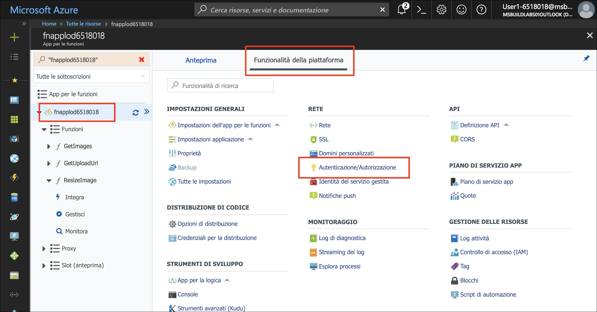
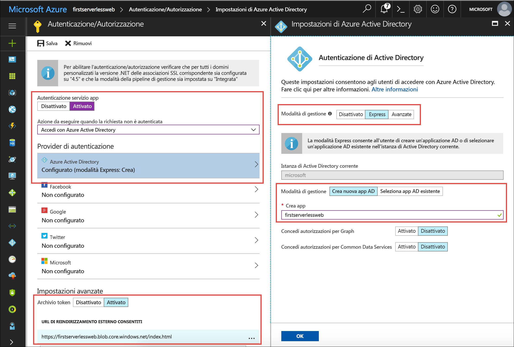
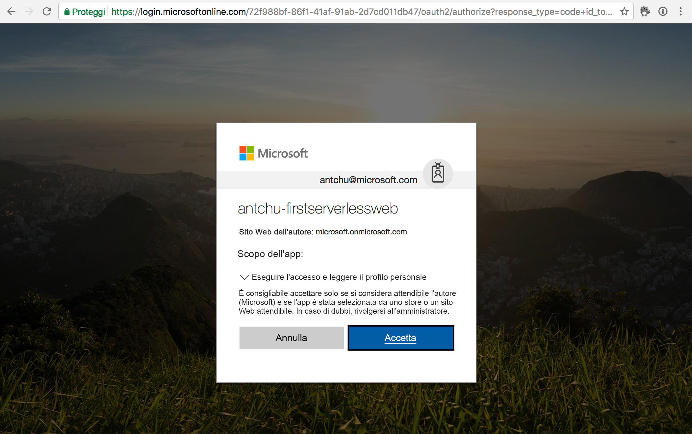

L'autenticazione del servizio app di Azure abilita il supporto dell'autenticazione chiavi in mano nell'app Funzioni di Azure. Si integra perfettamente con Facebook, Twitter, account Microsoft, Google e Azure Active Directory. È possibile aggiungere l'autenticazione del servizio app per proteggere le API back-end dell'app Web.

## <a name="enable-app-service-authentication"></a>Abilitare l'autenticazione del servizio app

1. Aprire l'app per le funzioni nel [portale di Azure](https://portal.azure.com/?azure-portal=true).

1. In **Funzionalità della piattaforma** selezionare **Autenticazione/Autorizzazione**.

    

1. Selezionare i valori seguenti:
    
    | Impostazione      |  Valore consigliato   | Descrizione                                        |
    | --- | --- | ---|
    | **Autenticazione servizio app** | Attivato | Abilitare l'autenticazione. |
    | **Azione da eseguire quando la richiesta non è autenticata** | Accedere con Azure Active Directory. | Selezionare un metodo di autenticazione configurato (vedere qui di seguito). |
    | **Provider di autenticazione** | Vedere qui di seguito. | Vedere qui di seguito. |
    | **Archivio token** | Attivato | Consente al servizio app di archiviare e gestire i token. |
    | **URL di reindirizzamento esterni consentiti** | L'URL dell'applicazione, ad esempio https://firstserverlessweb.z4.web.core.windows.net/. | URL a cui può essere reindirizzato il servizio app dopo l'autenticazione di un utente. |

1. Selezionare **Azure Active Directory** per visualizzare **Impostazioni di Azure Active Directory**.

    1. Selezionare **Rapida** come **Modalità di gestione** e inserire le informazioni seguenti.
    
        | Impostazione      |  Valore consigliato   | Descrizione                                        |
        | --- | --- | ---|
        | **Modalità di gestione** | Rapida, Crea nuova app AD | Configurare automaticamente un'entità servizio e l'autenticazione di Azure Active Directory. |
        | **Creare un'app** | my-serverless-webapp | Immettere un nome applicazione univoco. |
    
    1. Fare clic su **OK** per salvare le impostazioni di Azure Active Directory.

    


1. Fare clic su **Salva**.


## <a name="modify-the-web-app-to-enable-authentication"></a>Modificare l'app Web per abilitare l'autenticazione

1. In Cloud Shell assicurarsi che la directory corrente sia la cartella **www/dist**.

    ```azurecli
    cd ~/functions-first-serverless-web-application/www/dist
    ```

1. Per abilitare l'autenticazione nell'app per le funzioni, aggiungere la riga di codice seguente al file **settings.js**:

    `window.authEnabled = true`

    Effettuare la modifica e visualizzare il risultato eseguendo i comandi seguenti o usando un editor da riga di comando come VIM.

    ```azurecli
    echo "window.authEnabled = true" >> settings.js
    ```

    Verificare che la modifica sia stata effettuata nel file.

    ```azurecli
    cat settings.js
    ```

1. Caricare il file nell'archivio BLOB.

    ```azurecli
    az storage blob upload -c \$web --account-name <storage account name> -f settings.js -n settings.js
    ```


## <a name="test-the-application"></a>Test dell'applicazione

1. Aprire l'applicazione in un browser. Fare clic su **Accedi** ed eseguire l'accesso.

1. Selezionare un file di immagine e caricarlo.

    
    

## <a name="summary"></a>Riepilogo

In questa unità è stato descritto come aggiungere l'autenticazione all'applicazione usando l'autenticazione del servizio app di Azure.