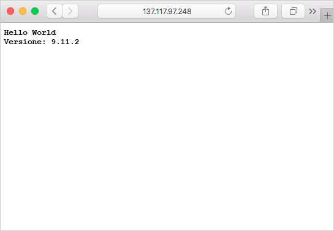

È possibile eseguire il pull di immagini del contenitore dal Registro contenitori di Azure da molte piattaforme di gestione contenitori, ad esempio Istanze di contenitore di Azure, servizio Kubernetes di Azure e Docker per Windows o Mac. Quando si eseguono immagini del contenitore dal Registro contenitori di Azure, potrebbero essere necessarie credenziali di autenticazione. È consigliabile usare un'entità servizio di Azure per l'autenticazione con Container Registry. Inoltre, è consigliabile anche proteggere le credenziali dell'entità servizio di Azure in Azure Key Vault.

In questa unità si crea un'entità servizio per il registro contenitori di Azure, la si archivia in Azure Key Vault e quindi si distribuisce il contenitore in Istanze di contenitore di Azure usando le credenziali dell'entità servizio.

## <a name="configure-registry-authentication"></a>Configurare l'autenticazione del registro

In tutti gli scenari di produzione dovrebbero essere usate entità servizio per accedere a un registro contenitori di Azure. Le entità servizio consentono di fornire il controllo degli accessi in base al ruolo alle immagini del contenitore. Ad esempio, è possibile configurare un'entità servizio con accesso solo pull a un registro.

Se non si ha già un insieme di credenziali in Azure Key Vault, crearne uno usando i comandi seguenti nell'interfaccia della riga di comando di Azure.

Prima di tutto, creare una variabile con il nome del registro contenitori. Questa variabile verrà usata in tutta l'unità.

```azurecli
ACR_NAME=<acrName>
```

Creare un insieme di credenziali delle chiavi di Azure con il comando `az keyvault create`.

```azurecli
az keyvault create --resource-group myResourceGroup --name $ACR_NAME-keyvault
```

A questo punto occorre creare un'entità servizio e archiviarne le credenziali nell'insieme di credenziali delle chiavi.

Per creare l'entità servizio, usare il comando `az ad sp create-for-rbac`. L'argomento `--role` configura l'entità servizio con il ruolo *lettore*, che concede l'accesso di tipo solo pull al registro. Per concedere l'accesso sia push che pull, impostare l'argomento `--role` su *collaboratore*.

```azurecli
az ad sp create-for-rbac --scopes $(az acr show --name $ACR_NAME --query id --output tsv) --role reader
```

L'output della creazione dell'entità servizio avrà un aspetto simile al seguente. Prendere nota dei valori `appId` e `password`. Questi valori verranno archiviati dell'insieme di credenziali delle chiavi di Azure.

```bash
{
  "appId": "1fa05179-0000-0000-0000-e269a4e97c41",
  "displayName": "azure-cli-2018-08-19-22-35-26",
  "name": "http://azure-cli-2018-08-19-22-35-26",
  "password": "72377509-0000-0000-0000-c8edbcb2d950",
  "tenant": "00000000-0000-0000-0000-000000000000"
}
```

Successivamente, usare il comando `az keyvault secret set` per archiviare l'*appId* dell'entità servizio nell'insieme di credenziali. Sostituire `<appId>` con il valore `appId` dell'entità servizio.

```azurecli
az keyvault secret set --vault-name $ACR_NAME-keyvault --name $ACR_NAME-pull-usr --value <appId>
```

A questo punto, usare il comando `az keyvault secret set` per archiviare la *password* dell'entità servizio nell'insieme di credenziali. Sostituire `<password>` con il valore `password` dell'entità servizio.

```azurecli
az keyvault secret set --vault-name $ACR_NAME-keyvault --name $ACR_NAME-pull-pwd --value <password>
```

È stato creato un insieme di credenziali delle chiavi di Azure e vi sono stati archiviati due segreti:

* `$ACR_NAME-pull-usr`: ID dell'entità servizio, da usare come **nome utente** del registro contenitori.
* `$ACR_NAME-pull-pwd`: password dell'entità servizio, da usare come **password** del registro contenitori.

Ora è possibile fare riferimento a questi segreti per nome quando gli utenti o le applicazioni e i servizi eseguono il pull di immagini dal registro.

### <a name="deploy-a-container-with-azure-cli"></a>Distribuire un contenitore con l'interfaccia della riga di comando di Azure

Ora che le credenziali dell'entità servizio sono archiviate in Azure Key Vault, le applicazioni e i servizi possono usarle per accedere al registro privato.

Eseguire il comando `az container create` seguente per distribuire un'istanza di contenitore. Il comando usa le credenziali dell'entità servizio archiviate in Azure Key Vault per eseguire l'autenticazione al registro contenitori.

```azurecli
az container create \
    --resource-group myResourceGroup \
    --name acr-build \
    --image $ACR_NAME.azurecr.io/helloacrbuild:v1 \
    --registry-login-server $ACR_NAME.azurecr.io \
    --ip-address Public \
    --registry-username $(az keyvault secret show --vault-name $ACR_NAME-keyvault --name $ACR_NAME-pull-usr --query value -o tsv) \
    --registry-password $(az keyvault secret show --vault-name $ACR_NAME-keyvault --name $ACR_NAME-pull-pwd --query value -o tsv)
```

Ottenere l'indirizzo IP dell'istanza di contenitore di Azure.

```azurecli
az container show --resource-group myResourceGroup --name acr-build --query ipAddress.ip --output table
```

Aprire un browser e passare all'indirizzo IP del contenitore. Se tutto è configurato correttamente, si dovrebbero visualizzare i risultati seguenti:



