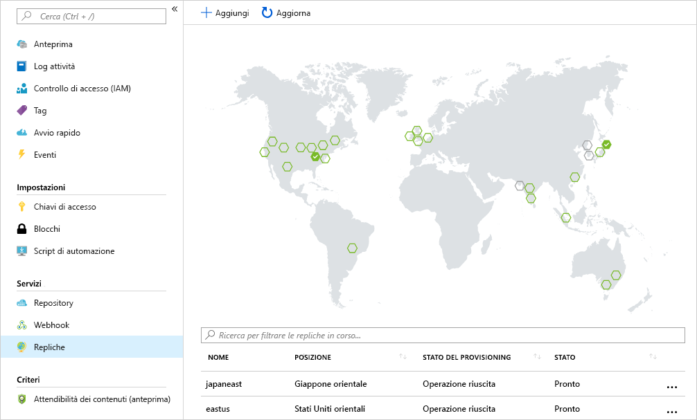

La società include carichi di lavoro di calcolo distribuiti in diverse aree geografiche, in modo da assicurare una presenza locale per la gestione della clientela distribuita. 

L'obiettivo consiste nell'inserire un registro contenitori in ogni area in cui vengono eseguite le immagini. Questa strategia consentirà di eseguire operazioni di rete vicina, offrendo trasferimenti a livello di immagine veloci e affidabili. 

La replica geografica consente al registro contenitori di Azure di fungere da singolo registro in modo da servire più aree con registri regionali multimaster.

Un registro con replica geografica è caratterizzato dai vantaggi seguenti:

- I nomi di registro/immagine/tag singoli possono essere usati in più aree
- Accesso al registro in una posizione di rete vicina da distribuzioni internazionali
- Nessun costo aggiuntivo per il traffico in uscita perché viene eseguito il pull delle immagini da un registro replicato in locale nella stessa area dell'host del contenitore
- Gestione unica di un registro in più aree

## <a name="replicate-an-image-to-multiple-locations"></a>Replica di un'immagine in più posizioni

Verrà usato il comando `az acr replication create` dell'interfaccia della riga di comando di Azure per replicare le immagini del contenitore da un'area a un'altra. In questo esempio verrà creata una replica per l'area `japaneast`. Aggiornare `<acrName>` con il nome del registro contenitori.

```azurecli
az acr replication create --registry <acrName> --location japaneast
```

L'output dovrebbe essere simile al seguente:

```console
{
  "id": "/subscriptions/00000000-0000-0000-0000-000000000000/resourceGroups/myresourcegroup/providers/Microsoft.ContainerRegistry/registries/myACR0007/replications/japaneast",
  "location": "japaneast",
  "name": "japaneast",
  "provisioningState": "Succeeded",
  "resourceGroup": "myresourcegroup",
  "status": {
    "displayStatus": "Syncing",
    "message": null,
    "timestamp": "2018-08-15T20:22:09.275792+00:00"
  },
  "tags": {},
  "type": "Microsoft.ContainerRegistry/registries/replications"
}
```

È necessario un passaggio finale. È possibile recuperare tutte le repliche delle immagini del contenitore create. Verrà usato il comando `az acr replication list` per recuperare l'elenco. Aggiornare `<acrName>` con il nome del registro contenitori.

```azurecli
az acr replication list --registry <acrName> --output table
```

L'output dovrebbe essere simile al seguente:

```console
NAME       LOCATION    PROVISIONING STATE    STATUS
---------  ----------  --------------------  --------
japaneast  japaneast   Succeeded             Ready
eastus     eastus      Succeeded             Ready
```

Occorre ricordare che non si è limitati all'interfaccia della riga di comando di Azure per elencare le repliche delle immagini. Nel portale di Azure selezionare `Replications` per un registro contenitori di Azure per visualizzare una mappa che illustra in dettaglio le repliche correnti. Le immagini del contenitore possono essere replicate in altre aree geografiche selezionando le aree sulla mappa.



## <a name="clean-up"></a>Eseguire la pulizia
<!---TODO: Update for sandbox?--->

A questo punto, è possibile pulire le risorse create eliminando il gruppo di risorse. A questo scopo, usare il comando `az group delete`.

```azurecli
az group delete --name myResourceGroup --no-wait
```

## <a name="summary"></a>Riepilogo

È stata completata la replica di un'immagine del contenitore in più data center di Azure mediante l'interfaccia della riga di comando di Azure. 