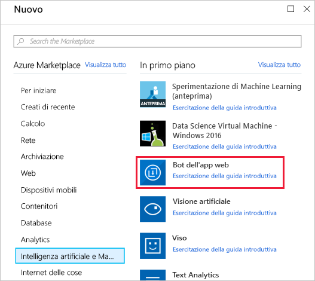
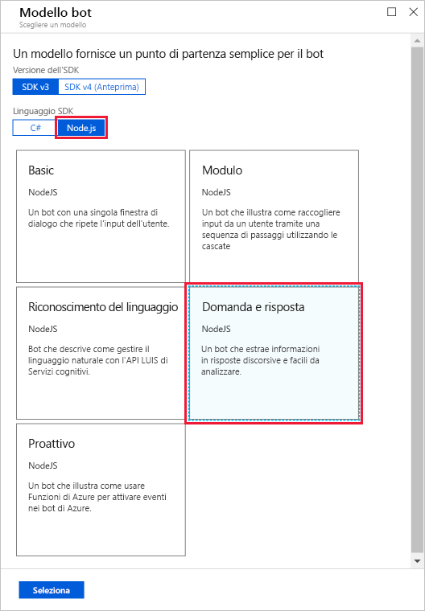
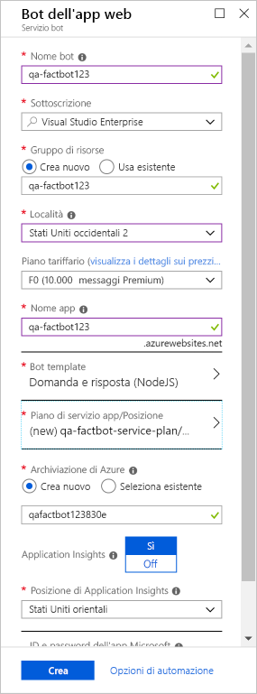

> [!NOTE]
> Dopo l'avvio della macchina virtuale, il nome utente e la password necessari per eseguire l'accesso sono disponibili nella scheda **Risorse** accanto alle istruzioni.

Il primo passaggio nella creazione di un bot consiste nel fornire un percorso per l'hosting del bot in Azure. La funzionalità App Web del servizio app di Azure è ideale per ospitare applicazioni bot e il servizio Azure Bot è progettato per effettuarne automaticamente il provisioning. In questa unità si userà il portale di Azure per effettuare il provisioning di un bot app Web di Azure.

1. Accedere al portale di Azure aprendo https://portal.azure.com nel browser della macchina virtuale.

1. Selezionare **+ Crea una risorsa**, **Intelligenza artificiale e Machine Learning** e quindi **Web App Bot** (Bot app Web).

    

1. Immettere un nome nella casella **Nome dell'app**, ad esempio "qa-factbot". *Questo nome deve essere univoco all'interno di Azure, dunque assicurarsi che accanto a esso compaia un segno di spunta verde.*

1. Selezionare le risorse preesistenti in corrispondenza di **Sottoscrizione** e **Gruppo di risorse**.

1. Selezionare la località più vicina e il piano tariffario **S1**.

1. Quindi, selezionare **Bot template** (modello bot). Selezionare **SDK v3** come versione, **Node.js** come linguaggio dell'SDK e **Domanda e risposta** come tipo di modello. Quindi, fare clic su **Seleziona** nella parte inferiore del pannello.

    

1. A questo punto, selezionare **Piano di servizio app/Località**, **Crea nuovo** e quindi creare un piano di servizio app denominato "qa-factbot-service-plan" o con un nome simile nella stessa area selezionata nel passaggio precedente. Al termine, selezionare **Crea** nella parte inferiore del pannello "Web App Bot" (Bot app Web) per avviare la distribuzione.

    

    > [!NOTE]
    > La distribuzione richiede in genere due minuti o meno.

1. Al termine della distribuzione, selezionare **Gruppi di risorse** nella barra multifunzione sul lato sinistro del portale.
1. Selezionare il gruppo di risorse già creato per questo gruppo per aprire il gruppo di risorse in cui è stato distribuito il bot app Web di Azure.

Si noteranno ora diverse risorse create per il bot app Web di Azure. Quando è stato distribuito il bot app Web di Azure, sono state eseguite numerose operazioni in background. È stato creato e registrato un bot, è stata creata un'[app Web di Azure](https://azure.microsoft.com/services/app-service/web/) per ospitarlo e il bot è stato configurato per l'uso di [Microsoft QnA Maker](https://www.qnamaker.ai/). Il passaggio successivo consiste nell'usare QnA Maker per creare una knowledge base di domande e risposte per integrare intelligenza nel bot.
