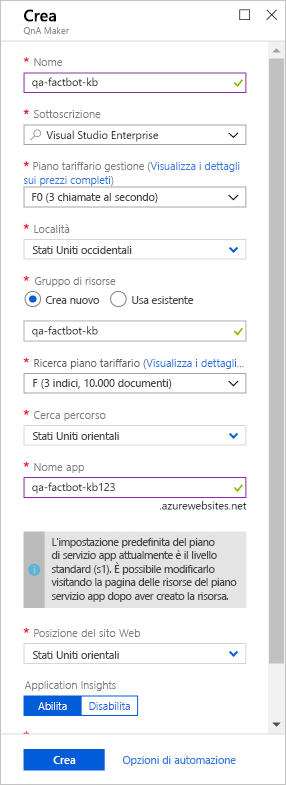
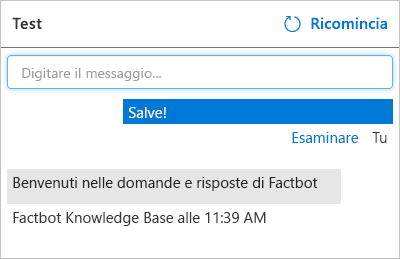

[!INCLUDE [0-vm-note](0-vm-note.md)]

[QnA Maker](https://www.qnamaker.ai/) è incluso in [Servizi cognitivi di Azure](https://www.microsoft.com/cognitive-services/), una suite di servizi e API per la creazione di app intelligenti, supportate da intelligenza artificiale e Machine Learning. Anziché codificare un bot in modo che anticipi ogni possibile domanda di un utente e offra una risposta, è possibile connetterlo a una knowledge base di domande e risposte creata con QnA Maker. Uno scenario di utilizzo comune consiste nel creare una knowledge base dall'URL di una pagina di domande frequenti, in modo che il bot possa rispondere a domande specifiche del dominio, ad esempio "Dove si trova il codice Product Key di Windows?" o "Dove si può scaricare Visual Studio Code?"

In questa unità si userà QnA Maker per creare una knowledge base contenente domande di tipo "Quale squadra ha vinto l'ultimo campionato di calcio?" e "Qual è la città più grande del mondo?" In seguito, si distribuirà la knowledge base in un'app Web di Azure in modo che sia accessibile tramite un endpoint HTTPS.

1. Aprire il portale di QnA Maker aprendo https://www.qnamaker.ai nel browser della VM e selezionare **Sign in** (Accedi) per accedere con lo stesso account Lab usato per accedere al portale di Azure. 

1. Selezionare il menu hamburger e quindi **Create a knowledge base** (Crea knowledge base). 

1. Selezionare **Create a QnA service** (Crea un servizio QnA).

1. Nella scheda del portale di Azure appena aperta immettere un nome nella casella **Nome**. Questo nome deve essere univoco all'interno di Azure. Assicurarsi quindi che accanto al nome *e* nella casella **Nome dell'app** più in basso nel pannello compaia un segno di spunta verde.

1. Selezionare **Usa esistente** in **Gruppo di risorse** e quindi selezionare il gruppo di risorse creato in precedenza per questo esercizio.

1. Selezionare un **Percorso** dall'elenco disponibile di seguito. 

1. Selezionare **F0** per **Piano tariffario per la gestione**. 

1. Selezionare **F** per **Cerca piano tariffario**. 

1. Verificare che **Nome dell'app** sia univoco in Azure.

1. Selezionare la località più vicina in entrambi gli elenchi a discesa e scegliere il pulsante **Crea** nella parte inferiore del pannello.

    

1. Selezionare **Gruppi di risorse** sulla barra multifunzione sul lato sinistro del portale e aprire il gruppo di risorse creato in precedenza nell'esercizio. Attendere finché "Distribuzione in corso" non cambia in "Operazione completata" nella parte superiore del pannello a indicare che il servizio QnA e le risorse associate sono stati distribuiti correttamente. Se il messaggio scompare, è possibile selezionare l'icona con la campana nella barra dei menu per visualizzare lo stato. È anche possibile selezionare **Aggiorna** nella parte superiore del pannello per aggiornare lo stato di distribuzione.

1. Tornare a **Create a knowledge base** (Crea knowledge base) aprendo https://www.qnamaker.ai/Create nel browser della macchina virtuale e scorrere fino a **Step 2** (Passaggio 2) per connettersi al servizio QnA.

1. In **Microsoft Azure Directory ID** (ID directory Microsoft Azure) scegliere **Microsoft Learn Hosting** (Hosting Microsoft Learn).

1. Selezionare **Microsoft Learn Hosting** (Hosting Microsoft Learn) dall'elenco a discesa **Azure subscription name** (Nome sottoscrizione di Azure).

1. In **Azure QnA service** (Servizio Azure QnA) selezionare il servizio QnA il cui nome è stato specificato in precedenza. Se non è elencato alcun servizio, potrebbe essere necessario aggiornare la pagina.

1. Assegnare quindi un nome alla knowledge base, ad esempio "Factbot Knowledge Base".

1. È possibile immettere domande e risposte in una knowledge base QnA Maker manualmente oppure importarle da domande frequenti online o file locali. I formati supportati sono file di testo delimitati da tabulazioni, documenti di Microsoft Word, fogli di calcolo di Excel e file PDF.

    Per una dimostrazione, aprire https://github.com/MicrosoftDocs/mslearn-build-chat-bot-with-azure-bot-service/blob/master/Factbot.tsv.zip nel browser della macchina virtuale e scaricare il file **Factbot.tsv.zip**. Questa cartella con estensione zip contiene un file di testo denominato **Factbot.tsv**. Estrarre e copiare il file nel computer. Scorrere quindi verso il basso nel portale di QnA Maker nel browser della VM, selezionare **+ Add file** (+ Aggiungi file) e selezionare **Factbot.tsv**. Questo file contiene 20 domande e risposte in formato delimitato da tabulazioni.

1. Selezionare **Create your KB** (Crea knowledge base personalizzata) in fondo alla pagina e attendere la creazione della knowledge base. Per il completamento dovrebbe essere necessario meno di un minuto.

1. Verificare che le domande e le risposte importate da **Factbot.tsv** vengano visualizzate nella knowledge base. Selezionare **Save and train** (Salva ed esegui training) e attendere il completamento del training.

    

1. Selezionare il pulsante **Test** a destra del pulsante **Save and train** (Salva ed esegui training). Digitare "Hi" nella finestra di messaggio e premere **INVIO**. Verificare che la risposta sia "Welcome to the QnA Factbot" come illustrato di seguito.

    

1. Digitare "What book has sold the most copies?" nella finestra di messaggio e premere **INVIO**. Qual è la risposta?

1. Selezionare nuovamente il pulsante **Test** per comprimere il pannello Test. 
1. Selezionare **Publish** (Pubblica) dal menu nella parte superiore della pagina e quindi il pulsante **Publish** (Pubblica) nella parte inferiore della pagina per pubblicare la knowledge base. La *pubblicazione* rende disponibile la knowledge base in un endpoint HTTPS.

Attendere il completamento del processo di pubblicazione e verificare che il servizio QnA sia stato distribuito. Ora che la knowledge base è ospitata in una propria app Web di Azure, il passaggio successivo consiste nel distribuire un bot che possa usarla.
