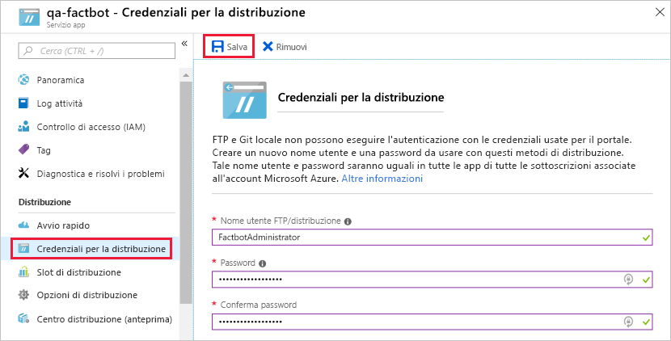

[!INCLUDE [0-vm-note](0-vm-note.md)]

Quando è stato creato un bot dell'app Web di Azure, è stata distribuita un'app Web di Azure per ospitarlo. Il bot tuttavia richiede del codice e in seguito deve essere distribuito all'app Web di Azure. Fortunatamente, il codice è stato generato automaticamente dal servizio Azure Bot. In questa unità si userà Visual Studio Code per inserire il codice in un repository Git locale e pubblicare il bot in Azure eseguendo il push delle modifiche dal repository locale in un repository remoto connesso all'app Web di Azure che ospita il bot, un processo noto come [integrazione continua](https://wikipedia.org/wiki/Continuous_integration).

1. Creare una cartella denominata "Factbot" per il codice sorgente del bot in un percorso a scelta del disco rigido.

1. Tornare al portale di Azure nel browser della macchina virtuale e aprire il gruppo di risorse creato in precedenza. In seguito selezionare il bot dell'app Web creato nell'esercizio precedente.

1. Selezionare **Compila** nel menu a sinistra, quindi selezionare **Download Bot source code** (Scarica codice sorgente bot) per preparare un file con estensione zip contenente il codice sorgente del bot. Dopo aver preparato il file con estensione zip, selezionare il pulsante **Download Bot source code** (Scarica codice sorgente bot) per scaricarlo. Al termine del download, estrarre il contenuto del file ZIP nella cartella "Factbot" creata precedentemente.

1. Tornare al pannello di compilazione dell'app Web del bot nel portale di Azure e selezionare **Configure continuous deployment** (Configura distribuzione continua).

1. Selezionare **Configura** nella parte superiore del pannello **Distribuzioni** e quindi su **Scegliere l'origine**.

1. Selezionare **Archivio Git locale** come origine della distribuzione.

1. Successivamente, selezionare **Configura connessione** e immettere nome utente e password. Probabilmente si dovrà immettere un nome utente diverso da "FactbotAdministrator", perché il nome deve essere univoco all'interno di Azure. In seguito, selezionare **OK** per tornare al pannello **Opzione di distribuzione** e selezionare nuovamente **OK** per tornare al pannello **Distribuzioni**.

    

1. Mentre il sistema di distribuzione esegue il provisioning, chiudere il pannello **Distribuzioni** e selezionare **All App service settings** (Tutte le impostazioni servizio app) nel menu a sinistra.

1. Avviare **Visual Studio Code** e usare il comando **File** > **Apri cartella** per aprire la cartella "Factbot" in cui è stato copiato il codice sorgente del bot.

1. Selezionare il pulsante **Controllo codice sorgente** sulla barra delle attività a sinistra di Visual Studio Code.

1. Selezionare l'icona **Inizializza repository** nella parte superiore.

1. Selezionare il pulsante **Inizializza repository** nella finestra di dialogo.

1. Digitare "First commit." nella finestra di messaggio.

1. Selezionare il segno di spunta per eseguire il commit delle modifiche, eseguendo un'installazione di appoggio di tutti i file quando viene richiesto.

    > [!NOTE]
    > Se si verifica un errore di Git perché non è stata individuata un'identità impostata in Git, avviare un prompt dei comandi ed eseguire i comandi seguenti, sostituendo i valori segnaposto per l'indirizzo di posta elettronica e il nome, se si vuole. In seguito, tentare di eseguire di nuovo il commit.
    >
    > ```bash
    > git config --global user.email "Lab User"
    > git config --global user.name "LabUser#######@learn"
    > ```

1. Selezionare **Terminale** dal menu **Visualizza** di Visual Studio Code per aprire un terminale integrato.

1. Eseguire il comando seguente nel terminale integrato, sostituendo BOT_NAME nei due punti seguenti con il nome del bot immesso nell'Esercizio 1.

    > [!NOTE]
    > L'URL remoto completo di Git è disponibile anche nella sezione **Panoramica** della risorsa del servizio app sotto **URL clone GIT**.

    ```bash
    git remote add qna-factbot https://BOT_NAME.scm.azurewebsites.net:443/BOT_NAME.git
    ```

1. Tornare al pannello **Controllo codice sorgente**, selezionare i puntini di sospensione nella parte superiore del pannello e quindi **Pubblica ramo** dal menu per eseguire il push del codice del bot dal repository locale ad Azure. Se vengono richieste le credenziali, immettere il nome utente e la password specificati al passaggio 9 di questo esercizio.

Il bot è stato pubblicato in Azure. Prima di testarlo in Azure, tuttavia, verrà eseguito in locale e si apprenderà come eseguirne il debug in Visual Studio Code.
