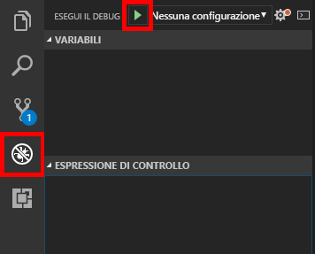

[!INCLUDE [0-vm-note](0-vm-note.md)]

<span data-ttu-id="58f8b-101">Analogamente al codice di qualsiasi applicazione, le modifiche al codice di un bot devono essere testate e sottoposte a debug in locale prima di essere distribuite nell'ambiente di produzione.</span><span class="sxs-lookup"><span data-stu-id="58f8b-101">As with any application code that you write, changes to bot code need to be tested and debugged locally before being deployed to production.</span></span> <span data-ttu-id="58f8b-102">Per eseguire il debug dei bot, Microsoft mette a disposizione Bot Framework Emulator.</span><span class="sxs-lookup"><span data-stu-id="58f8b-102">To help debug bots, Microsoft offers the Bot Framework Emulator.</span></span> <span data-ttu-id="58f8b-103">In questa unità verrà descritto come usare Visual Studio Code e l'emulatore per eseguire il debug dei bot.</span><span class="sxs-lookup"><span data-stu-id="58f8b-103">In this unit, you will learn how to use Visual Studio Code and the emulator to debug your bots.</span></span>

1. <span data-ttu-id="58f8b-104">Eseguire il comando seguente nel terminale integrato di Visual Studio Code per installare [Restify](http://restify.com/), un pacchetto Node.js molto diffuso per la compilazione e l'utilizzo di servizi Web RESTful:</span><span class="sxs-lookup"><span data-stu-id="58f8b-104">Execute the following command in Visual Studio Code's integrated terminal to install [Restify](http://restify.com/), a popular Node.js package for building and consuming RESTful web services:</span></span>

    ```bash
    npm install restify
    ```

1. <span data-ttu-id="58f8b-105">Ripetere questo passaggio per i comandi seguenti per installare [Microsoft Bot Framework Bot Builder SDK per Node.js](https://docs.microsoft.com/bot-framework/nodejs/bot-builder-nodejs-quickstart):</span><span class="sxs-lookup"><span data-stu-id="58f8b-105">Repeat this step for the following commands to install the [Microsoft Bot Framework Bot Builder SDK for Node.js](https://docs.microsoft.com/bot-framework/nodejs/bot-builder-nodejs-quickstart):</span></span>

    ```bash
    npm install botbuilder
    npm install botbuilder-azure
    npm install botbuilder-cognitiveservices
    ```

1. <span data-ttu-id="58f8b-106">Selezionare il pulsante **Esplora risorse** sulla barra delle attività di Visual Studio Code.</span><span class="sxs-lookup"><span data-stu-id="58f8b-106">Select the **Explorer** button in Visual Studio Code's activity bar.</span></span> 
1. <span data-ttu-id="58f8b-107">Selezionare il file **app.js** per aprirlo nell'editor del codice.</span><span class="sxs-lookup"><span data-stu-id="58f8b-107">Select **app.js** to open it in the code editor.</span></span> <span data-ttu-id="58f8b-108">Questo file contiene il codice alla base del bot, generato dal servizio Azure Bot e scaricato dal portale di Azure.</span><span class="sxs-lookup"><span data-stu-id="58f8b-108">This file contains the code that drives the bot — code that was generated by the Azure Bot Service and downloaded from the Azure portal.</span></span>

1. <span data-ttu-id="58f8b-109">Sostituire il contenuto del file **app.js** con il codice seguente e quindi salvare il file.</span><span class="sxs-lookup"><span data-stu-id="58f8b-109">Replace the contents of **app.js** with the following code, then save the file.</span></span>

    ```JavaScript
    "use strict";
    var builder = require("botbuilder");
    var botbuilder_azure = require("botbuilder-azure");

    var useEmulator = true;
    var userName = "";
    var yearsCoding = "";
    var selectedLanguage = "";

    var connector = useEmulator ? new builder.ChatConnector() : new botbuilder_azure.BotServiceConnector({
        appId: process.env.MicrosoftAppId,
        appPassword: process.env.MicrosoftAppPassword
    });

    var bot = new builder.UniversalBot(connector);

    bot.dialog('/', [

    function (session) {
        builder.Prompts.text(session, "Hello, and welcome to QnA Factbot! What's your name?");
    },

    function (session, results) {
        userName = results.response;
        builder.Prompts.number(session, "Hi " + userName + ", how many years have you been writing code?");
    },

    function (session, results) {
        yearsCoding = results.response;
        builder.Prompts.choice(session, "What language do you love the most?", ["C#", "Python", "Node.js", "Visual FoxPro"]);
    },

    function (session, results) {
        selectedLanguage = results.response.entity;

        session.send("Okay, " + userName + ", I think I've got it:" +
            " You've been writing code for " + yearsCoding + " years," +
            " and prefer to use " + selectedLanguage + ".");
    }]);

    var restify = require('restify');
    var server = restify.createServer();

    server.listen(3978, function() {
        console.log('test bot endpoint at http://localhost:3978/api/messages');
    });

    server.post('/api/messages', connector.listen());
    ```

1. <span data-ttu-id="58f8b-110">Impostare punti di interruzione alle righe 20, 25 e 30 (chiamate `builder.Prompts...`) selezionandoli sul margine a sinistra.</span><span class="sxs-lookup"><span data-stu-id="58f8b-110">Set breakpoints on lines 20, 25, and 30 (`builder.Prompts...` calls) by selecting in the margin on the left.</span></span>

1. <span data-ttu-id="58f8b-111">Selezionare il pulsante **Debug** sulla barra delle attività e quindi fare clic sul pulsante **Avvia debug** con la freccia verde per avviare una sessione di debug.</span><span class="sxs-lookup"><span data-stu-id="58f8b-111">Select the **Debug** button in the activity bar, then select the green arrow **Start Debugging** button to start a debugging session.</span></span> <span data-ttu-id="58f8b-112">Verificare che nella console di debug venga visualizzato "test bot endpoint at http://localhost:3978/api/messages".</span><span class="sxs-lookup"><span data-stu-id="58f8b-112">Confirm that "test bot endpoint at http://localhost:3978/api/messages" appears in the debug console.</span></span>

    

    <span data-ttu-id="58f8b-114">Il codice del bot viene ora eseguito in locale.</span><span class="sxs-lookup"><span data-stu-id="58f8b-114">Your bot code is now running locally.</span></span>

1. <span data-ttu-id="58f8b-115">Avviare **Bot Framework Emulator** dal menu Start.</span><span class="sxs-lookup"><span data-stu-id="58f8b-115">Launch the **Bot Framework Emulator** from the Start Menu.</span></span>

1. <span data-ttu-id="58f8b-116">Selezionare il campo **Enter your endpoint URL** (Immetti URL endpoint).</span><span class="sxs-lookup"><span data-stu-id="58f8b-116">Select the **Enter your endpoint URL** field.</span></span> <span data-ttu-id="58f8b-117">Immettere il nome e l'URL del bot visualizzati nella console di debug nel passaggio precedente.</span><span class="sxs-lookup"><span data-stu-id="58f8b-117">Enter the bot name and the bot URL displayed in the debug console in the previous step.</span></span>

1. <span data-ttu-id="58f8b-118">Lasciare vuoti i campi relativi all'ID e alla password dell'app Microsoft e alle impostazioni locali e selezionare **CONNECT** (Connetti).</span><span class="sxs-lookup"><span data-stu-id="58f8b-118">Leave the Microsoft App ID, Microsoft App Password, and Locale fields empty and select **CONNECT**.</span></span>

1. <span data-ttu-id="58f8b-119">Selezionare **Save and connect** (Salva e connetti) e salvare il file di configurazione nel percorso di preferenza.</span><span class="sxs-lookup"><span data-stu-id="58f8b-119">Then, select **Save and connect** and save the configuration file in the location of your choice.</span></span>

    >[!NOTE]
    > <span data-ttu-id="58f8b-120">In futuro sarà possibile riconnettersi al bot semplicemente selezionando il nome del bot in "My Bots" (Bot personali).</span><span class="sxs-lookup"><span data-stu-id="58f8b-120">In the future, you can reconnect to the bot simply by selecting the bot name under "My Bots".</span></span>

    

1. <span data-ttu-id="58f8b-122">Digitare "hi" nella casella nella parte inferiore dell'emulatore e premere **INVIO**.</span><span class="sxs-lookup"><span data-stu-id="58f8b-122">Type "hi" into the box at the bottom of the emulator and press **Enter**.</span></span> <span data-ttu-id="58f8b-123">Verificare che Visual Studio Code si interrompa alla riga 20 di **app.js**.</span><span class="sxs-lookup"><span data-stu-id="58f8b-123">Confirm that Visual Studio Code breaks on line 20 of **app.js**.</span></span> <span data-ttu-id="58f8b-124">Selezionare il pulsante **Continua** sulla barra degli strumenti di debug di Visual Studio Code e tornare all'emulatore per visualizzare la risposta del bot.</span><span class="sxs-lookup"><span data-stu-id="58f8b-124">Then, select the **Continue** button in Visual Studio Code's debugging toolbar, and return to the emulator to see the bot's response.</span></span>

1. <span data-ttu-id="58f8b-125">Il bot formulerà una serie di domande.</span><span class="sxs-lookup"><span data-stu-id="58f8b-125">The bot will ask you a series of questions.</span></span> <span data-ttu-id="58f8b-126">Rispondere e selezionare **Continua** in Visual Studio Code ogni volta che viene raggiunto un punto di interruzione.</span><span class="sxs-lookup"><span data-stu-id="58f8b-126">Answer them and select **Continue** in Visual Studio Code each time a breakpoint is hit.</span></span> <span data-ttu-id="58f8b-127">Al termine, selezionare il pulsante **Arresta** sulla barra degli strumenti di debug per terminare la sessione di debug.</span><span class="sxs-lookup"><span data-stu-id="58f8b-127">When you're done, select the **Stop** button in the debugging toolbar to end the debugging session.</span></span>

<span data-ttu-id="58f8b-128">A questo punto è stato ottenuto un bot completamente funzionante e si è appreso a eseguirne il debug in locale in Microsoft Bot Framework Emulator.</span><span class="sxs-lookup"><span data-stu-id="58f8b-128">At this point, you have a fully functioning bot and know how to debug it by running it locally in the Microsoft Bot Framework Emulator.</span></span> <span data-ttu-id="58f8b-129">Il passaggio successivo consiste nel rendere il bot più intelligente connettendolo alla knowledge base pubblicata.</span><span class="sxs-lookup"><span data-stu-id="58f8b-129">The next step is to make the bot more intelligent by connecting it to the knowledge base you published.</span></span>