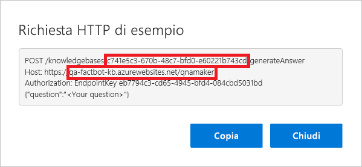

[!INCLUDE [0-vm-note](0-vm-note.md)]

In questa unità, il bot verrà connesso alla knowledge base di QnA Maker creata in precedenza, in modo che possa condurre una conversazione intelligente. Per la connessione alla knowledge base, è necessario recuperare alcune informazioni dal portale di QnA Maker, copiarle nel portale di Azure, aggiornare il codice del bot e quindi distribuire nuovamente il bot in Azure.

1. Tornare al portale di QnA Maker all'indirizzo https://www.qnamaker.ai nel browser della macchina virtuale e selezionare il pulsante dell'account nell'angolo superiore destro.
1. Selezionare **Manage endpoint keys** (Gestisci chiavi endpoint) dal menu a discesa.
1. Selezionare **Show** (Mostra) per visualizzare la chiave endpoint **Primary** (Primaria) e **Copy** (Copia) per copiarla negli Appunti. Incollarla in un file di testo in modo da poterla recuperare facilmente fra poco.

    > [!NOTE]
    > A seconda delle impostazioni del browser, per completare questa unità può essere necessario consentire i cookie di terze parti.

1. Selezionare **My knowledge bases** (Knowledge base personali) nel menu nella parte superiore della pagina.
1. Selezionare quindi **View Code** (Visualizza codice) per la knowledge base creata in precedenza.

1. Copiare l'ID knowledge base dalla prima riga e il nome host dalla seconda riga. Incollarli anche in un file di testo. Chiudere la finestra di dialogo. **Non** includere il prefisso "https://" nel nome host copiato.

    

1. Tornare al bot dell'app Web nel portale di Azure. Selezionare **Impostazioni applicazione** nel menu a sinistra e scorrere verso il basso fino a trovare le impostazioni denominate "QnAKnowledgebaseId", "QnAAuthKey" e "QnAEndpointHostName." Incollare in questi campi l'ID della knowledge base e il nome host appena ottenuti e la chiave endpoint ottenuta in precedenza. Selezionare quindi **Salva** nella parte superiore.

    

1. Tornare a **Visual Studio Code** e sostituire il contenuto di **app.js** con il codice seguente. Salvare quindi il file.

    ```JavaScript
    var restify = require('restify');
    var builder = require('botbuilder');
    var botbuilder_azure = require("botbuilder-azure");
    var builder_cognitiveservices = require("botbuilder-cognitiveservices");

    // Setup Restify Server
    var server = restify.createServer();
    server.listen(process.env.port || process.env.PORT || 3978, function () {
        console.log('%s listening to %s', server.name, server.url);
    });

    // Create chat connector for communicating with the Bot Framework Service
    var connector = new builder.ChatConnector({
        appId: process.env.MicrosoftAppId,
        appPassword: process.env.MicrosoftAppPassword,
        openIdMetadata: process.env.BotOpenIdMetadata
    });

    // Listen for messages from users
    server.post('/api/messages', connector.listen());

    var tableName = 'botdata';
    var azureTableClient = new botbuilder_azure.AzureTableClient(tableName, process.env['AzureWebJobsStorage']);
    var tableStorage = new botbuilder_azure.AzureBotStorage({ gzipData: false }, azureTableClient);

    // Create your bot with a function to receive messages from the user
    var bot = new builder.UniversalBot(connector);
    bot.set('storage', tableStorage);

    // Recognizer and and Dialog for preview QnAMaker service
    var previewRecognizer = new builder_cognitiveservices.QnAMakerRecognizer({
        knowledgeBaseId: process.env.QnAKnowledgebaseId,
        authKey: process.env.QnAAuthKey || process.env.QnASubscriptionKey
    });

    var basicQnAMakerPreviewDialog = new builder_cognitiveservices.QnAMakerDialog({
        recognizers: [previewRecognizer],
        defaultMessage: 'No match! Try changing the query terms!',
        qnaThreshold: 0.3
    }
    );

    bot.dialog('basicQnAMakerPreviewDialog', basicQnAMakerPreviewDialog);

    // Recognizer and and Dialog for GA QnAMaker service
    var recognizer = new builder_cognitiveservices.QnAMakerRecognizer({
        knowledgeBaseId: process.env.QnAKnowledgebaseId,
        authKey: process.env.QnAAuthKey || process.env.QnASubscriptionKey, // Backward compatibility with QnAMaker (Preview)
        endpointHostName: process.env.QnAEndpointHostName
    });

    var basicQnAMakerDialog = new builder_cognitiveservices.QnAMakerDialog({
        recognizers: [recognizer],
        defaultMessage: "I'm not quite sure what you're asking. Please ask your question again.",
        qnaThreshold: 0.3
    });

    bot.dialog('basicQnAMakerDialog', basicQnAMakerDialog);

    bot.dialog('/', //basicQnAMakerDialog);
        [
            function (session) {
                var qnaKnowledgebaseId = process.env.QnAKnowledgebaseId;
                var qnaAuthKey = process.env.QnAAuthKey || process.env.QnASubscriptionKey;
                var endpointHostName = process.env.QnAEndpointHostName;

                // QnA Subscription Key and KnowledgeBase Id null verification
                if ((qnaAuthKey == null || qnaAuthKey == '') || (qnaKnowledgebaseId == null || qnaKnowledgebaseId == ''))
                    session.send('Please set QnAKnowledgebaseId, QnAAuthKey and QnAEndpointHostName (if applicable) in App Settings. Learn how to get them at https://aka.ms/qnaabssetup.');
                else {
                    if (endpointHostName == null || endpointHostName == '')
                        // Replace with Preview QnAMakerDialog service
                        session.replaceDialog('basicQnAMakerPreviewDialog');
                    else
                        // Replace with GA QnAMakerDialog service
                        session.replaceDialog('basicQnAMakerDialog');
                }
            }
        ]);
    ```

    > [!NOTE]
    > Si noti la chiamata per creare un'istanza di `QnAMakerDialog` nella riga 30. Questa crea una finestra di dialogo che integra un bot compilato tramite il servizio Azure Bot con una knowledge base creata tramite Microsoft QnA Maker.

1. Selezionare il pulsante **Controllo codice sorgente** sulla barra delle attività di Visual Studio Code.
1. Passare il mouse sul file **app.js** e selezionare il pulsante __+__ per inserire le modifiche del file per il commit successivo.
1. Digitare "Connected to knowledge base" nella finestra di messaggio e selezionare il segno di spunta per eseguire il commit delle modifiche.

    > [!Warning]
    > Se si notano modifiche a un file **package.json**, assicurarsi di NON includerle nel commit. Il commit deve includere solo le modifiche apportate al file **app.js**.

1. Selezionare quindi il pulsante con i puntini di sospensione (__...__) e usare il comando **Pubblica ramo** per eseguire il push di queste modifiche nel repository remoto e nell'app Web di Azure.

1. Tornare al bot app Web nel portale di Azure e selezionare **Test in Web Chat** (Testa nella chat Web) a sinistra per aprire la console di test. Digitare "What's the most popular software programming language in the world?" nella casella nella parte inferiore della finestra della chat e premere **INVIO**. Verificare che il bot risponda.

La procedura è stata completata. Il bot è connesso alla knowledge base e può rispondere alle domande.
