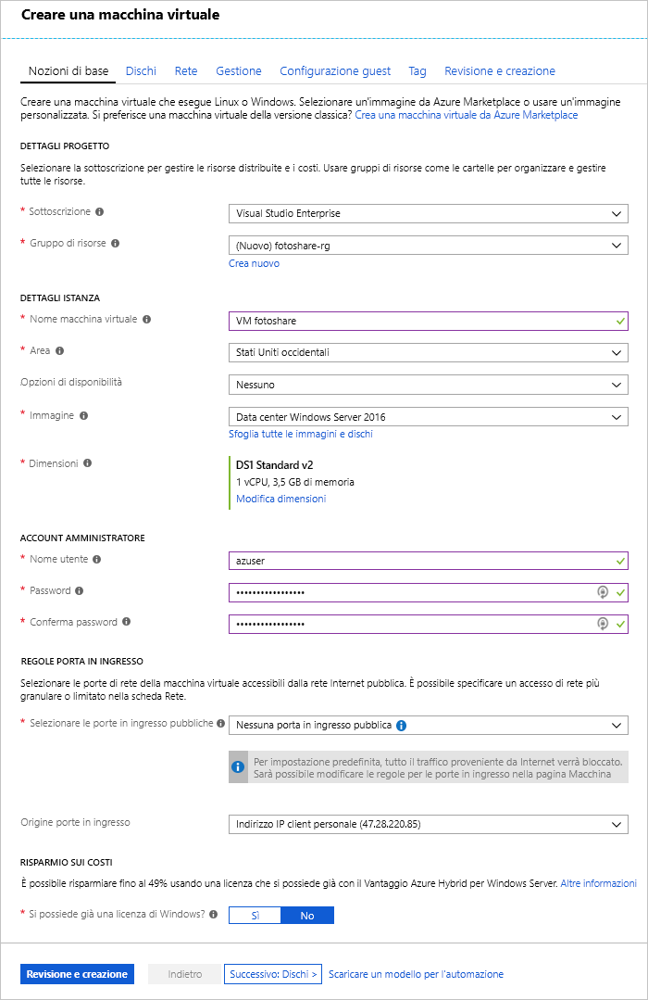

Si supponga di eseguire un sito per la condivisione di foto, con dati archiviati in macchine virtuali di Azure che eseguono SQL Server e applicazioni personalizzate.Suppose you run a photo sharing site, with data stored on Azure virtual machines (VMs) running SQL Server and custom applications. Si vogliono apportare le modifiche seguenti:You want to make the following adjustments:

- È necessario modificare le impostazioni della cache del disco in una macchina virtuale.You need to change the disk cache settings on a VM.
- Si vuole aggiungere un nuovo disco dati alla macchina virtuale con la memorizzazione nella cache abilitata.You want to add a new data disk to the VM with caching enabled.

Si è deciso di apportare queste modifiche tramite il portale di Azure.You've decided to make these changes through the Azure portal.

In questo esercizio verrà illustrato come modificare una macchina virtuale secondo le modalità descritte in precedenza.In this exercise, we'll walk through making the changes to a VM that we described above. Per prima cosa, accedere al portale e creare una macchina virtuale.First, let's sign in to the portal and create a VM.

[!include]

## Creare una macchina virtualeCreate a virtual machine

In questo passaggio si creerà una macchina virtuale con le proprietà seguenti:In this step, we're going to create a VM with the following properties:

| ProprietàProperty        | ValoreValue   |
|-----------------|---------|
| ImmagineImage           | **Windows Server 2016 Datacenter****Windows Server 2016 Datacenter** |
| NomeName            | **fotoshareVM****fotoshareVM** |
| Gruppo di risorseResource group  |   **<rgn>[Nome gruppo di risorse sandbox]</rgn>****<rgn>[Sandbox resource group name]</rgn>** |
| LocalitàLocation        | Vedere qui di seguito.See below. |

1. Accedere al [portale di Azure](https://portal.azure.com/triplecrownlabs.onmicrosoft.com?azure-portal=true) usando lo stesso account con cui è stata attivata la sandbox.Sign into the [Azure portal](https://portal.azure.com/triplecrownlabs.onmicrosoft.com?azure-portal=true) using the same account you activated the sandbox with.

1. Selezionare **Creare una risorsa** nel menu sulla barra laterale a sinistra.Select **Create a resource** in the sidebar menu on the left.

1. _VM Windows Server 2016_ deve essere nell'elenco degli elementi del Marketplace **Più comuni**._Windows Server 2016 VM_ should be in the list of **Popular** Marketplace elements. In caso contrario, provare a cercare "Windows Server 2016 DataCenter" usando la casella di ricerca in alto.If not, try searching for "Windows Server 2016 DataCenter" using the search box on the top.

1. Selezionare la macchina virtuale Windows e fare clic su **Crea** per avviare il processo di creazione della macchina virtuale.Select the Windows VM and click **Create** to start the VM creation process.

1. Nel pannello **Informazioni di base** verificare che la sottoscrizione selezionata in **Sottoscrizione** sia _Concierge Subscription_ (Sottoscrizione Concierge).In the **Basics** panel, verify the selected **Subscription** is _Concierge Subscription_.

1. In **Gruppo di risorse** selezionare **Utilizza esistente** e scegliere _<rgn>[Nome gruppo di risorse sandbox]</rgn>_.Under **Resource Group**, select **Use Existing** and choose _<rgn>[Sandbox resource group name]</rgn>_.

1. Nella casella **Nome macchina virtuale** immettere _fotoshareVM_.In the **Virtual machine name** box, enter _fotoshareVM_.

1. Nell'elenco a discesa **Località** selezionare l'area più vicina a quella in cui ci si trova nell'elenco seguente.In the **Location** drop-down list, select the closest region to you from the following list.

    [!include]

1. Per **Dimensioni** per la macchina virtuale, il valore predefinito è **DS1 Standard v2**, che assegna una singola CPU e 3,5 GB di memoria.For the VM **Size**, the default is **DS1 v2** which gives you a single CPU and 3.5 GB of memory. Si tratta di dimensioni appropriate per questo esempio.That's fine for this example.

1. Nella sezione **ACCOUNT AMMINISTRATORE** completare i campi **Nome utente** e **Password**/**Conferma password** per un account amministratore nella nuova macchina virtuale.In **ADMINISTRATOR ACCOUNT** section, enter a **Username** and **Password**/**Confirm password** for an administrator account on the new VM.

1. Di seguito è riportato un esempio di come appariranno le opzioni di configurazione nel pannello **Informazioni di base**. Mantenere le impostazioni predefinite per le altre schede e campi rimanenti e fare clic su **Rivedi e crea**.The following image is an example of what the **Basics** configuration looks like when filled out. Leave the defaults for the remaining tabs and fields and click **Review + create**.

    

1. Dopo aver esaminato le nuove impostazioni della macchina virtuale, fare clic su **Crea** per iniziare a distribuire la nuova macchina virtuale.After reviewing your new VM settings, click **Create** to start the deploying your new VM.

La creazione della macchina virtuale può richiedere alcuni minuti per la creazione di tutte le varie risorse (archiviazione, interfaccia di rete e così via) per supportare la macchina virtuale.VM creation can take a few minutes as it creates all the various resources (storage, network interface, etc.) to support the virtual machine. Attendere il completamento della distribuzione della macchina virtuale prima di continuare con l'esercizio.Wait until the VM has deployed before continuing with the exercise.

## Visualizzare lo stato della cache del disco del sistema operativo nel portaleView OS disk cache status in the portal

Dopo avere distribuito la macchina virtuale, è possibile verificare lo stato di memorizzazione nella cache del disco del sistema operativo usando la procedura seguente:Once our VM is deployed, we can confirm the caching status of the OS disk using the following steps:

1. Selezionare la risorsa **fotoshareVM** per aprire i dettagli della macchina virtuale nel portale.Select the **fotoshareVM** resource to open the VM details in the portal. In alternativa, è possibile fare clic su **Tutte le risorse** sulla barra laterale a sinistra e quindi selezionare la macchina virtuale **fotoshareVM**.Alternatively, you can click **All resources** in the left sidebar, and then select your VM, **fotoshareVM**.

1. In **Impostazioni** selezionare **Dischi**.Under **Settings**, select **Disks**.

1. Nel riquadro **Dischi** la macchina virtuale ha un disco, ovvero quello del sistema operativo.On the **Disks** pane, the VM has one disk, the OS disk. Il tipo di cache è attualmente impostato sul valore predefinito **Lettura/scrittura**.Its cache type is currently set to the default value of **Read/write**.

## Modificare le impostazioni della cache del disco del sistema operativo nel portaleChange the cache settings of the OS disk in the portal

1. Nel riquadro **Dischi** selezionare **Modifica** in alto a sinistra nella schermata.On the **Disks** pane, select **Edit** in the upper left of the screen.

1. Modificare il valore **Memorizzazione nella cache dell'host** per il disco del sistema operativo impostandolo su **Sola lettura** usando l'elenco a discesa e quindi selezionare **Salva** in alto a sinistra nella schermata.Change the **HOST CACHING** value for the OS disk to **Read-only** using the drop-down list, and then select **Save** in the upper left of the screen.

1. Questo aggiornamento può richiedere tempo.This update can take some time. Il motivo è che la modifica dell'impostazione della cache di un disco di Azure scollega e ricollega il disco di destinazione.The reason is that changing the cache setting of an Azure disk detaches and reattaches the target disk. Se si tratta del disco del sistema operativo, anche la macchina virtuale viene riavviata.If it's the operating system disk, the VM is also restarted. Al termine dell'operazione, si riceverà una notifica che indica che i dischi della macchina virtuale sono stati aggiornati.When the operation completes, you'll get a notification saying the VM disks have been updated.

1. Al termine dell'operazione, il tipo di cache del disco del sistema operativo è impostato su **Sola lettura**.Once complete, the OS disk cache type is set to **Read-only**.

È ora possibile passare alla configurazione della cache del disco dati.Let's move on to data disk cache configuration. Per configurare un disco, è prima necessario crearne uno.To configure a disk, we'll need first to create one.

## Aggiungere un disco dati alla macchina virtuale e impostare il tipo di memorizzazione nella cacheAdd a data disk to the VM and set caching type

1. Di nuovo nella visualizzazione **Dischi** della macchina virtuale nel portale proseguire e fare clic su **Aggiungi disco dati**.Back on the **Disks** view of our VM in the portal, go ahead and click **Add data disk**. Viene immediatamente visualizzato un errore nel campo **Nome** che indica che il campo non può essere vuoto.An error immediately appears in the **Name** field, telling us that the field can't be empty. Poiché non è ancora presente un disco dati, è necessario crearne uno.We don't have a data disk yet, so let's create one.

1. Fare clic nell'elenco **Nome** e quindi su **Crea disco**.Click in the **Name** list, and then click **Create disk**.

1. Nella casella **Nome** nel riquadro **Crea disco gestito** digitare **fotosharesVM-data**.In the **Create managed disk** pane, in the **Name** box, type **fotosharesVM-data**.

1. In **Gruppo di risorse** selezionare **Utilizza esistente** e scegliere _<rgn>[Nome gruppo di risorse sandbox]</rgn>_.Under **Resource Group**, select **Use existing**, and select _<rgn>[Sandbox resource group name]</rgn>_.

1. Osservare le impostazioni predefinite per gli altri campi:Note the defaults for the remaining fields:
    - SSD PremiumPremium SSD
    - Dimensioni di 1023 GB1023 GB in size
    - Stessa località della macchina virtuale (non modificabile).In the same location as the VM (not changeable).
    - Limite per operazioni di I/O al secondo: 5000IOPS limit - 5000
    - Limite per velocità effettiva (MB/s): 200Throughput limit (MB/s) - 200

1. Fare clic su **Crea** nella parte inferiore della schermata.Click **Create** at the bottom of the screen. 

    Attendere il completamento della creazione del disco prima di continuare.Wait until the disk has been created before continuing.

1. Modificare il valore di **MEMORIZZAZIONE NELLA CACHE DELL'HOST** per il nuovo disco dati impostandolo su **Sola lettura** usando l'elenco a discesa (potrebbe essere già impostato) e quindi fare clic su **Salva** in alto a sinistra nella schermata.Change the **HOST CACHING** value for our new data disk to **Read-only** using the drop-down list (it might be set already), and then click **Save** in the upper left of the screen.

    Al termine che la macchina virtuale completi l'aggiornamento del nuovo disco dati.Wait for the VM to finish updating the new data disk. Al termine, sarà presente un nuovo disco dati nella macchina virtuale.Once complete, you will have a new data disk on your virtual machine.

In questo esercizio è stato usato il portale di Azure per configurare la memorizzazione nella cache in una nuova macchina virtuale, modificare le impostazioni della cache in un disco esistente e configurare la memorizzazione nella cache in un nuovo disco dati.In this exercise, we used the Azure portal to configure caching on a new VM, change cache settings on an existing disk, and configure caching on a new data disk. Lo screenshot seguente mostra la configurazione finale:The following screenshot shows the final configuration:

