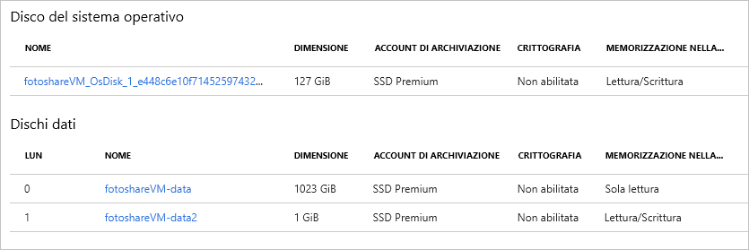

Nell'esercizio precedente sono state eseguite le attività seguenti tramite il portale di Azure:

- Visualizzare lo stato della cache del disco del sistema operativo
- Modificare le impostazioni della cache del disco del sistema operativo
- Aggiungere un disco dati alla macchina virtuale
- Modificare il tipo di memorizzazione nella cache in un nuovo disco dati

Ora si farà pratica con queste operazioni in Azure PowerShell. 

> [!NOTE]
> Si userà Azure PowerShell, ma è anche possibile usare l'interfaccia della riga di comando di Azure che offre funzionalità simili con uno strumento basato su console. È supportata in macOS, Linux e Windows. Per altre informazioni sull'interfaccia della riga di comando di Azure, vedere il modulo **Gestire macchine virtuali con l'interfaccia della riga di comando di Azure**.

Verrà usata la macchina virtuale creata nell'esercizio precedente. Per le operazioni in questo lab si presuppone che:

- La macchina virtuale esista già e sia chiamata **fotoshareVM**
- La macchina virtuale sia inserita in un gruppo di risorse denominato **<rgn>[nome gruppo di risorse sandbox]</rgn>**

Se i nomi effettivi sono diversi, sostituire questi valori con i propri.

Di seguito è riportato lo stato corrente dei dischi della macchina virtuale dall'ultimo esercizio:


È stato usato il portale per impostare il campo **MEMORIZZAZIONE NELLA CACHE DELL'HOST** per i dischi dati e del sistema operativo. Tenere presente questo stato iniziale mentre si esegue la procedura seguente.

### <a name="set-up-some-variables"></a>Impostare alcune variabili

Per prima cosa, occorre archiviare alcuni nomi di risorse per poterli riusare in seguito.

1. Usare il terminale Azure Cloud Shell a destra per eseguire i comandi di PowerShell seguenti:

    > [!NOTE]
    > Passare la sessione di Cloud Shell su **PowerShell** prima di provare questi comandi, se necessario.
    
    ```powershell
    $myRgName = "<rgn>[Sandbox resource group name]</rgn>"
    $myVMName = "fotoshareVM"
    ```
    
    > [!TIP]
    > Sarà necessario reimpostare queste variabili se la sessione di Cloud Shell scade. Pertanto, se possibile, eseguire interamente questo lab in una sola sessione.
    
### <a name="get-info-about-our-vm"></a>Ottenere informazioni sulla macchina virtuale

1. Eseguire il comando seguente per ottenere le proprietà della macchina virtuale:

    ```powershell
    $myVM = Get-AzureRmVM -ResourceGroupName $myRgName -VMName $myVmName
    ```
    
1. La risposta verrà archiviata nella variabile `$myVM`. È possibile inviare tramite pipe l'output nel cmdlet `select-object` per visualizzare proprietà specifiche:

    ```powershell
    $myVM | select-object -property ResourceGroupName, Name, Type, Location
    ```
    
1. Il risultato dovrebbe essere simile al seguente.

    ```output
    ResourceGroupName Name        Type                              Location
    ----------------- ----        ----                              --------
    <rgn>[Sandbox resource group name]</rgn> fotoshareVM Microsoft.Compute/virtualMachines eastus
    ```
    
### <a name="view-os-disk-cache-status"></a>Visualizzare lo stato della cache del disco del sistema operativo

1. È possibile controllare l'impostazione di memorizzazione nella cache tramite l'oggetto `StorageProfile` come indicato di seguito:

    ```powershell
    $myVM.StorageProfile.OsDisk.Caching
    ```

    ```output
    ReadOnly
    ```
   
1. Ripristinare il valore predefinito per un disco del sistema operativo, ovvero _ReadWrite_.

### <a name="change-the-cache-settings-of-the-os-disk"></a>Modificare le impostazioni della cache del disco del sistema operativo

1. È possibile impostare il valore per il tipo di cache usando lo stesso oggetto `StorageProfile` come indicato di seguito:

    ```powershell
    $myVM.StorageProfile.OsDisk.Caching = "ReadWrite"
    ```
    
    Questo comando viene eseguito rapidamente, il che significa che esegue un'operazione in locale. Il comando modifica solo la proprietà dell'oggetto `myVM`. Come indicato nello screenshot seguente, se si aggiorna la variabile `$myVM` riassegnandola con il cmdlet `Get-AzureRmVM`, il valore di memorizzazione nella cache non risulterà modificato nella macchina virtuale.

1. Per apportare la modifica nella macchina virtuale stessa, chiamare `Update-AzureRmVM` come indicato di seguito:

    ```powershell
    Update-AzureRmVM -ResourceGroupName $myRGName -VM $myVM
    ```
    
    Si noti che questa chiamata richiede alcuni minuti per il completamento. Ciò avviene perché è in corso l'aggiornamento della macchina virtuale effettiva e Azure riavvia la macchina virtuale per apportare la modifica.

    ```output
    RequestId IsSuccessStatusCode StatusCode ReasonPhrase
    --------- ------------------- ---------- ------------
                             True         OK OK
    ```
    
1. Se si aggiorna nuovamente la variabile `$myVM`, si noterà la modifica nell'oggetto. Anche esaminando il disco nel portale, la modifica sarà visibile. 

    ```powershell
    $myVM = Get-AzureRmVM -ResourceGroupName $myRgName -VMName $myVmName
    $myVM.StorageProfile.OsDisk.Caching
    ```
    
    ```output
    ReadWrite
    ```
    
### <a name="list-data-disk-info"></a>Elencare le informazioni del disco dati

1. Per visualizzare i dischi dati disponibili nella macchina virtuale, eseguire il comando seguente:

    ```powershell
    $myVM.StorageProfile.DataDisks
    ```
    
    ```output
    Name            : fotosharesVM-data
    DiskSizeGB      : 1023
    Lun             : 0
    Caching         : ReadOnly
    CreateOption    : Attach
    SourceImage     :
    VirtualHardDisk :
    ```
    
Al momento è presente un solo disco dati. Il campo `Lun` è importante. È il numero di unità logica (**L****U****N**) univoco. Quando si aggiunge un altro disco dati, viene assegnato un valore `Lun` univoco.

### <a name="add-a-new-data-disk-to-our-vm"></a>Aggiungere un nuovo disco dati alla macchina virtuale

1. Per praticità, verrà archiviato il nuovo nome del disco:

    ```powershell
    $newDiskName = "fotoshareVM-data2"
    ```
    
1. Eseguire il comando `Add-AzureRmVMDataDisk` seguente per definire un nuovo disco dati da 1 GB:

    ```powershell
    Add-AzureRmVMDataDisk -VM $myVM -Name $newDiskName  -LUN 1  -DiskSizeinGB 1 -CreateOption Empty
    ```
    Si otterrà una risposta simile alla seguente:

    ```output
    ResourceGroupName  : xxxxxxxx-xxxx-xxxx-xxxx-xxxxxxxx
    Id                 : /subscriptions/xxxxxxxx-xxxx-xxxx-xxx-xxxxxxx/resourceGroups/<rgn>[Sandbox resource group name]</rgn>/providers/Microsoft.Compute/virtualMachines/fotoshareVM
    VmId               : xxxxxxxx-xxxx-xxxx-xxxx-xxxxxxxxxxx
    Name               : fotoshareVM
    Type               : Microsoft.Compute/virtualMachines
    Location           : eastus
    Tags               : {}
    DiagnosticsProfile : {BootDiagnostics}
    HardwareProfile    : {VmSize}
    NetworkProfile     : {NetworkInterfaces}
    OSProfile          : {ComputerName, AdminUsername, WindowsConfiguration, Secrets}
    ProvisioningState  : Succeeded
    StorageProfile     : {ImageReference, OsDisk, DataDisks}
        ```
    
1. We've given this disk a `Lun` value of `1` because it's not taken. We defined the disk we want to create, so it's time to run `Update-AzureRmVM` to make the actual change:

    ```powershell
    Update-AzureRmVM -ResourceGroupName $myRGName -VM $myVM
    ```
    
1. Esaminare nuovamente le informazioni sul disco dati:

    ```powershell
    $myVM.StorageProfile.DataDisks
    ```
    
    ```output
    Name            : fotosharesVM-data
    DiskSizeGB      : 1023
    Lun             : 0
    Caching         : ReadOnly
    CreateOption    : Attach
    SourceImage     :
    VirtualHardDisk :
    
    Name            : fotoshareVM-data2
    DiskSizeGB      : 1
    Lun             : 1
    Caching         : None
    CreateOption    : Empty
    SourceImage     :
    VirtualHardDisk :
    ```

Sono ora disponibili due dischi. Il valore `Lun` del nuovo disco è `1` e il valore predefinito per `Caching` è `None`. Questo valore verrà ora modificato.

### <a name="change-cache-settings-of-new-data-disk"></a>Modificare le impostazioni della cache del nuovo disco dati

1. Le proprietà di un disco dati della macchina virtuale possono essere modificate con il cmdlet `Set-AzureRmVMDataDisk`, come illustrato di seguito:

    ```powershell
    Set-AzureRmVMDataDisk -VM $myVM -Lun "1" -Caching ReadWrite
    ```
    
1. Come sempre, eseguire il commit delle modifiche con `Update-AzureRmVM`:

    ```powershell
    Update-AzureRmVM -ResourceGroupName $myRGName -VM $myVM
    ```
    
Ecco una visualizzazione dal portale delle operazioni che sono state eseguite in questo esercizio. La macchina virtuale ha ora due dischi dati e sono state modificate tutte le impostazioni di **Memorizzazione nella cache dell'host**. Tutte queste operazioni sono state eseguite con pochi semplici comandi, direttamente da Azure PowerShell.


