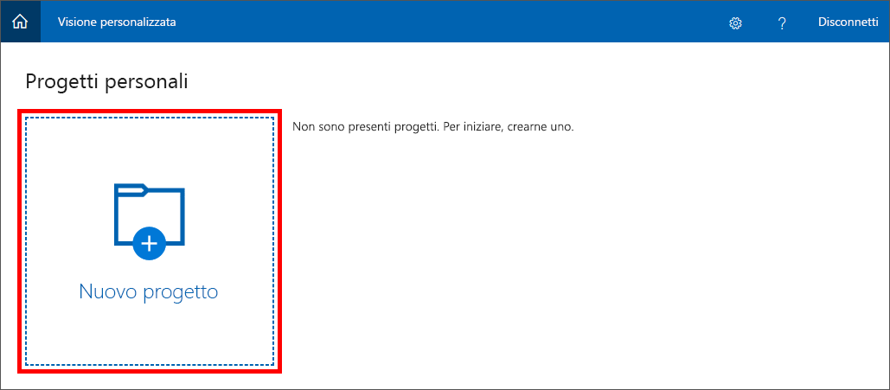
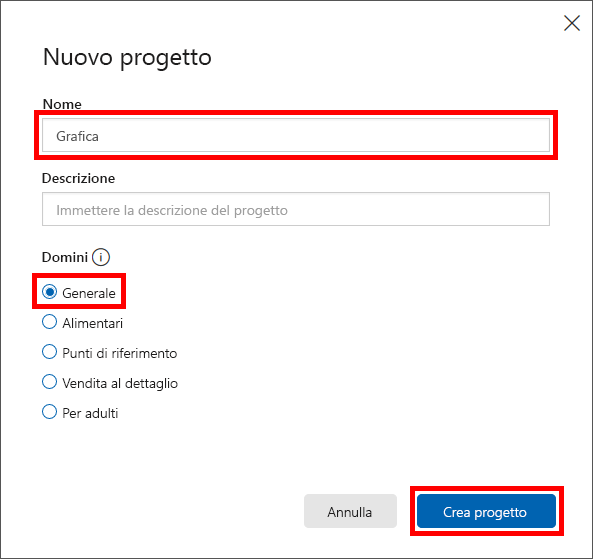

Il primo passaggio per la creazione del modello di classificazione delle immagini con il Servizio visione artificiale personalizzato consiste nel creare un progetto. In questa unità si userà il portale del Servizio visione artificiale personalizzato per creare un progetto del Servizio visione artificiale personalizzato.

1. Aprire il [portale del Servizio visione artificiale personalizzato](https://www.customvision.ai/?azure-portal=true) nel browser. Selezionare quindi **Accedi**.

1. Se viene chiesto di accedere, usare le credenziali per l'account Microsoft. Se viene chiesto se consentire all'app di accedere alle proprie informazioni, fare clic su **Sì** e, se richiesto, accettare le condizioni del servizio.

1. Fare clic su **Nuovo progetto** per creare un nuovo progetto.

    

1. Nella finestra di dialogo **Create new project** (Crea nuovo progetto) assegnare al progetto il nome *Artworks*, e verificare che **Generale** sia selezionato nell'elenco **Domini**. È possibile mantenere le impostazioni predefinite per **Project Types** (Tipi di progetto) e **Classification Types** (Tipi di classificazione). Selezionare **Crea progetto** per creare il progetto.

    > Un dominio ottimizza un modello per tipi specifici di immagini. Ad esempio, se l'obiettivo è classificare immagini di cibi in base al tipo di alimento che contengono o all'esoticità dei piatti, può essere utile selezionare il dominio Food (Cibo). Per scenari che non corrispondono ad alcuno dei domini disponibili o in caso di dubbi su quale dominio scegliere, selezionare il dominio Generale.

   

Il passaggio seguente consiste nel caricare immagini nel progetto e assegnare tag alle immagini per classificarle.