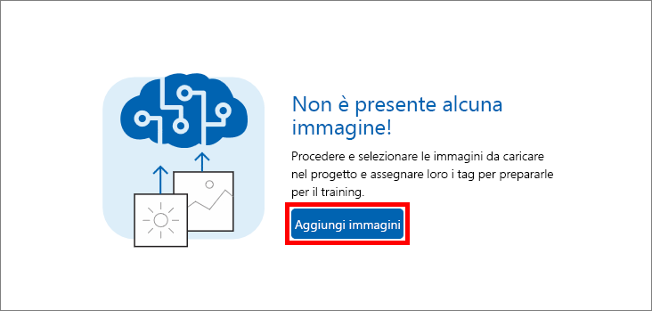
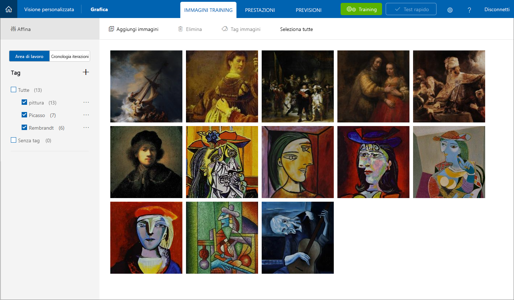

In questa unità si aggiungeranno immagini di celebri dipinti di Picasso, Pollock e Rembrandt al progetto Artworks, assegnando tag alle immagini in modo che il Servizio visione artificiale personalizzato apprenda a differenziare un artista dall'altro.

1. Fare clic su **Add images** (Aggiungi immagini) per aggiungere immagini al progetto.

    

1. Fare clic su **Esplora file locali**.

    

    _Esplorazione di immagini locali_

1. Passare alla cartella "Artists\Picasso" nelle [risorse fornite con questo modulo](https://a4r.blob.core.windows.net/public/cvs-resources.zip), selezionare tutti i file nella cartella e quindi fare clic su **Apri**.

    

1. Digitare "painting" (senza virgolette) nella casella **Add some tags** (Aggiungi alcuni tag). Fare clic su **+** per assegnare il tag alle immagini.

    

1. Ripetere il passaggio 4 per aggiungere un tag "Picasso" alle immagini.

1. Fare clic su **Upload 7 files** per caricare le immagini. Al termine del caricamento, fare clic su **Fine**.

    

1. Verificare che le immagini caricate siano visualizzate nel portale, insieme ai tag assegnati.

    

1. Con sette immagini di Picasso, il Servizio visione artificiale personalizzato è in grado di identificare piuttosto correttamente i dipinti di Picasso. Tuttavia, se si esegue il training del modello a questo punto, il modello sarà in grado di riconoscere solo a cosa assomiglia un Picasso, ma non di identificare i dipinti di altri artisti.

    Il passaggio successivo consiste nel caricare alcuni dipinti di altri artisti. Fare clic su **Add images** (Aggiungi immagini) e selezionare tutte le immagini contenute nella cartella "Artists\Rembrandt" nelle risorse del modulo. Assegnare alle immagini i tag "painting" e "Rembrandt" (non "Picasso") e caricarle nel progetto.

    > Per aggiungere il tag "painting," non è necessario digitarlo di nuovo. È possibile selezionarlo nell'elenco a discesa in corrispondenza della casella **Add some tags** (Aggiungi alcuni tag), come mostrato di seguito. Sarà **invece** necessario digitare "Rembrandt" e fare clic su **+** per aggiungere un tag "Rembrandt".

    

1. Verificare che le immagini di Rembrandt siano visualizzate accanto a quelle di Picasso nel progetto e che "Rembrandt" sia incluso nell'elenco di tag.

    

1. Si aggiungeranno ora i dipinti dell'enigmatico artista Jackson Pollock per permettere al Servizio visione artificiale personalizzato di riconoscere anche i suoi dipinti. Selezionare tutte le immagini contenute nella cartella "Artists\Pollock" nelle risorse del modulo, aggiungere alle immagini i tag con i termini "painting" e "Pollock" e quindi caricare le immagini nel progetto.

Dopo aver caricato le immagini con tag, il passaggio successivo consiste nell'eseguire il training del modello con queste immagini in modo che sia in grado di distinguere tra i dipinti di Picasso, Rembrandt e Pollock e di determinare se un dipinto è opera di uno di questi celebri artisti.