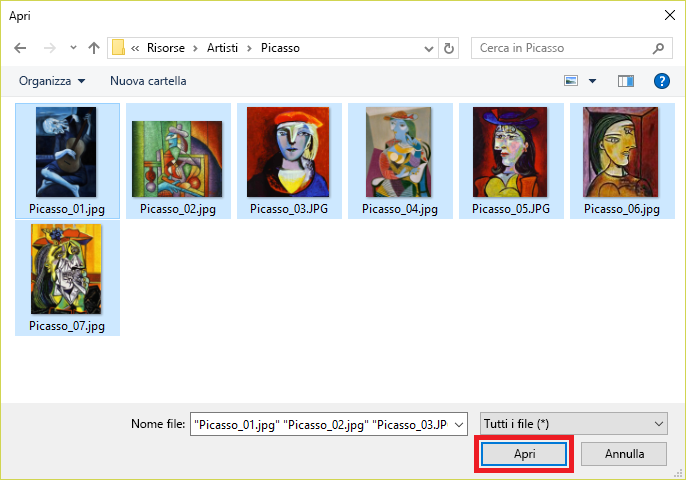

In questa unità le immagini di famosi dipinti di Picasso, Pollock e Rembrandt vengono aggiunte al progetto Artworks.In this unit, you'll add images of famous paintings by Picasso, Pollock, and Rembrandt to the Artworks project. È possibile contrassegnare le immagini in modo che Servizio visione artificiale personalizzato sia in grado di distinguere un artista da un altro.You'll tag the images so the Custom Vision Service can learn to differentiate one artist from another.

1. Nel progetto **Artworks** creato selezionare il segno più (**+**) a destra di **Tags** (Tag) nel pannello laterale.In the **Artworks** project that we created, select the plus sign (**+**) to the right of **Tags** in the side panel.

     

1. Viene visualizzata una finestra di dialogo denominata **Name the tag** (Assegna un nome al tag).A dialog called **Name the tag** is displayed. Digitare *painting* nel campo nome e selezionare **Save** (Salva).Type *painting* into the tag name field and select **Save**. In questo modo viene creato il tag *painting* nell'elenco di tag.This operation creates the tag *painting* in the tag list. È possibile aggiungere altri tag.Let's add some more. 

1. Ripetere il passaggio 2 per aggiungere i tag con i valori *Picasso*, *Pollock* e *Rembrandt*.Repeat step 2 to add tags with the values *Picasso*, *Pollock*, and *Rembrandt*. Al termine dell'operazione, l'elenco di tag avrà un aspetto simile al seguente.The tag list will look like the following when you are finished.

    

    Come si può notare, il numero di immagini del progetto contrassegnate con ognuno di questi tag è pari a zero.As you can see, the number of images in our project that are tagged with each of these tags is zero. Aggiungere alcune immagini al progetto e assegnare i tag.Let's add some images to our project and assign tags.

1. Scaricare [cvs-resources.zip](https://github.com/MicrosoftDocs/mslearn-classify-images-with-the-custom-vision-service/raw/master/cvs-resources.zip) contenente risorse immagine per il modulo e decomprimerlo nel computer locale.Download [cvs-resources.zip](https://github.com/MicrosoftDocs/mslearn-classify-images-with-the-custom-vision-service/raw/master/cvs-resources.zip) which contains image resources for this module and unzip it to your local machine. 

1. Nel portale selezionare **Add images** (Aggiungi immagini) per aggiungere le immagini al progetto.Back in the portal, select **Add images** to add images to the project.

    

1. Nella cartella **cvs-resources** scaricata in locale nel passaggio 4 passare alla cartella "Artists\Picasso".In the **cvs-resources** folder that you downloaded locally in step 4, navigate to the "Artists\Picasso" folder.

1. Selezionare tutti i file in "Artists\Picasso" e quindi selezionare **Open** (Apri).Select all of the files in "Artists\Picasso", and then select **Open**.

    

1. Viene visualizzata la finestra di dialogo **Image upload** (Caricamento immagine) in cui sono presenti anteprime di tutte le immagini da caricare.The **Image upload** dialog appears and displays thumbnails of all the images we are uploading. Selezionare il campo **My Tags** (Tag personali) per aprire un elenco a discesa dei tag che è possibile assegnare a tali immagini.Select the **My Tags** field, which opens a dropdown of the tags you can assign these images. 

    

1. Selezionare i tag *painting* e *Picasso* e quindi selezionare **Upload 7 files** (Carica 7 file) per completare il caricamento.Select the tags *painting* and *Picasso* and then select **Upload 7 files** to finish the upload. 

1. Verificare che le immagini caricate siano presenti nel progetto Artworks e che l'elenco di tag sia stato aggiornato per indicare che sette immagini siano state contrassegnate con *Picasso* e *painting*.Confirm that the images you uploaded are now in the Artworks project, and that the tag list has been updated to show that we've tagged seven images with *Picasso* and *painting*.

    

1. Con sette immagini di Picasso, il Servizio visione artificiale personalizzato è in grado di identificare in modo abbastanza corretto i dipinti di Picasso.With seven Picasso images, the Custom Vision Service can do a decent job of identifying paintings by Picasso. Se si esegue il training del modello a questo punto, tuttavia, il modello sarà in grado di riconoscere solo a cosa assomiglia un Picasso, ma non di identificare i dipinti di altri artisti.But if you trained the model right now, it would only understand what a Picasso looks like, and it wouldn't be able to identify paintings by other artists. Il passaggio successivo consiste nel caricare alcuni dipinti di altri artisti.The next step is to upload some paintings by another artist. 

1. Selezionare **Add images** (Aggiungi immagini) e selezionare tutte le immagini contenute nella cartella "Artists\Rembrandt" nelle risorse del modulo.Select **Add images** and select all of the images in the "Artists\Rembrandt" folder in the module resources. Contrassegnare le immagini con le etichette "painting" e "Rembrandt" (non "Picasso") e quindi selezionare **Upload 6 files** (Carica 6 file) per caricarle nel progetto.Tag them with the labels "painting" and "Rembrandt" (not "Picasso"), and select **Upload 6 files** to upload them to the project.

    

1. Verificare che le immagini di Rembrandt siano visualizzate accanto a quelle di Picasso nel progetto e che "Rembrandt" sia incluso nell'elenco di tag.Confirm that the Rembrandt images appear alongside the Picasso images in the project, and that "Rembrandt" appears in the list of tags.

    

1. Si aggiungeranno ora i dipinti dell'enigmatico artista Jackson Pollock per permettere al Servizio visione artificiale personalizzato di riconoscere anche i suoi dipinti.Now add paintings by the enigmatic artist Jackson Pollock to enable the Custom Vision Service to recognize Pollock paintings, too. Selezionare tutte le immagini contenute nella cartella "Artists\Pollock" nelle risorse del modulo, aggiungere alle immagini i tag con i termini "painting" e "Pollock" e quindi caricare le immagini nel progetto.Select all of the images in the "Artists\Pollock" folder in the module resources, tag them with the terms "painting" and "Pollock", and upload them to the project.

Dopo aver caricato le immagini con tag, il passaggio successivo consiste nell'eseguire il training del modello con queste immagini in modo che sia in grado di distinguere tra i dipinti di Picasso, Rembrandt e Pollock e di determinare se un dipinto è opera di uno di questi celebri artisti.With the tagged images uploaded, the next step is to train the model with these images so it can distinguish between paintings by Picasso, Rembrandt, and Pollock, as well as determine whether a painting is a work by one of these famous artists.