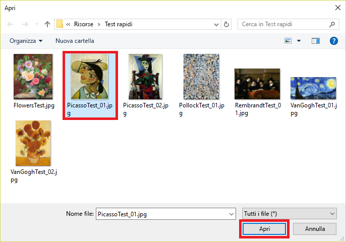

Più avanti in questo modulo si creerà un'app Node.js che usa il modello per identificare l'artista dei dipinti presentati. Tuttavia, non è necessario scrivere un'app per testare il modello, ma è possibile eseguire i test nel portale e perfezionare ulteriormente il modello tramite le immagini usate per i test. In questa unità si testerà la capacità del modello di identificare l'artista di un dipinto usando immagini di test fornite.

1. Fare clic su **Quick Test** (Test rapido) nella parte superiore della pagina.

    

1. Fare clic su **Esplora file locali** e quindi passare alla cartella "Quick Tests" nelle risorse del modulo. Selezionare **PicassoTest_01.jpg** e quindi fare clic su **Apri**.

    

1. Esaminare i risultati del test nella finestra di dialogo "Quick Test" (Test rapido). Qual è la probabilità che il dipinto sia un Picasso? Qual è la probabilità che sia un Rembrandt o un Pollock?

1. Chiudere la finestra di dialogo "Quick Test" (Test rapido). Nella parte superiore della pagina fare quindi clic su **Predictions** (Stime).

    

1. Fare clic sull'immagine di test caricata per mostrarne un dettaglio. Aggiungere all'immagine un tag "Picasso" selezionando **Picasso** nell'elenco a discesa e quindi fare clic su **Salva e chiudi**.

    > Aggiungendo tag alle immagini di test in questo modo, è possibile perfezionare il modello senza caricare altre immagini di training.

    

1. Eseguire un altro test rapido usando il file denominato **FlowersTest.jpg** nella cartella "Quick Tests". Verificare che a questa immagine venga assegnata una bassa probabilità che si tratti di un Picasso, un Rembrandt o un Pollock.

Il modello è stato sottoposto a training ed è pronto per l'uso e sembra in grado di identificare i dipinti di determinati artisti. A questo punto, si compirà un ulteriore passo avanti, integrando l'intelligenza del modello in un'app.