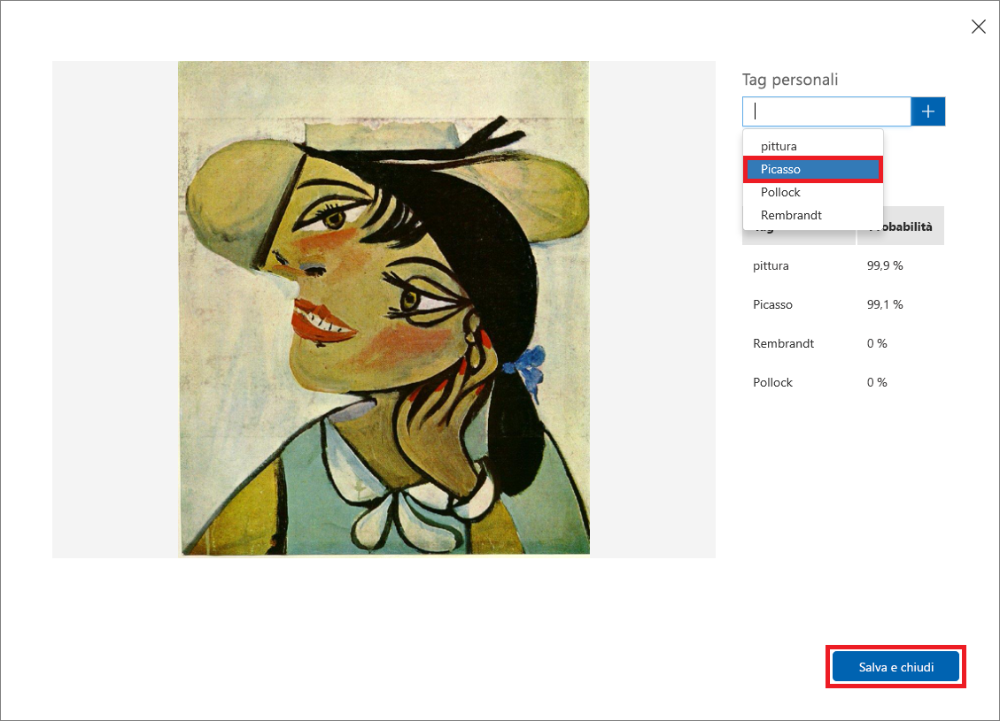

È stato eseguito il training del modello ed è giunto il momento di testarlo.Now that we've trained our model, it's time to test it. Verranno fornite nuove immagini al modello e si esaminerà la capacità del modello di classificarle.We'll give the model new images and see how well it classifies it.

1. Fare clic su **Quick Test** (Test rapido) nella parte superiore della pagina.Click **Quick Test** at the top of the page.

    

1. Fare clic su **Esplora file locali** e quindi passare alla cartella "Quick Tests" nella cartella delle risorse del modulo scaricata in precedenza.Click **Browse local files**, and then browse to the "Quick Tests" folder in the module resources folder you download previously. Selezionare **PicassoTest_01.jpg** e quindi fare clic su **Apri**.Select **PicassoTest_01.jpg**, and click **Open**.

    

1. Esaminare i risultati del test nella finestra di dialogo "Quick Test" (Test rapido).Examine the results of the test in the "Quick Test" dialog. Qual è la probabilità che il dipinto sia un Picasso?What is the probability that the painting is a Picasso? Qual è la probabilità che sia un Rembrandt o un Pollock?What is the probability that it's a Rembrandt or Pollock?

    

1. Chiudere la finestra di dialogo "Quick Test" (Test rapido).Close the "Quick Test" dialog. Nella parte superiore della pagina fare quindi clic su **Predictions** (Stime).Then click **Predictions** at the top of the page.

    

1. Fare clic sull'immagine di test caricata per mostrarne un dettaglio.Click the test image that you uploaded to show a detail of it. Aggiungere all'immagine un tag "Picasso" selezionando **Picasso** nell'elenco a discesa e quindi fare clic su **Salva e chiudi**.Then tag the image as a "Picasso" by selecting **Picasso** from the drop-down list and clicking **Save and close**.

    > Aggiungendo tag alle immagini di test in questo modo, è possibile perfezionare il modello senza caricare altre immagini di training.By tagging test images this way, you can refine the model without uploading additional training images.

    

1. Eseguire un altro test rapido usando questa volta il file denominato **FlowersTest.jpg** nella cartella "Quick Test".Run another quick test, this time using the file named **FlowersTest.jpg** in the "Quick Test" folder. Verificare che a questa immagine sia assegnata una bassa probabilità che si tratti di un Picasso, un Rembrandt o un Pollock.Confirm that this image is assigned a low probability of being a Picasso, a Rembrandt, or a Pollock.

Il modello è stato sottoposto a training ed è pronto per l'uso e sembra in grado di identificare i dipinti di determinati artisti.The model is trained and ready to go and appears to be skilled at identifying paintings by certain artists. È possibile chiamare l'endpoint di stima tramite HTTP e vedere cosa succede.Let's call the prediction endpoint over HTTP and see what happens.