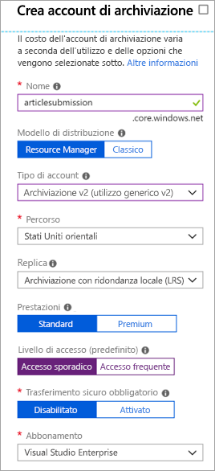

La comunicazione diretta tra i componenti di un'applicazione distribuita può essere problematica, in quanto potrebbe subire interruzioni in caso di larghezza di banda ridotta o numero elevato di richieste.

Abbiamo riscontrato questo problema nel nostro sistema: il portale Web chiama un servizio Web, che funziona perfettamente finché il servizio risponde in maniera tempestiva. Dato che il traffico elevato causa problemi, la soluzione è usare una coda per eliminare il collegamento diretto tra le app front-end e il servizio Web del livello intermedio.

## <a name="what-is-azure-queue-storage"></a>Informazioni su Archiviazione code di Azure

Archiviazione code di Azure è un servizio di Azure che implementa code basate sul cloud. Ogni coda gestisce un elenco di messaggi. I componenti delle applicazioni accedono a una coda usando un'API REST o una libreria client fornita da Azure. Generalmente sono presenti uno o più componenti _mittente_ e uno o più componenti _destinatario_. I componenti mittente aggiungono messaggi alla coda. I componenti destinatario recuperano i messaggi dall'inizio della coda per l'elaborazione. L'illustrazione seguente mostra più applicazioni mittente che aggiungono messaggi alla coda di Azure e un'applicazione destinataria che li recupera.


Il prezzo è basato sulle dimensioni della coda e sul numero di operazioni. Più grandi sono le dimensioni di una coda di messaggi, maggiore è il costo. Viene inoltre addebitato un costo per ogni operazione, come l'aggiunta e l'eliminazione di un messaggio. Per informazioni sui prezzi, vedere [Prezzi di Archiviazione code di Azure](https://azure.microsoft.com/pricing/details/storage/queues/).

## <a name="why-use-queues"></a>Perché usare le code?

Una coda aumenta la resilienza archiviando temporaneamente i messaggi in attesa. Nei periodi in cui le richieste sono limitate o normali, le dimensioni della coda rimangono ridotte in quanto il componente di destinazione rimuove i messaggi dalla coda più velocemente di quanto vengono aggiunti. Se invece il numero di richieste è elevato, le dimensioni della coda possono aumentare, ma i messaggi non vanno persi. Il componente di destinazione può aggiornare e svuotare la coda quando il numero di richieste torna alla normalità.

Una singola coda può raggiungere dimensioni massime di **500 TB**, quindi potenzialmente può archiviare _milioni_ di messaggi. La velocità effettiva da raggiungere per una singola coda è di 2000 messaggi al secondo, velocità che le consente di gestire situazioni di traffico elevato.

Le code consentono una scalabilità automatica e immediata dell'applicazione man mano che cambia il numero di richieste. Sono quindi utili per i dati aziendali di importanza critica, la cui perdita causerebbe danni all'organizzazione. Azure offre molti altri servizi a scalabilità automatica. Ad esempio, la funzionalità **Scalabilità automatica** è disponibile nei set di scalabilità di macchine virtuali, nei servizi cloud, nei piani di servizio app e negli ambienti di servizio app di Azure. Grazie a questa funzionalità è possibile definire regole che Azure userà per identificare i periodi di picco delle richieste e aggiungere automaticamente capacità senza coinvolgere un amministratore. La scalabilità automatica risponde alle richieste rapidamente, ma non immediatamente. Archiviazione code di Azure, invece, gestisce istantaneamente i picchi di richieste archiviando i messaggi finché non sono disponibili risorse di elaborazione.

## <a name="what-is-a-message"></a>Che cos'è un messaggio?

Un messaggio in una coda è una matrice di byte con dimensioni massime di 64 KB. Il contenuto dei messaggi non viene interpretato in alcun modo da nessun componente di Azure.

Se si vuole creare un messaggio strutturato, è possibile formattarne il contenuto tramite XML o JSON. Il codice è responsabile della generazione e dell'interpretazione del formato personalizzato. Ad esempio, si potrebbe creare un messaggio JSON personalizzato con un aspetto simile al seguente:

```json
{
    "Message": {
        "To": "news@contoso.com",
        "From": "writer@contoso.com",
        "Subject": "Support request",
        "Body": "Send me a photographer!"
    }
}
```

## <a name="creating-a-storage-account"></a>Creazione di un account di archiviazione

Una coda deve far parte di un account di archiviazione. È possibile creare un account di archiviazione usando l'interfaccia della riga di comando di Azure (o PowerShell) oppure il portale di Azure. Il portale è il mezzo più semplice perché è completamene guidato e richiede esplicitamente l'immissione di ogni singola informazione. 

Lo screenshot seguente mostra la posizione della categoria degli account di archiviazione.


Per creare l'account sono disponibili diverse opzioni, ma nella maggior parte dei casi è possibile usare la selezione predefinita. Queste opzioni sono state illustrate in un modulo precedente, ma è possibile passare il puntatore sopra il suggerimento `(i)` associato a ciascuna opzione per visualizzarne una breve descrizione. Ecco un esempio di inserimento delle informazioni nel pannello del portale.

Lo screenshot seguente mostra il pannello Crea account di archiviazione e le informazioni necessarie per creare un account di archiviazione.



### <a name="settings-for-queues"></a>Impostazioni per le code
Quando si crea un account di archiviazione che conterrà code, è opportuno considerare le impostazioni seguenti:

- Le code sono disponibili solo all'interno degli account di archiviazione per utilizzo generico di Azure (v1 o v2). Non è possibile aggiungerle ad account di archiviazione BLOB.
- L'impostazione **Livello di accesso** disponibile per gli account di archiviazione v2 si applica solo all'archiviazione BLOB e non ha alcun effetto sulle code.
- È consigliabile scegliere una posizione vicina ai componenti di origine o a quelli di destinazione oppure (preferibilmente) a entrambi.
- I dati vengono sempre replicati su più server come misura di protezione da errori del disco e altri problemi a livello di hardware. È possibile scegliere fra due strategie di replica: l'**archiviazione con ridondanza locale** ha costi contenuti ma è vulnerabile agli eventi critici che colpiscono un intero data center, mentre l'**archiviazione con ridondanza geografica** esegue la replica dei dati in altri data center di Azure. Scegliere la strategia di replica più adatta alle proprie esigenze di ridondanza.
- Il livello di prestazioni determina la modalità di archiviazione dei messaggi: il livello **Standard** usa unità magnetiche, mentre il livello **Premium** usa unità SSD. Scegliere il livello Standard se si prevede che i picchi di richieste siano di breve durata. Scegliere il livello Premium se la lunghezza della coda talvolta aumenta notevolmente e occorre ridurre al minimo il tempo di accesso ai messaggi.
- Richiedere il trasferimento sicuro se esiste la possibilità che attraverso la coda passino informazioni riservate. Questa impostazione assicura che tutte le connessioni alla coda vengano crittografate tramite SSL (Secure Sockets Layer).