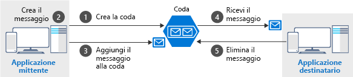

Le code di ricezione dei messaggi - pacchetti di dati la cui forma è noto per l'applicazione mittente e l'applicazione ricevente. Il mittente crea la coda e aggiunge un messaggio. Il destinatario recupera il messaggio, lo elabora e quindi lo elimina dalla coda. L'illustrazione seguente mostra un flusso tipico di questo processo.



Tenere presente che `get` e `delete` sono operazioni distinte. Questa disposizione gestisce i potenziali errori sul lato del destinatario e implementa un concetto noto come _recapito At-Least-Once_. Dopo che il destinatario riceve un messaggio, questo rimane nella coda ma è invisibile per 30 secondi. Se sul lato del destinatario si verifica un arresto anomalo del sistema o un'interruzione dell'alimentazione durante l'elaborazione, il messaggio non verrà mai eliminato dalla coda. Dopo 30 secondi, il messaggio ricompare nella coda e un'altra istanza del destinatario può elaborarlo fino al completamento.

## <a name="the-azure-storage-client-library-for-net"></a>Libreria client di archiviazione di Azure per .NET

La **Libreria client di archiviazione di Azure per .NET** fornisce i tipi per rappresentare ognuno degli oggetti con cui è necessario interagire:

- `CloudStorageAccount` rappresenta l'account di archiviazione di Azure.
- `CloudQueueClient` rappresenta Archiviazione code di Azure.
- `CloudQueue` rappresenta una delle istanze della coda.
- `CloudQueueMessage` rappresenta un messaggio.

Queste classi vengono usate per ottenere l'accesso a livello di codice alla coda. La libreria dispone di metodi sia sincroni che asincroni. Le versioni asincrone sono preferibili perché evitano di bloccare l'app client.

> [!NOTE]
> La libreria client di archiviazione di Azure per .NET è disponibile nel pacchetto NuGet **WindowsAzure.Storage**. È possibile installarla tramite un ambiente di sviluppo integrato, l'interfaccia della riga di comando di Azure o `Install-Package WindowsAzure.Storage` di PowerShell.

## <a name="how-to-connect-to-a-queue"></a>Come connettersi a una coda

Per connettersi a una coda occorre prima creare un `CloudStorageAccount` con la stringa di connessione. L'oggetto risultante può quindi creare un `CloudQueueClient`, che a sua volta può aprire un'istanza di `CloudQueue`. Di seguito è illustrato il flusso di base del codice.

```csharp
CloudStorageAccount account = CloudStorageAccount.Parse(connectionString);

CloudQueueClient client = account.CreateCloudQueueClient();

CloudQueue queue = client.GetQueueReference("myqueue");
```

La creazione di una `CloudQueue` non implica necessariamente l'esistenza della coda di archiviazione _effettiva_. È comunque possibile usare questo oggetto per creare, eliminare e verificare la presenza di una coda esistente. Come già accennato, tutti i metodi supportano le versioni sia sincrone che asincrone, ma useremo solo le versioni asincrone basate su `Task`.

## <a name="how-to-create-a-queue"></a>Come creare una coda

Per la creazione della coda si userà un criterio comune: l'applicazione mittente deve sempre essere responsabile della creazione della coda. Questo criterio mantiene l'applicazione più autonoma e meno dipendente da attività di configurazione dell'amministratore. 

Per semplificare la creazione, la libreria client espone un metodo `CreateIfNotExistsAsync` che crea la coda se necessario o restituisce `false` se la coda esiste già. 

Di seguito è illustrato il codice tipico.

```csharp
CloudQueue queue;
//...

await queue.CreateIfNotExistsAsync();
```

> [!NOTE]
> Per consentire all'account di archiviazione di usare questa API sono necessarie le autorizzazioni `Write` o `Create`. Questa condizione è sempre vera se si usa il modello di sicurezza **Chiave di accesso**, ma è possibile bloccare le autorizzazioni per l'account con altri approcci che consentano solo operazioni di lettura sulla coda.

## <a name="how-to-send-a-message"></a>Come inviare un messaggio

Per inviare un messaggio, è necessario creare un'istanza di un oggetto `CloudQueueMessage`. La classe dispone di alcuni costruttori di overload che caricano i dati nel messaggio. Useremo il costruttore che accetta una `string`. Dopo aver creato il messaggio, si userà un oggetto `CloudQueue` per inviarlo.

Ecco un esempio tipico:

```csharp
var message = new CloudQueueMessage("your message here");

CloudQueue queue;
//...

await queue.AddMessageAsync(message);
```

> [!NOTE]
> Mentre le dimensioni totali della coda possono raggiungere i 500 TB, le dimensioni dei singoli messaggi non possono superare i 64 KB (48 KB se si usa la codifica Base64). Se occorre un payload superiore, è possibile combinare code e BLOB, passando l'URL ai dati effettivi (archiviati come BLOB) nel messaggio. Questo approccio consentirebbe di accodare fino a 200 GB per un singolo elemento.

## <a name="how-to-receive-and-delete-a-message"></a>Come ricevere ed eliminare un messaggio

Sul lato del destinatario il messaggio successivo viene ricevuto, elaborato e quindi eliminato dopo che l'elaborazione è riuscita. Ecco un semplice esempio:

```C#
CloudQueue queue;
//...

CloudQueueMessage message = await queue.GetMessageAsync();

if (message != null)
{
    // Process the message
    //...

    await queue.DeleteMessageAsync(message);
}
```

Ora è possibile applicare quanto appreso alla nostra applicazione.