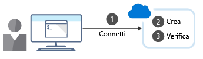

<span data-ttu-id="19034-101">L'interfaccia della riga di comando di Azure consente di digitare i comandi e di eseguirli immediatamente dalla riga di comando.</span><span class="sxs-lookup"><span data-stu-id="19034-101">The Azure CLI lets you type commands and execute them immediately from the command line.</span></span> <span data-ttu-id="19034-102">Ricordare che l'obiettivo complessivo dell'esempio di sviluppo software è distribuire nuove build di un'app Web per i test.</span><span class="sxs-lookup"><span data-stu-id="19034-102">Recall that the overall goal in the software development example is to deploy new builds of a web app for testing.</span></span> <span data-ttu-id="19034-103">Di seguito vengono esaminati i tipi di attività che è possibile eseguire con l'interfaccia della riga di comando di Azure.</span><span class="sxs-lookup"><span data-stu-id="19034-103">Let's talk about the sorts of tasks you can do with the Azure CLI.</span></span>

## <a name="what-azure-resources-can-be-managed-using-the-azure-cli"></a><span data-ttu-id="19034-104">Quali risorse di Azure possono essere gestite tramite l'interfaccia della riga di comando di Azure?</span><span class="sxs-lookup"><span data-stu-id="19034-104">What Azure resources can be managed using the Azure CLI?</span></span>

<span data-ttu-id="19034-105">L'interfaccia della riga di comando di Azure consente di controllare quasi tutti gli aspetti di ogni risorsa di Azure.</span><span class="sxs-lookup"><span data-stu-id="19034-105">The Azure CLI lets you control nearly every aspect of every Azure resource.</span></span> <span data-ttu-id="19034-106">È possibile lavorare con gruppi di risorse, archiviazione, macchine virtuali, Azure Active Directory (Azure AD), contenitori, apprendimento automatico e così via.</span><span class="sxs-lookup"><span data-stu-id="19034-106">You can work with resource groups, storage, virtual machines, Azure Active Directory (Azure AD), containers, machine learning, and so on.</span></span>

<span data-ttu-id="19034-107">I comandi nell'interfaccia della riga di comando sono strutturati in _gruppi_ e _sottogruppi_.</span><span class="sxs-lookup"><span data-stu-id="19034-107">Commands in the CLI are structured in _groups_ and _subgroups_.</span></span> <span data-ttu-id="19034-108">Ogni gruppo rappresenta un servizio offerto da Azure e i sottogruppi dividono i comandi per questi servizi in raggruppamenti logici.</span><span class="sxs-lookup"><span data-stu-id="19034-108">Each group represents a service provided by Azure, and the subgroups divide commands for these services into logical groupings.</span></span> <span data-ttu-id="19034-109">Ad esempio, il gruppo `storage` include sottogruppi, tra i quali **account**, **blob**, **storage** e **queue**.</span><span class="sxs-lookup"><span data-stu-id="19034-109">For example, the `storage` group contains subgroups including **account**, **blob**, **storage**, and **queue**.</span></span>

<span data-ttu-id="19034-110">Quindi, come si possono trovare i comandi specifici necessari?</span><span class="sxs-lookup"><span data-stu-id="19034-110">So, how do you find the particular commands you need?</span></span> <span data-ttu-id="19034-111">Un modo consiste nell'usare `az find`.</span><span class="sxs-lookup"><span data-stu-id="19034-111">One way is to use `az find`.</span></span> <span data-ttu-id="19034-112">Ad esempio, se si vogliono trovare i comandi utili per gestire un BLOB di archiviazione, si può usare il comando find seguente:</span><span class="sxs-lookup"><span data-stu-id="19034-112">For example, if you want to find commands that might help you manage a storage blob, you can use the following find command:</span></span>

```azurecli
az find -q blob
```

<span data-ttu-id="19034-113">Se si conosce già il nome del comando, l'argomento `--help` per il comando restituirà informazioni più dettagliate su di esso e, per un gruppo di comandi, un elenco dei sottocomandi disponibili.</span><span class="sxs-lookup"><span data-stu-id="19034-113">If you already know the name of the command you want, the `--help` argument for that command will get you more detailed information on the command, and for a command group, a list of the available subcommands.</span></span> <span data-ttu-id="19034-114">Ritornando all'esempio di archiviazione, ecco come è possibile ottenere un elenco dei sottogruppi e dei comandi per la gestione dell'archiviazione BLOB:</span><span class="sxs-lookup"><span data-stu-id="19034-114">So, with our storage example, here's how you can get a list of the subgroups and commands for managing blob storage:</span></span>

```azurecli
az storage blob --help
```

## <a name="how-to-create-an-azure-resource"></a><span data-ttu-id="19034-115">Come creare una risorsa di Azure</span><span class="sxs-lookup"><span data-stu-id="19034-115">How to create an Azure resource</span></span>

<span data-ttu-id="19034-116">La creazione di una nuova risorsa di Azure prevede in genere tre passaggi: connessione alla sottoscrizione di Azure, creazione della risorsa e verifica del completamento della creazione.</span><span class="sxs-lookup"><span data-stu-id="19034-116">When creating a new Azure resource, there are typically three steps: connect to your Azure subscription, create the resource, and verify that creation was successful.</span></span> <span data-ttu-id="19034-117">La figura seguente illustra una panoramica di alto livello del processo.</span><span class="sxs-lookup"><span data-stu-id="19034-117">The following illustration shows a high-level overview of the process.</span></span>



<span data-ttu-id="19034-119">Ogni passaggio corrisponde a un comando diverso dell'interfaccia della riga di comando di Azure.</span><span class="sxs-lookup"><span data-stu-id="19034-119">Each step corresponds to a different Azure CLI command.</span></span>

### <a name="connect"></a><span data-ttu-id="19034-120">Connettere</span><span class="sxs-lookup"><span data-stu-id="19034-120">Connect</span></span>

<span data-ttu-id="19034-121">Dato che si sta lavorando con un'installazione locale dell'interfaccia della riga di comando di Azure, è necessario eseguire l'autenticazione prima di poter eseguire i comandi di Azure, tramite il comando **login** dell'interfaccia della riga di comando di Azure.</span><span class="sxs-lookup"><span data-stu-id="19034-121">Since you're working with a local install of the Azure CLI, you'll need to authenticate before you can execute Azure commands, by using the Azure CLI **login** command.</span></span>

```azurecli
az login
```

<span data-ttu-id="19034-122">L'interfaccia della riga di comando di Azure in genere avvierà il browser predefinito per aprire la pagina di accesso di Azure.</span><span class="sxs-lookup"><span data-stu-id="19034-122">The Azure CLI will typically launch your default browser to open the Azure sign-in page.</span></span> <span data-ttu-id="19034-123">Se ciò non accade, seguire le istruzioni della riga di comando e immettere un codice di autorizzazione all'indirizzo [https://aka.ms/devicelogin](https://aka.ms/devicelogin).</span><span class="sxs-lookup"><span data-stu-id="19034-123">If this doesn't work, follow the command-line instructions and enter an authorization code at [https://aka.ms/devicelogin](https://aka.ms/devicelogin).</span></span>

<span data-ttu-id="19034-124">Quando l'accesso riesce, si verrà connessi alla sottoscrizione di Azure.</span><span class="sxs-lookup"><span data-stu-id="19034-124">After a successful sign in, you'll be connected to your Azure subscription.</span></span>

### <a name="create"></a><span data-ttu-id="19034-125">Creare</span><span class="sxs-lookup"><span data-stu-id="19034-125">Create</span></span>

<span data-ttu-id="19034-126">È spesso necessario creare un nuovo gruppo di risorse prima di creare un nuovo servizio di Azure, quindi i gruppi di risorse verranno usati come esempio per mostrare come creare le risorse di Azure dall'interfaccia della riga di comando.</span><span class="sxs-lookup"><span data-stu-id="19034-126">You'll often need to create a new resource group before you create a new Azure service, so we'll use resource groups as an example to show how to create Azure resources from the CLI.</span></span>

<span data-ttu-id="19034-127">Il comando **group create** dell'interfaccia della riga di comando di Azure crea un gruppo di risorse.</span><span class="sxs-lookup"><span data-stu-id="19034-127">The Azure CLI **group create** command creates a resource group.</span></span> <span data-ttu-id="19034-128">È necessario specificare un nome e una posizione.</span><span class="sxs-lookup"><span data-stu-id="19034-128">You must specify a name and location.</span></span> <span data-ttu-id="19034-129">Il nome deve essere univoco all'interno della sottoscrizione.</span><span class="sxs-lookup"><span data-stu-id="19034-129">The name must be unique within your subscription.</span></span> <span data-ttu-id="19034-130">La posizione determina dove vengono archiviati i metadati per il gruppo di risorse.</span><span class="sxs-lookup"><span data-stu-id="19034-130">The location determines where the metadata for your resource group will be stored.</span></span> <span data-ttu-id="19034-131">Per specificare la posizione si usano stringhe come "West US", "North Europe" o "West India". In alternativa, è possibile usare gli equivalenti composti da una parola singola, ad esempio westus, northeurope o westindia.</span><span class="sxs-lookup"><span data-stu-id="19034-131">You use strings like "West US", "North Europe", or "West India" to specify the location; alternatively, you can use single word equivalents, such as westus, northeurope, or westindia.</span></span> <span data-ttu-id="19034-132">La sintassi di base è:</span><span class="sxs-lookup"><span data-stu-id="19034-132">The core syntax is:</span></span>

```azurecli
az group create --name <name> --location <location>
```

> [!IMPORTANT]
> <span data-ttu-id="19034-133">Non si deve creare un gruppo di risorse quando si usa un sandbox gratuito di Azure.</span><span class="sxs-lookup"><span data-stu-id="19034-133">You do not need to create a resource group when using the free Azure sandbox.</span></span> <span data-ttu-id="19034-134">Al contrario, si userà un gruppo di risorse creato in precedenza.</span><span class="sxs-lookup"><span data-stu-id="19034-134">Instead, you will use a pre-created resource group.</span></span>

### <a name="verify"></a><span data-ttu-id="19034-135">Verificare</span><span class="sxs-lookup"><span data-stu-id="19034-135">Verify</span></span>

<span data-ttu-id="19034-136">Per molte risorse di Azure, l'interfaccia della riga di comando di Azure include un sottocomando **list** per visualizzare i dettagli della risorsa.</span><span class="sxs-lookup"><span data-stu-id="19034-136">For many Azure resources, the Azure CLI provides a **list** subcommand to view resource details.</span></span> <span data-ttu-id="19034-137">Ad esempio, il comando **group list** dell'interfaccia della riga di comando di Azure elenca i gruppi di risorse di Azure.</span><span class="sxs-lookup"><span data-stu-id="19034-137">For example, the Azure CLI **group list** command lists your Azure resource groups.</span></span> <span data-ttu-id="19034-138">Questo comando è utile in questo contesto per verificare se è stata completata la creazione del gruppo di risorse:</span><span class="sxs-lookup"><span data-stu-id="19034-138">This is useful here to verify whether creation of the resource group was successful:</span></span>

```azurecli
az group list
```

<span data-ttu-id="19034-139">Per ottenere una visualizzazione più concisa, è possibile formattare l'output come una tabella semplice:</span><span class="sxs-lookup"><span data-stu-id="19034-139">To get a more concise view, you can format the output as a simple table:</span></span>

```azurecli
az group list --output table
```
