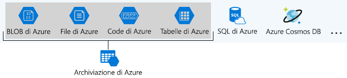

Spesso le organizzazioni dispongono di account di archiviazione multipli per essere in grado di implementare diversi set di requisiti.Organizations often have multiple storage accounts to let them implement different sets of requirements. Prendendo ad esempio un produttore di cioccolato, potrebbe esistere un account di archiviazione per i dati aziendali privati e uno per i file destinati ai consumatori.In the chocolate-manufacturer example, there would be one storage account for the private business data and one for the consumer-facing files. Qui sono riportati i fattori dei criteri controllati da un account di archiviazione che consentono di decidere il numero di account necessari.Here, you will learn the policy factors that are controlled by a storage account, which will help you decide how many accounts you need.

## Che cos'è Archiviazione di Azure?What is Azure Storage?

Azure offre diversi modi per archiviare i dati.Azure provides many ways to store your data. Sono disponibili più opzioni di database come server di Azure SQL, Azure Cosmos DB e archiviazione tabelle di Azure.There are multiple database options like Azure SQL Server, Azure Cosmos DB, and Azure Table Storage. Sono possibili diversi modi per memorizzare e inviare messaggi, ad esempio Code di Azure e Hub eventi.Azure offers multiple ways to store and send messages, such as Azure Queues and Event Hubs. È anche possibile archiviare file separati con opzioni come File di Azure e BLOB di Azure.You can even store loose files using services like Azure Files and Azure Blobs.

Azure ha selezionato quattro servizi dati e li ha riuniti sotto il nome _Archiviazione di Azure_.Azure selected four of these data services and placed them together under the name _Azure Storage_. I quattro servizi sono BLOB di Azure, File di Azure, Code di Azure e Tabelle di Azure.The four services are Azure Blobs, Azure Files, Azure Queues, and Azure Tables. L'illustrazione seguente mostra gli elementi di Archiviazione di Azure.The following illustration shows the elements of Azure Storage.

A questi quattro servizi è stato riservato un trattamento speciale in quanto sono tutti servizi di archiviazione semplici basati sul cloud e sono spesso utilizzati insieme nella stessa applicazione.These four were given special treatment because they are all primitive, cloud-based storage services and are often used together in the same application.

## Che cos’è un account di archiviazione?What is a storage account?

Un _account di archiviazione_ è un contenitore che raggruppa un set di servizi di Archiviazione di Azure.A _storage account_ is a container that groups a set of Azure Storage services together. Solo i servizi di dati di Archiviazione di Azure possono essere inclusi in un account di archiviazione (BLOB di Azure, File di Azure, Code di Azure e Tabelle di Azure).Only data services from Azure Storage can be included in a storage account (Azure Blobs, Azure Files, Azure Queues, and Azure Tables). La figura seguente mostra un account di archiviazione che contiene diversi servizi dati.The following illustration shows a storage account containing several data services.

La combinazione di servizi di dati in un account di archiviazione consente di gestirli come gruppo.Combining data services into a storage account lets you manage them as a group. Le impostazioni specificate al momento della creazione dell'account, o quelle modificate dopo la creazione, vengono applicate a tutti gli elementi dell'account.The settings you specify when you create the account, or any that you change after creation, are applied to everything in the account. L'eliminazione dell'account di archiviazione comporta l'eliminazione di tutti i dati archiviati al suo interno.Deleting the storage account deletes all of the data stored inside it.

Un account di archiviazione è una risorsa di Azure ed è incluso in un gruppo di risorse.A storage account is an Azure resource and is included in a resource group. La seguente illustrazione mostra una sottoscrizione di Azure contenente più gruppi di risorse in cui ogni gruppo contiene uno o più account di archiviazione.The following illustration shows an Azure subscription containing multiple resource groups, where each group contains one or more storage accounts.

Altri servizi di dati di Azure come Azure SQL e Cosmos DB sono gestite come risorse di Azure indipendenti e non possono essere inclusi in un account di archiviazione.Other Azure data services like Azure SQL and Cosmos DB are managed as independent Azure resources and cannot be included in a storage account. La figura seguente mostra una tipica disposizione: BLOB, File, Code e Tabelle si trovano all'interno degli account di archiviazione mentre gli altri servizi no.The following illustration shows a typical arrangement: Blobs, Files, Queues, and Tables are inside storage accounts, while other services are not.

## Impostazioni account di archiviazioneStorage account settings

Un account di archiviazione definisce un criterio che si applica a tutti i servizi di archiviazione nell'account.A storage account defines a policy that applies to all the storage services in the account. Ad esempio, è possibile specificare che tutti i servizi indipendenti vengano archiviati nel Data Center Stati Uniti occidentali, accessibile solo tramite https e addebitati alla sottoscrizione del reparto vendite.For example, you could specify that all the contained services will be stored in the West US datacenter, accessible only over https, and billed to the sales department's subscription.

Le impostazioni controllate da un account di archiviazione sono:The settings that are controlled by a storage account are:

- **Sottoscrizione**: sottoscrizione di Azure che verrà fatturata per i servizi presenti nell'account.**Subscription**: The Azure subscription that will be billed for the services in the account.

- **Percorso**: data center in cui vengono archiviati i servizi nell'account.**Location**: The datacenter that will store the services in the account.

- **Prestazioni**: determina i servizi dati di cui è possibile disporre nell'account di archiviazione e il tipo di dischi hardware usati per archiviare i dati.**Performance**: Determines the data services you can have in your storage account and the type of hardware disks used to store the data. **Standard**: consente di disporre di qualsiasi servizio di dati (BLOB, File, Coda, Tabella) e sfrutta le unità disco magnetiche.**Standard** allows you to have any data service (Blob, File, Queue, Table) and uses magnetic disk drives. **Premium**: limita a un tipo specifico di BLOB denominato _BLOB di pagina_ e usa unità a stato solido (SSD) per l'archiviazione.**Premium** limits you to one specific type of blob called a _page blob_ and uses solid-state drives (SSD) for storage.

- **Replica**: determina la strategia usata per creare copie dei dati per la protezione da errori hardware o disastri naturali.**Replication**: Determines the strategy used to make copies of your data to protect against hardware failure or natural disaster. Al minimo, Azure manterrà automaticamente una copia dei dati all'interno del data center associato all'account di archiviazione.At a minimum, Azure will automatically maintain a copy of your data within the data center associated with the storage account. Questo viene chiamato LRS (Locally Redundant Storage, archiviazione con ridondanza locale) e protegge da guasti hardware, ma non protegge da un evento che inabilita l'intero data center.This is called locally-redundant storage (LRS), and guards against hardware failure but does not protect you from an event that incapacitates the entire datacenter. È possibile eseguire l'aggiornamento a una delle altre opzioni, ad esempio archiviazione con ridondanza geografica per ottenere la replica in data center diversi in tutto il mondo.You can upgrade to one of the other options such as geo-redundant storage (GRS) to get replication at different datacenters across the world.

- **Livello di accesso**: controlla dopo quanto tempo l’utente sarà in grado di accedere ai BLOB nell'account di archiviazione.**Access tier**: Controls how quickly you will be able to access the blobs in this storage account. La funzione di accesso frequente consente un accesso più rapido rispetto all’accesso sporadico, ma a un costo maggiore.Hot gives quicker access than Cool, but at increased cost. Questo si applica solo ai BLOB e viene usato come valore predefinito per nuovi BLOB.This applies only to blobs, and serves as the default value for new blobs.

- **Trasferimento sicuro obbligatorio**: funzionalità di sicurezza che determina i protocolli supportati per l'accesso.**Secure transfer required**: A security feature that determines the supported protocols for access. Se l'impostazione è abilitata, è necessario il protocollo HTTPS. Se disabilitata, il protocollo da usare è HTTP.Enabled requires HTTPs, while disabled allows HTTP.

- **Reti virtuali**: funzionalità di sicurezza che consente le richieste di accesso in ingresso solo da reti virtuali specificate.**Virtual networks**: A security feature that allows inbound access requests only from the virtual network(s) you specify.

## Quanti account di archiviazione sono necessari?How many storage accounts do you need?

Un account di archiviazione rappresenta un insieme di impostazioni quali posizione, strategia di replica e proprietario di sottoscrizione.A storage account represents a collection of settings like location, replication strategy, and subscription owner. È necessario un account di archiviazione per ogni gruppo di impostazioni da applicare ai dati.You need one storage account for every group of settings that you want to apply to your data. La figura seguente mostra due account di archiviazione che si differenziano per una sola impostazione; ovvero una differenza sufficiente per richiedere account di archiviazione separati.The following illustration shows two storage accounts that differ in one setting; that one difference is enough to require separate storage accounts.

Il numero di account di archiviazione necessari è in genere determinato dalla diversità dei dati, dalla sensibilità ai costi e dalla tolleranza per i costi di gestione.The number of storage accounts you need is typically determined by your data diversity, cost sensitivity, and tolerance for management overhead.

### Diversità dei datiData diversity

Le organizzazioni spesso generano dati che variano a seconda di dove vengono consumati, di quanto sono sensibili, di quale gruppo paga le bollette, ecc. La diversità relativa a uno qualsiasi di questi vettori può portare a più account di archiviazione.Organizations often generate data that differs in where it is consumed, how sensitive it is, which group pays the bills, etc. Diversity along any of these vectors can lead to multiple storage accounts. Si prendano in considerazione due esempi:Let's consider two examples:

1. Si dispone di dati specifici per un paese o un'area?Do you have data that is specific to a country or region? In tal caso, per motivi di prestazioni o conformità, potrebbe essere opportuno collocarli in un data center del paese specifico.If so, you might want to locate it in a data center in that country for performance or compliance reasons. È necessario un account di archiviazione per ogni posizione.You will need one storage account for each location.

1. Si dispone di dati proprietari e di dati di consumo pubblico?Do you have some data that is proprietary and some for public consumption? In questo caso, è possibile abilitare le reti virtuali per i dati proprietari e non per i dati pubblici.If so, you could enable virtual networks for the proprietary data and not for the public data. Ciò richiederà anche account di archiviazione separati.This will also require separate storage accounts.

In generale, una maggiore diversità indica la necessità di un maggior numero di account di archiviazione.In general, increased diversity means an increased number of storage accounts.

### Sensibilità ai costiCost sensitivity

Un account di archiviazione di per sé non ha alcun costo finanziario, tuttavia, le impostazioni scelte per l'account influenzano il costo dei servizi nell'account.A storage account by itself has no financial cost; however, the settings you choose for the account do influence the cost of services in the account. L’archiviazione con ridondanza geografica è più costosa dell’archiviazione con ridondanza locale.Geo-redundant storage costs more than locally-redundant storage. Prestazioni Premium e il livello ad accesso frequente aumentano il costo dei BLOB.Premium performance and the Hot access tier increase the cost of blobs.

È possibile usare più account di archiviazione per ridurre i costi.You can use multiple storage accounts to reduce costs. Ad esempio, è possibile suddividere i dati in categorie critiche e non critiche.For example, you could partition your data into critical and non-critical categories. È possibile inserire i dati critici in un account di archiviazione con archiviazione con ridondanza geografica e inserire i dati non critici in un account di archiviazione diverso con archiviazione con ridondanza geografica.You could place your critical data into a storage account with geo-redundant storage and put your non-critical data in a different storage account with locally-redundant storage.

### Tolleranza per il sovraccarico di gestioneTolerance for management overhead

Ogni account di archiviazione richiede tempo e attenzione da parte di un amministratore per la creazione e la manutenzione.Each storage account requires some time and attention from an administrator to create and maintain. Ciò aumenta anche la complessità per gli utenti che aggiungono i dati nell'archiviazione cloud e tutti gli utenti in questo ruolo devono capire lo scopo di ogni account di archiviazione in modo da aggiungere nuovi dati all’account corretto.It also increases complexity for anyone who adds data to your cloud storage; everyone in this role needs to understand the purpose of each storage account so they add new data to the correct account.

Gli account di archiviazione sono un potente strumento per ottenere le prestazioni e sicurezza necessari, riducendo al minimo i costi.Storage accounts are a powerful tool to help you get the performance and security you need while minimizing costs. Una strategia tipica è quella di iniziare con un'analisi dei dati e creare partizioni che condividono caratteristiche come posizione, fatturazione e strategia di replica e quindi creare un account di archiviazione per ogni partizione.A typical strategy is to start with an analysis of your data and create partitions that share characteristics like location, billing, and replication strategy, and then create one storage account for each partition.