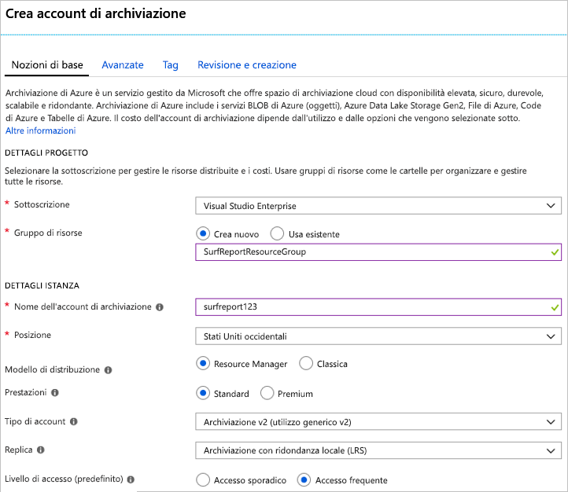
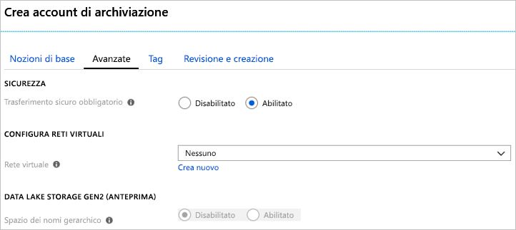

In questa unità, si userà il portale di Azure per creare un account di archiviazione appropriata per una fittizia southern California entrando report app web.

Il sito dei report entrando consente agli utenti di caricare foto e video del loro stato beach locale. I visualizzatori useranno il contenuto per scegliere la spiaggia con le condizioni migliori per il surf. Ecco l'elenco degli obiettivi di progettazione e funzionalità:

- Il contenuto video deve caricarsi rapidamente
- Il sito deve essere in grado di gestire i picchi imprevisti nei volumi di caricamento
- Il contenuto non aggiornato deve essere rimosso man mano che cambiano le condizioni per il surf, in modo che il sito mostri sempre le condizioni attuali

Si opta per un'implementazione che memorizza nel buffer il contenuto caricato in una coda di Azure per l'elaborazione e quindi lo sposta in un BLOB di Azure per l'archiviazione. È necessario un account di archiviazione che può contenere BLOB e code mettendo a disposizione l'accesso a bassa latenza ai contenuti.

## Usare il portale di Azure per creare un account di archiviazione

[!include]

1. Accedere al [portale di Azure](https://portal.azure.com/?azure-portal=true).

1. Nella parte superiore sinistra del portale di Azure, selezionare **crea una risorsa**.

1. Nel Pannello di selezione che viene visualizzato, selezionare **archiviazione**.

1. Sul lato destro del riquadro, selezionare **account di archiviazione: blob, file, tabella, coda**.

    

### Configurare le opzioni di base

[!include]

Sotto **dettagli progetto**:

1. Scegliere la **Sottoscrizione** appropriata.

1. Selezionare il gruppo di risorse esistenti <rgn>[nome gruppo di risorse di tipo Sandbox]</rgn> nell'elenco a discesa.

    > [!NOTE]
    > Questo gruppo di risorse gratuito è stato fornito da Microsoft come parte dell'esperienza di apprendimento. Quando si crea un account per un'applicazione reale, è consigliabile creare un nuovo gruppo di risorse nella sottoscrizione per contenere tutte le risorse per l'app.

Sotto **dettagli dell'istanza**:

1. Immettere un **nome account di archiviazione**. Il nome verrà usato per generare l'URL pubblico usato per accedere ai dati nell'account. Deve essere univoco in tutti i nomi account di archiviazione esistenti in Azure. Deve essere compreso tra 3 e 24 caratteri e può contenere solo lettere minuscole e numeri.

1. Selezionare una **posizione** nelle vicinanze è. 

1. Lasciare il **modello di distribuzione** come _Resource manager_. Questo è il modello preferito per tutte le distribuzioni di risorse in Azure e consente di raggruppare tutte le risorse correlate per l'app a un _gruppo di risorse_ per una gestione più semplice.

1. Selezionare _Standard_ per il **prestazioni** opzione. In tal modo viene stabilito il tipo di archiviazione su disco utilizzato per contenere i dati nell'account di archiviazione. Standard vengono utilizzati traditional dischi rigidi e l'account Premium Usa unità SSD () per un accesso più rapido. Tuttavia, tenere presente che Premium supporta solo _BLOB di pagine_ e si sarà necessario BLOB in blocchi per i video e una coda per il buffer - entrambi sono disponibili solo con i _Standard_ opzione.

1. Selezionare _archiviazione v2 (utilizzo generico v2)_ per il **tipologia Account**. Ciò fornisce accesso alle ultime funzionalità e prezzi. In particolare, gli account di archiviazione Blob sono disponibili più opzioni con questo tipo di account. È necessario una combinazione di BLOB e una coda, in modo che il _archiviazione Blob_ opzione non funzionerà. Per questa applicazione, non vi sarà alcun vantaggio alla scelta di un _archiviazione (utilizzo generico v1)_ account, dal momento che potrebbe limitare le funzionalità in grado di accedere e improbabile per ridurre i costi del carico di lavoro previsto.

1. Lasciare il **replica** come _l'archiviazione con ridondanza locale (LRS)_. I dati negli account di archiviazione di Azure vengono sempre replicati per assicurarne la disponibilità elevata - questa opzione consente di scegliere la modalità a portata di mano la replica viene eseguita in base ai requisiti di durabilità. In questo caso, le immagini e video rapidamente diventino obsoleti e vengono rimossi dal sito. Non vale quindi la pena di pagare di più per la ridondanza globale. Nel caso in cui un evento catastrofico causi la perdita di dati, è possibile riavviare il sito con contenuti aggiornati caricati dagli utenti.

1. Impostare il **livello di accesso** al _frequente_. Questa impostazione viene utilizzata solo per l'archiviazione Blob. Il **livello di accesso frequente** ideale per i dati utilizzati di frequente e il **livello di accesso sporadico** è preferibile per i dati ad accesso sporadico. Si noti che viene impostata solo la _predefinito_ valore - quando si crea un Blob, è possibile impostare un valore diverso per i dati. In questo caso, vengono utilizzati i video su caricamento rapido, quindi si userà l'opzione ad alte prestazioni per i BLOB.
   
Lo screenshot seguente mostra le impostazioni compilate per la scheda **Informazioni di base**. Si noti che il gruppo di risorse, sottoscrizioni e nome avrà valori diversi.

### Configurare le opzioni avanzate

1. Fare clic sul **successivo: Avanzate >** pulsante per spostare il **avanzate** scheda oppure selezionare il **avanzate** scheda nella parte superiore della schermata.

1. Il **trasferimento sicuro obbligatorio** permette di controllare se **HTTP** può essere usato per le API REST usata per accedere ai dati nell'account di archiviazione. Impostando questa opzione su _Enabled_ forzerà ai client di utilizzare SSL (**HTTPS**). La maggior parte dei casi è opportuno impostare questa _abilitato_ come usando HTTPS tramite la rete è considerata una procedura consigliata.

    > [!WARNING]
    > Se questa opzione è abilitata, applicherà alcune restrizioni aggiuntive. Connessioni del servizio file di Azure senza crittografia avrà esito negativo, inclusi gli scenari di uso di SMB 2.1 o 3.0 in Linux. Poiché archiviazione di Azure non supporta SSL per i nomi di dominio personalizzato, questa opzione non può essere utilizzata con un nome di dominio personalizzato.

1. Impostare il **reti virtuali** possibilità _None_. Questa opzione consente di isolare l'account di archiviazione in una rete virtuale di Azure. Si vuole usare l'accesso a Internet pubblico. I contenuti disponibili viene esposto al pubblico ed è necessario consentire l'accesso di client pubblici.

1. Lasciare il **Gen2 di archivio Data Lake** opzione come _disabilitato_. Si tratta di applicazioni big data che non sono rilevanti per questo modulo.

Lo screenshot seguente mostra le impostazioni compilate per la scheda **Avanzate**.

### Creare

1. È possibile esplorare le **tag** impostazioni se si desidera. Ciò consente di associare coppie chiave/valore per l'account per la categorizzazione ed è una funzionalità disponibile per qualsiasi risorsa di Azure.

1. Fare clic su **esaminare e creare** per esaminare le impostazioni. Sono sufficienti una convalida rapida delle opzioni di per assicurarsi che siano selezionati tutti i campi obbligatori. Se sono presenti problemi, verrà riportati di seguito. Dopo aver esaminato le impostazioni, fare clic su **Create** per effettuare il provisioning dell'account di archiviazione.

Richiederà alcuni minuti per distribuire l'account. Mentre Azure funziona su esso, è possibile esplorare le API verrà usato con questo account.

### Verificare

1. Selezionare il collegamento **Account di archiviazione** nella barra laterale sinistra.

1. Individuare il nuovo account di archiviazione nell'elenco per verificare che la creazione sia riuscita.

<!-- Cleanup sandbox -->
[!include]

Quando si lavora nella propria sottoscrizione, è possibile i passaggi seguenti nel portale di Azure per eliminare il gruppo di risorse e tutte le risorse associate.

1. Selezionare il collegamento **Gruppo di risorse** nella barra laterale sinistra.

1. Individuare il gruppo di risorse creato nell'elenco.

1. Fare doppio clic sulla voce relativa al gruppo di risorse e selezionare **Elimina gruppo di risorse** dal menu di scelta rapida. È anche possibile scegliere l'elemento "..." dal menu sul lato destro della voce da ottenere per stesso menu di scelta rapida.

1. Digitare il nome del gruppo di risorse nel campo di conferma.

1. Fare clic sul pulsante **Elimina**.

## Riepilogo

È stato creato un account di archiviazione con le impostazioni più appropriate per i propri requisiti aziendali. Ad esempio, si potrebbe essere stata selezionata un Data Center Stati Uniti occidentali perché i clienti si trovano principalmente in California del sud. Si tratta di un flusso tipico: in primo luogo analizzare i dati e gli obiettivi e quindi configurare le opzioni di account di archiviazione in modo che corrispondano.