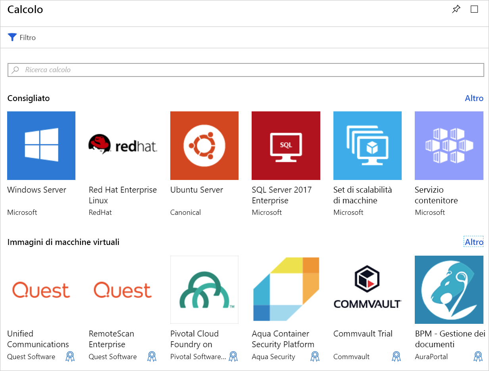

A questo punto è disponibile un sito Web esistente in esecuzione in un server Ubuntu Linux locale. Il nostro obiettivo consiste nel creare una macchina virtuale di Azure (VM) usando l'immagine Ubuntu più recente e quindi eseguire la migrazione del sito nel cloud. In questa unità, si apprenderà sulle opzioni da valutare durante la creazione di una macchina virtuale in Azure.

## Introduzione alle macchine virtuali di Azure

Macchine virtuali di Azure è una risorsa di cloud computing su richiesta e scalabile. Includono processori, memoria, archiviazione e le risorse di rete. È possibile avviare e arrestare le macchine virtuali in base alle esigenze e gestirle dal portale di Azure o con la CLI di Azure. È anche possibile usare un remoto Secure Shell (SSH) per connettersi direttamente alla macchina virtuale in esecuzione ed eseguire comandi come se fosse in un computer locale.

### Esecuzione di Linux in Azure

La creazione di macchine virtuali basate su Linux in Azure è facile. Microsoft ha collaborato con i principali fornitori di Linux per assicurarsi che le distribuzioni siano ottimizzate per la piattaforma Azure. È possibile creare macchine virtuali da immagini predefinite per un'ampia gamma di distribuzioni Linux più diffuse, ad esempio Ubuntu, SUSE e RedHat o creare la propria distribuzione di Linux per l'esecuzione nel cloud.

## Creazione di una macchina virtuale di Azure

Le macchine virtuali possono essere definite e distribuite in Azure in diversi modi: il portale di Azure, uno script (tramite il comando di Azure o Azure PowerShell) o un modello Azure Resource Manager. In tutti i casi, è necessario fornire tipi diversi di informazioni che illustreremo a breve.

Azure Marketplace offre anche immagini preconfigurate che includono sia un sistema operativo e gli strumenti preferiti software installati per scenari specifici.

## Risorse usate in una macchina virtuale Linux

Quando si crea una macchina virtuale Linux in Azure, è necessario creare anche le risorse per ospitarla. Queste risorse interagiscono per virtualizzare un computer ed eseguire il sistema operativo Linux. Queste deve esistere (ed essere selezionate durante la creazione della macchina virtuale) e verranno creati con la macchina virtuale:

- Una macchina virtuale che fornisce le risorse CPU e memoria
- Un account di Archiviazione di Azure per contenere i dischi rigidi virtuali
- Dischi virtuali per contenere il sistema operativo, le applicazioni e i dati
- Una rete virtuale (VNet) per connettere la macchina virtuale ad altri servizi di Azure o all'hardware in locale
- Un'interfaccia di rete per comunicare con la rete virtuale
- Un indirizzo IP pubblico facoltativo in modo da poter accedere alla macchina virtuale

Come per altri servizi di Azure, sarà necessario un **gruppo di risorse** per contenere la macchina virtuale (e, facoltativamente, raggruppare queste risorse per l'amministrazione). Quando si crea una nuova macchina virtuale, è possibile usare un gruppo di risorse esistente o crearne uno nuovo.

## Scegliere l'immagine della VM

La scelta di un'immagine è una delle decisioni principali e più importanti da prendere in fase di creazione di una VM. Un'immagine è un modello usato per creare una VM. Questi modelli includono un sistema operativo e, spesso, anche altro software, ad esempio strumenti di sviluppo o ambienti di hosting Web.

Tutto ciò che può essere installato in un computer può essere incluso in un'immagine. È possibile creare una macchina virtuale da un'immagine che è preconfigurata per con precisione le attività che necessarie, ad esempio un'app web in Apache HTTP Server di hosting.

> [!TIP]
> È anche possibile creare e caricare immagini disco personalizzate.

## Dimensionamento di una macchina virtuale

Proprio come un computer fisico dispone di una determinata quantità di memoria e potenza della CPU, lo stesso vale per una macchina virtuale. Azure offre una serie di macchine virtuali con dimensioni e prezzi diversi. La dimensione scelta determinerà potenza di elaborazione, memoria e capacità di archiviazione massima della macchina virtuale.

> [!WARNING]
> Sono previsti limiti di quota per ogni sottoscrizione, che possono influire sulla creazione della macchina virtuale. Per impostazione predefinita, non è possibile avere più di 20 _core_ virtuali per tutte le macchine virtuali all'interno di un'area. È possibile dividere le macchine virtuali tra aree o inviare una [richiesta online](https://docs.microsoft.com/azure/azure-supportability/resource-manager-core-quotas-request) per aumentare i limiti.

Le dimensioni delle macchine virtuali vengono raggruppate in categorie, a partire dalla serie B per attività di testing di base fino alla serie H per estese attività di elaborazione. È consigliabile selezionare le dimensioni della macchina virtuale in base al carico di lavoro da eseguire. È possibile modificare le dimensioni di una macchina virtuale dopo averla creata, ma la macchina virtuale deve essere arrestata prima di tutto. Pertanto, è consigliabile impostare le dimensioni, in modo appropriato dall'inizio se possibile.

#### Di seguito sono riportate alcune linee guida basate sullo scenario di destinazione

| Scenario | Dimensioni da considerare
|-------|------------------|
| **Utilizzo generico di elaborazione/web**: test e sviluppo, database medio-piccolo o da server web con traffico medio a ridotto. | B, Dsv3, Dv3, DSv2, Dv2 |
| **Le attività di calcolo intenso**: server web con traffico medio, Appliance di rete, processi batch e i server applicazioni. | Fsv2, Fs, F |
| **Utilizzo di memoria di grandi dimensioni**: server di database relazionali, medio-cache di grandi dimensioni e analitica in memoria. | Esv3, Ev3, M, GS, G, DSv2, Dv2 |
| **Elaborazione ed archiviazione dati**: Big data, SQL e NoSQL database tale velocità effettiva del disco elevata esigenza e i/o. | Ls |
| **Livelli intensivi di rendering della grafica** o modifica di video, nonché training e inferenza dei modelli (ND) con deep learning. | NV, NC, NCv2, NCv3, ND |
| **High performance computing (HPC)**: I carichi di lavoro necessario le macchine virtuali della CPU più veloci e potenti con interfacce di rete a elevata velocità effettiva opzionali. | H |

## Scelta delle opzioni di archiviazione

Il set successivo di decisioni si basa su archiviazione. Prima di tutto è possibile scegliere la tecnologia dei dischi. Le opzioni includono un'unità disco rigido tradizionale basata su platter o un'unità SSD più moderna. Proprio come per l'hardware acquistato, l'archiviazione SSD ha un costo maggiore, ma offre prestazioni migliori.

> [!TIP]
> Sono disponibili due livelli di archiviazione su unità SSD: Standard e Premium. Per carichi di lavoro normali, ma se si vogliono prestazioni migliori, scegliere dischi SSD Standard. Scegliere dischi SSD Premium per carichi di lavoro con I/O intensivo oppure sistemi strategici che devono elaborare i dati molto rapidamente.

### Mapping di archiviazione e dischi

Azure Usa i dischi rigidi virtuali (VHD) per rappresentare i dischi fisici per la macchina virtuale. I dischi rigidi virtuali replicano il formato logico e i dati di un'unità disco, ma vengono archiviati come BLOB di pagine in un account di Archiviazione di Azure. Pagamento in base al disco è possibile scegliere il tipo di archiviazione deve usare (unità SSD o HDD). Ciò consente di controllare le prestazioni di ogni disco, probabilmente in base alle attività di I/O che si prevede di eseguire.

Per impostazione predefinita, per la macchina virtuale Linux verranno creati due dischi rigidi virtuali (VHD):

1. Il **disco del sistema operativo**: questo è l'unità principale e ha una capacità massima di 2048 GB. Sarà denominata `/dev/sda` per impostazione predefinita.

1. Oggetto **disco temporaneo**: ciò fornisce l'archiviazione temporanea per il sistema operativo o qualsiasi app. Nelle macchine virtuali Linux il disco è `/dev/sdb` e viene formattato e montato in `/mnt` dall'agente Linux di Azure. Le dimensioni vengono stabilite in base alla dimensione della macchina virtuale e viene usato per archiviare il file di scambio.

> [!WARNING]
> Il disco temporaneo non è persistente. Su questo disco è consigliabile scrivere solo dati non fondamentali per il sistema.

#### Come gestire i dati

È possibile archiviare i dati nell'unità primaria insieme al sistema operativo, ma un approccio migliore consiste nel creare _dischi dati_ dedicati. È possibile creare e collegare dischi aggiuntivi alla macchina virtuale. Ogni disco può contenere fino a 4095 GB di dati e la quantità massima di spazio di archiviazione viene determinata dalla dimensione della macchina virtuale selezionata.

> [!NOTE]
> La caratteristica interessante è la possibilità di creare un'immagine di disco rigido virtuale da un disco reale. Ciò consente di eseguire facilmente la migrazione _esistenti_ informazioni da un computer locale al cloud.

### Dischi gestiti e non gestiti

La scelta finale per l'archiviazione consiste nel decidere se usare dischi **non gestiti** oppure **gestiti**.

Con i dischi non gestiti si è responsabili degli account di archiviazione usati per archiviare i dischi rigidi virtuali corrispondenti ai dischi delle macchine virtuali. Si pagano le tariffe dell'account di archiviazione per la quantità di spazio usato. Un singolo account di archiviazione prevede un limite fisso di velocità di 20.000 operazioni di I/O al secondo e questo significa che un singolo account di archiviazione è in grado di supportare 40 dischi rigidi virtuali standard a pieno ritmo. Se è necessario aumentare, servirà più di un account di archiviazione e ciò può risultare complicato.

I dischi gestiti rappresentano il modello di archiviazione su disco consigliato più recente. Risolvono in modo elegante queste complicazioni delegando ad Azure il carico di gestione degli account di archiviazione. Si specificano il tipo di disco (Standard o Premium) e le dimensioni del disco e Azure crea e gestisce sia il disco _e_ Usa lo spazio di archiviazione. Non è necessario preoccuparsi dei limiti per l'account di archiviazione e aumentare la disponibilità diventa quindi più semplice. I dischi gestiti offrono anche diversi altri vantaggi:

- **Maggiore affidabilità**: Azure garantisce che i dischi rigidi virtuali associati a elevata affidabilità le macchine virtuali devono essere posizionati in diverse parti dell'archiviazione di Azure per fornire livelli simili di resilienza.
- **Migliore sicurezza**: i dischi gestiti sono risorse gestite reali nel gruppo di risorse. Questo significa che possono sfruttare il controllo degli accessi in base al ruolo per limitare chi può usare i dati dei dischi rigidi virtuali.
- **Supporto degli snapshot**: è possibile usare gli snapshot per creare una copia di sola lettura di un disco rigido virtuale. È necessario arrestare la macchina virtuale proprietaria, ma la creazione dello snapshot richiede solo pochi secondi. Al termine, è possibile accendere la macchina virtuale e usare lo snapshot per creare una macchina virtuale duplicata per risolvere i problemi di produzione o il rollback della macchina virtuale per il punto in cui è stato creato lo snapshot.
- **Supporto di backup**: i dischi gestiti sono possibile eseguire automaticamente backup in aree diverse per il ripristino di emergenza con Backup di Azure senza influire sul servizio della macchina virtuale.

## Comunicazione di rete

Le macchine virtuali comunicano con le risorse esterne tramite una rete virtuale (VNet). La rete virtuale rappresenta una rete privata in un'unica area, usata dalle risorse per le comunicazioni. Una rete virtuale è esattamente come le reti gestite in locale. È possibile suddividerla tramite subnet per isolare le risorse, connetterla ad altre (incluse le reti locali) e applicare le regole del traffico per regolare le connessioni in ingresso e in uscita.

### Pianificazione della rete

Quando si crea una nuova macchina virtuale, si avrà la possibilità di creare una nuova rete virtuale o di usare una rete virtuale esistente nella propria area.

Scegliere di delegare ad Azure la creazione della rete insieme alla macchina virtuale è semplice, ma è probabile che non sia la soluzione ideale per la maggior parte degli scenari. È consigliabile pianificare i requisiti di rete _fin dall'inizio_ per tutti i componenti nell'architettura e creare separatamente la struttura di rete virtuale. Quindi, creare le macchine virtuali e inserirle in reti virtuali creati in precedenza. Il tema delle reti virtuali verrà approfondito più avanti in questo modulo.

Prima di creare una macchina virtuale, è necessario decidere come si desidera amministrare la macchina virtuale. Esaminiamo le opzioni.