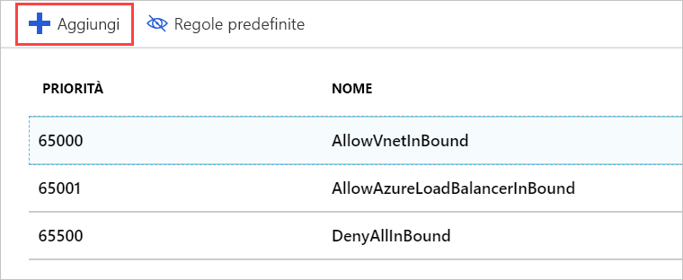
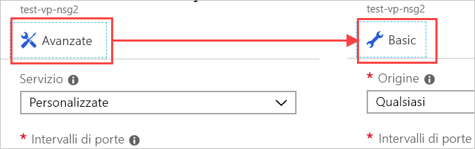

Ora si applicherà alla rete un gruppo di sicurezza di rete, in modo che sul server possa transitare solo traffico HTTP.

## Creare un gruppo di sicurezza di rete

Azure dovrebbe aver creato un gruppo di sicurezza, perché si era indicato di volere l'accesso SSH. Tuttavia ora si crea un nuovo gruppo di sicurezza, in modo da documentare l'intero processo. Questa procedura è particolarmente importante se si decide di creare la rete virtuale _prima_ delle macchine virtuali. Come indicato in precedenza, i gruppi di sicurezza sono _facoltativi_ e non vengono necessariamente creati con la rete.

1. Nel [portale di Azure](https://portal.azure.com/learn.docs.microsoft.com?azure-portal=true) fare clic sul pulsante **Crea una risorsa** sulla barra laterale nell'angolo a sinistra per avviare la creazione di una nuova risorsa.

1. Digitare **Gruppo di sicurezza di rete** nella casella del filtro e selezionare l'elemento corrispondente nell'elenco.

1. Verificare che sia selezionato il modello di distribuzione **Resource Manager** e fare clic su **Crea**.

1. Specificare un **Nome** per il gruppo di sicurezza. Anche in questo caso è consigliabile applicare le convenzioni di denominazione. Si userà **test-web-eus-nsg1** per **Test Web Network Security Group #1 in East US**. È consigliabile modificare la parte del nome relativa alla località in modo da riflettere la posizione del gruppo di sicurezza.

1. Selezionare la **sottoscrizione** appropriata e usare il **gruppo di risorse** esistente.

1. Inserirlo infine nella stessa **Posizione** della VM/rete virtuale. Questa operazione è importante perché non sarà possibile applicare questa risorsa se si trova in una posizione diversa.

1. Fare clic su **Crea** per creare il gruppo.

## Aggiungere una nuova regola in ingresso al gruppo di sicurezza di rete

La distribuzione verrà completata rapidamente. Al termine è possibile aggiungere nuove regole per il gruppo di sicurezza:

1. Trovare la nuova risorsa gruppo di sicurezza e selezionarla nel portale di Azure.

1. Nella pagina Panoramica si noterà che sono state create alcune regole predefinite create per bloccare la rete.

    Sul lato in ingresso:

    - Tutto il traffico in ingresso da una rete virtuale a un'altra è consentito. In questo modo le risorse della rete virtuale possono comunicare tra loro.
    - Il **probe** di Azure Load Balancer richiede di verificare che la macchina virtuale sia attiva.
    - Tutto il traffico in ingresso rimanente viene rifiutato.

    Sul lato in uscita:
    - Tutto il traffico nella rete virtuale è consentito.
    - Tutto il traffico in uscita verso Internet è consentito.
    - Tutto il traffico in uscita di altro tipo viene rifiutato.

    > [!NOTE]
    > Queste regole predefinite vengono impostate con valori di priorità elevata e quindi vengono valutate per _ultime_. Non possono essere modificate o eliminate, ma è possibile eseguirne l'_override_ creando regole più specifiche per il traffico con un valore di priorità più basso.

1. Fare clic sulla sezione **Regole di sicurezza in ingresso** nel pannello **Impostazioni** del gruppo di sicurezza.

1. Fare clic su **+ Aggiungi** per aggiungere una nuova regola di sicurezza.

    

    Esistono due modalità per immettere le informazioni necessarie per una regola di sicurezza: di base e avanzata. È possibile alternare tra le modalità facendo clic sul pulsante nella parte superiore del pannello **Aggiungi**.

    

    La modalità avanzata consente di personalizzare completamente la regola. Se tuttavia è necessario configurare un protocollo noto, è più facile lavorare con la modalità di base.

1. Passare alla modalità di base.

1. Aggiungere le informazioni per la regola HTTP:

    - Impostare **Servizio** su HTTP. Verrà automaticamente configurato l'intervallo di porte.
    - Impostare **Priorità** su **1000**. Deve essere un numero inferiore a quello della regola predefinita **Nega**. È possibile far iniziare l'intervallo con qualsiasi valore, ma è consigliabile usare un valore che consenta di creare un'eccezione in un secondo momento, se necessario.
    - Assegnare un nome alla regola. In questo caso usare **allow-http-traffic**.
    - Assegnare una descrizione alla regola.

1. Tornare alla modalità **avanzata**. Si noti che le impostazioni sono ancora presenti. È possibile usare questo pannello per creare impostazioni con granularità più fine. In particolare, l'**origine** deve essere un indirizzo IP specifico o un intervallo di indirizzi IP specifici delle telecamere. Se si conosce l'indirizzo IP corrente del computer locale, provare a usarlo. In caso contrario, lasciare l'impostazione **Qualsiasi** in modo che sia possibile testare la regola.

1. Fare clic su **Aggiungi** per creare la regola. L'elenco di regole in ingresso verrà aggiornato. Si noti che sono in ordine di priorità, ovvero l'ordine in cui verranno esaminate.

## Applicare il gruppo di sicurezza

Tenere presente che il gruppo di sicurezza può essere applicato a un'interfaccia di rete (per proteggere una singola VM) oppure a una subnet (per applicarlo a tutte le risorse della subnet). Si userà il secondo approccio, che è il più comune. È possibile accedere a questa risorsa in Azure tramite la risorsa di rete virtuale oppure indirettamente tramite la VM che usa la rete virtuale.

1. Passare al pannello **Panoramica** per la macchina virtuale. È possibile trovare la VM in **Tutte le risorse**.

1. Selezionare l'elemento **Rete** nella sezione **Impostazioni**.

1. Nelle proprietà della rete sono disponibili informazioni sulla rete applicata alla VM, tra cui **Rete virtuale/subnet**. Questo è un collegamento selezionabile che consente di ottenere la risorsa. Fare clic per aprire la rete virtuale. Questo collegamento è disponibile _anche_ nel pannello **Panoramica** della VM. Entrambi i collegamenti apriranno la **panoramica** della rete virtuale.

1. Nella sezione **Impostazioni** selezionare l'elemento **Subnet**.

1. Dovrebbe essere presente una sola subnet definita (predefinita) da quando prima sono state create la VM e la rete. Fare clic sull'elemento nell'elenco per aprire i dettagli.

1. Fare clic sulla voce **Gruppo di sicurezza di rete**.

1. Selezionare il nuovo gruppo di sicurezza: **test-web-eus-nsg1**. Dovrebbe essere presente un altro gruppo oltre a quello creato con la macchina virtuale.

1. Fare clic su **Salva** per salvare la modifica. L'applicazione alla rete richiederà un minuto.

## Aggiornare il gruppo di sicurezza di rete nell'interfaccia di rete

La porta 80 è aperta nel gruppo di sicurezza di rete applicato alla subnet, ma continuerà a essere bloccata perché attualmente non è consentita nel gruppo di sicurezza di rete applicato all'interfaccia di rete. Ecco come risolvere il problema per abilitare la connessione.

1. Tornare al pannello **Panoramica** per la macchina virtuale. È possibile trovare la macchina virtuale in **Tutte le risorse**.

1. Selezionare l'elemento **Rete** nella sezione **Impostazioni**.

1. Nella sezione **Regole porta in ingresso** dovrebbero essere visualizzate le regole del gruppo di sicurezza di rete per la subnet, e appena sotto, le regole per l'interfaccia di rete. Nelle regole del gruppo di sicurezza di rete per l'interfaccia di rete selezionare **Aggiungi regola porta in ingresso**.

1. Passare alla modalità di base.

1. Aggiungere le informazioni per la regola HTTP:

    - Impostare **Servizio** su HTTP. Verrà automaticamente configurato l'intervallo di porte.
    - Impostare la **Priorità** su **310**.
    - Assegnare un nome alla regola. In questo caso usare **allow-http-traffic**.
    - Assegnare alla regola una descrizione.

1. Fare clic su **Aggiungi** per creare la regola.

## Verificare le regole

Ora si procede a convalidare la modifica:

1. Tornare al pannello **Panoramica** per la macchina virtuale. È possibile trovare la VM in **Tutte le risorse**.

1. Selezionare l'elemento **Rete** nella sezione **Impostazioni**.

1. Nei dettagli dell'interfaccia di rete è presente un collegamento alle **regole di sicurezza effettive** che consente di visualizzare rapidamente come verranno valutate le regole. Fare clic sul collegamento per aprire l'analisi e verificare che vengano visualizzate la nuova regole.

    

1. Naturalmente, il modo migliore per assicurarsi che tutto funzioni correttamente è inviare una richiesta HTTP al server. A questo punto dovrebbe funzionare.

    

## Ultimo passaggio

Le regole di sicurezza sono difficili da configurare correttamente. È stato commesso un errore quando si è applicato questo nuovo gruppo di sicurezza: si è perso l'accesso SSH. Per risolvere questo problema, è possibile aggiungere un'altra regola al gruppo di sicurezza applicato alla subnet per consentire l'accesso SSH. Assicurarsi di limitare gli indirizzi TCP/IP in ingresso per la regola a quelli di cui si è proprietari.

> [!WARNING]
> Assicurarsi sempre di bloccare le porte usate per l'accesso amministrativo. Un approccio ancora migliore consiste nel creare una VPN per collegare la rete virtuale alla rete privata e consentire solo le richieste RDP o SSH da tale intervallo di indirizzi. È anche possibile sostituire la porta usata da SSH con una diversa da quella predefinita. Tenere presente che la sostituzione della porta non è sufficiente ad arrestare gli attacchi. L'unico effetto che ottiene è rendere più difficile il rilevamento della porta.