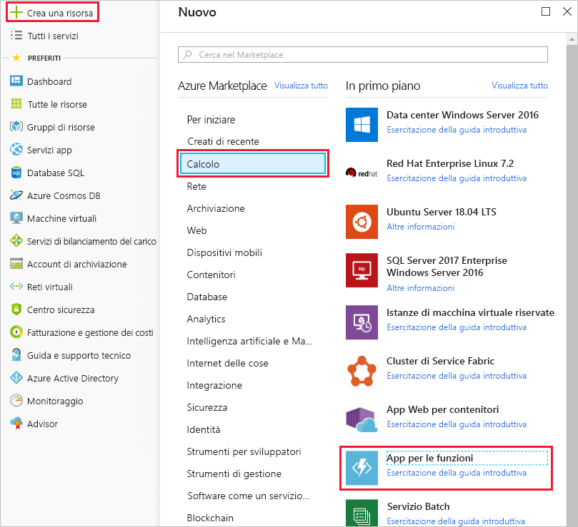
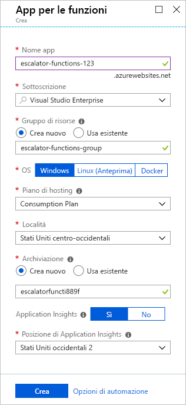
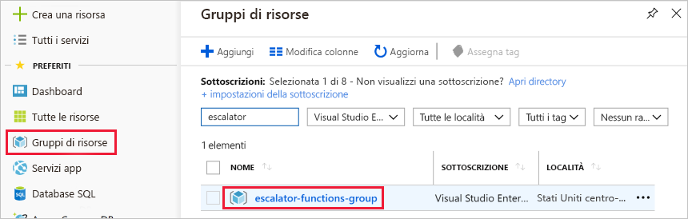
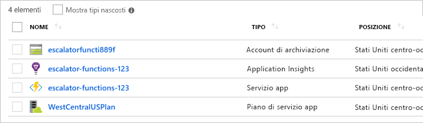

A questo punto è possibile iniziare a implementare il servizio relativo alla temperatura.You are now ready to start implementing the temperature service. Nell'unità precedente si è stabilito che una soluzione senza server sarebbe la più adatta alle specifiche esigenze.In the previous unit, you determined that a serverless solution would best fit your needs. Ora verrà creata un'app per le funzioni per contenere la funzione di Azure.Let's start by creating a function app to hold our Azure Function.

## Informazioni sulle app per le funzioniWhat is a function app?

Le funzioni sono ospitate in un contesto di esecuzione chiamato **app per le funzioni**.Functions are hosted in an execution context called a **function app**. Le app per le funzioni vengono definite per raggruppare e strutturare in modo logico le funzioni e una risorsa di calcolo in Azure.You define function apps to logically group and structure your functions and a compute resource in Azure. Nell'esempio dell'ascensore, si crea un'app per le funzioni per ospitare il servizio relativo alla temperatura dell'ingranaggio di trasmissione dell'ascensore.In our elevator example, you would create a function app to host the escalator drive gear temperature service. Per creare l'app per le funzioni è necessario prendere alcune decisioni. In particolare, scegliere un piano di servizio e selezionare un account di archiviazione compatibile.There are a few decisions that need to be made to create the function app; you need to choose a service plan and select a compatible storage account.

### Scelta di un piano di servizioChoosing a service plan

Le app per le funzioni possono usare uno dei due tipi di piani di servizio disponibili.Function apps may use one of two types of service plans. Il primo è il **piano di servizio a consumo**.The first service plan is the **Consumption service plan**. Questo è il piano più adatto quando si usa la piattaforma applicativa serverless di Azure.This is the plan that you choose when using the Azure serverless application platform. Consente la scalabilità automatica e applica un addebito quando le funzioni sono in esecuzione.The Consumption service plan provides automatic scaling and bills you when your functions are running. Il piano di servizio a consumo prevede un periodo di timeout configurabile per l'esecuzione di una funzione.The Consumption plan comes with a configurable timeout period for the execution of a function. Per impostazione predefinita il timeout è di 5 minuti, ma può essere configurato per una durata massima di 10 minuti.By default, it is 5 minutes, but may be configured to have a timeout as long as 10 minutes.

Il secondo piano è detto **piano di servizio app di Azure**.The second plan is called the **Azure App Service plan**. Questo piano consente di evitare periodi di timeout consentendo l'esecuzione della funzione in modalità continua in una macchina virtuale definita dall'utente.This plan allows you to avoid timeout periods by having your function run continuously on a VM that you define. Quando si usa un piano di servizio app, si è responsabili della gestione di risorse dell'app per cui viene eseguita la funzione, quindi tecnicamente non è un piano serverless.When using an App Service plan, you are responsible for managing the app resources the function runs on, so this is technically not a serverless plan. Può tuttavia essere la scelta migliore se le funzioni vengono eseguite in modalità continua o richiedono una potenza di elaborazione o un tempo di esecuzione più elevati rispetto a quelli che può offrire il piano a consumo.However, it may be a better choice if your functions are used continuously or if your functions require more processing power or execution time than the Consumption plan can provide.

### Requisiti dell'account di archiviazioneStorage account requirements

Quando si crea un'app per le funzioni, è necessario collegarla a un account di archiviazione.When you create a function app, it must be linked to a storage account. È possibile selezionare un account esistente o crearne uno nuovo.You can select an existing account or create a new one. L'app per le funzioni usa questo account di archiviazione per le operazioni interne, ad esempio la registrazione dei dati di esecuzione delle funzioni e la gestione dei trigger di esecuzione.The function app uses this storage account for internal operations such as logging function executions and managing execution triggers. Nell'ambito del piano di servizio a consumo è anche la posizione in cui vengono archiviati il codice e il file di configurazione della funzione.On the Consumption service plan, this is also where the function code and configuration file are stored.

## Creare un'app per le funzioniCreate a function app

Ora verrà creata un'app per le funzioni nel portale di Azure.Let's create a function app in the Azure portal.

1. Accedere al [portale di Azure](https://portal.azure.com?azure-portal=true) con il proprio account Azure.Sign in to the [Azure portal](https://portal.azure.com?azure-portal=true) using your Azure account.

1. Selezionare il pulsante **Crea una risorsa** visualizzato nell'angolo superiore sinistro del portale di Azure, quindi selezionare **Inizia subito > Serverless Function App** (App per le funzioni serverless) per aprire il pannello *Crea* dell'app per le funzioni.Select the **Create a resource** button found on the upper left-hand corner of the Azure portal, and then select **Get started > Serverless Function App** to open the Function App *Create* blade. In alternativa, è possibile usare l'opzione **Calcolo > App per le funzioni** che apre lo stesso pannello.Alternatively, you can use the **Compute > Function App** option, which will open the same blade.

  

1. Scegliere un nome app globalmente univoco.Choose a globally unique app name. Questo nome sarà l'URL di base del servizio.This will serve as the base URL of your service. Ad esempio, è possibile assegnare all'app il nome **escalator-functions-xxxxxxx**, sostituendo la x con le iniziali e l'anno di nascita dell'utente.For example, you can name it **escalator-functions-xxxxxxx**, where the x's can be replaced with your initials and your birth year. Se il nome non risulta globalmente univoco, è possibile provare un'altra combinazione.If this isn't globally unique, you can try any other combination. I caratteri validi sono a-z, 0-9 e -.Valid characters are a-z, 0-9 and -.

1. Selezionare la sottoscrizione di Azure in cui ospitare l'app per le funzioni.Select the Azure subscription where you would like the function app hosted.

1. Creare un nuovo gruppo di risorse denominato **escalator-functions-group**.Create a new resource group called **escalator-functions-group**. L'impiego di un gruppo per contenere tutte le risorse usate in questo modulo semplificherà le successive operazioni di pulizia.Using a resource group to hold all resources used in this module will help with clean-up later.

1. Selezionare **Windows** come sistema operativo.Select **Windows** for OS.

1. Per **Piano di hosting** selezionare il **piano a consumo**, ovvero l'opzione di hosting senza server.For **Hosting Plan**, select the **Consumption Plan**, which is the serverless hosting option.

1. Selezionare la località geografica più vicina all'utente (o ai clienti).Select the geographical location closest to you (or your customers).

1. Creare un nuovo account di archiviazione.Create a new storage account. Azure assegna un nome all'account in base al nome dell'app.Azure will give it a name based on the app name. È possibile modificarlo, se necessario, ma deve anche essere univoco.You can change it if you like, but it must also be unique.

1. Verificare che Azure Application Insights sia **attivato** e selezionare l'area più vicina all'utente (o ai clienti).Make sure that Azure Application Insights is **On** and select the region closest to you (or your customers).
  Al termine, la configurazione sarà simile a quella rappresentata nello screenshot seguente.When you're finished, your configuration should look like the config in the following screenshot.

  

1. Selezionare **Crea**; il processo di distribuzione richiederà alcuni minuti.Select **Create**; deployment will take a few minutes. L'utente riceverà una notifica al completamento dell'operazione.You'll receive a notification once it's complete.

## Verificare l'app per le funzioni di AzureVerify your Azure function app

1. Nel menu a sinistra del portale di Azure selezionare **Gruppi di risorse**.From the Azure portal left-hand menu, select **Resource groups**. Viene visualizzato **escalator-functions-group** nell'elenco dei gruppi disponibili.You should then see the **escalator-functions-group** in the list of available groups.

  

1. Selezionare **escalator-functions-group**.Select the **escalator-functions-group**. Viene visualizzato un elenco di risorse simile al seguente.You should then see a resource list like the following list.

  

L'elemento con l'icona di funzione a forma di fulmine, elencato come servizio app, è la nuova app per le funzioni.The item with the lightning bolt Function icon, listed as an App Service, is your new function app. Fare clic sull'elemento per aprire i dettagli sulla nuova funzione, a cui è stato assegnato un URL pubblico. Aprendo l'URL in un browser, viene visualizzata una pagina Web predefinita che indica che l'app per le funzioni è in esecuzione.You can click on it to open the details about the new function - it has a public URL assigned to it, if you open that in a browser, you should get a default web page that indicates your Function App is running.
