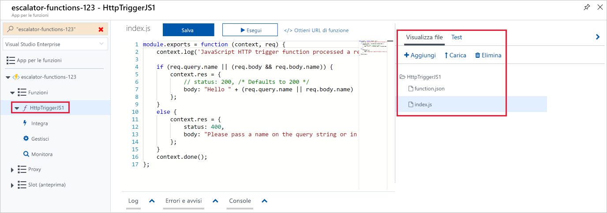
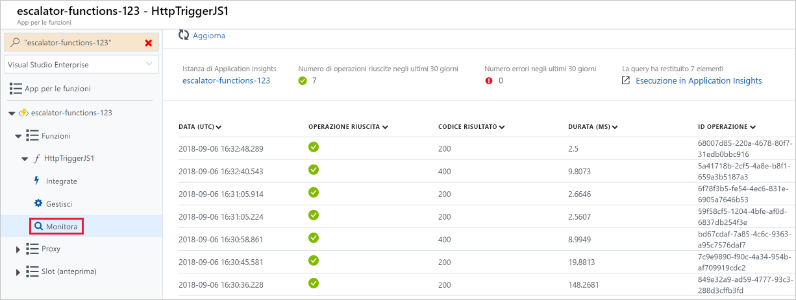

<span data-ttu-id="36cef-101">Dopo aver creato un'app per le funzioni, verrà spiegato come compilare, configurare ed eseguire una funzione.</span><span class="sxs-lookup"><span data-stu-id="36cef-101">Now that we have a function app created, let's look at how to build, configure, and execute a function.</span></span>

### <a name="triggers"></a><span data-ttu-id="36cef-102">Trigger</span><span class="sxs-lookup"><span data-stu-id="36cef-102">Triggers</span></span>

<span data-ttu-id="36cef-103">Le funzioni sono basate sugli eventi, ovvero vengono eseguite in risposta a un evento.</span><span class="sxs-lookup"><span data-stu-id="36cef-103">Functions are event driven, which means they run in response to an event.</span></span>

<span data-ttu-id="36cef-104">Il tipo di evento che avvia la funzione viene chiamato **trigger**.</span><span class="sxs-lookup"><span data-stu-id="36cef-104">The type of event that starts the function is called a **trigger**.</span></span> <span data-ttu-id="36cef-105">La funzione deve essere configurata con un solo trigger.</span><span class="sxs-lookup"><span data-stu-id="36cef-105">You must configure a function with exactly one trigger.</span></span>

<span data-ttu-id="36cef-106">Azure supporta i trigger per i servizi seguenti.</span><span class="sxs-lookup"><span data-stu-id="36cef-106">Azure supports triggers for the following services.</span></span>

| <span data-ttu-id="36cef-107">Servizio</span><span class="sxs-lookup"><span data-stu-id="36cef-107">Service</span></span>                 | <span data-ttu-id="36cef-108">Descrizione del trigger</span><span class="sxs-lookup"><span data-stu-id="36cef-108">Trigger description</span></span>  |
|-------------------------|---------|
| <span data-ttu-id="36cef-109">Archiviazione BLOB</span><span class="sxs-lookup"><span data-stu-id="36cef-109">Blob storage</span></span>            | <span data-ttu-id="36cef-110">Avvia una funzione quando viene rilevato un BLOB nuovo o aggiornato.</span><span class="sxs-lookup"><span data-stu-id="36cef-110">Start a function when a new or updated blob is detected.</span></span>       |
| <span data-ttu-id="36cef-111">Cosmos DB</span><span class="sxs-lookup"><span data-stu-id="36cef-111">Cosmos DB</span></span>               | <span data-ttu-id="36cef-112">Avvia una funzione quando vengono rilevati inserimenti e aggiornamenti.</span><span class="sxs-lookup"><span data-stu-id="36cef-112">Start a function when inserts and updates are detected.</span></span>      |
| <span data-ttu-id="36cef-113">Griglia di eventi</span><span class="sxs-lookup"><span data-stu-id="36cef-113">Event Grid</span></span>              | <span data-ttu-id="36cef-114">Avvia una funzione quando viene ricevuto un evento da Griglia di eventi.</span><span class="sxs-lookup"><span data-stu-id="36cef-114">Start a function when an event is received from Event Grid.</span></span>       |
| <span data-ttu-id="36cef-115">HTTP</span><span class="sxs-lookup"><span data-stu-id="36cef-115">HTTP</span></span>                    | <span data-ttu-id="36cef-116">Avvia una funzione con una richiesta HTTP.</span><span class="sxs-lookup"><span data-stu-id="36cef-116">Start a function with an HTTP request.</span></span>      |
| <span data-ttu-id="36cef-117">Eventi di Microsoft Graph</span><span class="sxs-lookup"><span data-stu-id="36cef-117">Microsoft Graph Events</span></span>  | <span data-ttu-id="36cef-118">Avvia una funzione in risposta a un webhook in ingresso di Microsoft Graph.</span><span class="sxs-lookup"><span data-stu-id="36cef-118">Start a function in response to an incoming webhook from the Microsoft Graph.</span></span> <span data-ttu-id="36cef-119">Ogni istanza del trigger può rispondere a un tipo di risorsa di Microsoft Graph.</span><span class="sxs-lookup"><span data-stu-id="36cef-119">Each instance of this trigger can react to one Microsoft Graph resource type.</span></span>       |
| <span data-ttu-id="36cef-120">Archiviazione code</span><span class="sxs-lookup"><span data-stu-id="36cef-120">Queue storage</span></span>           | <span data-ttu-id="36cef-121">Avvia una funzione quando viene ricevuto un nuovo elemento in una coda.</span><span class="sxs-lookup"><span data-stu-id="36cef-121">Start a function when a new item is received on a queue.</span></span> <span data-ttu-id="36cef-122">Il messaggio in coda viene inviato come input alla funzione.</span><span class="sxs-lookup"><span data-stu-id="36cef-122">The queue message is provided as input to the function.</span></span>      |
| <span data-ttu-id="36cef-123">Bus di servizio</span><span class="sxs-lookup"><span data-stu-id="36cef-123">Service Bus</span></span>             | <span data-ttu-id="36cef-124">Avvia una funzione in risposta ai messaggi di una coda del bus di servizio.</span><span class="sxs-lookup"><span data-stu-id="36cef-124">Start a function in response to messages from a Service Bus queue.</span></span>       |
| <span data-ttu-id="36cef-125">Timer</span><span class="sxs-lookup"><span data-stu-id="36cef-125">Timer</span></span>                   | <span data-ttu-id="36cef-126">Avvia una funzione in una pianificazione.</span><span class="sxs-lookup"><span data-stu-id="36cef-126">Start a function on a schedule.</span></span>       |

### <a name="bindings"></a><span data-ttu-id="36cef-127">Associazioni</span><span class="sxs-lookup"><span data-stu-id="36cef-127">Bindings</span></span>

<span data-ttu-id="36cef-128">Le associazioni sono una modalità dichiarativa per connettere dati e servizi alla funzione.</span><span class="sxs-lookup"><span data-stu-id="36cef-128">Bindings are a declarative way to connect data and services to your function.</span></span> <span data-ttu-id="36cef-129">Sono in grado di comunicare con diversi servizi, pertanto non è necessario scrivere codice nella funzione per connettersi alle origini dati e gestire le connessioni.</span><span class="sxs-lookup"><span data-stu-id="36cef-129">Bindings know how to talk to different services, which means you don't have to write code in your function to connect to data sources and manage connections.</span></span> <span data-ttu-id="36cef-130">La piattaforma gestisce automaticamente questa complessità nell'ambito del codice di associazione.</span><span class="sxs-lookup"><span data-stu-id="36cef-130">The platform takes care of that complexity for you as part of the binding code.</span></span> <span data-ttu-id="36cef-131">Ogni associazione ha una direzione: il codice legge i dati dalle associazioni di *input* e scrive i dati nelle associazioni di *output*.</span><span class="sxs-lookup"><span data-stu-id="36cef-131">Each binding has a direction - your code reads data from *input* bindings and writes data to *output* bindings.</span></span> <span data-ttu-id="36cef-132">Ogni funzione può avere zero o più associazioni per gestire i dati di input e output elaborati dalla funzione.</span><span class="sxs-lookup"><span data-stu-id="36cef-132">Each function can have zero or more bindings to manage the input and output data processed by the function.</span></span>

<span data-ttu-id="36cef-133">Un trigger è un tipo speciale di associazione di input che in più consente di avviare l'esecuzione.</span><span class="sxs-lookup"><span data-stu-id="36cef-133">A trigger is a special type of input binding that has the additional capability of initiating execution.</span></span>

<span data-ttu-id="36cef-134">Azure offre [numerose associazioni](https://docs.microsoft.com/azure/azure-functions/functions-triggers-bindings#supported-bindings) per connettersi a diversi servizi di archiviazione e messaggistica.</span><span class="sxs-lookup"><span data-stu-id="36cef-134">Azure provides a [large number of bindings](https://docs.microsoft.com/azure/azure-functions/functions-triggers-bindings#supported-bindings) to connect to different storage and messaging services.</span></span>

### <a name="a-sample-binding-definition"></a><span data-ttu-id="36cef-135">Un esempio di definizione di associazione</span><span class="sxs-lookup"><span data-stu-id="36cef-135">A sample binding definition</span></span>

<span data-ttu-id="36cef-136">L'esempio che segue illustra la configurazione di una funzione con un'associazione di input (trigger) e un'associazione di output.</span><span class="sxs-lookup"><span data-stu-id="36cef-136">Let's look at an example of configuring a function with an input binding (trigger) and an output binding.</span></span> <span data-ttu-id="36cef-137">Si supponga di voler leggere i dati dall'archiviazione BLOB, elaborarli nella funzione e quindi scrivere un messaggio a una coda.</span><span class="sxs-lookup"><span data-stu-id="36cef-137">Let's say we want to read data from Blob storage, process it in our function, and then write a message to a queue.</span></span> <span data-ttu-id="36cef-138">A questo scopo occorre configurare un'_associazione di input_ di tipo *BLOB* e un'_associazione di output_ di tipo *coda*.</span><span class="sxs-lookup"><span data-stu-id="36cef-138">You would configure an _input binding_ of type *blob* and an _output binding_ of type *queue*.</span></span>

<span data-ttu-id="36cef-139">Le associazioni possono essere definite nel portale di Azure e vengono archiviate come file JSON, che possono anche essere modificati direttamente.</span><span class="sxs-lookup"><span data-stu-id="36cef-139">Bindings can be defined in the Azure portal, and are stored as JSON files, which you can also edit directly.</span></span> <span data-ttu-id="36cef-140">Il file JSON seguente è un esempio di definizione di un trigger e di un'associazione per una funzione.</span><span class="sxs-lookup"><span data-stu-id="36cef-140">The following JSON is sample definition of a trigger and binding for a function.</span></span>

```json
{
  "bindings": [
    {
      "name": "order",
      "type": "queueTrigger",
      "direction": "in",
      "queueName": "myqueue-items",
      "connection": "MY_STORAGE_ACCT_APP_SETTING"
    },
    {
      "name": "$return",
      "type": "table",
      "direction": "out",
      "tableName": "outTable",
      "connection": "MY_TABLE_STORAGE_ACCT_APP_SETTING"
    }
  ]
}
```

<span data-ttu-id="36cef-141">Questo esempio illustra una funzione attivata da un messaggio che viene aggiunto a una coda denominata **myqueue-items**.</span><span class="sxs-lookup"><span data-stu-id="36cef-141">This example shows a function that is triggered by a message being added to a queue named **myqueue-items**.</span></span> <span data-ttu-id="36cef-142">Il valore restituito della funzione viene quindi inviato alla tabella **outTable** nell'archiviazione tabelle di Azure.</span><span class="sxs-lookup"><span data-stu-id="36cef-142">It then sends the return value of the function to the **outTable** table in Azure Table storage.</span></span> <span data-ttu-id="36cef-143">Questo è un esempio molto semplice, in cui è possibile modificare l'output in modo che sia un messaggio di posta elettronica con un'associazione SendGrid, inserire un evento in un bus di servizio per inviare notifiche a un altro componente dell'architettura o persino avere più associazioni di output per effettuare il push dei dati a vari servizi.</span><span class="sxs-lookup"><span data-stu-id="36cef-143">This is a very simple example, we could change the output to be an email using a SendGrid binding, or put an event onto a Service Bus to notify some other component in our architecture, or even have multiple output bindings to push data to various services.</span></span>

## <a name="creating-a-function-in-the-azure-portal"></a><span data-ttu-id="36cef-144">Creazione di una funzione nel portale di Azure</span><span class="sxs-lookup"><span data-stu-id="36cef-144">Creating a function in the Azure portal</span></span>

<span data-ttu-id="36cef-145">Azure offre diversi modelli di funzione già pronti per gli scenari comuni.</span><span class="sxs-lookup"><span data-stu-id="36cef-145">Azure provides several pre-made function templates for common scenarios.</span></span>

### <a name="quickstart-templates"></a><span data-ttu-id="36cef-146">Modelli di avvio rapido</span><span class="sxs-lookup"><span data-stu-id="36cef-146">Quickstart templates</span></span>

<span data-ttu-id="36cef-147">Quando si aggiunge la prima funzione, viene visualizzata la schermata Avvio rapido.</span><span class="sxs-lookup"><span data-stu-id="36cef-147">When adding your first function, you are presented with the Quickstart screen.</span></span> <span data-ttu-id="36cef-148">Questa schermata consente di scegliere un tipo di trigger (HTTP, Timer o Dati) e un linguaggio di programmazione (C#, JavaScript, F# o Java).</span><span class="sxs-lookup"><span data-stu-id="36cef-148">This screen allows you to choose a trigger type (HTTP, Timer, or Data) and programming language (C#, JavaScript, F# or Java).</span></span> <span data-ttu-id="36cef-149">Quindi, in base alle selezioni effettuate, Azure genera il codice della funzione e la configurazione con un codice di esempio usato per visualizzare i dati di input ricevuti nel registro.</span><span class="sxs-lookup"><span data-stu-id="36cef-149">Then, based on your selections, Azure will generate the function code and configuration for you with some sample code provided to display out the input data received in the log.</span></span>

### <a name="custom-function-templates"></a><span data-ttu-id="36cef-150">Modelli di funzione personalizzati</span><span class="sxs-lookup"><span data-stu-id="36cef-150">Custom function templates</span></span>

<span data-ttu-id="36cef-151">La selezione dei modelli di Avvio rapido consente di accedere facilmente agli scenari più comuni.</span><span class="sxs-lookup"><span data-stu-id="36cef-151">The selection of Quickstart templates provides easy access to the most common scenarios.</span></span> <span data-ttu-id="36cef-152">Tuttavia, Azure offre altri 30 modelli con cui è possibile iniziare</span><span class="sxs-lookup"><span data-stu-id="36cef-152">However, Azure provides over 30 additional templates you can start with.</span></span> <span data-ttu-id="36cef-153">e che possono essere selezionati dalla schermata di elenco dei modelli durante la creazione delle funzioni successive o usando l'opzione **Funzione personalizzata** nella schermata Avvio rapido.</span><span class="sxs-lookup"><span data-stu-id="36cef-153">These can be selected from the template list screen when creating subsequent functions or be selected by using the **Custom function** option on the Quickstart screen.</span></span>

- <span data-ttu-id="36cef-154">Trigger HTTP con C#, F# o JavaScript</span><span class="sxs-lookup"><span data-stu-id="36cef-154">HTTP trigger w/ C#, F#, or JavaScript</span></span>
- <span data-ttu-id="36cef-155">Trigger timer con C#, F# o JavaScript</span><span class="sxs-lookup"><span data-stu-id="36cef-155">Timer trigger w/ C#, F#, or JavaScript</span></span>
- <span data-ttu-id="36cef-156">Trigger coda con C#, F# o JavaScript</span><span class="sxs-lookup"><span data-stu-id="36cef-156">Queue trigger w/ C#, F#, or JavaScript</span></span>
- <span data-ttu-id="36cef-157">Trigger coda bus di servizio con C#, F# o JavaScript</span><span class="sxs-lookup"><span data-stu-id="36cef-157">Service Bus Queue trigger w/ C#, F#, or JavaScript</span></span>
- <span data-ttu-id="36cef-158">Trigger Cosmos DB con C#, F# o JavaScript</span><span class="sxs-lookup"><span data-stu-id="36cef-158">Cosmos DB trigger w/ C# or JavaScript</span></span>
- <span data-ttu-id="36cef-159">Hub IoT (hub eventi) con C#, F# o JavaScript</span><span class="sxs-lookup"><span data-stu-id="36cef-159">IoT Hub (Event Hub) w/ C#, F#, or JavaScript</span></span>
- <span data-ttu-id="36cef-160">... e molti altri</span><span class="sxs-lookup"><span data-stu-id="36cef-160">... and many more</span></span>

## <a name="navigating-to-your-function-and-files"></a><span data-ttu-id="36cef-161">Passaggio alla funzione e ai file</span><span class="sxs-lookup"><span data-stu-id="36cef-161">Navigating to your function and files</span></span>

<span data-ttu-id="36cef-162">Quando si crea una funzione da un modello, vengono creati numerosi file.</span><span class="sxs-lookup"><span data-stu-id="36cef-162">When you create a function from a template, several files are created.</span></span> <span data-ttu-id="36cef-163">Ad esempio, se si è scelto di usare l'Avvio rapido per Webhook + API con JavaScript, i file generati saranno un file di configurazione, **function.json**, e un file del codice sorgente, **index.js**.</span><span class="sxs-lookup"><span data-stu-id="36cef-163">For example, if you opted to use the Webhook + API Quickstart using JavaScript, the files generated would be a configuration file, **function.json**, and a source code file, **index.js**.</span></span> <span data-ttu-id="36cef-164">Le funzioni create in un'app per le funzioni vengono visualizzate sotto la voce di menu **Funzioni** nel portale delle app per le funzioni.</span><span class="sxs-lookup"><span data-stu-id="36cef-164">The functions you create in a function app appear under the **Functions** menu item in the function app portal.</span></span>

<span data-ttu-id="36cef-165">Quando si seleziona una funzione nell'app per le funzioni, si apre un editor di codice che visualizza il codice della funzione, come illustrato nello screenshot seguente.</span><span class="sxs-lookup"><span data-stu-id="36cef-165">When you select a function in your function app, a code editor opens and displays the code for your function, as illustrated in the following screenshot.</span></span>



<span data-ttu-id="36cef-167">Come si può vedere nello screenshot precedente, a destra è visualizzato un menu a comparsa che include una scheda per la **visualizzazione dei file**.</span><span class="sxs-lookup"><span data-stu-id="36cef-167">As you can see in the preceding screenshot, there's a flyout menu on the right that includes a tab to **View files**.</span></span> <span data-ttu-id="36cef-168">Selezionando la scheda, viene visualizzata la struttura di file che compone la funzione.</span><span class="sxs-lookup"><span data-stu-id="36cef-168">Selecting this tab shows the file structure that makes up your function.</span></span>

## <a name="testing-your-azure-function"></a><span data-ttu-id="36cef-169">Test della funzione di Azure</span><span class="sxs-lookup"><span data-stu-id="36cef-169">Testing your Azure function</span></span>

<span data-ttu-id="36cef-170">Dopo aver creato una funzione, è opportuno testarla.</span><span class="sxs-lookup"><span data-stu-id="36cef-170">Once you've created a function, you'll want to test it.</span></span> <span data-ttu-id="36cef-171">Esistono due approcci: l'esecuzione manuale e il test nel portale di Azure.</span><span class="sxs-lookup"><span data-stu-id="36cef-171">There are a couple of approaches: manual execution and testing from within the Azure portal itself.</span></span>

### <a name="manual-execution"></a><span data-ttu-id="36cef-172">Esecuzione manuale</span><span class="sxs-lookup"><span data-stu-id="36cef-172">Manual execution</span></span>

<span data-ttu-id="36cef-173">È possibile avviare una funzione attivando manualmente il trigger configurato.</span><span class="sxs-lookup"><span data-stu-id="36cef-173">You can start a function by manually triggering the configured trigger.</span></span> <span data-ttu-id="36cef-174">Se ad esempio si usa un trigger HTTP, è possibile usare uno strumento come Postman o cURL per avviare una richiesta HTTP all'URL dell'endpoint della funzione, disponibile nella definizione del trigger HTTP (**Recupera URL della funzione**).</span><span class="sxs-lookup"><span data-stu-id="36cef-174">For instance, if you are using an HTTP trigger - you can use a tool such as Postman or cURL to initiate an HTTP request to your function endpoint URL, which is available from the HTTP trigger definition (**Get function URL**).</span></span>

### <a name="testing-in-the-azure-portal"></a><span data-ttu-id="36cef-175">Test nel portale di Azure</span><span class="sxs-lookup"><span data-stu-id="36cef-175">Testing in the Azure portal</span></span>

<span data-ttu-id="36cef-176">Il portale offre un altro modo pratico per testare le funzioni.</span><span class="sxs-lookup"><span data-stu-id="36cef-176">The portal also provides a convenient way to test your functions.</span></span> <span data-ttu-id="36cef-177">Sul lato destro della finestra del codice è presente un menu di spostamento con schede a comparsa.</span><span class="sxs-lookup"><span data-stu-id="36cef-177">On the right side of the code window, there is a flyout tabbed navigation menu.</span></span> <span data-ttu-id="36cef-178">In questo menu è presente la scheda **Test**.</span><span class="sxs-lookup"><span data-stu-id="36cef-178">This menu contains a **Test** item.</span></span> <span data-ttu-id="36cef-179">Se si espande il menu e si seleziona questa scheda, è possibile eseguire la funzione e visualizzarne il risultato.</span><span class="sxs-lookup"><span data-stu-id="36cef-179">Expanding the menu and selecting this tab gives you another way to execute your function and view the result.</span></span> <span data-ttu-id="36cef-180">Quando si fa clic su **Esegui** in questa finestra di test, i risultati vengono visualizzati nella finestra di output insieme a un codice di stato.</span><span class="sxs-lookup"><span data-stu-id="36cef-180">When you click **Run** in this test window, the results are displayed in the output window, along with a status code.</span></span>

## <a name="monitoring-dashboard"></a><span data-ttu-id="36cef-181">Dashboard di monitoraggio</span><span class="sxs-lookup"><span data-stu-id="36cef-181">Monitoring dashboard</span></span>

<span data-ttu-id="36cef-182">La possibilità di monitorare le funzioni è fondamentale durante lo sviluppo e nell'ambiente di produzione.</span><span class="sxs-lookup"><span data-stu-id="36cef-182">The ability to monitor your functions is critical during development and in production.</span></span> <span data-ttu-id="36cef-183">Il portale di Azure offre un dashboard di monitoraggio disponibile se si attiva l'integrazione di Application Insights.</span><span class="sxs-lookup"><span data-stu-id="36cef-183">The Azure portal provides a monitoring dashboard available if you turn on the Application Insights integration.</span></span> <span data-ttu-id="36cef-184">Nel menu di spostamento dell'app per le funzioni, quando si espande il nodo della funzione, viene visualizzata la voce di menu **Monitor**.</span><span class="sxs-lookup"><span data-stu-id="36cef-184">In the function app navigation menu, once you expand the function node you'll see a **Monitor** menu item.</span></span> <span data-ttu-id="36cef-185">Il dashboard di monitoraggio offre un modo rapido per visualizzare la cronologia delle esecuzioni della funzione e visualizza il timestamp, il codice di risultato, la durata e l'ID operazione inseriti da Application Insights.</span><span class="sxs-lookup"><span data-stu-id="36cef-185">This monitor dashboard provides a quick way to view the history of function executions and displays the timestamp, result code, duration, and operation ID populated by Application Insights.</span></span>



## <a name="streaming-log-window"></a><span data-ttu-id="36cef-187">Finestra di log nel flusso</span><span class="sxs-lookup"><span data-stu-id="36cef-187">Streaming log window</span></span>

<span data-ttu-id="36cef-188">È anche possibile aggiungere alla funzione istruzioni di registrazione per il debug nel portale di Azure.</span><span class="sxs-lookup"><span data-stu-id="36cef-188">You're also able to add logging statements to your function for debugging in the Azure portal.</span></span> <span data-ttu-id="36cef-189">I metodi chiamati per ogni linguaggio vengono passati a un oggetto di "registrazione" che può essere usato per registrare le informazioni nella finestra di log, che si trova in un menu a schede a comparsa nella parte inferiore della finestra del codice.</span><span class="sxs-lookup"><span data-stu-id="36cef-189">The called methods for each language are passed a "logging" object, which may be used to log information to the log window located in a tabbed flyout menu located at the bottom of the code window.</span></span>

<span data-ttu-id="36cef-190">Il seguente frammento di codice JavaScript illustra come registrare un messaggio usando il metodo `context.log` (l'oggetto `context` viene passato al gestore).</span><span class="sxs-lookup"><span data-stu-id="36cef-190">The following JavaScript code snippet shows how to log a message using the `context.log` method (the `context` object is passed to the handler).</span></span>

```javascript
  context.log('Enter your logging statement here');
```

<span data-ttu-id="36cef-191">Si può eseguire la stessa operazione in C# usando il metodo `log.Info`.</span><span class="sxs-lookup"><span data-stu-id="36cef-191">We could the same thing in C# using the `log.Info` method.</span></span> <span data-ttu-id="36cef-192">In questo caso l'oggetto `log` viene passato al metodo C# che elabora la funzione.</span><span class="sxs-lookup"><span data-stu-id="36cef-192">In this case, the `log` object is passed ot the C# method processing the function.</span></span>

```csharp
  log.Info("Enter your logging statement here");
```

### <a name="errors-and-warnings-window"></a><span data-ttu-id="36cef-193">Finestra degli errori e degli avvisi</span><span class="sxs-lookup"><span data-stu-id="36cef-193">Errors and warnings window</span></span>

<span data-ttu-id="36cef-194">La scheda della finestra degli errori e degli avvisi si trova nello stesso menu a comparsa della finestra di log.</span><span class="sxs-lookup"><span data-stu-id="36cef-194">You can locate the errors and warnings window tab in the same flyout menu as the log window.</span></span> <span data-ttu-id="36cef-195">In questa finestra vengono visualizzati gli errori e gli avvisi di compilazione all'interno del codice.</span><span class="sxs-lookup"><span data-stu-id="36cef-195">This window will show compilation errors and warnings within your code.</span></span>
