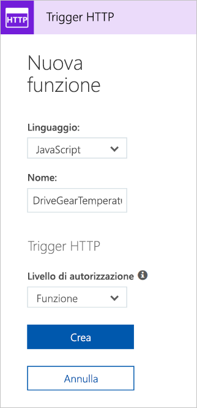

Qui di seguito si proseguirà con l'esempio della trasmissione a ingranaggi aggiungendo la logica per il servizio relativo alla temperatura. In particolare, si riceveranno dati da una richiesta HTTP.

## <a name="function-requirements"></a>Requisiti della funzione

Innanzitutto, definire i requisiti per la logica:

- Le temperature tra 0 e 25 dovranno essere contrassegnate come **OK**.
- Le temperature tra 26 e 50 dovranno essere contrassegnate come **CAUTION**.
- Le temperature oltre 50 dovranno essere contrassegnate come **DANGER**.

## <a name="add-a-function-to-our-function-app"></a>Aggiungere una funzione a un'app per le funzioni

Come descritto nell'unità precedente, Azure offre modelli che consentono di creare funzioni. In questa unità si userà il modello `HttpTrigger` per implementare il servizio relativo alla temperatura.

1. Accedere al [portale di Azure](https://portal.azure.com?azure-portal=true).

1. Selezionare il gruppo di risorse dal primo esercizio scegliendo **tutte le risorse** nel menu a sinistra e quindi selezionando <rgn>[nome gruppo di risorse di tipo Sandbox]</rgn>.

3. Verranno quindi visualizzate le risorse del gruppo. Fare clic sul nome dell'app per le funzioni creata nell'esercizio precedente, selezionando il **responsabile riassegnazione-funzioni-xxxxxxx** elemento (anche indicato da fulmine icona funzione).

  

4. Nel menu a sinistra vengono visualizzati il nome dell'app per le funzioni e un sottomenu contenente tre elementi: *Funzioni*, *Proxy* e *Slot*.  Per iniziare a creare la prima funzione, selezionare **funzioni** e fare clic sui **nuova funzione** nella parte superiore della pagina risultante.

  

5. Nella schermata Avvio rapido selezionare il collegamento **Funzione personalizzata** nella sezione **Iniziare da zero**, come illustrato nello screenshot seguente. Se non viene visualizzata la schermata di avvio rapido, fare clic sui **passare alla Guida introduttiva** collegamento nella parte superiore della pagina.

  

6. Nell'elenco dei modelli visualizzati sullo schermo, selezionare la **JavaScript** implementazione delle **trigger HTTP** modello come illustrato nello screenshot seguente.

7. Immettere **DriveGearTemperatureService** nel campo relativo al nome all'interno della finestra di dialogo **Nuova funzione** visualizzata. Lasciare il livello Autorizzazione impostato su "Funzione" e premere il pulsante **Crea** per creare la funzione.

  

8. Quando la creazione della funzione viene completata, si aprirà l'editor di codice con il contenuto del file di codice *index. js*. Nel frammento di codice seguente viene elencato il codice predefinito che il modello ha generato automaticamente.

```javascript
module.exports = function (context, req) {
    context.log('JavaScript HTTP trigger function processed a request.');

    if (req.query.name || (req.body && req.body.name)) {
        context.res = {
            // status: 200, /* Defaults to 200 */
            body: "Hello " + (req.query.name || req.body.name)
        };
    }
    else {
        context.res = {
            status: 400,
            body: "Please pass a name on the query string or in the request body"
        };
    }
    context.done();
};
```

La funzione prevede il passaggio di un nome tramite la stringa della query di richiesta HTTP o come parte del corpo della richiesta. La funzione risponde restituendo il messaggio **Salve, {nome}** e ripetendo il nome che è stato inviato nella richiesta.

Sul lato destro della visualizzazione del codice sorgente saranno presenti due schede. Il **visualizzare i file** scheda vengono elencati i file di codice e di configurazione per la funzione.  Selezionare **Function. JSON** per visualizzare la configurazione della funzione, che dovrebbe essere simile al seguente:

```javascript
{
    "disabled": false,
    "bindings": [
    {
        "authLevel": "function",
        "type": "httpTrigger",
        "direction": "in",
        "name": "req"
    },
    {
        "type": "http",
        "direction": "out",
        "name": "res"
    }
    ]
}
```

Con questa configurazione si dichiara che la funzione viene eseguita quando riceve una richiesta HTTP. L'associazione di output dichiara che la risposta verrà inviata come risposta HTTP.

## <a name="test-the-function-using-curl"></a>Testare la funzione usando cURL

> [!TIP]
> **cURL** è uno strumento da riga di comando che può essere usato per inviare o ricevere file. È incluso in Linux, macOS e Windows 10 e può essere scaricato per la maggior parte degli altri sistemi operativi. cURL supporta vari protocolli, come HTTP, HTTPS, FTP, FTPS, SFTP, LDAP, TELNET, SMTP, POP3 e così via. Per altre informazioni, consultare i collegamenti seguenti:
>
>- <https://en.wikipedia.org/wiki/CURL>
>- <https://curl.haxx.se/docs/>

Per testare la funzione, è possibile inviare una richiesta HTTP all'URL della funzione usando cURL dalla riga di comando. Per trovare l'URL dell'endpoint della funzione, tornare al codice della funzione e selezionare il collegamento **Recupera URL della funzione**, come illustrato nello screenshot seguente. Salvare temporaneamente questo collegamento.

 

### <a name="securing-http-triggers"></a>Protezione dei trigger HTTP

I trigger HTTP consentono di usare le chiavi API per bloccare i chiamanti sconosciuti, richiedendo che la chiave sia presente in ogni richiesta. Quando si crea una funzione, si seleziona il _livello di autorizzazione_. Per impostazione predefinita, è impostato su "Function", che richiede una chiave API specifica della funzione, ma è possibile impostarla anche su "Admin" per usare una chiave globale "master" o "Anonymous" per indicare che è richiesto alcun codice. Il livello di autorizzazione può essere modificato anche tramite le proprietà di funzione dopo la creazione.

Poiché è stato specificato "Funzione" durante la creazione di questa funzione, è necessario specificare la chiave quando si invia la richiesta HTTP. È possibile inviarla come parametro della stringa di query denominato `code`, oppure come un'intestazione HTTP (scelta consigliata) denominata `x-functions-key`.

Le chiavi di funzione e master sono disponibili nella sezione **Gestisci** quando si espande la funzione. Per impostazione predefinita sono nascoste ed è necessario mostrarle.

1. Espandere la funzione e scegliere il **Gestisci** sezione mostra il valore predefinito di chiave di funzione e copiarlo negli Appunti.


1. Formattare quindi un comando cURL con l'URL per la funzione e la chiave di funzione.

    - Usare una richiesta `POST`.
    - Aggiungere un valore dell'intestazione `Content-Type` del tipo `application/json`.
    - Assicurarsi di sostituire l'URL qui sotto con il proprio.
    - Passare la chiave di funzione come valore dell'intestazione `x-functions-key`.

    ```bash
    curl --header "Content-Type: application/json" --header "x-functions-key: <your-function-key>" --request POST --data "{\"name\": \"Azure Function\"}" https://<your-url-here>/api/DriveGearTemperatureService
    ```

La funzione risponderà con il testo `"Hello Azure Function"`.

## <a name="add-business-logic-to-the-function"></a>Aggiungere la logica di business alla funzione

È ora possibile aggiungere la logica alla funzione che controlla le letture delle temperature ricevute e imposta ogni singolo stato.

La funzione prevede una matrice di letture della temperatura. Il frammento JSON seguente costituisce un esempio di corpo della richiesta che sarà inviata alla funzione. Ogni elemento `reading` possiede un ID, un timestamp e una temperatura.

```json
{
    "readings": [
        {
            "driveGearId": 1,
            "timestamp": 1534263995,
            "temperature": 23
        },
        {
            "driveGearId": 3,
            "timestamp": 1534264048,
            "temperature": 45
        },
        {
            "driveGearId": 18,
            "timestamp": 1534264050,
            "temperature": 55
        }
    ]
}
```

Il codice predefinito della funzione sarà poi sostituito con il codice seguente, che implementa la logica di business.

1. Aprire il file **index.js** e sostituirlo con il codice seguente.

```javascript
module.exports = function (context, req) {
    context.log('Drive Gear Temperature Service triggered');
    if (req.body && req.body.readings) {
        req.body.readings.forEach(function(reading) {

            if(reading.temperature<=25) {
                reading.status = 'OK';
            } else if (reading.temperature<=50) {
                reading.status = 'CAUTION';
            } else {
                reading.status = 'DANGER'
            }
            context.log('Reading is ' + reading.status);
        });

        context.res = {
            // status: 200, /* Defaults to 200 */
            body: {
                "readings": req.body.readings
            }
        };
    }
    else {
        context.res = {
            status: 400,
            body: "Please send an array of readings in the request body"
        };
    }
    context.done();
};
```

La logica che è stata aggiunta è semplice. Vengono eseguiti l'iterazione della matrice delle letture e il controllo del campo relativo alla temperatura. A seconda del valore di tale campo, lo stato viene impostato su **OK**, **CAUTION** o **DANGER**. La matrice delle letture viene quindi restituita dopo aver aggiunto il campo dello stato per ogni voce.

Si notino le istruzioni `log`. Durante l'esecuzione della funzione, le istruzioni aggiungeranno messaggi nella finestra di log.

## <a name="test-our-business-logic"></a>Testare la logica di business

In questo caso si userà il riquadro **Test** nel portale per testare la funzione.

1. Aprire la finestra **Test** dal menu a comparsa a destra.

1. Incollare la richiesta di esempio nella casella di testo del corpo della richiesta.

    ```json
    {
        "readings": [
            {
                "driveGearId": 1,
                "timestamp": 1534263995,
                "temperature": 23
            },
            {
                "driveGearId": 3,
                "timestamp": 1534264048,
                "temperature": 45
            },
            {
                "driveGearId": 18,
                "timestamp": 1534264050,
                "temperature": 55
            }
        ]
    }
    ```

1. Selezionare **Esegui** e visualizzare la risposta nel riquadro di output. Per visualizzare i messaggi di log, aprire la scheda **Log** nel riquadro a comparsa nella parte inferiore della pagina. Lo screenshot seguente illustra un esempio di risposta nel riquadro di output e i messaggi nel riquadro **Log**.


Nel riquadro di output è possibile osservare che il campo relativo allo stato è stato aggiunto correttamente per ogni lettura.

Passare al dashboard **Monitoraggio** per verificare se la richiesta è stata registrata in Application Insights.


