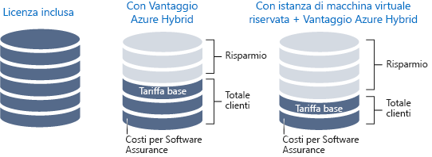
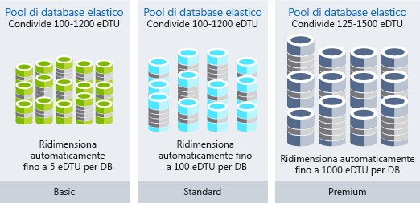

L'utente è un architetto delle soluzioni. L'organizzazione, Lamna Healthcare, ha spostato i carichi di lavoro nel cloud. Di recente, la fattura per queste risorse e questi flussi di lavoro è aumentata più di quanto previsto da Lamna. È stato chiesto di determinare se l'aumento è dovuto a una naturale crescita in termini di efficienza o se il costo può essere ridotto gestendo in modo più efficiente le risorse cloud dell'organizzazione.

#### Ottimizzare l'efficienza della spesa per il cloud

> [!VIDEO https://www.microsoft.com/videoplayer/embed/RWjTgy]

## Come il cloud modifica le spese

Una delle differenze tra il cloud pubblico e l'infrastruttura locale è il metodo di pagamento per i servizi usati. In un data center locale il tempo necessario per l'approvvigionamento hardware è lungo, le dimensioni dell'hardware vengono scelte in modo da garantire la massima capacità e alcuni dei costi, ad esempio quelli per l'alimentazione e lo spazio, possono essere nascosti alla business unit che utilizza le risorse. L'acquisto dell'infrastruttura fisica blocca gli investimenti in asset a lungo termine, impedendo di essere agili con le risorse.

Il passaggio al cloud introduce un modello di costo con pagamento per le risorse usate. Non è più necessario bloccare gli investimenti in asset e, se i requisiti relativi alle risorse cambiano, è possibile reagire aggiungendole, spostandole o rimuovendole. I carichi di lavoro variano tra i servizi e al loro interno, la domanda può essere imprevedibile e i modelli di crescita cambiano nel tempo. Dal momento che si paga solo per le risorse usate nel cloud, la struttura dei costi può adattarsi alle modifiche apportate alle risorse.

L'infrastruttura cloud è in grado di gestire scenari di utilizzo variabile delle risorse. Le risorse con periodi significativi di inattività possono essere arrestate quando non sono in uso e non comportano alcun costo. Le risorse possono crescere parallelamente a un servizio invece di dover attendere il ciclo di approvvigionamento successivo. Altre risorse possono essere aggiunte e rimosse in modo dinamico per rispondere a picchi prevedibili e imprevedibili nella domanda. La figura seguente illustra il motivo per cui l'infrastruttura locale non può gestire tutti questi scenari di utilizzo variabile delle risorse.

In un'architettura efficiente le risorse sottoposte a provisioning soddisfano la domanda di tali risorse. Se l'utilizzo di una macchina virtuale è inferiore al 10% per la maggior parte del tempo, è in atto uno spreco di risorse, a livello sia di calcolo che di costo. Al contrario, una macchina virtuale in esecuzione, che viene utilizzata al 90%, usa la maggior parte delle risorse disponibili e consente un uso efficiente del denaro. L'esecuzione di un sistema fino al 100% di utilizzo comporta il rischio di introdurre problemi di prestazioni. È importante garantire che l'ottimizzazione dell'efficienza non comprometta le prestazioni del sistema. Poiché la domanda raramente è costante, adattare le risorse, quando è possibile soddisfare la domanda, è importante per poter garantire l'efficienza.

## Tener traccia della spesa per il cloud

Per prendere decisioni intelligenti, sono necessari i dati. Osservando la destinazione del denaro, è possibile iniziare a confrontarla con l'utilizzo effettivo per capire dove si sta verificando uno spreco all'interno dell'ambiente.

Un'esportazione dei dati di fatturazione è disponibile in qualsiasi momento. Usando i dati di fatturazione, è possibile risalire alle cause dei costi e stabilire come vengono allocati tra le risorse. Il problema è che i dati di fatturazione indicano il costo, ma non l'utilizzo. I dati indicheranno, ad esempio, che si sta pagando per una VM di grandi dimensioni, ma quanto la si sta effettivamente usando?

Gestione costi di Azure offre informazioni dettagliate non solo sulla destinazione di spesa, ma anche sulle risorse sottoutilizzate. Gestione costi di Azure tiene traccia della spesa totale, del costo del servizio e del costo nel tempo. È possibile eseguire il drill-down di tipi di risorse e istanze. È anche possibile suddividere i costi per organizzazione o centro di costo assegnando alle risorse tag corrispondenti a tali categorie.

Azure Advisor ha anche un componente di costo. Consiglia il ridimensionamento della VM, con l'acquisto di istanze riservate qualora siano più convenienti delle istanze con pagamento al consumo. Identifica i circuiti di ExpressRoute non usati e i gateway di rete virtuale inattivi. Advisor offre suggerimenti aggiuntivi in termini di prestazioni, disponibilità elevata e sicurezza.

L'importante è dedicare tempo a esaminare la spesa e a valutare la destinazione del denaro. Identificare le aree di inefficienza per assicurarsi di operare nel modo più efficiente possibile.

## Organizzare le risorse per l'ottimizzazione

Organizzare le risorse consente di tener traccia dell'andamento di alcuni costi. Esistono modi per raggruppare le risorse, stabilendo una relazione per sapere a che cosa sono correlati i costi. Nell'ambito della fatturazione, le risorse possono essere facilmente raggruppate per:

- Assegnazione delle risorse a sottoscrizioni diverse.
- Assegnazione delle risorse a gruppi di risorse diversi.
- Applicazione di tag alle risorse.

L'uso di sottoscrizioni e gruppi di risorse per organizzare le risorse è un modo semplice per raggruppare logicamente le risorse, utile quando si devono esaminare i dati di fatturazione. I tag sono utili quando le relazioni tra le risorse oltrepassano i limiti delle sottoscrizioni e dei gruppi di risorse. I tag sono coppie chiave-valore che possono essere aggiunte a qualsiasi risorsa e vengono esposte nei dati di fatturazione, consentendo di associare un centro di costo o un reparto alla risorsa. I tag consentono di creare più facilmente report sui costi, oltre ad attribuire a ogni reparto dell'organizzazione la responsabilità dei propri i costi. La figura seguente mostra come applicare lo stesso tag alle risorse in gruppi di risorse diversi e persino in sottoscrizioni diverse.

L'aggiunta di alcune organizzazioni alle risorse può essere molto utile e consente di conoscere l'andamento dei costi. Verranno ora esaminati alcuni modi per ottimizzare i costi.

## Ottimizzazione dei costi IaaS

Per le organizzazioni che usano le macchine virtuali, il costo associato alle macchine virtuali è spesso la voce principale della spesa. I costi di calcolo sono in genere la voce principale, seguita da quella per lo spazio di archiviazione. Dedicare tempo all'ottimizzazione delle risorse con pagamento in base all'uso può avere un notevole impatto sul totale della fattura mensile.

Verranno ora illustrate le procedure consigliate per ridurre i costi di calcolo e di archiviazione.

### Calcolo

Sono disponibili diverse opzioni per realizzare risparmi sui costi delle macchine virtuali.

- Scegliere un'istanza di macchina virtuale di dimensioni inferiori.
- Ridurre il numero di ore di esecuzione di una macchina virtuale.
- Usare gli sconti per i costi di calcolo.

#### Scegliere le dimensioni appropriate per le macchine virtuali

Il corretto ridimensionamento di una macchina virtuale è il processo in cui le dimensioni della macchina virtuale vengono scelte in base alla domanda di risorse richiesta dalla VM. Se una VM in esecuzione è inattiva al 25%, riducendo le dimensioni della VM si ridurranno immediatamente i costi. I costi delle macchine virtuali sono lineari all'interno di una famiglia di istanze. Ogni dimensione maggiore successiva raddoppierà i costi. Al contrario, la riduzione di una VM di una singola dimensione di istanza ridurrà i costi della metà. La figura seguente mostra come è possibile ottenere un risparmio del 50% riducendo la VM di una dimensione all'interno della stessa serie.

Azure Advisor identifica le macchine virtuali sottoutilizzate. Advisor monitora l'utilizzo delle macchine virtuali per 14 giorni, in modo da identificare quelle sottoutilizzate. Le macchine virtuali con un utilizzo della CPU non superiore al 5% e un utilizzo di rete non superiore a 7 MB per almeno quattro giorni sono considerate macchine virtuali sottoutilizzate.

#### Implementare pianificazioni di arresto per le macchine virtuali

Se si hanno carichi di lavoro di VM usati solo periodicamente, ma eseguiti in modo continuo, si sta sprecando denaro. Queste VM possono essere arrestate se non in uso, consentendo di risparmiare costi di calcolo mentre la VM è deallocata. Ad esempio, un ambiente di sviluppo è un candidato ideale perché lo sviluppo è un'attività che, in genere, viene svolta solo durante le ore lavorative.

Sono disponibili diverse opzioni per deallocare una macchina virtuale. Si può usare Automazione di Azure per eseguire le VM solo negli orari necessari per i carichi di lavoro. È possibile usare la funzionalità di arresto automatico in una macchina virtuale per pianificare un arresto automatizzato occasionale. Infine, è possibile arrestare manualmente una macchina virtuale nel portale di Azure. Arrestare sempre le macchine virtuali usando i controlli di Azure perché l'arresto del sistema operativo dall'interno di una macchina virtuale non dealloca le relative risorse di Azure, cosicché si continuerà ad accumulare costi.

#### Applicare gli sconti ai costi di calcolo

Il vantaggio Azure Hybrid consente di ottimizzare ulteriormente i costi sia per Windows Server che per SQL Server, consentendo di usare le licenze di Windows Server o di SQL Server locali con Software Assurance da usare come sconto sul costo di calcolo di queste VM, eliminando i costi per Windows e SQL Server nelle istanze abilitate.

Alcune macchine virtuali devono essere continuamente operative. È il caso di una server farm di applicazioni Web per un carico di lavoro di produzione oppure di un controller di dominio che supporta vari server in una rete virtuale. Se si è certi che tali macchine virtuali verranno eseguite durante il prossimo anno o anche più a lungo, è possibile ottenere ulteriori risparmi sui costi acquistando un'istanza riservata. Si possono acquistare istanze di macchina virtuale riservate di Azure per uno o tre anni di capacità di calcolo, a un prezzo scontato rispetto alle risorse di calcolo con pagamento in base al consumo. Le istanze di macchina virtuale riservate di Azure consentono di ridurre in modo significativo i costi delle macchine virtuali, ovvero fino al 72% rispetto ai prezzi con pagamento in base al consumo, con un impegno anticipato di uno o tre anni. La figura seguente mostra i risparmi ottenuti quando si combina la licenza locale con Vantaggio Azure Hybrid e quando si combina la licenza locale con le istanze riservate di Azure e Vantaggio Azure Hybrid.

### Ottimizzazione dei costi di archiviazione su disco di una macchina virtuale

Per i carichi di lavoro che non richiedono dischi con affidabilità e prestazioni elevate, è possibile usare la risorsa di archiviazione standard a costi ridotti. È possibile scegliere di usare la risorsa di archiviazione standard per gli ambienti di sviluppo e test che non devono necessariamente essere una corrispondenza esatta per un carico di lavoro di produzione.

Assicurarsi che nell'ambiente non rimangano dischi orfani. I dischi non associati a una VM continuano a incorrere nei costi di archiviazione. Se è stata rimossa una VM, ma non i dischi, i dischi orfani potrebbero essere un'opportunità di ridurre i costi di archiviazione.

Come per i dischi orfani, nel caso di snapshot orfani residui, eseguirne la pulizia. Il loro prezzo è inferiore a quello dei dischi in sé, ma è comunque consigliabile eliminare i costi delle risorse non necessarie.

## Ottimizzazione dei costi PaaS

I servizi PaaS hanno in genere costi ottimizzati rispetto ai servizi IaaS, ma è ugualmente possibile identificare gli sprechi e ottimizzare i servizi per ridurre al minimo i costi. Verrà ora illustrato come ridurre i costi di archiviazione BLOB di Azure e del database SQL di Azure.

### Ottimizzazione dei costi del database SQL di Azure

Quando si crea un database SQL di Azure, è necessario selezionare un server SQL di Azure e scegliere un livello di prestazioni. Ogni livello offre un grado di prestazioni nelle unità di transazione di database (DTU) o nelle memorie centrali virtuali (vCore). Per i carichi di database stabili, per ottimizzare è sufficiente selezionare il livello con le dimensioni corrette per le prestazioni necessarie. Ma cosa accade se il database ha burst imprevedibili o picchi di attività? I pool elastici possono ridurre i costi per i carichi di lavoro imprevedibili.

I pool elastici di database SQL offrono una soluzione semplice e conveniente per la gestione e il ridimensionamento di diversi database con esigenze di utilizzo variabili e imprevedibili. I database in un pool elastico si trovano in un server di database SQL di Azure singolo e condividono un determinato numero di risorse a un prezzo specifico. I pool sono adatti per un numero elevato di database con modelli di utilizzo specifici. Per un determinato database, questo modello è caratterizzato da un utilizzo medio ridotto con picchi di utilizzo relativamente poco frequenti.
Più database è possibile aggiungere a un pool, maggiori diventano i risparmi. La figura seguente illustra le capacità dei tre tipi di pool di database elastici, ovvero Basic, Standard e Premium.  Il tipo Basic consente di usufruire della scalabilità automatica fino a 5 eDTU per database, con quello Standard fino a 100 eDTU per database e infine con quello Premium fino a 1000 eDTU per database.

I pool elastici sono un ottimo modo per distribuire i costi tra più database e possono avere un impatto significativo sulla riduzione dei costi del database SQL di Azure.

### Ottimizzazione dei costi di archiviazione BLOB

L'archivio BLOB è un modo economico per archiviare i dati, ma man mano che aumenta la quantità di dati, è possibile ridurre il totale della fattura ottimizzando la modalità di archiviazione dei dati.

Si userà di nuovo l'esempio di Lamna Healthcare. È presente un'applicazione di diagnostica per immagini che archivia le immagini nell'archivio BLOB. A causa della quantità e delle dimensioni delle immagini, lo spazio di archiviazione finisce per essere un costo significativo per l'applicazione. Quando viene acquisita un'immagine per un paziente, è probabile che durante la prima settimana tale immagine venga visualizzata diverse volte e che quindi le prestazioni previste per la funzionalità di recupero di immagini debbano essere elevate. Un'immagine ottenuta due anni fa verrà invece aperta raramente e le prestazioni di recupero previste sono inferiori. È possibile usare il livello di archiviazione per ottimizzare i costi del recupero di immagini, considerata la riduzione delle prestazioni richieste man mano che l'immagine diventa obsoleta.

Per gli oggetti BLOB in Azure sono disponibili tre livelli di archiviazione. Il livello di archiviazione ad accesso frequente di Azure è ottimizzato per l'archiviazione di dati a cui si accede di frequente. Il livello di archiviazione ad accesso sporadico di Azure è ottimizzato per l'archiviazione di dati a cui si accede poco frequentemente e che vengono archiviati per almeno 30 giorni. Il livello di archiviazione archivio di Azure è ottimizzato per l'archiviazione dei dati a cui si accede raramente e che rimangono archiviati per almeno 180 giorni con requisiti di latenza flessibili.

- **Livello di accesso frequente**: costi di archiviazione massimi, ma costi di accesso minimi.
- **Livello di accesso sporadico**: costi di archiviazione più bassi e costi di accesso più alti rispetto all'archiviazione ad accesso frequente. Questo livello è destinato ai dati che rimangono nel livello ad accesso sporadico per almeno 30 giorni.
- **Livello di accesso archivio**: costo di archiviazione più basso e costi di recupero dati più alti rispetto all'archiviazione ad accesso sporadico e ad accesso frequente. Questo livello è destinato ai dati che possono tollerare alcune ore di latenza di recupero e rimarranno nel livello archivio per almeno 180 giorni.

Per Lamna Healthcare, è utile mantenere le immagini nuove nel livello accesso frequente per un mese, in modo che la visualizzazione delle immagini più recenti sia il più veloce possibile. Si possono quindi spostare le immagini più vecchie di un anno al livello archivio perché è probabile che queste immagini non verranno recuperate. Si ridurrebbero così i costi associati all'archiviazione di queste immagini.

### Adottare modelli di prezzi a consumo

Il passaggio ai servizi PaaS può anche far evolvere il modello con pagamento a consumo in un vero modello di prezzi al consumo. Per i servizi come Funzioni di Azure c'è la possibilità di usare _piani di consumo_. Quando si usa un piano a consumo, le istanze dell'host di Funzioni di Azure vengono aggiunte e rimosse in modo dinamico in base al numero di eventi in ingresso. Questo piano senza server offre la scalabilità automatica e sono previsti costi per le risorse di calcolo solo quando le funzioni sono in esecuzione. In un piano A consumo, il timeout dell'esecuzione di una funzione si verifica dopo un periodo di tempo configurabile.

La fatturazione si basa sul numero di esecuzioni, il tempo di esecuzione e la memoria usata. La fatturazione viene aggregata tra tutte le funzioni all'interno di un'app per le funzioni.

Il passaggio a servizi che usano un modello di prezzi a consumo può introdurre nell'architettura un nuovo approccio ai risparmi.

## Ottimizzazione dei costi in Lamna Healthcare

Lamna Healthcare sta facendo progressi nella riduzione dei costi. È stata organizzata una verifica mensile dei costi e ogni reparto ha accesso a Gestione costi di Azure, in cui è possibile controllare i costi di tutto il mese. Sono stati identificati alcuni ambiti in cui si possono usare le istanze riservate e ne sono state acquistate diverse per sfruttare i vantaggi di questo sconto. Sono stati implementati processi automatizzati per arrestare gli ambienti di sviluppo negli orari di minore attività, evitando costi aggiuntivi durante le ore in cui queste risorse non vengono usate. 

Con l'ottimizzazione dell'archivio BLOB per l'archiviazione di immagini, è stato possibile ridurre considerevolmente i costi rispetto ai due mesi precedenti.

## Riepilogo

Per ottimizzare i costi dell'infrastruttura cloud, è necessario tener traccia delle spese e assicurarsi che l'utilizzo delle risorse corrisponda alle domande dei carichi di lavoro. Usando il livello di prestazioni e qualità appropriato per le risorse, è possibile ottimizzare ulteriormente i costi del cloud.