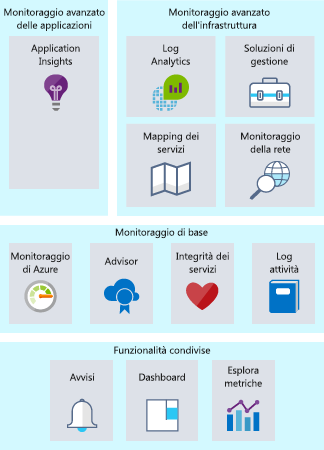
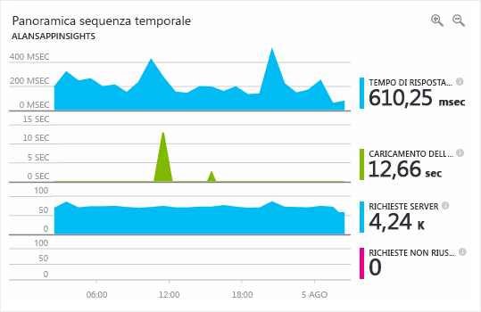

Il monitoraggio è l'azione di raccolta e analisi dei dati per determinare le prestazioni, l'integrità e la disponibilità dell'applicazione aziendale e delle risorse da cui dipende.Monitoring is the act of collecting and analyzing data to determine the performance, health, and availability of your business application and the resources that it depends on. Cosa accadrebbe se si gestisse un team operativo responsabile delle risorse in esecuzione in Azure?What if you ran an operations team responsible for resources running on Azure? Cosa fare per assicurarsi di avere visibilità sull'integrità dei sistemi?What would you do to ensure you had visibility into the health of your systems? Se succede qualcosa, chi se ne accorge per primo, il team o gli utenti finali?If something happens, who finds out first, your team or your end users? Un'efficace strategia di monitoraggio permette di concentrarsi sull'integrità dell'applicazione.An effective monitoring strategy helps you focus on the health of your application. Contribuisce anche ad aumentare il tempo di attività tramite notifiche proattive sugli aspetti critici, per poterli risolvere prima che diventino effettivi problemi.It also helps you increase your uptime by proactively notifying you of critical issues, so that you can resolve them before they become problems. 

Quando si tratta di monitoraggio e analisi in Azure, è possibile aggregare i servizi in tre aree di interesse specifiche: monitoraggio avanzato delle applicazioni, monitoraggio avanzato dell'infrastruttura e monitoraggio di base.When it comes to monitoring and analytics on Azure, we can bundle services into three specific areas of focus: deep application monitoring, deep infrastructure monitoring, and core monitoring. In questa unità verrà esaminata ognuna di queste aggregazioni e verrà illustrato come i servizi di Azure abilitano queste funzionalità per l'architettura.In this unit, we'll take a look through each of these bundles and how Azure services enable these capabilities for your architecture. Anche se questi servizi sono stati raggruppati, esistono diversi punti di integrazione tra di essi, che consentono la condivisione di importanti punti dati di monitoraggio.Even though we've grouped these services together, there are several integration points between them, allowing for sharing of important monitoring data points between them. La figura seguente visualizza i servizi di monitoraggio disponibili assemblati in gruppi logici.The following illustration shows the available monitoring services assembled into logical groups.

## Monitoraggio di baseCore monitoring

Il monitoraggio di base offre il monitoraggio essenziale e necessario delle diverse risorse di Azure.Core monitoring provides fundamental, required monitoring across Azure resources. Per monitoraggio essenziale si intende il monitoraggio delle operazioni eseguite sulle risorse a livello di piattaforma Azure.When we talk about fundamental monitoring, you can think of this as monitoring what is happening with your resources at the Azure platform level. Questa area di interesse fornisce informazioni approfondite, ad esempio, sull'integrità della piattaforma Azure, sulle modifiche apportate alle risorse e sulle metriche delle prestazioni.This area of focus gives you insight into things like the health of the Azure platform, insight into changes being made to your resources, and performance metrics. L'uso dei servizi da quest'area permette di monitorare i componenti di base necessari per mantenere in esecuzione l'applicazione.Using services from this area gives you the ability to monitor the basic pieces you need to keep your application running.

Azure offre servizi che consentono di visualizzare quattro aree chiave di monitoraggio di base: registrazione delle attività, integrità dei servizi, metriche e diagnostica e suggerimenti sulle procedure consigliate.Azure provides services to give you visibility into four key core monitoring areas: activity logging, the health of services, metrics and diagnostics, and recommendations on best practices. Questi servizi sono incorporati in Azure e, per abilitarli e impostarli, sono sufficienti pochissime operazioni di configurazione.These services are built in to Azure and take little to no configuration to enable and set up. Ecco informazioni più approfondite.Let's take a closer look.

### Registrazione delle attivitàActivity logging

La registrazione delle attività è estremamente importante per ottenere informazioni su che cosa avviene relativamente alle risorse a livello di piattaforma Azure.Activity logging is incredibly important to get information on what is happening with your resources at the Azure platform level. Ogni modifica inviata alla piattaforma Azure viene registrata nel log attività di Azure, permettendo di tenere traccia di qualsiasi azione eseguita sulle risorse.Every change submitted to the Azure platform is logged to the Azure Activity Log, giving you the ability to trace any action taken on your resources. Il log attività contiene informazioni dettagliate sulle attività, che consentono di rispondere a domande come:Activity Log will contain detailed information on activities to help you answer questions like:

- Chi ha collegato un disco a questa macchina virtuale?Who has attached a disk to this virtual machine?
- Quando è stato arrestato questo computer?When was this machine shut down?
- Chi ha modificato la configurazione del servizio di bilanciamento del carico?Who changed the load balancer configuration?
- Perché l'operazione di scalabilità automatica sul set di scalabilità di macchine virtuali non è riuscita?Why did the autoscale operation on my virtual machine scale set fail?

L'uso del log attività per rispondere a questi tipi di domande consentirà di risolvere problemi, tener traccia delle modifiche e fornire il controllo della situazione dell'ambiente di Azure.Using Activity Log to answer these types of questions will help you troubleshoot issues, track changes, and provide auditing of what's happening in your Azure environment. I dati del log attività vengono conservati solo per 90 giorni e possono essere salvati in un account di archiviazione o inviati ad Azure Log Analytics per conservarli più lungo e analizzarli ulteriormente.Activity Log data is only retained for 90 days and can be archived to a storage account or sent to Azure Log Analytics for longer retention and further analysis.

### Integrità dei servizi cloudHealth of cloud services

A un certo punto, qualsiasi sistema può avere problemi e così anche i servizi di Azure.At some point, any system can have issues, and that's true for Azure services as well. Rimanere informati sull'integrità dei servizi di Azure consentirà di sapere se e quando un problema che influisce su un servizio di Azure sta influendo anche sull'ambiente.Staying informed of the health of Azure services will help you understand if and when an issue impacting an Azure service is impacting your environment. Quello che potrebbe sembrare un problema circoscritto potrebbe essere il risultato di un problema più ampio e Integrità dei servizi di Azure fornisce queste informazioni.What may seem like a localized issue could be the result of a more widespread issue, and Azure Service Health provides this insight. Integrità dei servizi di Azure identifica eventuali problematiche relative ai servizi di Azure che possono influire negativamente sull'applicazione.Azure Service Health identifies any issues with Azure services that might affect your application. Integrità dei servizi permette anche di definire una manutenzione pianificata.Service Health also helps you plan for scheduled maintenance.

### Metriche e diagnosticaMetrics and diagnostics

Per i problemi più circoscritti, è importante avere visibilità sulla situazione del sistema o dell'istanza del servizio.For issues that are more localized in nature, it's important to have visibility into what is happening on your system or service instance. La possibilità di visualizzare le metriche e le informazioni di diagnostica è fondamentale per la risoluzione dei problemi di prestazioni e per ricevere notifiche quando si verificano problemi.The ability to view metrics and diagnostic information is critical to troubleshoot performance issues and stay notified when something goes wrong. Per fornire tale visibilità, i servizi di Azure hanno un modo comune di visualizzare l'integrità, le metriche o le informazioni di diagnostica.To provide this visibility, Azure services have a common way of showing health, metric, or diagnostic information. Monitoraggio di Azure permette il monitoraggio di base per i servizi di Azure consentendo la raccolta, l'aggregazione e la visualizzazione di metriche, log attività e log di diagnostica.Azure Monitor enables core monitoring for Azure services by allowing the collection, aggregation, and visualization of metrics, activity logs, and diagnostic logs.

Sono disponibili metriche che forniscono statistiche sulle prestazioni per diverse risorse, nonché per il sistema operativo all'interno di una macchina virtuale.Metrics are available that provide performance statistics for different resources and even the operating system inside a virtual machine. È possibile visualizzare questi dati con una delle utilità di esplorazione disponibili nel portale di Azure e creare avvisi basati su queste metriche.You can view this data with one of the explorers in the Azure portal and create alerts based on these metrics. Monitoraggio di Azure fornisce la più veloce pipeline di metriche (da 5 minuti a 1 minuto), che è necessario usare per gestire notifiche e avvisi con particolari requisiti di tempo.Azure Monitor provides the fastest metrics pipeline (5 minutes down to 1 minute), so you should use it for time-critical alerts and notifications.

### Suggerimenti sulle procedure consigliateRecommendations on best practices

Quando si pensa al monitoraggio, generalmente si pensa all'integrità corrente di una risorsa.When we think of monitoring, we typically think of the current health of a resource. Anche quando una risorsa è integra, è tuttavia possibile apportare modifiche che possono garantire maggiore disponibilità, riduzione dei costi o miglioramento della sicurezza.But even when a resource is healthy, there could be adjustments that would result in greater availability, reduced cost, or improved security. Azure Advisor consente di tenere sotto controllo potenziali problemi relativi a prestazioni, costi, disponibilità elevata o sicurezza all'interno delle risorse.Azure Advisor can help by keeping an eye out for potential performance, cost, high availability, or security issues within your resources. Advisor crea suggerimenti personalizzati in base alla configurazione delle risorse e ai dati di telemetria, fornendo indicazioni non disponibili nella maggior parte delle piattaforme di monitoraggio tradizionali.Advisor makes personalized recommendations based on resource configuration and telemetry, providing guidance that most traditional monitoring platforms don't provide.

## Monitoraggio avanzato dell'infrastrutturaDeep infrastructure monitoring

I componenti di monitoraggio descritti finora sono ideali per fornire informazioni approfondite, ma offrono visibilità solo sull'infrastruttura di Azure.While the monitoring components we've covered thus far are great at offering insights, they only give visibility to the Azure platform. Per carichi di lavoro IaaS tipici, è possibile raccogliere più metriche e informazioni di diagnostica dalla rete o dagli effettivi sistemi operativi.For typical IaaS workloads, there's more metrics and diagnostic information to gather from the network or the actual operating systems. Il pull delle informazioni dettagliate da SQL Server per verificare che sia configurato correttamente, l'analisi dello spazio disponibile su disco in tutti i server dell'ambiente o la visualizzazione delle dipendenze di rete tra i sistemi e i servizi sono esempi in cui Log Analytics può offrire informazioni approfondite.Pulling information from SQL Server to ensure it's properly configured, analyzing free disk space across all the servers in your environment, or visualizing the network dependencies between your systems and services are all examples where Log Analytics can provide deep insights.

Quando si progetta una strategia di monitoraggio, è importante includere ogni componente nella catena di applicazioni, per poter correlare gli eventi nei servizi e nelle risorse.When designing a monitoring strategy, it's important to include every component in the application chain, so you can correlate events across services and resources. I servizi che supportano Monitoraggio di Azure sono facilmente configurabili per l'invio dei dati a un'area di lavoro di Log Analytics.For services that support Azure Monitor, they can be easily configured to send their data to a Log Analytics workspace. Le macchine virtuali (sia nel cloud che locali) possono avere un agente installato per inviare i dati a Log Analytics.Virtual machines (both in the cloud and on-premises) can have an agent installed to send data to Log Analytics. È possibile inviare dati personalizzati a Log Analytics tramite l'API Log Analytics.You can submit custom data to Log Analytics through the Log Analytics API. La figura seguente visualizza il ruolo di Log Analytics come hub centrale per il monitoraggio dei dati.The following illustration shows how Log Analytics acts as a central hub for monitoring data. Log Analytics riceve i dati di monitoraggio dalle risorse di Azure e li rende disponibile ai consumer per l'analisi o la visualizzazione.Log Analytics receives monitoring data from your Azure resources and makes it available to consumers for analysis or visualization.

Con questi dati in Log Analytics, è possibile eseguire query sui dati non elaborati con scopi di risoluzione dei problemi, identificazione della causa radice e controllo.With this data in Log Analytics, you can query the raw data for troubleshooting, root cause identification, and auditing purposes. Per diversi servizi noti (SQL Server, Windows Server Active Directory), sono disponibili soluzioni di gestione che visualizzano i dati di monitoraggio e individuano la conformità alle procedure consigliate.For several known services (SQL Server, Windows Server Active Directory), there are management solutions readily available that visualize monitoring data and uncover compliance with best practices.

Log Analytics consente di creare query e di interagire con altri sistemi in base a tali query.Log Analytics allows you to create queries and interact with other systems based on those queries. L'esempio più comune sono gli avvisi.The most common example is an alert. Può essere opportuno ricevere un messaggio di posta elettronica quando un sistema esaurisce lo spazio su disco o una procedura consigliata in SQL Server non viene più seguita.Maybe you want to receive an email when a system runs out of disk space or a best practice on SQL Server is no longer followed. Log Analytics può inviare avvisi, avviare l'automazione e anche connettersi alle API personalizzate, ad esempio per l'integrazione con Gestione dei servizi IT.Log Analytics can send alerts, kick off automation, and even hook into custom APIs for things like integration with IT service management (ITSM).

## Monitoraggio avanzato delle applicazioniDeep application monitoring

È importante conoscere le prestazioni dell'infrastruttura e dei servizi di base, ma è possibile sfruttare ulteriormente le funzionalità di monitoraggio esaminando in dettaglio le applicazioni per identificare problemi di prestazioni, tendenze di utilizzo e disponibilità complessiva dei servizi che si sviluppano e da cui si dipende.It's important to understand how core services and infrastructure are performing, but you can take your monitoring capabilities even further by looking deep into your applications to identify performance issues, usage trends, and overall availability of services you develop and depend on. Usando uno strumento di gestione delle prestazioni delle applicazioni, è possibile rilevare e diagnosticare meglio i problemi che si verificano nelle app Web e nei servizi.By using an application performance management tool, you can better detect and diagnose issues that occur within your web apps and services.

Azure Application Insights è lo strumento ideale.Azure Application Insights allows you to do exactly that. Application Insights offre funzionalità di visualizzazione, query e raccolta di dati di telemetria.Application Insights provides telemetry collection, query, and visualization capabilities. Sono necessarie solo pochissime modifiche al codice.Little to no code changes are required. È sufficiente installare un pacchetto di strumentazione di piccole dimensioni nell'applicazione.You only have to install a small instrumentation package into your application. Application Insights è un servizio multipiattaforma che supporta .NET, Node.js o Java.Application Insights is cross platform, supporting .NET, Node.js, or Java.

Ad esempio, il tempo di risposta dell'applicazione può essere un problema complesso da risolvere.For instance, the response time of the application might be complex to troubleshoot. Il server Web è sovraccarico?Is it the web server being overloaded? Si tratta di una query SQL specifica non ottimizzata?Is it a specific SQL query that's not optimized? Le prestazioni dell'API chiamata sono più lente del solito?Is the API that you're calling performing slower than usual? Le soluzioni di monitoraggio delle prestazioni dell'applicazione sono utili per rilevare i problemi effettivi che il semplice monitoraggio delle metriche non riesce a evidenziare.Application performance monitoring solutions can help uncover the actual issues that basic metric monitoring can't expose. Lo screenshot seguente include una rappresentazione grafica dei dettagli delle prestazioni di un'applicazione resi disponibili da Azure Application Insights.The following screenshot shows a graphical display of an application’s performance details provided by Azure Application Insights.

Qualsiasi strategia di monitoraggio dovrebbe includere una soluzione di monitoraggio delle prestazioni dell'applicazione, che potendo monitorare uso, prestazioni e disponibilità consente di rispondere agli errori molto più velocemente.An application performance monitoring solution will help you monitor usage, performance, and availability, allowing you to respond to failure much faster, and should be included in any monitoring strategy.

## Monitoraggio in Lamna HealthcareMonitoring at Lamna Healthcare

Lamna Healthcare ha rinnovato la propria strategia di monitoraggio dopo aver spostato le risorse nel cloud.Lamna Healthcare has been revamping their monitoring strategy since moving their resources to the cloud. Usano Monitoraggio per la risoluzione dei problemi e la creazione di avvisi quando i problemi di prestazioni possono influire sulle risorse.They're using Monitor for troubleshooting and alerting when performance issues may be impacting their resources. Hanno configurato l'invio di notifiche sull'integrità dei servizi in modo che il team operativo possa intervenire immediatamente.They have notifications configured to send any service health notifications to their operations team for immediate engagement. Hanno predisposto un processo per esaminare periodicamente Advisor e verificare che i suggerimenti vengano implementati nell'ambiente, se applicabili.They have a process in place to regularly review Advisor to ensure the recommendations are implemented into their environment where applicable. 

Inviano i dati dei log da tutte le risorse di Azure e locali a un'area di lavoro di Log Analytics, per poter cercare nelle origini dei log la correlazione tra gli eventi, e usano le soluzioni di gestione per Windows Server Active Directory e SQL Server.They send log data from all Azure and on-premises resources to a Log Analytics workspace, so they have the ability to search across log sources for event correlation and are using management solutions for Windows Server Active Directory and SQL Server.

Il team di sviluppo ha iniziato a integrare Application Insights nelle applicazioni e ha già individuato due difetti, in precedenza non rilevati, che stavano compromettendo le prestazioni.Their development team has started integrating Application Insights into their applications, and they've already uncovered two defects that were impacting performance that had previously gone undetected.

## RiepilogoSummary

Una valida strategia di monitoraggio analizza più livelli di un'architettura, dall'infrastruttura di supporto ai dati di telemetria completi dell'applicazione.A good monitoring strategy looks across multiple layers of an architecture, from supporting infrastructure to deep application telemetry. Aiuterà a comprendere il funzionamento dettagliato dei diversi componenti dell'applicazione.It will help you understand the detailed operation of the different components of your application. Aumenta il tempo di attività inviando in modo proattivo notifiche sui problemi critici, in modo che sia possibile risolverli prima che diventino gravi e consente di correlare i log e i dati di telemetria tra i sistemi per individuare i problemi.It increases your uptime by proactively notifying you of critical issues, so that you can resolve them before they become problems, and allows you to correlate logs and telemetry across systems to uncover issues. È stata esaminata una serie di servizi di Azure che è possibile sfruttare nella strategia di monitoraggio.We've taken a look at a number of services on Azure that you can leverage in your monitoring strategy.