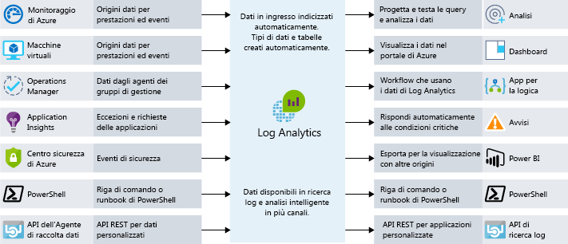

Il monitoraggio è l'azione di raccolta e analisi dei dati per determinare le prestazioni, l'integrità e la disponibilità dell'applicazione aziendale e delle risorse da cui dipende. Cosa accadrebbe se si gestisse un team operativo responsabile delle risorse in esecuzione in Azure? Cosa fare per assicurarsi di avere visibilità sull'integrità dei sistemi? Se succede qualcosa, chi se ne accorge per primo, il team o gli utenti finali? Un'efficace strategia di monitoraggio permette di concentrarsi sull'integrità dell'applicazione. Contribuisce anche ad aumentare il tempo di attività tramite notifiche proattive sugli aspetti critici, per poterli risolvere prima che diventino effettivi problemi. 

Quando si tratta di monitoraggio e analisi in Azure, è possibile aggregare i servizi in tre aree di interesse specifiche: monitoraggio avanzato delle applicazioni, monitoraggio avanzato dell'infrastruttura e monitoraggio di base. In questa unità verrà esaminata ognuna di queste aggregazioni e verrà illustrato come i servizi di Azure abilitano queste funzionalità per l'architettura. Anche se questi servizi sono stati raggruppati, esistono diversi punti di integrazione tra di essi, che consentono la condivisione di importanti punti dati di monitoraggio. La figura seguente visualizza i servizi di monitoraggio disponibili assemblati in gruppi logici.

## Monitoraggio di base

Il monitoraggio di base offre il monitoraggio essenziale delle diverse risorse di Azure. Per monitoraggio essenziale si intende il monitoraggio delle operazioni eseguite sulle risorse a livello di infrastruttura di Azure. Quest'area di interesse fornisce informazioni approfondite, ad esempio, sull'integrità della piattaforma Azure e sulle modifiche apportate alle risorse e le metriche delle prestazioni. L'uso dei servizi da quest'area permette di monitorare i componenti di base necessari per mantenere in esecuzione l'applicazione.

Azure offre servizi che consentono di visualizzare quattro aree chiave di monitoraggio di base: registrazione delle attività, integrità dei servizi, metriche e diagnostica e suggerimenti sulle procedure consigliate. Questi servizi sono incorporati in Azure e, per abilitarli e impostarli, sono sufficienti pochissime operazioni di configurazione. Ecco informazioni più approfondite.

### Registrazione delle attività

La registrazione delle attività è molto importante per avere un quadro della situazione delle risorse a livello di infrastruttura di Azure. Ogni modifica inviata alla piattaforma Azure viene registrata nel log attività di Azure, offrendo la possibilità di tracciare qualsiasi azione eseguita sulle risorse. Il log attività contiene informazioni dettagliate sulle attività, che consentono di rispondere a domande come:

- Chi ha collegato un disco a questa macchina virtuale?
- Quando è stato arrestato questo computer?
- Chi ha modificato la configurazione del servizio di bilanciamento del carico?
- Perché l'operazione di scalabilità automatica sul set di scalabilità di macchine virtuali non è riuscita?

L'uso del log attività per rispondere a questi tipi di domande consentirà di risolvere problemi, tener traccia delle modifiche e fornire il controllo della situazione dell'ambiente di Azure. I dati del log attività vengono conservati solo per 90 giorni e possono essere salvati in un account di archiviazione o inviati ad Azure Log Analytics per conservarli più lungo e analizzarli ulteriormente.

### Integrità dei servizi cloud

A un certo punto, qualsiasi sistema può avere problemi e così anche i servizi di Azure. Rimanere informati sull'integrità dei servizi di Azure consentirà di sapere se e quando un problema che influisce su un servizio di Azure sta influendo anche sull'ambiente. Quello che potrebbe sembrare un problema circoscritto potrebbe essere il risultato di un problema più ampio e Integrità dei servizi di Azure fornisce queste informazioni. Integrità dei servizi di Azure identifica eventuali problematiche relative ai servizi di Azure che possono influire negativamente sull'applicazione. Integrità dei servizi permette anche di definire una manutenzione pianificata.

### Metriche e diagnostica

Per i problemi più circoscritti, è importante avere visibilità sulla situazione del sistema o dell'istanza del servizio. La possibilità di visualizzare le metriche e le informazioni di diagnostica è fondamentale per la risoluzione dei problemi di prestazioni e per ricevere notifiche quando si verificano problemi. Per fornire tale visibilità, i servizi di Azure hanno un modo comune di visualizzare l'integrità, le metriche o le informazioni di diagnostica. Monitoraggio di Azure permette il monitoraggio di base per i servizi di Azure consentendo la raccolta, l'aggregazione e la visualizzazione di metriche, log attività e log di diagnostica.

Sono disponibili metriche che forniscono statistiche sulle prestazioni per diverse risorse, nonché per il sistema operativo all'interno di una macchina virtuale. È possibile visualizzare questi dati con una delle utilità di esplorazione disponibili nel portale di Azure e creare avvisi basati su queste metriche. Monitoraggio di Azure fornisce la più veloce pipeline di metriche (da 5 minuti a 1 minuto), che è necessario usare per gestire notifiche e avvisi con particolari requisiti di tempo.

### Suggerimenti sulle procedure consigliate

Quando si pensa al monitoraggio, generalmente si pensa all'integrità corrente di una risorsa. Anche quando una risorsa è integra, è tuttavia possibile apportare modifiche che possono garantire maggiore disponibilità, riduzione dei costi o miglioramento della sicurezza. Azure Advisor consente di tenere sotto controllo potenziali problemi relativi a prestazioni, costi, disponibilità elevata o sicurezza all'interno delle risorse. Advisor crea suggerimenti personalizzati in base alla configurazione delle risorse e ai dati di telemetria, fornendo indicazioni non disponibili nella maggior parte delle piattaforme di monitoraggio tradizionali.

## Monitoraggio avanzato dell'infrastruttura

I componenti di monitoraggio illustrati finora sono ideali per fornire informazioni approfondite, ma offrono visibilità solo sull'infrastruttura di Azure. Per carichi di lavoro IaaS tipici, sono disponibili più metriche e informazioni di diagnostica che è possibile raccogliere dalla rete o dai sistemi operativi effettivi. Il pull delle informazioni dettagliate da SQL Server per verificare che sia configurato correttamente, l'analisi dello spazio disponibile su disco in tutti i server dell'ambiente o la visualizzazione delle dipendenze di rete tra i sistemi e i servizi sono esempi in cui Log Analytics può offrire informazioni approfondite.

Quando si progetta una strategia di monitoraggio, è importante includere ogni componente nella catena di applicazioni, per poter correlare gli eventi nei servizi e nelle risorse. I servizi che supportano Monitoraggio di Azure sono facilmente configurabili per l'invio dei dati a un'area di lavoro di Log Analytics. Le macchine virtuali (sia nel cloud che locali) possono avere un agente installato per inviare i dati a Log Analytics. È possibile inviare dati personalizzati a Log Analytics tramite l'API Log Analytics. La figura seguente visualizza il ruolo di Log Analytics come hub centrale per il monitoraggio dei dati. Log Analytics riceve i dati di monitoraggio dalle risorse di Azure e li rende disponibile ai consumer per l'analisi o la visualizzazione.

Con questi dati in Log Analytics, è possibile eseguire query sui dati non elaborati con scopi di risoluzione dei problemi, identificazione della causa radice e controllo. Per i servizi noti diversi (SQL Server, Windows Server Active Directory), sono disponibili soluzioni di gestione immediatamente disponibili che visualizza i dati di monitoraggio e identifica la conformità alle procedure consigliate.

Log Analytics consente di creare query e di interagire con altri sistemi in base a tali query. L'esempio più comune sono gli avvisi. Può essere opportuno ricevere un messaggio di posta elettronica quando un sistema esaurisce lo spazio su disco o una procedura consigliata in SQL Server non viene più seguita. Log Analytics può inviare avvisi, avviare l'automazione e anche connettersi alle API personalizzate, ad esempio per l'integrazione con Gestione dei servizi IT.

## Monitoraggio avanzato delle applicazioni

È importante conoscere le prestazioni dell'infrastruttura e dei servizi di base, ma è possibile sfruttare ulteriormente le funzionalità di monitoraggio esaminando in dettaglio le applicazioni per identificare problemi di prestazioni, tendenze di utilizzo e disponibilità complessiva dei servizi che si sviluppano e da cui si dipende. Usando uno strumento di gestione delle prestazioni delle applicazioni, è possibile rilevare e diagnosticare meglio i problemi che si verificano nelle app Web e nei servizi.

Azure Application Insights è lo strumento ideale. Application Insights offre funzionalità di visualizzazione, query e raccolta di dati di telemetria. Sono necessarie solo pochissime modifiche al codice. È sufficiente installare un pacchetto di strumentazione di piccole dimensioni nell'applicazione. Application Insights è multipiattaforma e supporta .NET, Node.js o Java.

Può essere complesso risolvere i problemi anche di una funzionalità semplice come il tempo di risposta dell'applicazione. Il server Web è sovraccarico? Si tratta di una query SQL specifica non ottimizzata? Le prestazioni dell'API chiamata sono più lente del solito? Le soluzioni di monitoraggio delle prestazioni dell'applicazione sono utili per rilevare i problemi effettivi che il semplice monitoraggio delle metriche non riesce a evidenziare. Lo screenshot seguente include una rappresentazione grafica dei dettagli delle prestazioni di un'applicazione resi disponibili da Azure Application Insights.

Qualsiasi strategia di monitoraggio dovrebbe includere una soluzione di monitoraggio delle prestazioni dell'applicazione, che potendo monitorare uso, prestazioni e disponibilità consente di rispondere agli errori molto più velocemente.

## Monitoraggio in Lamna Healthcare

Lamna Healthcare ha rinnovato la propria strategia di monitoraggio dopo aver spostato le risorse nel cloud. Usano Monitoraggio per la risoluzione dei problemi e la creazione di avvisi quando i problemi di prestazioni possono influire sulle risorse. Hanno configurato l'invio di notifiche sull'integrità dei servizi in modo che il team operativo possa intervenire immediatamente. Hanno predisposto un processo per esaminare periodicamente Advisor e verificare che i suggerimenti vengano implementati nell'ambiente, se applicabili. 

Inviano i dati di log da tutte le risorse di Azure e da sito locale a un'area di lavoro di Log Analitica, in modo che hanno la possibilità di eseguire ricerche nelle origini dei log per la correlazione di eventi e Usa le soluzioni di gestione per Windows Server Active Directory e SQL Server.

Il team di sviluppo ha iniziato a integrare Application Insights nelle applicazioni e ha già individuato due difetti, in precedenza non rilevati, che stavano compromettendo le prestazioni.

## Riepilogo

Una valida strategia di monitoraggio analizza più livelli di un'architettura, dall'infrastruttura di supporto ai dati di telemetria completi dell'applicazione. Aiuterà a comprendere il funzionamento dettagliato dei diversi componenti dell'applicazione. Aumenta il tempo di attività inviando in modo proattivo notifiche sui problemi critici, in modo che sia possibile risolverli prima che diventino gravi e consente di correlare i log e i dati di telemetria tra i sistemi per individuare i problemi. È stata esaminata una serie di servizi di Azure che è possibile sfruttare nella strategia di monitoraggio.