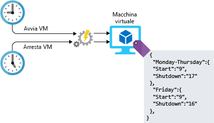

<span data-ttu-id="73f29-101">La gestione dell'infrastruttura di qualsiasi tipo di carico di lavoro comporta attività di configurazione.</span><span class="sxs-lookup"><span data-stu-id="73f29-101">Managing the infrastructure of any type of workload involves configuration tasks.</span></span> <span data-ttu-id="73f29-102">Questa configurazione può essere eseguita manualmente, ma i passaggi manuali possono richiedere molto personale ed essere soggetti a errori e inefficienti.</span><span class="sxs-lookup"><span data-stu-id="73f29-102">This configuration can be done manually, but manual steps can be labor-intensive, error prone, and inefficient.</span></span> <span data-ttu-id="73f29-103">E se si venisse assegnati alla gestione di un progetto che ha richiesto la distribuzione di centinaia di sistemi in Azure?</span><span class="sxs-lookup"><span data-stu-id="73f29-103">What if you are assigned to lead a project that required the deployment of hundreds of systems on Azure?</span></span> <span data-ttu-id="73f29-104">Come si compilerebbero e configurerebbero queste risorse?</span><span class="sxs-lookup"><span data-stu-id="73f29-104">How would you build and configure these resources?</span></span> <span data-ttu-id="73f29-105">Quanto tempo servirebbe?</span><span class="sxs-lookup"><span data-stu-id="73f29-105">How long would this take?</span></span> <span data-ttu-id="73f29-106">Sarebbe possibile fare in modo che ogni sistema venisse configurato correttamente, senza varianze tra di essi?</span><span class="sxs-lookup"><span data-stu-id="73f29-106">Could you ensure that each system was configured properly, with no variance between them?</span></span> <span data-ttu-id="73f29-107">Usando l'automazione nella progettazione dell'architettura, è possibile superare queste difficoltà.</span><span class="sxs-lookup"><span data-stu-id="73f29-107">By using automation in your architecture design, you can work past these challenges.</span></span> <span data-ttu-id="73f29-108">Verranno ora illustrati alcuni modi per automatizzare i passaggi in Azure.</span><span class="sxs-lookup"><span data-stu-id="73f29-108">Let's take a look at some of the ways you can automate on Azure.</span></span>

## <a name="infrastructure-as-code"></a><span data-ttu-id="73f29-109">Infrastruttura come codice</span><span class="sxs-lookup"><span data-stu-id="73f29-109">Infrastructure as code</span></span>

<span data-ttu-id="73f29-110">L'infrastruttura come codice è la gestione dell'infrastruttura (reti, macchine virtuali, servizi di bilanciamento del carico e topologia di connessione) in un modello descrittivo, usando un sistema di controllo delle versioni simile a quello usato per il codice sorgente.</span><span class="sxs-lookup"><span data-stu-id="73f29-110">Infrastructure as code is the management of infrastructure (networks, virtual machines, load balancers, and connection topology) in a descriptive model, using a versioning system similar to what is used for source code.</span></span> <span data-ttu-id="73f29-111">Analogamente al principio per cui lo stesso codice sorgente genera lo stesso file binario, un modello di infrastruttura come codice genera lo stesso ambiente ogni volta che viene applicato.</span><span class="sxs-lookup"><span data-stu-id="73f29-111">Like the principle that the same source code generates the same binary, an IaC model generates the same environment every time it is applied.</span></span> <span data-ttu-id="73f29-112">L'infrastruttura come codice è una procedura DevOps essenziale e viene spesso usata in combinazione con il recapito continuo.</span><span class="sxs-lookup"><span data-stu-id="73f29-112">IaC is a key DevOps practice and is often used in conjunction with continuous delivery.</span></span>

<span data-ttu-id="73f29-113">L'infrastruttura come codice si è evoluta per risolvere il problema della trasformazione degli ambienti.</span><span class="sxs-lookup"><span data-stu-id="73f29-113">Infrastructure as code evolved to solve the problem of environment drift.</span></span> <span data-ttu-id="73f29-114">Senza l'infrastruttura come codice, i team devono gestire le impostazioni dei singoli ambienti di distribuzione.</span><span class="sxs-lookup"><span data-stu-id="73f29-114">Without IaC, teams must maintain the settings of individual deployment environments.</span></span> <span data-ttu-id="73f29-115">Nel tempo, ogni ambiente diventa un fiocco di neve, ovvero una configurazione univoca che non può essere riprodotta automaticamente.</span><span class="sxs-lookup"><span data-stu-id="73f29-115">Over time, each environment becomes a snowflake, that is, a unique configuration that cannot be reproduced automatically.</span></span> <span data-ttu-id="73f29-116">Le incoerenze tra ambienti causano problemi durante le distribuzioni.</span><span class="sxs-lookup"><span data-stu-id="73f29-116">Inconsistency among environments leads to issues during deployments.</span></span> <span data-ttu-id="73f29-117">Con questo tipo di scenario, l'amministrazione e la manutenzione dell'infrastruttura richiede processi manuali difficili da monitorare e soggetti a errori.</span><span class="sxs-lookup"><span data-stu-id="73f29-117">With snowflakes, administration and maintenance of infrastructure involves manual processes which were hard to track and contributed to errors.</span></span>

<span data-ttu-id="73f29-118">Quando si automatizza la distribuzione dei servizi e dell'infrastruttura, esistono due diversi approcci che è possibile adottare: quello imperativo e quello dichiarativo.</span><span class="sxs-lookup"><span data-stu-id="73f29-118">When automating the deployment of services and infrastructure, there are two different approaches you can take: imperative and declarative.</span></span> <span data-ttu-id="73f29-119">In un approccio imperativo si determinano in modo esplicito i comandi che vengono eseguiti per ottenere il risultato desiderato.</span><span class="sxs-lookup"><span data-stu-id="73f29-119">In an imperative approach, you explicitly state the commands that are executed to produce the outcome you are looking for.</span></span> <span data-ttu-id="73f29-120">Con un approccio dichiarativo, si specifica quale deve essere il risultato e non come ottenerlo.</span><span class="sxs-lookup"><span data-stu-id="73f29-120">With a declarative approach, you specify what you want the outcome to be instead of specifying how you want it done.</span></span> <span data-ttu-id="73f29-121">Entrambi gli approcci sono validi, quindi nessuna scelta è sbagliata.</span><span class="sxs-lookup"><span data-stu-id="73f29-121">Both approaches are valuable, so there's no wrong choice.</span></span> <span data-ttu-id="73f29-122">Questi diversi approcci come appaiono in Azure e come li si usa?</span><span class="sxs-lookup"><span data-stu-id="73f29-122">What do these different approaches look like on Azure, and how do you use them?</span></span>

### <a name="imperative-automation"></a><span data-ttu-id="73f29-123">Automazione imperativa</span><span class="sxs-lookup"><span data-stu-id="73f29-123">Imperative automation</span></span>

<span data-ttu-id="73f29-124">Si inizierà con l'automazione imperativa.</span><span class="sxs-lookup"><span data-stu-id="73f29-124">Let's start with imperative automation.</span></span> <span data-ttu-id="73f29-125">Con l'automazione imperativa, si specifica _come_ eseguire i passaggi.</span><span class="sxs-lookup"><span data-stu-id="73f29-125">With imperative automation, we're specifying _how_ things are to be done.</span></span> <span data-ttu-id="73f29-126">Questa operazione viene in genere eseguita a livello di codice tramite un linguaggio di scripting o un SDK.</span><span class="sxs-lookup"><span data-stu-id="73f29-126">This is typically done programmatically through a scripting language or SDK.</span></span> <span data-ttu-id="73f29-127">Per le risorse di Azure, è possibile usare l'interfaccia della riga di comando di Azure o Azure PowerShell.</span><span class="sxs-lookup"><span data-stu-id="73f29-127">For Azure resources, we could use the Azure CLI or Azure PowerShell.</span></span> <span data-ttu-id="73f29-128">Verrà ora esaminato un esempio che usa l'interfaccia della riga di comando di Azure per creare un account di archiviazione.</span><span class="sxs-lookup"><span data-stu-id="73f29-128">Let's take a look at an example that uses the Azure CLI to create a storage account.</span></span>

```azure-cli
az group create --name storage-resource-group \
        --location eastus

az storage account create --name mystorageaccount \
        --resource-group storage-resource-group \
        --kind BlobStorage \
        --access-tier hot
```

<span data-ttu-id="73f29-129">In questo esempio verrà specificato come creare queste risorse.</span><span class="sxs-lookup"><span data-stu-id="73f29-129">In this example, we're specifying how to create these resources.</span></span> <span data-ttu-id="73f29-130">Eseguire un comando per creare un gruppo di risorse.</span><span class="sxs-lookup"><span data-stu-id="73f29-130">Execute a command to create a resource group.</span></span> <span data-ttu-id="73f29-131">Eseguire un altro comando per creare un account di archiviazione.</span><span class="sxs-lookup"><span data-stu-id="73f29-131">Execute another command to create a storage account.</span></span> <span data-ttu-id="73f29-132">Verrà indicato in modo esplicito ad Azure quali comandi eseguire per produrre l'output necessario.</span><span class="sxs-lookup"><span data-stu-id="73f29-132">We're explicitly telling Azure what commands to run to produce the output we need.</span></span>

<span data-ttu-id="73f29-133">Con questo approccio, è possibile automatizzare completamente l'infrastruttura.</span><span class="sxs-lookup"><span data-stu-id="73f29-133">With this approach, we're able to fully automate our infrastructure.</span></span> <span data-ttu-id="73f29-134">È possibile fornire aree per l'input e l'output e assicurarsi che vengano eseguiti ogni volta gli stessi comandi.</span><span class="sxs-lookup"><span data-stu-id="73f29-134">We can provide areas for input and output, and can ensure that the same commands are executed every time.</span></span> <span data-ttu-id="73f29-135">Automatizzando le risorse, i passaggi manuali sono stati eliminati dal processo, rendendo l'amministrazione delle risorse più efficiente dal punto di vista operativo.</span><span class="sxs-lookup"><span data-stu-id="73f29-135">By automating our resources, we've taken the manual steps out of the process, making resource administration operationally more efficient.</span></span> <span data-ttu-id="73f29-136">Esistono tuttavia alcuni svantaggi in questo approccio.</span><span class="sxs-lookup"><span data-stu-id="73f29-136">There are some downsides to this approach though.</span></span> <span data-ttu-id="73f29-137">Se l'architettura diventa più complessa, anche gli script per creare le risorse lo diventano rapidamente.</span><span class="sxs-lookup"><span data-stu-id="73f29-137">Scripts to create resources can quickly become complex as the architecture becomes more complex.</span></span> <span data-ttu-id="73f29-138">Potrebbe essere necessario aggiungere la gestione degli errori e la convalida dell'input per garantire l'esecuzione completa.</span><span class="sxs-lookup"><span data-stu-id="73f29-138">Error handling and input validation may need to be added to ensure full execution.</span></span> <span data-ttu-id="73f29-139">I comandi potrebbero essere modificati e richiedere quindi la manutenzione degli script.</span><span class="sxs-lookup"><span data-stu-id="73f29-139">Commands may change, requiring ongoing maintenance of the scripts.</span></span>

### <a name="declarative-automation"></a><span data-ttu-id="73f29-140">Automazione dichiarativa</span><span class="sxs-lookup"><span data-stu-id="73f29-140">Declarative automation</span></span>

<span data-ttu-id="73f29-141">Con l'automazione dichiarativa, si specifica _quale_ deve essere il risultato, affidando al sistema in uso la procedura per ottenerlo.</span><span class="sxs-lookup"><span data-stu-id="73f29-141">With declarative automation, we're specifying _what_ we want our result to be, leaving the details of how it's done to the system we're using.</span></span> <span data-ttu-id="73f29-142">In Azure l'automazione dichiarativa viene eseguita tramite l'uso di modelli di Azure Resource Manager.</span><span class="sxs-lookup"><span data-stu-id="73f29-142">On Azure, declarative automation is done through the use of Azure Resource Manager templates.</span></span>

<span data-ttu-id="73f29-143">I modelli di Resource Manager sono file con struttura JSON che specificano ciò che si vuole creare.</span><span class="sxs-lookup"><span data-stu-id="73f29-143">Resource Manager templates are JSON-structured files that specify what we want created.</span></span> <span data-ttu-id="73f29-144">Nell'esempio seguente viene indicato ad Azure di creare un account di archiviazione con i nomi e le proprietà specificati.</span><span class="sxs-lookup"><span data-stu-id="73f29-144">In the example below, we're telling Azure to create a storage account with the names and properties that we specify.</span></span> <span data-ttu-id="73f29-145">I passaggi veri e propri eseguiti per creare questo account di archiviazione vengono effettuati da Azure.</span><span class="sxs-lookup"><span data-stu-id="73f29-145">The actual steps that are executed to create this storage account are left to Azure.</span></span> <span data-ttu-id="73f29-146">I modelli hanno quattro sezioni: parametri, variabili, risorse e output.</span><span class="sxs-lookup"><span data-stu-id="73f29-146">Templates have four sections: parameters, variables, resources, and outputs.</span></span> <span data-ttu-id="73f29-147">I parametri gestiscono l'input da usare nel modello.</span><span class="sxs-lookup"><span data-stu-id="73f29-147">Parameters handle input to be used within the template.</span></span> <span data-ttu-id="73f29-148">Le variabili consentono di archiviare i valori da usare nell'intero modello.</span><span class="sxs-lookup"><span data-stu-id="73f29-148">Variables provide a way to store values for use throughout the template.</span></span> <span data-ttu-id="73f29-149">Le risorse sono ciò che viene creato e gli output consentono di fornire all'utente i dettagli di ciò che è stato creato.</span><span class="sxs-lookup"><span data-stu-id="73f29-149">Resources are the things that are being created, and outputs are a way to provide details to the user of what was created.</span></span>

```json
{
    "$schema": "https://schema.management.azure.com/schemas/2015-01-01/deploymentTemplate.json#",
    "contentVersion": "1.0.0.0",
    "parameters": {
        "name": {
            "type": "string"
        },
        "location": {
            "type": "string"
        },
        "accountType": {
            "type": "string",
            "defaultValue": "Standard_RAGRS"
        },
        "kind": {
            "type": "string"
        },
        "accessTier": {
            "type": "string"
        },
        "httpsTrafficOnlyEnabled": {
            "type": "bool",
            "defaultValue": true
        }
    },
    "variables": {
    },
    "resources": [
        {
            "apiVersion": "2018-02-01",
            "name": "[parameters('name')]",
            "location": "[parameters('location')]",
            "type": "Microsoft.Storage/storageAccounts",
            "sku": {
                "name": "[parameters('accountType')]"
            },
            "kind": "[parameters('kind')]",
            "properties": {
                "supportsHttpsTrafficOnly": "[parameters('httpsTrafficOnlyEnabled')]",
                "accessTier": "[parameters('accessTier')]",
                "encryption": {
                    "services": {
                        "blob": {
                            "enabled": true
                        },
                        "file": {
                            "enabled": true
                        }
                    },
                    "keySource": "Microsoft.Storage"
                }
            },
            "dependsOn": []
        }
    ],
    "outputs": {
        "storageAccountName": {
            "type": "string",
            "value": "[parameters('name')]"
        }
    }
}
```

<span data-ttu-id="73f29-150">I modelli possono essere usati per creare e modificare la maggior parte dei servizi in Azure.</span><span class="sxs-lookup"><span data-stu-id="73f29-150">Templates can be used to create and manipulate most services on Azure.</span></span> <span data-ttu-id="73f29-151">Possono essere archiviati in repository di codice, inclusi nel controllo del codice sorgente e condivisi tra gli ambienti per garantire che l'infrastruttura in fase di sviluppo corrisponda a quella effettivamente in produzione.</span><span class="sxs-lookup"><span data-stu-id="73f29-151">They can be stored in code repositories and source controlled, and shared across environments to ensure that the infrastructure being developed against matches what's actually in production.</span></span> <span data-ttu-id="73f29-152">Sono un ottimo modo per automatizzare le distribuzioni e garantire la coerenza, eliminano gli errori di configurazione delle distribuzioni e possono aumentare la velocità operativa.</span><span class="sxs-lookup"><span data-stu-id="73f29-152">They are a great way to automate deployments and help ensure consistency, eliminate deployment misconfigurations, and can increase operational speed.</span></span>

<span data-ttu-id="73f29-153">L'automazione della distribuzione dell'infrastruttura è una valida opzione per iniziare, ma per la distribuzione delle macchine virtuali sono necessarie altre operazioni.</span><span class="sxs-lookup"><span data-stu-id="73f29-153">Automating your infrastructure deployment is a great first step, but when deploying virtual machines, there's still more work to do.</span></span> <span data-ttu-id="73f29-154">Verranno ora esaminati due approcci per automatizzare la configurazione dopo la distribuzione.</span><span class="sxs-lookup"><span data-stu-id="73f29-154">Let's take a look at a couple of approaches to automating configuration post deployment.</span></span>

## <a name="vm-customization-images-vs-post-deployment-configuration"></a><span data-ttu-id="73f29-155">Personalizzazione della VM: immagini e configurazione post-distribuzione</span><span class="sxs-lookup"><span data-stu-id="73f29-155">VM customization: images vs. post-deployment configuration</span></span>

<span data-ttu-id="73f29-156">In molte distribuzioni di macchine virtuali, il processo non viene eseguito quando il computer è in esecuzione.</span><span class="sxs-lookup"><span data-stu-id="73f29-156">For many virtual machine deployments, the job isn't done when the machine is running.</span></span> <span data-ttu-id="73f29-157">È probabile che siano necessarie altre operazioni di configurazione prima la VM possa effettivamente essere usata per lo scopo designato.</span><span class="sxs-lookup"><span data-stu-id="73f29-157">It's likely there's additional configuration that's needed before the VM can actually serve its intended purpose.</span></span> <span data-ttu-id="73f29-158">Potrebbe essere necessario formattare altri dischi, aggiungere a un dominio la VM, installare un agente per un software di gestione e anche installare e configurare il carico di lavoro effettivo.</span><span class="sxs-lookup"><span data-stu-id="73f29-158">Additional disks might need formatting, the VM might need to be joined to a domain, maybe an agent for a management software needs to be installed, and most likely the actual workload requires installation and configuration as well.</span></span>

<span data-ttu-id="73f29-159">Sono due le strategie comunemente applicate per le operazioni di configurazione, considerate parte della configurazione della VM stessa, che presentano entrambe vantaggi e svantaggi:</span><span class="sxs-lookup"><span data-stu-id="73f29-159">There are two common strategies applied for the configuration work considered to be part the configuration of the VM itself, both of which have advantages and disadvantages:</span></span>

- <span data-ttu-id="73f29-160">Immagini personalizzate</span><span class="sxs-lookup"><span data-stu-id="73f29-160">Custom images</span></span>
- <span data-ttu-id="73f29-161">Scripting post-distribuzione</span><span class="sxs-lookup"><span data-stu-id="73f29-161">Post-deployment scripting</span></span>

<span data-ttu-id="73f29-162">Le immagini personalizzate vengono generate distribuendo una macchina virtuale e quindi configurando o installando il software in tale istanza in esecuzione.</span><span class="sxs-lookup"><span data-stu-id="73f29-162">Custom images are generated by deploying a virtual machine and then configuring or installing software on that running instance.</span></span> <span data-ttu-id="73f29-163">Quando tutto è configurato correttamente, il computer può essere arrestato e viene creata un'immagine dalla VM.</span><span class="sxs-lookup"><span data-stu-id="73f29-163">When everything is configured correctly, the machine can be shut down, and an image is created from the VM.</span></span> <span data-ttu-id="73f29-164">Da tale immagine possono quindi essere create altre nuove macchine virtuali.</span><span class="sxs-lookup"><span data-stu-id="73f29-164">The image can then be used as a base for other new virtual machines.</span></span> <span data-ttu-id="73f29-165">L'uso di immagini personalizzate può ridurre il tempo complessivo richiesto dalla distribuzione perché, quando la macchina virtuale è distribuita e in esecuzione, non sarà necessaria alcuna configurazione aggiuntiva.</span><span class="sxs-lookup"><span data-stu-id="73f29-165">Working with custom images can speed up the overall time of your deployment as once the virtual machine is deployed and running, no additional configuration would be needed.</span></span> <span data-ttu-id="73f29-166">Se la velocità di distribuzione è un fattore importante, è sicuramente opportuno prendere in considerazione le immagini personalizzate.</span><span class="sxs-lookup"><span data-stu-id="73f29-166">If deployment speed is an important factor, custom images are definitely worth exploring.</span></span>

<span data-ttu-id="73f29-167">Lo scripting post-distribuzione in genere sfrutta un'immagine di base e quindi usa lo scripting o una piattaforma di gestione della configurazione per eseguire la configurazione dopo che la VM è stata distribuita.</span><span class="sxs-lookup"><span data-stu-id="73f29-167">Post-deployment scripting typically leverages a basic base image, then relies on scripting or a configuration management platform to do configuration after the VM is deployed.</span></span> <span data-ttu-id="73f29-168">Lo scripting post-distribuzione può essere realizzato eseguendo uno script nella VM tramite l'estensione script di Azure o sfruttando una soluzione più affidabile, ad esempio Automation DSC (Desired State Configuration) per Azure.</span><span class="sxs-lookup"><span data-stu-id="73f29-168">The post-deployment scripting could be done by executing a script on the VM through the Azure Script Extension or by leveraging a more robust solution such as Azure Automation Desired State Configuration (DSC).</span></span>

<span data-ttu-id="73f29-169">Per ogni approccio è bene ricordare alcune considerazioni.</span><span class="sxs-lookup"><span data-stu-id="73f29-169">Each approach has some considerations to keep in mind.</span></span> <span data-ttu-id="73f29-170">Quando si usano le immagini, assicurarsi che esista un processo per gestire gli aggiornamenti delle immagini, le patch di sicurezza e la gestione dell'inventario delle immagini stesse.</span><span class="sxs-lookup"><span data-stu-id="73f29-170">When using images, you'll need to ensure there's a process to handle image updates, security patches, and inventory management of the images themselves.</span></span> <span data-ttu-id="73f29-171">Con lo scripting post-distribuzione, i tempi di compilazione possono aumentare perché la VM non può essere aggiunta ai carichi di lavoro in tempo reale fino al completamento della compilazione.</span><span class="sxs-lookup"><span data-stu-id="73f29-171">With post-deployment scripting, build times can be extended since the VM can't be added to live workloads until the build is complete.</span></span> <span data-ttu-id="73f29-172">Questo potrebbe non essere un problema significativo per i sistemi autonomi, ma, quando si usano servizi che vengono ridimensionati automaticamente (ad esempio, i set di scalabilità di macchine virtuali), i tempi di compilazione estesi possono comprometta la velocità di ridimensionamento.</span><span class="sxs-lookup"><span data-stu-id="73f29-172">This may not be a significant issue for standalone systems, but when using services that autoscale (such as virtual machine scale sets), this extended build time can impact how quickly you can scale.</span></span> <span data-ttu-id="73f29-173">Con entrambi gli approcci, è importante correggere eventuali deviazioni della configurazione. Non appena la nuova configurazione viene implementata, è necessario assicurarsi che i sistemi esistenti vengano aggiornati di conseguenza.</span><span class="sxs-lookup"><span data-stu-id="73f29-173">With both approaches, you'll want to ensure you address configuration drift; as new configuration is rolled out, you'll need to ensure that existing systems are updated accordingly.</span></span>

<span data-ttu-id="73f29-174">L'automazione della distribuzione delle risorse può rappresentare un enorme vantaggio per l'ambiente.</span><span class="sxs-lookup"><span data-stu-id="73f29-174">Automating resource deployment can be a massive benefit to your environment.</span></span> <span data-ttu-id="73f29-175">Il risparmio di tempo e la riduzione degli errori possono portare le funzionalità operative a un altro livello.</span><span class="sxs-lookup"><span data-stu-id="73f29-175">The amount of time saved, and error reduced can move your operational capabilities to another level.</span></span>

## <a name="automation-of-operational-tasks"></a><span data-ttu-id="73f29-176">Automazione delle attività operative</span><span class="sxs-lookup"><span data-stu-id="73f29-176">Automation of operational tasks</span></span>

<span data-ttu-id="73f29-177">Quando le soluzioni sono operative, è possibile automatizzare anche le attività operative continuative.</span><span class="sxs-lookup"><span data-stu-id="73f29-177">Once your solutions are up and running, there are ongoing operational activities that can also be automated.</span></span> <span data-ttu-id="73f29-178">L'automazione di queste attività con Automazione di Azure riduce i carichi di lavoro manuali, abilita la gestione della configurazione e degli aggiornamenti delle risorse di calcolo, centralizza le risorse condivise, ad esempio pianificazioni, credenziali e certificati, e fornisce un framework per l'esecuzione di qualsiasi tipo di attività di Azure.</span><span class="sxs-lookup"><span data-stu-id="73f29-178">Automating these tasks with Azure Automation reduces manual workloads, enables configuration and update management of compute resources, centralizes shared resources such as schedules, credentials, and certificates, and provides a framework for running any type of Azure task.</span></span>

<span data-ttu-id="73f29-179">Per le operazioni relative a Lamna Healthcare, sono incluse:</span><span class="sxs-lookup"><span data-stu-id="73f29-179">For your Lamna Healthcare work, this might include:</span></span>

- <span data-ttu-id="73f29-180">Ricerca periodica di dischi orfani.</span><span class="sxs-lookup"><span data-stu-id="73f29-180">Periodically searching for orphaned disks.</span></span>
- <span data-ttu-id="73f29-181">Installazione delle patch di sicurezza più recenti nelle VM.</span><span class="sxs-lookup"><span data-stu-id="73f29-181">Installing the latest security patches on VMs.</span></span>
- <span data-ttu-id="73f29-182">Ricerca e arresto delle macchine virtuali durante gli orari di minore attività.</span><span class="sxs-lookup"><span data-stu-id="73f29-182">Searching for and shutting down virtual machines in off-hours.</span></span>
- <span data-ttu-id="73f29-183">Esecuzione di report giornalieri e generazione di un dashboard per inviare i report ai dirigenti.</span><span class="sxs-lookup"><span data-stu-id="73f29-183">Running daily reports and producing a dashboard to report to senior management.</span></span>

<span data-ttu-id="73f29-184">Ad esempio, si supponga di voler eseguire una macchina virtuale solo durante l'orario lavorativo.</span><span class="sxs-lookup"><span data-stu-id="73f29-184">As a concrete example, suppose you want to run a virtual machine only during business hours.</span></span> <span data-ttu-id="73f29-185">È possibile scrivere uno script per avviare la macchina virtuale la mattina e spegnerla la sera.</span><span class="sxs-lookup"><span data-stu-id="73f29-185">You can write a script to start the VM in the morning and shut it down in the evening.</span></span> <span data-ttu-id="73f29-186">È possibile configurare Automazione di Azure per eseguire lo script a orari definiti.</span><span class="sxs-lookup"><span data-stu-id="73f29-186">You can configure Azure Automation to run the script at set times.</span></span> <span data-ttu-id="73f29-187">L'illustrazione seguente mostra il ruolo di Automazione di Azure in questo processo.</span><span class="sxs-lookup"><span data-stu-id="73f29-187">The following illustration shows the role of Azure Automation in this process.</span></span>



## <a name="automating-development-environments"></a><span data-ttu-id="73f29-189">Automazione degli ambienti di sviluppo</span><span class="sxs-lookup"><span data-stu-id="73f29-189">Automating development environments</span></span>

<span data-ttu-id="73f29-190">All'altra estremità della pipeline dell'infrastruttura cloud si trovano i computer di sviluppo usati dagli sviluppatori per scrivere le applicazioni e i servizi che sono alla base dell'azienda.</span><span class="sxs-lookup"><span data-stu-id="73f29-190">At the other end of the pipeline of your cloud infrastructure are the development machines used by developers to write the applications and services that are the core of your business.</span></span> <span data-ttu-id="73f29-191">È possibile usare Azure DevTest Labs per identificare le VM con tutti gli strumenti corretti e i repository necessari.</span><span class="sxs-lookup"><span data-stu-id="73f29-191">You can use Azure DevTest Labs to stamp out VMs with all of the correct tools and repositories that they need.</span></span> <span data-ttu-id="73f29-192">Gli sviluppatori che usano più servizi possono passare da un ambiente di sviluppo a un altro senza dover effettuare manualmente il provisioning di un nuovo computer.</span><span class="sxs-lookup"><span data-stu-id="73f29-192">Developers working on multiple services can switch between development environments without having to provision a new machine themselves.</span></span> <span data-ttu-id="73f29-193">Questi ambienti di sviluppo possono essere arrestati quando non sono in uso e riavviati quando sono di nuovo necessari.</span><span class="sxs-lookup"><span data-stu-id="73f29-193">These development environments can be shut down when not in use and restarted when they are required again.</span></span>

## <a name="automation-at-lamna-healthcare"></a><span data-ttu-id="73f29-194">Automazione in Lamna Healthcare</span><span class="sxs-lookup"><span data-stu-id="73f29-194">Automation at Lamna Healthcare</span></span>

<span data-ttu-id="73f29-195">Verrà ora illustrato come Lamna Healthcare abbia registrato un miglioramento grazie all'automazione.</span><span class="sxs-lookup"><span data-stu-id="73f29-195">Let's take a look at how Lamna Healthcare has improved by using automation.</span></span> <span data-ttu-id="73f29-196">All'inizio, la distribuzione dell'infrastruttura e le compilazioni dei server erano interamente manuali.</span><span class="sxs-lookup"><span data-stu-id="73f29-196">When you started your journey, infrastructure deployment and server builds were entirely manual.</span></span> <span data-ttu-id="73f29-197">I tecnici distribuivano tutto tramite il portale.</span><span class="sxs-lookup"><span data-stu-id="73f29-197">Engineers were deploying everything through the portal.</span></span> <span data-ttu-id="73f29-198">In questo modo venivano introdotti varianze ed errori tra gli ambienti di test e di produzione e le differenze impedivano di rilevare i problemi prima che il codice venisse usato nell'ambiente di produzione.</span><span class="sxs-lookup"><span data-stu-id="73f29-198">This was introducing variance and errors between test and production environments, and the differences were hindering their ability to detect problems before code hit production.</span></span>

<span data-ttu-id="73f29-199">L'intera infrastruttura viene ora distribuita tramite modelli di Resource Manager.</span><span class="sxs-lookup"><span data-stu-id="73f29-199">They now deploy all their infrastructure through Resource Manager templates.</span></span> <span data-ttu-id="73f29-200">Questi modelli sono archiviati in un repository GitHub e, prima del rilascio per la distribuzione, viene eseguita una revisione del codice.</span><span class="sxs-lookup"><span data-stu-id="73f29-200">These templates are checked into a GitHub repository, and a code review happens before they are released for deployment.</span></span> <span data-ttu-id="73f29-201">Viene inoltre creata la stessa infrastruttura negli ambienti di sviluppo, test e produzione, per garantire la convalida della configurazione in tutti gli ambienti.</span><span class="sxs-lookup"><span data-stu-id="73f29-201">They're also able to build the same infrastructure between dev, test, and production, ensuring they have validated their configuration across all environments.</span></span>

<span data-ttu-id="73f29-202">Per la maggior parte dei servizi che usano macchine virtuali, è disponibile un'immagine di base standard e viene usato DSC per configurare i sistemi dopo la distribuzione.</span><span class="sxs-lookup"><span data-stu-id="73f29-202">For most services using virtual machines, they have a standard base image and use DSC to configure the systems post deployment.</span></span> <span data-ttu-id="73f29-203">Per le Web farm in cui è necessaria la scalabilità dei set di scalabilità di macchine virtuali, è disponibile un processo completamente automatizzato per archiviare il codice e compilare una nuova immagine con tutta la configurazione richiesta predefinita prima di renderla disponibile nei set di scalabilità.</span><span class="sxs-lookup"><span data-stu-id="73f29-203">For web farms where they need the scalability of virtual machine scale sets, they have a fully automated process to check in code and build a new image with all required configuration built in before making it available in their scale sets.</span></span>

<span data-ttu-id="73f29-204">È disponibile un processo di Automazione per arrestare durante gli orari di minore attività le macchine virtuali identificate per poter ridurre i costi. È stata anche automatizzata l'applicazione di patch alle VM.</span><span class="sxs-lookup"><span data-stu-id="73f29-204">They have an Automation job to shut down identified virtual machines in off-hours to reduce costs and have automated their VM patching as well.</span></span>

<span data-ttu-id="73f29-205">Gli sviluppatori hanno ora un ambiente self-service in DevTest Labs in cui possono sviluppare con le immagini e la configurazione più recenti, assicurandosi che gli elementi usati per lo sviluppo corrispondano alla configurazione usata nell'ambiente di produzione.</span><span class="sxs-lookup"><span data-stu-id="73f29-205">Developers now have a self-service environment in DevTest Labs where they can develop against the latest images and configuration, ensuring that what they develop against matches the configuration in production.</span></span>

<span data-ttu-id="73f29-206">Tutto ciò ha richiesto uno sforzo iniziale, ma ne sono derivati vantaggi a lungo termine.</span><span class="sxs-lookup"><span data-stu-id="73f29-206">All of this took some up-front effort, but the benefits have paid off in the long run.</span></span> <span data-ttu-id="73f29-207">Sono stati ridotti drasticamente gli errori e lo sforzo richiesto ai team operativi per gestire gli ambienti.</span><span class="sxs-lookup"><span data-stu-id="73f29-207">They've dramatically reduced error and the effort required by their operations teams to maintain their environments.</span></span> <span data-ttu-id="73f29-208">Per gli sviluppatori è un vantaggio poter passare facilmente al provisioning delle risorse per lo sviluppo, eliminando tutte le operazioni necessarie per creare gli ambienti.</span><span class="sxs-lookup"><span data-stu-id="73f29-208">Developers love that they can easily go provision resources to develop against, eliminating the back and forth to get environments created.</span></span>

## <a name="summary"></a><span data-ttu-id="73f29-209">Riepilogo</span><span class="sxs-lookup"><span data-stu-id="73f29-209">Summary</span></span>

<span data-ttu-id="73f29-210">Sono stati illustrati alcuni modi per introdurre le funzionalità di automazione nell'architettura.</span><span class="sxs-lookup"><span data-stu-id="73f29-210">We've taken a look at a number of ways to bring automation capabilities into your architecture.</span></span> <span data-ttu-id="73f29-211">Dedicando tempo all'automazione dell'ambiente si ottengono numerosissimi vantaggi, dalla distribuzione dell'infrastruttura come codice al miglioramento della produttività degli sviluppatori con gli ambienti lab.</span><span class="sxs-lookup"><span data-stu-id="73f29-211">From deploying infrastructure as code, to improving developer productivity with lab environments, there's a ton of benefit from taking time to automate your environment.</span></span> <span data-ttu-id="73f29-212">La riduzione degli errori e della varianza e il risparmio sui costi operativi possono essere un vantaggio significativo per l'organizzazione e consentono di portare l'ambiente cloud al livello successivo.</span><span class="sxs-lookup"><span data-stu-id="73f29-212">Reducing error, reducing variance, and saving operational costs can be a significant benefit to your organization and help take your cloud environment to the next level.</span></span>