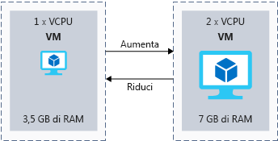
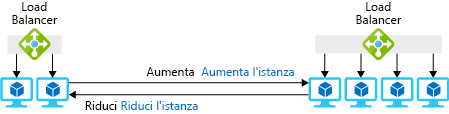
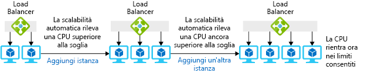

Capita di rado di riuscire a prevedere esattamente il carico sul sistema: le applicazioni pubbliche possono crescere rapidamente oppure può presentarsi la necessità che con la crescita dell'azienda un'applicazione interna supporti una base utenti più ampia.It's rare that we can exactly predict the load on our system: public facing applications might grow rapidly or an internal application might need to support a larger user base as the business grows. Anche quando si può prevedere il carico, è raro che questo sia sempre costante: i rivenditori hanno una domanda maggiore durante le vacanze e i siti Web di articoli sportivi registrano la massima affluenza durante i playoff.Even when we can predict load, it's rarely flat: retailers have more demand during the holidays and sports websites peak during playoffs. In questo articolo vengono definiti i concetti di _aumento/riduzione delle prestazioni_ e _aumento/riduzione del numero di istanze_ e viene illustrato come Azure possa migliorare le funzionalità di scalabilità e come le tecnologie serverless e per i contenitori possano migliorare le capacità di scalabilità dell'architettura.Here, we'll define _scaling up/down_ and _scaling out/in_, cover some ways Azure can improve your scaling capabilities, and look at how serverless and container technologies can improve your architecture's ability to scale.

## Cos'è la scalabilità?What is scaling?

La _scalabilità_ è il processo di gestione delle risorse per consentire a un'applicazione di soddisfare un set di requisiti relativi alle prestazioni._Scaling_ is the process of managing your resources to help your application meet a set of performance requirements.  Quando ci sono troppe risorse che servono gli utenti, queste non verranno usate in modo efficiente, con un conseguente spreco di denaro.When we have too many resources serving users, we won't be using it efficiently and we'll be wasting money. Un numero troppo limitato di risorse disponibili produrrà invece un impatto sulle prestazioni dell'applicazione.Too few available resources means that the performance of our application could be impacted. L'obiettivo è soddisfare i requisiti di prestazioni definiti ottimizzando i costi.The goal is to meet our defined performance requirements while optimizing for cost. 

Il termine "_risorse_" può fare riferimento a tutto ciò che serve per riuscire a eseguire le applicazioni."_Resources_" can refer to anything we need to manage to run our applications. Memoria e CPU per le macchine virtuali sono le risorse più ovvie, ma per alcuni servizi di Azure può essere necessario prendere in considerazione larghezza di banda o astrazioni come le unità richiesta di Cosmos DB.Memory and CPU for virtual machines are the most obvious resources, but some Azure services might require you to consider bandwidth or abstractions, like Cosmos DB Request Units.

In un mondo in cui le esigenze delle applicazioni sono costanti è facile prevedere il livello di risorse necessario.In a world where application demand is constant, it's easy to predict the right amount of resources you'll need. Nel mondo reale le esigenze delle applicazioni cambiano nel tempo e possono quindi essere più difficili da prevedere.In the real world, the demands of applications change over time, so the right amount of resources you'll need can be harder to predict. Nel migliore dei casi queste variazioni sono prevedibili o stagionali, ma non è detto che questo accada per tutte le applicazioni.If you're lucky, that change will be predictable or seasonal, but that is not typical of all applications. In teoria, è opportuno effettuare il provisioning della giusta quantità di risorse per soddisfare la domanda e adattarle alle variazioni.Ideally, you want to provision the right amount of resources to meet demand and adjust as demand changes.

La scalabilità è difficile in uno scenario locale in cui si acquistano e gestiscono i propri server.Scaling is difficult in an on-premises scenario, where you purchase and manage your own servers. L'aggiunta di risorse può risultare onerosa e spesso passa troppo tempo prima che le risorse siano disponibili online, talvolta più tempo rispetto al periodo in cui è richiesta una maggiore capacità.Adding resources can be costly and often takes too much time to bring online, sometimes longer than your actual need for the increased capacity. Anche ridurre la capacità nei periodi di calo della domanda nel sistema può risultare complicato, di conseguenza può capitare che non sia possibile ridurre i costi.It can be just as difficult to then reduce capacity during times of low demand on the system, so you may be stuck with the increased cost.

La possibilità di ridimensionare facilmente il sistema è uno dei vantaggi chiave di Azure.Easy scaling is a key benefit of Azure. La maggior parte delle risorse di Azure consente di aggiungere o rimuovere facilmente le risorse e molti servizi includono opzioni automatiche che monitorano la domanda e si adattano automaticamente.Most Azure resources let you easily add or remove resources as demand changes, and many services have automated options so they monitor demand and adjust for you. Questa funzionalità di ridimensionamento automatico consente di impostare soglie per il livello minimo e massimo di istanze che devono essere disponibili e aggiunge o rimuove le istanze in base a una metrica delle prestazioni, ad esempio l'utilizzo della CPU.This automatic scaling capability, commonly known as autoscaling, lets you set thresholds for the minimum and maximum level of instances that should be available, and will add or remove instances based upon a performance metric (for example, CPU utilization).

#### Aumento delle prestazioni e del numero di istanzeScaling up and out

> [!VIDEO https://www.microsoft.com/videoplayer/embed/RE2yBWi]

## Cosa si intende per aumento o riduzione delle prestazioni?What is scaling up or down?

L'aumento delle prestazioni è il processo in cui la capacità di una determinata istanza viene aumentata.Scaling up is the process where we increase the capacity of a given instance. Una macchina virtuale può passare da 1 vCPU e 3,5 GB di RAM a 2 vCPU e 7 GB di RAM per offrire una maggiore capacità di elaborazione.A virtual machine could be increased from 1 vCPU and 3.5 GB of RAM to 2 vCPUs and 7 GB of RAM to provide more processing capacity. La riduzione delle prestazioni è invece il processo in cui la capacità di una determinata istanza viene ridotta.On the other hand, scaling down is the process where we lower the capacity of a given instance. La riduzione della capacità di una macchina virtuale da 2 vCPU e 7 GB di RAM a 1 vCPU e 3,5 GB di RAM, ad esempio, ne ridurrà la capacità e il costo.For example, reducing a virtual machine's capacity from 2 vCPUs and 7 GB of RAM to 1 vCPU and 3.5 GB of RAM, reducing both capacity and cost. La figura seguente illustra un esempio di modifica della dimensione di una macchina virtuale.The following illustration shows an example of changing the size of a virtual machine.

Esaminiamo ora i concetti di aumento e riduzione delle prestazioni nel contesto delle risorse di Azure:Let's take a look at what scaling up or down means in the context of Azure resources:

- Nelle macchine virtuali di Azure il ridimensionamento viene implementato in base alle dimensioni di una macchina virtuale.In Azure virtual machines, you scale based upon a virtual machine size. Alle dimensioni è associata una determinata quantità di vCPU, RAM e spazio di archiviazione locale.That size has a certain amount of vCPUs, RAM, and local storage associated with it. È possibile, ad esempio, aumentare le prestazioni passando da una macchina virtuale Standard_DS1_v2 (1 vCPU e 3,5 GB di RAM) a una macchina virtuale Standard_DS2_v2 (2 vCPU e 7 GB di RAM).For example, we could scale up from a Standard_DS1_v2 virtual machine (1 vCPU and 3.5 GB of RAM) to a Standard_DS2_v2 virtual machine (2 vCPUs and 7 GB of RAM).
- Il database SQL di Azure è un'implementazione di piattaforma distribuita come servizio (PaaS, Platform as a Service) di Microsoft SQL Server.Azure SQL Database is a platform as a service (PaaS) implementation of Microsoft SQL Server.  È possibile aumentare le prestazioni di un database in base al numero di unità di transazione di database (DTU) o vCPU.You can scale up a database based upon the number of database transaction units (DTUs) or vCPUs. Le DTU sono un'astrazione delle risorse sottostanti e una combinazione di CPU, I/O e memoria.DTUs are an abstraction of underlying resources and are a blend of CPU, IO, and memory. Ad esempio, è possibile ridimensionare il database SQL di Azure dalla dimensione P2 con 250 DTU fino alla dimensione P4 con 500 DTU per assegnare al database velocità effettiva e capacità maggiori.For instance, you could scale your Azure SQL database from a size of P2 with 250 DTUs up to a P4 with 500 DTUs to give the database more throughput and capacity.
- Servizio app di Azure è un servizio di hosting di siti Web PaaS in Azure.Azure App Service is a PaaS website-hosting service on Azure. I siti Web vengono eseguiti in una server farm virtuale, anche nota come piano di servizio app.Websites run on a virtual server farm, also known as an App Service plan. Nel piano di servizio app è possibile passare ai livelli superiori o inferiori, che includono ognuno opzioni specifiche in termini di capacità.You can scale the App Service plan up or down between tiers and have capacity options within tiers. Il piano di servizio app S1 include ad esempio 1 vCPU e 1,75 GB di RAM per istanza.For example, an S1 App Service plan has 1 vCPU and 1.75 GB of RAM per instance. È possibile passare al piano di servizio app S2 che include 2 vCPU e 3 GB di RAM per istanza.We could scale up to an S2 App Service plan, which has 2 vCPUs and 3 GB of RAM per instance.

Per poter usare queste funzionalità in un ambiente locale, è in genere necessario attendere l'approvvigionamento dell'hardware necessario e l'installazione prima di iniziare a usare il nuovo livello.To have these capabilities in an on-premises environment you typically have to wait for procurement of the needed hardware and installation before you can start using the new level of scale. In Azure le risorse fisiche sono già distribuite e disponibiliIn Azure, the physical resources are already deployed and available for you. ed è sufficiente selezionare il livello alternativo di scalabilità che si intende usare.You simply need to select the alternate level of scale that you are looking to use.

A seconda dei servizi cloud scelti, può essere necessario valutare l'impatto dell'aumento delle prestazioni nella soluzione.You may need to consider the impact of scaling up in your solution, depending upon the cloud services that you have chosen.

Se ad esempio si sceglie di aumentare le prestazioni del database SQL di Azure, il servizio gestisce l'aumento delle prestazioni di singoli nodi garantendo l'operatività.For example, if you choose to scale up in Azure SQL Database, the service deals with scaling up individual nodes and continues the operation of your service. La modifica del livello di servizio e/o del livello di prestazioni di un database implica la creazione di una replica del database originale con il nuovo livello di prestazioni e quindi il passaggio delle connessioni alla replica.Changing the service tier and/or performance level of a database creates a replica of the original database at the new performance level, and then switches connections over to the replica. Durante questo processo non si verifica alcuna perdita di dati e ci sarà solo una breve interruzione (in genere inferiore a quattro secondi) quando il servizio passa alla replica.No data is lost during this process, and there's only a brief interruption (typically less than four seconds) when the service switches over to the replica.

Se invece si sceglie di aumentare o ridurre le prestazioni di una macchina virtuale, è sufficiente selezionare dimensioni diverse per l'istanza.Alternatively, if you choose to scale up or down a virtual machine, you do so by selecting a different instance size. Nella maggior parte dei casi questa operazione richiede un riavvio della macchina virtuale ed è quindi consigliabile tenere presente questo aspetto quando si esegue questa attività.In most cases this requires a restart of the VM, so it's best to have the expectation that a reboot will be required and you'll need to account for when performing this activity.

È infine consigliabile cercare sempre soluzioni che offrano un'opzione di riduzione delle prestazioni.Finally, you should always look for places where scaling down is an option. Quando l'applicazione è in grado di assicurare prestazioni adeguate a un piano tariffario inferiore, la fattura di Azure subisce una significativa riduzione.If your application can provide adequate performance at a lower price tier, your Azure bill could be significantly reduced.

## Cosa si intende per aumento o riduzione del numero di istanze?What is scaling out or in?

Mentre l'aumento e la riduzione delle prestazioni consentono di regolare la quantità di risorse a disposizione di una singola istanza, l'aumento e la riduzione del numero di istanze consentono di regolare il numero totale di istanze.Where scaling up and down adjusts the amount of resources a single instance has available, scaling out and in adjusts the total number of instances.

L'_aumento del numero di istanze_ è il processo di aggiunta di altre istanze per supportare il carico della soluzione._Scaling out_ is the process of adding more instances to support the load of your solution. Se ad esempio il front-end di un sito Web è ospitato in macchine virtuali, si può aumentare il numero delle macchine virtuali in caso di aumento del livello di carico.For example, if our website front end were hosted on virtual machines, we could increase the number of virtual machines if the level of load increased.

La _riduzione del numero di istanze_ è il processo di rimozione delle istanze non più necessarie per supportare il carico della soluzione._Scaling in_ is the process of removing instances that are no longer needed to support the load of your solution. Se i front-end del sito Web sono poco usati, si può decidere di ridurre il numero di istanze per risparmiare sui costi.If the website front ends have low usage, we may want to lower the number of instances to save cost. La figura seguente illustra un esempio di modifica del numero di istanze di macchine virtuali.The following illustration shows an example of changing the number of virtual machine instances.

Ecco alcuni esempi di aumento e riduzione del numero di istanze nel contesto delle risorse di Azure:Here are some examples of what scaling out or in means in the context of Azure resources:

- Per il livello infrastruttura è probabile che si usino set di scalabilità di macchine virtuali per automatizzare l'aggiunta e la rimozione di istanze aggiuntive.For the infrastructure layer, you would likely use virtual machine scale sets to automate the addition and removal of extra instances.
  - I set di scalabilità di macchine virtuali consentono di creare e gestire un gruppo di macchine virtuali identiche con bilanciamento del carico.Virtual machine scale sets let you create and manage a group of identical, load balanced VMs.
  - Il numero di istanze di macchine virtuali può aumentare o diminuire automaticamente in risposta alla domanda o a una pianificazione definita.The number of VM instances can automatically increase or decrease in response to demand or a defined schedule.
- In un'implementazione del database SQL di Azure è possibile condividere il carico tra le istanze di database tramite il partizionamento orizzontale.In an Azure SQL Database implementation, you could share the load across database instances by sharding. Il _partizionamento orizzontale_ è una tecnica per distribuire grandi quantità di dati strutturati in modo identico tra più database indipendenti._Sharding_ is a technique to distribute large amounts of identically structured data across a number of independent databases.
- In Servizio app di Azure il piano di servizio app è la server farm Web virtuale che ospita l'applicazione.In Azure App Service, the App Service plan is the virtual web server farm hosting your application. L'aumento del numero di istanze in questo modo implica l'aumento del numero di macchine virtuali nella farm.Scaling out in this way means that you're increasing the number of virtual machines in the farm. In modo analogo ai set di scalabilità di macchine virtuali, il numero di istanze può essere aumentato o diminuito automaticamente in risposta a determinate metriche o a una pianificazione.As with virtual machine scale sets, the number of instances can be automatically raised or lowered in response to certain metrics or a schedule.

L'aumento del numero di istanze viene in genere eseguito facilmente nel portale di Azure, tramite strumenti da riga di comando o modelli di Resource Manager e nella maggior parte dei casi risulta automatico per l'utente finale.Scaling out is typically easily performed in the Azure portal, command-line tools, or Resource Manager templates, and in most cases is seamless to the end user.

### Scalabilità automaticaAutoscale

È possibile configurare alcuni di questi servizi per l'uso di una funzionalità denominata scalabilità automatica.You can configure some of these services to use a feature called autoscale. Grazie alla scalabilità automatica, le operazioni manuali di scalabilità dei servizi non sono più necessarie.With autoscale you no longer have to worry about scaling services manually. È invece possibile impostare una soglia minima e massima di istanze e applicare la scalabilità in base a metriche (lunghezza della coda, uso della CPU) o pianificazioni (giorni feriali tra le 17:00 e le 19:00) specifiche.Instead, you can set a minimum and maximum threshold of instances and scale based upon specific metrics (queue length, CPU utilization) or schedules (weekdays between 5:00 PM and 7:00 PM). La figura seguente illustra come la funzionalità di scalabilità automatica gestisce le istanze per gestire il carico.The following illustration shows how the autoscale feature manages instances to handle the load.

### Considerazioni relative alla riduzione e all'aumento del numero di istanzeConsiderations when scaling in and out

Quando si aumenta il numero di istanze, i tempi di avvio dell'applicazione possono influire sulla velocità di scalabilità dell'applicazione.When scaling out, the startup time of your application can impact how quickly your application can scale. Se l'app Web richiede due minuti per l'avvio e per essere disponibile per gli utenti, ognuna delle istanze richiederà due minuti prima di essere disponibile per gli utenti.If your web app takes two minutes to start up and be available for users, that means each of your instances will take two minutes until they are available to your users. È consigliabile prendere in considerazione i tempi di avvio al momento di determinare la velocità di scalabilità.You'll want to take this startup time into consideration when determining how fast you want to scale.

È anche necessario riflettere sulle modalità di gestione dello stato da parte dell'applicazione.You'll also need to think about how your application handles state. Quando si riduce il numero di istanze dell'applicazione, qualsiasi stato archiviato nel computer non è più disponibile.When the application scales in, any state stored on the machine is no longer available. Se un utente si connette a un'istanza il cui stato non è disponibile, può essere necessario eseguire l'accesso o selezionare di nuovo i dati, determinando un'esperienza utente poco soddisfacente.If a user connects to an instance that doesn't have its state, it could force them to sign in or re-select data, leading to a poor user experience. Un modello comune consiste nell'esternalizzare lo stato a un altro servizio, ad esempio Cache Redis o database SQL, in modo che i server Web siano senza stato.A common pattern is to externalize state to another service like Redis Cache or SQL Database, making your web servers stateless. Con i front-end Web senza stato non occorre sapere quali singole istanze siano disponibili,Now that our web front ends are stateless, we don't need to worry about which individual instances are available. perché eseguono tutte lo stesso processo e sono distribuite allo stesso modo.They are all doing the same job and are deployed in the same way.

## LimitazioneThrottling

È stato appurato che il carico posto su un'applicazione varia nel tempo.We've established that the load on an application will vary over time. Ciò può essere dovuto al numero di utenti attivi o simultanei e alle attività in esecuzione.This may be due to the number of active or concurrent users and the activities being performed. Sebbene sia possibile usare la scalabilità automatica per aggiungere capacità, è anche possibile usare un meccanismo di limitazione per limitare il numero di richieste provenienti da un'origine.While we could use autoscaling to add capacity, we could also use a throttling mechanism to limit the number of requests from a source. È possibile proteggere i limiti delle prestazioni configurando limiti noti a livello di applicazione, evitando così che questa venga compromessa.We can safeguard performance limits by putting known limits into place at the application level, preventing the application from breaking. La limitazione viene usata più di frequente nelle applicazioni che espongono endpoint API.Throttling is most frequently used in applications exposing API endpoints.

Dopo che l'applicazione ha identificato la possibile violazione di un limite, può essere avviata la limitazione per verificare che il contratto di servizio del sistema complessivo non venga violato.Once the application has identified that it would breach a limit, throttling could begin and ensure the overall system SLA isn't breached. Ad esempio, se si espone un'API che consente ai clienti di ottenere i dati, è possibile limitare il numero di richieste a 100 al minuto.For example, if we exposed an API for customers to get data, we could limit the number of requests to 100 per minute. Se un cliente qualsiasi supera questo limite si può rispondere con un codice di stato 429 HTTP includendo il tempo di attesa prima di poter inviare correttamente un'altra richiesta.If any single customer exceeded this limit, we could respond with an HTTP 429 status code, including the wait time before another request can successfully be submitted.

## Elaborazione serverlessServerless

L'elaborazione serverless offre un ambiente di esecuzione ospitato nel cloud che esegue le app ma che astrae completamente l'ambiente sottostante.Serverless computing provides a cloud-hosted execution environment that runs your apps but completely abstracts the underlying environment. È sufficiente creare un'istanza del servizio e aggiungere il codice; non è necessaria, né tantomeno consentita, la gestione o la manutenzione dell'infrastruttura.You create an instance of the service, and you add your code; no infrastructure management or maintenance is required, or even allowed.

Le app serverless vengono configurate per rispondere ad eventi.You configure your serverless apps to respond to events. Può trattarsi di un endpoint REST, un timer o un messaggio ricevuto da un altro servizio di Azure.This could be a REST endpoint, a timer, or a message received from another Azure service. L'app serverless viene eseguita solo quando viene attivata da un evento.The serverless app runs only when it's triggered by an event.

L'utente non è responsabile dell'infrastruttura.Infrastructure isn't your responsibility. La scalabilità e le prestazioni vengono gestite automaticamente e vengono addebitate solo le risorse effettivamente usate.Scaling and performance are handled automatically, and you are billed only for the exact resources you use. Non è necessario prenotare la capacità.There's no need to even reserve capacity. Funzioni di Azure, Istanze di contenitore di Azure e App per la logica sono esempi di elaborazione serverless disponibili in Azure.Azure Functions, Azure Container Instances, and Logic Apps are examples of serverless computing available on Azure.

Di seguito viene ripreso l'esempio Lamna Healthcare.Let's revisit the Lamna Healthcare example. Potrebbe presentare del potenziale per un risparmio sui costi e una gestione più semplice.There could be some potential for cost saving and ease of management. Si consideri un endpoint API.Consider an API endpoint. Invece di ospitare l'API nel Servizio app di Azure dove è necessario pagare per la capacità riservata, l'organizzazione può usare un'app di Funzioni di Azure attivata da una richiesta HTTP.Instead of hosting the API in Azure App Service, where they must pay for reserved capacity, they could use an Azure Function App triggered by an HTTP request. Funzioni di Azure consente al team di pagare solo per le risorse necessarie per elaborare le singole transazioni.Azure functions would enable the team to pay only for the resources required to process each transaction. Il costo e la scalabilità saranno direttamente in linea con il numero di transazioni nel sistema.The cost and scale would be directly in line with the number of transactions in the system.

## ContenitoriContainers

Un contenitore è un metodo che esegue le applicazioni in un ambiente virtualizzato.A container is a method running applications in a virtualized environment. Una macchina virtuale è virtualizzata a livello hardware, dove un hypervisor rende possibile l'esecuzione di più sistemi operativi virtualizzati in un singolo server fisico.A virtual machine is virtualized at the hardware level, where a hypervisor makes it possible to run multiple virtualized operating systems on a single physical server. Con i contenitori, la virtualizzazione passa a un livello superiore.Containers take the virtualization up a level. La virtualizzazione avviene a livello di sistema operativo, consentendo l'esecuzione di più istanze dell'applicazione identiche all'interno dello stesso sistema operativo.The virtualization is done at the OS level, making it possible to run multiple identical application instances within the same OS.

I contenitori sono ideali per gli scenari in cui viene aumentato il numero di istanze.Containers are well suited to scale out scenarios. Sono concepiti per essere leggeri e sono stati progettati per essere creati, scalati e arrestati in modo dinamico man mano che l'ambiente e la domanda cambiano.They are meant to be lightweight and are designed to be created, scaled out, and stopped dynamically as environment and demand change.

Un vantaggio dell'uso dei contenitori è la possibilità di eseguire più applicazioni isolate in ogni macchina virtuale.A benefit of using containers is the ability to run multiple isolated applications on each virtual machine. Poiché i contenitori stessi sono protetti e isolati a livello di kernel, non si deve necessariamente usare macchine virtuali separate per carichi di lavoro separati.Since containers themselves are secured and isolated at a kernel level, you don't necessarily need separate VMs for separate workloads.

Anche se è possibile eseguire i contenitori nelle macchine virtuali, sono disponibile due servizi di Azure che semplificano le operazioni di gestione e scalabilità dei contenitori:While you can run containers on virtual machines, there are a couple of Azure services that focus on easing the management and scaling of containers:

- **Servizio Kubernetes di Azure (AKS)****Azure Kubernetes Service (AKS)**

  Il servizio Kubernetes di Azure consente di configurare macchine virtuali che fungono da nodi.Azure Kubernetes Service allows you to set up virtual machines to act as your nodes. Azure ospita il piano di gestione di Kubernetes e prevede la fatturazione solo dei nodi del ruolo di lavoro in esecuzione che ospitano i contenitori.Azure hosts the Kubernetes management plane and only bills for the running worker nodes that host your containers.

  Per incrementare il numero dei nodi del ruolo di lavoro in Azure si può usare l'interfaccia della riga di comando di Azure per incrementarli manualmente.To increase the number of your worker nodes in Azure, you could use the Azure CLI to increase that manually. Al momento della redazione di questo documento, è disponibile una versione di anteprima di Cluster Autoscaler su AKS che consente la scalabilità automatica dei nodi del ruolo di lavoro.At time of writing, there is a preview of Cluster Autoscaler on AKS available that enables autoscaling of your worker nodes. Nel cluster Kubernetes è possibile usare HPA (Horizontal Pod Autoscaler) per aumentare il numero di istanze del contenitore da distribuire.On your Kubernetes cluster, you could use the Horizontal Pod Autoscaler to scale out the number of instances of the container to be deployed.

  La scalabilità nel servizio Kubernetes di Azure è possibile anche con il componente Virtual Kubelet descritto di seguito.AKS can also scale with the Virtual Kubelet described below.

- **Istanze di contenitore di Azure (ACI)****Azure Container Instances (ACI)**
  
  Istanze di contenitore di Azure è un approccio serverless che consente di creare ed eseguire contenitori su richiesta.Azure Container Instances is a serverless approach that lets you create and execute containers on demand. Viene addebitato solo il tempo di esecuzione per secondo.You're charged only for the execution time per second.

  È possibile usare Virtual Kubelet per connettere Istanze di contenitore di Azure all'ambiente Kubernetes, incluso il servizio Kubernetes di Azure.You can use Virtual Kubelet to connect Azure Container Instances into your Kubernetes environment, including AKS. Con Virtual Kubelet, quando il cluster Kubernetes necessita di istanze di contenitore aggiuntive, la domanda può essere soddisfatta da Istanze di contenitore di Azure.With Virtual Kubelet, when your Kubernetes cluster demands additional container instances, those demands can be met from ACI. Poiché Istanze di contenitore di Azure è serverless, non è necessario avere a disposizione capacità riservata.Since ACI is serverless, there is no need to have reserved capacity. È quindi possibile usufruire del controllo e della flessibilità offerti dalla scalabilità Kubernetes con la fatturazione per secondo dell'approccio serverless.You can therefore take advantage of the control and flexibility of Kubernetes scaling with the per-second-billing of serverless. Al momento della redazione di questo documento, Virtual Kubelet è descritto come software sperimentale e non deve essere usato in scenari di produzione.At time of writing, the Virtual Kubelet is described as experimental software and should not be used in production scenarios.

## Scalabilità in Lamna HealthcareScaling at Lamna Healthcare

Lamna Healthcare usa un sistema di prenotazioni e gestione dei pazienti.Lamna Healthcare operates a patient management and booking system. Il sistema gestisce le prenotazioni degli appuntamenti e le cartelle cliniche dei pazienti in decine di ospedali e strutture sanitarie.The management system handles appointment bookings and patient records across dozens of hospitals and medical facilities. Il servizio sanitario locale funziona al massimo della sua capacità e al momento non ne è prevista la crescita.The local health service is running at full capacity, and no growth is expected at the moment. Il sistema viene eseguito in un sito Web PHP ospitato nel Servizio app di Azure.The system is running on a PHP website hosted in Azure App Service.

Il modello di carico dell'applicazione è prevedibile perché il cliente opera principalmente dal lunedì al venerdì dalle 9:00 alle 17:00.The load pattern of the application is predictable, as they primarily operate Monday to Friday between the hours of 9 to 5.  Dal martedì al venerdì viene gestita una media di 1.200 transazioni all'ora nell'intero sistema.From Tuesday through to Friday, the system averages 1,200 transactions per hour across the entire system. Durante il fine settimana il sistema gestisce una media di 500 transazioni all'ora.During the weekend, it handles 500 transactions per hour. Dopo la calma del fine settimana i lunedì sono frenetici con una media di 2.000 transazioni all'ora.After the quiet of the weekend, Mondays are busy with an average of 2,000 transactions per hour.

L'applicazione è ospitata in un piano di servizio app S1, ma il team operativo ha notato un utilizzo elevato della CPU (oltre il 95%) in tutte le istanze.The application is hosted on an S1 App Service plan, but the operations team have noticed a high level of CPU utilization (over 95%) across all instances. L'utilizzo elevato influisce sui tempi di elaborazione e caricamento dell'applicazione.The high usage is having an impact on the processing and loading times of the application. In un ambiente cloud la presenza di risorse con un utilizzo elevato non è necessariamente negativa.In a cloud environment, having highly utilized resources is not necessarily a bad thing. Denota infatti un'ottimizzazione della spesa perché le risorse distribuite vengono usate in maniera ottimale.It means that they are getting value for their money, as the resources deployed are being well used. 

Il team decide di _passare a un livello superiore_ del piano di servizio app per le istanze distribuite, ovvero da S1 (1 vCPU e 1,75 GB di RAM) a S2 (2 vCPU e 3 GB di RAM).The team decide to _scale up_ the App Service plan level for the deployed instances from S1 (1 vCPU and 1.75 GB of RAM) to S2 (2 vCPUs and 3 GB of RAM). Per eseguire facilmente questa operazione, il team usa il portale di Azure. Si può però ottenere lo stesso risultato usando un singolo comando nell'interfaccia della riga di comando di Azure, Azure PowerShell o i modelli di Resource Manager.They easily achieve this using the Azure portal, but could have achieved the same thing using a single command in the Azure CLI, Azure PowerShell, or using Resource Manager templates.

Il team decide di automatizzare il numero di istanze distribuite in base a una pianificazione, dal momento che il profilo di carico è prevedibile.The team decide that they want to automate the number of instances deployed based upon a schedule, as their load profile is predictable. Viene quindi configurata la pianificazione di scalabilità automatica del piano di servizio app.They configure the App Service plan's autoscale schedule. Supponiamo che due istanze siano in grado di gestire adeguatamente 500 transazioni all'ora.Let's assume two instances sufficiently handle 500 transactions per hour. Per soddisfare i requisiti (in base alle informazioni dettagliate e al monitoraggio dei test di carico), il team potrebbe quindi passare a sei istanze per il periodo compreso tra il martedì e il venerdì e a otto istanze per il lunedì.The team could then scale to six instances for Tuesday - Friday and eight instances for a Monday to meet the requirements (based upon insight and monitoring from load tests).

La scalabilità automatica offre anche un altro vantaggio, ovvero la preparazione per scenari imprevisti.Autoscale also gives them an added benefit, preparing for those unforeseen scenarios. Il sito potrebbe improvvisamente dover affrontare un carico superiore al previsto nel fine settimana (più appuntamenti nella stagione invernale a causa di raffreddori e influenze).The site may suddenly take higher than expected load on the weekend (more appointments in the winter season because of colds and flu). Il team può configurare la scalabilità automatica in modo da aumentare di un'istanza quando la percentuale di CPU è superiore al 70% e ridurre di un'istanza quando l'uso è inferiore al 15%.The team can set up autoscale to increase by one instance when CPU percentage is above 70% and reduce by one instance when usage is below 15%.

Il team ha usato il modello di limitazione all'interno dell'API di prenotazione dei pazienti che è stata esposta dietro un'istanza di Gestione API di Azure.The team have used the throttling pattern inside of the patient booking API they have exposed behind an Azure API Management instance. Questo contribuisce a evitare prestazioni inadeguate del sistema consentendo il passaggio solo di un determinato volume di unità elaborate.This helps prevent the system from performing poorly by only allowing a certain volume of throughput through the system.

Sono stati descritti l'aumento e la riduzione delle prestazioni e l'aumento e la riduzione del numero di istanze, nonché l'uso di queste opzioni nell'architettura.We've talked about scaling up and down and scaling in and out, and how you can leverage these options in your architecture. È stato anche illustrato come le tecnologie serverless e i contenitori possano contribuire a migliorare le funzionalità di ridimensionamento.We've also looked at how serverless technologies and containers can help evolve your scaling capabilities.