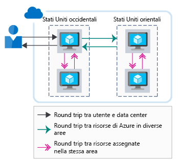
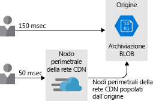

Le prestazioni della rete possono avere un impatto significativo sull'esperienza utente. Nelle architetture complesse con molti servizi diversi la riduzione della latenza al minimo a ogni hop può influire notevolmente sulle prestazioni complessive. Questa unità tratterà dell'importanza della latenza di rete e di come ridurla all'interno della propria architettura. Verrà illustrato anche il modo in cui Lamna Healthcare ha adottato strategie per ridurre al minimo la latenza di rete tra le sue risorse di Azure e tra i propri utenti e Azure.

## Importanza della latenza di rete

La latenza è una misura del ritardo. La latenza di rete è il tempo necessario per passare da un'origine a una destinazione in un'infrastruttura di rete. Questo periodo di tempo è comunemente noto come round-trip delay, ovvero il tempo impiegato per passare dall'origine alla destinazione e viceversa.

In un data center tradizionale la latenza dell'ambiente può essere minima in quanto le risorse spesso condividono la stessa posizione e un set comune di infrastrutture. Il tempo necessario per arrivare dall'origine alla destinazione è inferiore quando le risorse sono fisicamente vicine.

Un ambiente cloud è invece pensato per la scalabilità. Le risorse ospitate nel cloud possono non trovarsi nello stesso rack, data center o persino area. Questo approccio distribuito può influire sul tempo di round-trip delle comunicazioni di rete. Mentre tutte le aree di Azure sono interconnesse tramite un backbone fiber ad alta velocità, la velocità della luce resta una limitazione fisica. Le chiamate tra servizi in posizioni fisiche diverse avranno comunque una latenza di rete direttamente correlata alla distanza tra loro.

Oltre a ciò, più frequenti sono le interazioni con un'applicazione, più round trip sono necessari. Ogni round trip implica un costo in termini di latenza e ogni round trip contribuisce alla latenza complessiva. La figura seguente mostra come la latenza percepita dall'utente è la combinazione di round trip necessari per soddisfare la richiesta.

Verrà ora descritto come migliorare le prestazioni tra le risorse di Azure e tra gli utenti finali e le risorse di Azure.

## Latenza tra risorse di Azure

Si supponga che Lamna Healthcare stia sperimentando un nuovo sistema di prenotazione per i pazienti in esecuzione in diversi server Web e un database nell'area Europa occidentale di Azure. Questa architettura consente di ridurre al minimo il tempo di trasmissione dei dati, in quanto le risorse si trovano all'interno della stessa area di Azure.

Si supponga che il progetto pilota del sistema abbia avuto esito positivo e che sia stato esteso agli utenti in Australia. Questi utenti saranno soggetti al tempo di round trip necessario alle risorse in Europa occidentale per visualizzare il sito Web e l'esperienza utente non sarà soddisfacente a causa della latenza di rete.

Il team di Lamna Healthcare decide di ospitare un'altra istanza front-end nell'area Australia orientale per ridurre la latenza degli utenti. Anche se questa progettazione aiuta a ridurre i tempi di restituzione del contenuto agli utenti finali da parte del server Web, la qualità dell'esperienza è ancora insoddisfacente a causa di una latenza di comunicazione significativa tra i server Web front-end in Australia orientale e il database in Europa occidentale.

Vi sono alcuni modi per ridurre la latenza rimanente:

- Creare una replica di lettura del database in Australia orientale. Ciò permetterebbe di ottenere buone prestazioni nelle operazioni di lettura, ma le operazioni di scrittura subirebbero comunque una latenza. La replica geografica del database SQL di Azure consente le repliche di lettura.
- È possibile sincronizzare i dati tra le aree con la sincronizzazione dati SQL di Azure.
- È possibile usare un database distribuito a livello globale come Azure Cosmos DB. Questo consente l'esecuzione di letture e scritture indipendentemente dall'area, ma può richiedere modifiche al modo in cui l'applicazione fa riferimento ai dati e li archivia.
- Usare una tecnologia di memorizzazione nella cache, ad esempio Cache Redis di Azure, per ridurre al minimo le chiamate ad alta latenza a database remoti per i dati utilizzati di frequente.

L'obiettivo è ridurre al minimo la latenza di rete tra ogni livello dell'applicazione. Il modo in cui ciò viene risolto dipende dall'applicazione e dall'architettura dei dati, ma Azure fornisce meccanismi per affrontare questo problema in diversi servizi.

## Latenza tra utenti e risorse di Azure

È stata esaminata la latenza tra le risorse di Azure, ma è bene considerare anche la latenza tra gli utenti e l'applicazione cloud usata. L'obiettivo è quello di ottimizzare la distribuzione dell'interfaccia utente finale per gli utenti. Vengono esaminati ora alcuni modi per migliorare le prestazioni di rete tra gli utenti finali e l'applicazione.

### È possibile usare un servizio di bilanciamento del carico DNS per l'ottimizzazione del percorso dell'endpoint

Nell'esempio di Lamna Healthcare, si è visto che il team ha creato un ulteriore nodo web front-end in Australia orientale. Tuttavia, gli utenti finali devono specificare in modo esplicito l'endpoint front-end che desiderano utilizzare. In quanto progettista di una soluzione, Lamna Healthcare vuole rendere l'esperienza il più semplice possibile per i suoi utenti.

Può essere utile Gestione traffico di Microsoft Azure. Gestione traffico è un servizio di bilanciamento del carico basato su DNS che consente di distribuire il traffico all'interno di un'area di Azure e tra aree diverse. Invece di indirizzare l'utente verso un'istanza specifica del front-end Web, Gestione traffico può instradare gli utenti in base a una serie di caratteristiche:

- **Priorità**: viene specificato un elenco ordinato di istanze front-end. Se l'istanza con la priorità più alta non è disponibile, Gestione traffico instraderà l'utente verso quella successiva disponibile.
- **Ponderato**: viene impostato un peso per ogni istanza front-end. Gestione traffico distribuisce quindi il traffico in base alle percentuali definite.
- **Prestazioni**: Gestione traffico consente di instradare gli utenti verso l'istanza front-end più vicina in base alla latenza di rete.
- **Geografico**: è possibile configurare le aree geografiche per le distribuzioni front-end, instradando gli utenti in base ai mandati di sovranità dei dati o alla localizzazione del contenuto.

I profili di Gestione traffico possono anche essere annidati. È ad esempio possibile instradare prima gli utenti in diverse aree geografiche, ad esempio Europa e Australia, usando il routing geografico e quindi instradarli verso distribuzioni front-end locali usando il metodo di routing basato sulle prestazioni.

Si supponga che Lamna Healthcare abbia distribuito un front-end Web in Europa occidentale e Australia. Si supponga che abbia distribuito il Database SQL di Azure con la distribuzione primaria nell'area Europa occidentale e una replica di lettura in Australia orientale. Si supponga inoltre che l'applicazione possa connettersi all'istanza di SQL locale per le query di lettura.

Il team distribuisce un'istanza di Gestione traffico in modalità prestazioni e aggiunge le due istanze front-end come profili di Gestione traffico. Un utente finale passa a un nome di dominio personalizzato, ad esempio lamnahealthcare.com, e viene instradato a Gestione traffico. Gestione traffico restituisce quindi il nome DNS del front-end dell'Europa occidentale o dell'Australia orientale in base alle prestazioni migliori in termini di latenza di rete.

È importante notare che questo bilanciamento del carico viene gestito solo tramite DNS e in questa fase non viene eseguito alcun bilanciamento del carico in linea o memorizzazione nella cache. Gestione traffico restituisce semplicemente il nome DNS del front-end più vicino all'utente.

### Usare la rete CDN per memorizzare nella cache il contenuto vicino agli utenti

Il sito web userà probabilmente una qualche forma di contenuto statico (pagine intere o risorse come immagini e video). Questo contenuto potrebbe essere recapitato agli utenti più velocemente usando una rete per la distribuzione di contenuti (CDN) come Azure CDN. 

Quando Lamna distribuisce contenuti sulla rete CDN di Azure, questi elementi vengono copiati in più server in tutto il mondo. Supponiamo che uno di tali elementi sia un video distribuito dall'archiviazione BLOB: `HowToCompleteYourBillingForms.MP4`. Il team quindi configura il sito Web in modo che il collegamento di ogni utente al video faccia effettivamente riferimento al server perimetrale della rete CDN più vicino, invece di fare riferimento all'archiviazione BLOB. Con questo approccio il contenuto è più vicino alla destinazione, di conseguenza la latenza risulta ridotta e l'esperienza utente è migliore. La figura seguente mostra in che modo la rete CDN colloca il contenuto più vicino alla destinazione, riducendo la latenza e migliorando l'esperienza utente.

È _possibile_ usare le reti per la distribuzione di contenuti anche per ospitare contenuto dinamico memorizzato nella cache. È però necessaria una considerazione aggiuntiva perché il contenuto memorizzato nella cache potrebbe non essere aggiornato rispetto all'origine. Per controllare la scadenza del contesto, è possibile impostare una durata (TTL). Se la durata (TTL) è eccessiva, il contenuto visualizzato potrebbe non essere aggiornato e sarà necessario ripulire la cache.

Per gestire il contenuto memorizzato nella cache, è possibile usare la funzionalità **Accelerazione sito dinamico**, che consente di migliorare le prestazioni delle pagine Web con contenuto dinamico. La funzionalità Accelerazione sito dinamico può anche fornire un percorso a bassa latenza, d esempio un endpoint API, a servizi aggiuntivi nella soluzione usata.

### Usare ExpressRoute per la connettività da locale ad Azure

È importante anche l'ottimizzazione della connettività di rete dall'ambiente locale ad Azure. Per gli utenti che si connettono ad applicazioni, sia che siano ospitati su macchine virtuali che su offerte PaaS come Servizio app di Azure, è opportuno assicurarsi che abbiano la migliore connessione alle applicazioni in uso. 

È sempre possibile usare la rete Internet pubblica per collegare gli utenti ai servizi, ma le prestazioni di Internet possono variare e possono essere influenzate da problemi esterni. È anche possibile che non si voglia esporre tutti i servizi tramite Internet e che si preferisca una connessione privata alle risorse di Azure.

Una delle opzioni disponibili è la VPN da sito a sito tramite Internet, ma per le architetture con velocità effettiva elevata, il sovraccarico della VPN e la variabilità di Internet possono incrementare notevolmente la latenza.

In queste situazioni può essere utile Azure ExpressRoute. ExpressRoute è una connessione privata dedicata tra la rete e Azure, che offre prestazioni garantite e garantisce che gli utenti finali abbiano il percorso migliore verso tutte le risorse di Azure. La figura seguente illustra in che modo il circuito ExpressRoute offre connettività tra le applicazioni locali e le risorse di Azure.

Esaminando ancora una volta lo scenario di Lamna, questa organizzazione decide di migliorare ulteriormente l'esperienza utente finale per gli utenti che si trovano presso le loro strutture effettuando il provisioning di un circuito ExpressRoute sia in Australia orientale che in Europa occidentale, offrendo agli utenti finali una connessione diretta al sistema di prenotazione e garantendo la latenza più bassa possibile per l'applicazione.

È importante considerare l'impatto della latenza di rete sull'architettura per garantire le migliori prestazioni possibili per gli utenti finali. Sono state esaminate alcune opzioni per ridurre la latenza di rete tra gli utenti finali e Azure e tra le risorse di Azure.