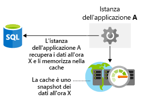

È importante fare alcune considerazioni sulle prestazioni di archiviazione nell'architettura.It's important to include storage performance considerations in your architecture. Proprio come la latenza di rete, una riduzione delle prestazioni a livello di archiviazione può compromettere l'esperienza degli utenti finali.Just like network latency, poor performance at the storage layer can impact your end-users' experience. In che modo si potrebbe ottimizzare l'archiviazione dei dati?How would you optimize your data storage? Quali aspetti occorre prendere in considerazione per assicurarsi di non introdurre colli di bottiglia in termini di archiviazione nell'architettura?What things do you need to consider to ensure that you're not introducing storage bottlenecks into your architecture? Qui di seguito viene spiegato come ottimizzare le prestazioni dell'archiviazione nell'architettura.Here, we'll take a look at how to optimize your storage performance in your architecture.

## Ottimizzare le prestazioni di archiviazione della macchina virtualeOptimize virtual machine storage performance

Innanzitutto verrà spiegato come ottimizzare l'archiviazione per le macchine virtuali.Let's first take a look at optimizing storage for virtual machines. L'archiviazione su disco svolge un ruolo fondamentale nelle prestazioni delle macchine virtuali. La scelta del tipo di disco più idoneo per l'applicazione è una decisione importante.Disk storage plays a critical role in the performance of your virtual machines, and selecting the right disk type for your application is an important decision.

Applicazioni diverse hanno requisiti di archiviazione diversi.Different applications are going to have different storage requirements. L'applicazione potrebbe essere sensibile alla latenza delle letture e scritture del disco, oppure potrebbe richiedere di gestire un numero elevato di operazioni di input/output al secondo (IOPS) o una maggiore velocità effettiva complessiva del disco.Your application may be sensitive to latency of disk reads and writes or it may require the ability to handle a large number of input/output operations per second (IOPS) or greater overall disk throughput.

Quando si compila un carico di lavoro IaaS, quale tipo di disco è opportuno usare?When building an IaaS workload, which type of disk should you use? Vi sono quattro opzioni:There are four options:

- **Archiviazione SSD locale**: ogni macchina virtuale ha un disco temporaneo supportato da un'archiviazione SSD locale.**Local SSD storage** - Each VM has a temporary disk that is backed by local SSD storage. Le dimensioni del disco variano a seconda delle dimensioni della macchina virtuale.The size of this disk varies depending on the size of the virtual machine. Poiché si tratta di un disco SSD locale, le prestazioni sono elevate, ma può verificarsi una perdita di dati durante un evento di manutenzione o una ridistribuzione della macchina virtuale.Since this disk is local SSD, the performance is high, but data may be lost during a maintenance event or a redeployment of the VM. Questo disco è adatto solo per l'archiviazione temporanea dei dati che non sono necessari in modo permanente.This disk is only suitable for temporary storage of data that you do not need permanently. Questo disco è molto utile per il file di paging o di scambio e per elementi quali tempdb in SQL Server.This disk is great for the page or swap file, and for things like tempdb in SQL Server. Per questa risorsa di archiviazione non vengono addebitati costi.There is no charge for this storage. È inclusa nel costo della macchina virtuale.It's included in the cost of the VM.

- **Archiviazione HDD standard**: si tratta di una risorsa di archiviazione su disco con spindle e può essere adatta quando l'applicazione non è condizionata da una velocità effettiva minore o una latenza incoerente.**Standard storage HDD** - This is spindle disk storage and may fit well where your application is not bound by inconsistent latency or lower levels of throughput. Un carico di lavoro di sviluppo/test in cui non sono necessarie prestazioni garantite è un'applicazione ideale per questo tipo di disco.A dev/test workload where guaranteed performance isn't needed is a great use case for this disk type.

- **Archiviazione SSD standard**: si tratta di una risorsa di archiviazione basata su SSD con la bassa latenza delle unità SSD, ma livelli inferiori di velocità effettiva.**Standard storage SSD** - This is SSD backed storage and has the low latency of SSD but lower levels of throughput. Un server Web non di produzione rappresenta un buon caso d'uso per questo tipo di disco.A non-production web server would be a good use case for this disk type.

- **Archiviazione SSD Premium**: questa risorsa di archiviazione basata su SSD è particolarmente adatta per i carichi di lavoro dell'ambiente di produzione che richiedono la massima affidabilità e una bassa latenza costante, oppure livelli elevati di operazioni di I/O al secondo e velocità effettiva.**Premium storage SSD** - This SSD backed storage is well-suited for those workloads that are going into production, require the greatest reliability and demand consistent low latency, or need high levels of throughput and IOPS. Poiché questi dischi possono vantare livelli superiori di prestazioni e affidabilità, sono consigliati per tutti i carichi di lavoro di produzione.Since these disks have greater performance and reliability capabilities, they are recommended for all production workloads.

L'archiviazione Premium può essere collegata solo a macchine virtuali di determinate dimensioni.Premium storage can attach only to specific virtual machine (VM) sizes. Le dimensioni che supportano l'archiviazione Premium hanno una "s" nel nome, ad esempio D2**s**_v3 o Standard_F2**s**_v2.Premium storage capable sizes are designated with an "s" in the name, for example D2**s**_v3 or Standard_F2**s**_v2. Qualsiasi tipo di macchina virtuale (con o senza una "s" nel nome) può essere collegata a unità SSD o HDD di archiviazione standard.Any virtual machine type (with or without an "s" in the name) can attach standard storage HDD or SSD drives.

È possibile effettuare lo striping dei dischi tramite una tecnologia di striping (come Spazi di archiviazione diretta in Windows o mdadm in Linux) per aumentare la velocità effettiva e le operazioni di I/O al secondo distribuendo attività tra più dischi.Disks can be striped using a striping technology (such as Storage Spaces Direct on Windows or mdadm on Linux) to increase the throughput and IOPS by spreading disk activity across multiple disks. Lo striping del disco consente di superare i limiti delle prestazioni dei dischi e viene spesso impiegato in sistemi database ad alte prestazioni e altri sistemi con requisiti di archiviazione intensivi.Using disk striping allows you to really push the limits of performance for disks, and is often seen in high-performance database systems and other systems with intensive storage requirements.

Quando ci si affida ai carichi di lavoro della macchina virtuale, è necessario valutare i requisiti delle prestazioni dell'applicazione per determinare lo spazio di archiviazione sottostante di cui verrà eseguito il provisioning per le macchine virtuali.When relying on virtual machine workloads, you'll need to evaluate the performance requirements of your application to determine the underlying storage you'll provision for your virtual machines.

## Ottimizzare le prestazioni di archiviazione dell'applicazioneOptimize storage performance for your application

Sebbene sia possibile usare diverse tecnologie di archiviazione per migliorare le prestazioni del disco non elaborato, è anche possibile migliorare le prestazioni di accesso ai dati a livello di applicazione.While you can use differing storage technologies to improve the raw disk performance, you can also address the performance of access to data at the application layer. Qui di seguito verranno esaminati alcuni modi per farlo.Let's take a look at a few ways you can do this.

### Memorizzazione nella cacheCaching

Un approccio comune per migliorare le prestazioni delle applicazioni è quello di integrare un livello di caching tra l'applicazione e l'archivio dati.A common approach to improve application performance is to integrate a caching layer between your application and your data store. In genere, la cache archivia dati nella memoria e ne consente il recupero in modo rapido.A cache typically stores data in memory and allows for fast retrieval. Può trattarsi di dati usati di frequente, specificati da un database o temporanei, ad esempio lo stato utente.This data can be frequently accessed data, data you specify from a database, or temporary data such as user state. È possibile controllare il tipo di dati archiviati, la frequenza di aggiornamento e la scadenza.You'll have control over the type of data stored, how often it refreshes, and when it expires. Condividendo questa cache nella stessa area dell'applicazione e del database, sarà possibile ridurre la latenza complessiva tra i due.By co-locating this cache in the same region as your application and database, you'll reduce the overall latency between the two. Il pull dei dati dalla cache sarà tendenzialmente più rapido rispetto al recupero degli stessi dati da un database. Di conseguenza, usando un livello di caching è possibile migliorare notevolmente le prestazioni complessive dell'applicazione.Pulling data out of the cache will almost always be faster than retrieving the same data from a database, so by using a caching layer you can substantially improve the overall performance of your application. La figura seguente mostra come un'applicazione recupera i dati da un database, li memorizza in una cache e usa il valore memorizzato nella cache in base alle esigenze.The following illustration shows how an application retrieves data from a database, stores it in a cache, and uses the cached value as needed.

Cache Redis di Azure è un servizio di memorizzazione nella cache di Azure.Azure Redis Cache is a caching service on Azure. Si basa sulla cache open source Redis.It's based upon the open-source Redis cache. Cache Redis di Azure è un servizio completamente gestito offerto da Microsoft.Azure Redis Cache is a fully managed service offering by Microsoft. Si seleziona il livello di prestazioni richiesto e si configura l'applicazione per usare il servizio.You select the performance tier that you require and configure your application to use the service.

### Persistenza poliglottaPolyglot persistence

La persistenza poliglotta presuppone l'uso di tecnologie di archiviazione dati diverse per gestire i requisiti di archiviazione.Polyglot persistence is the usage of different data storage technologies to handle your storage requirements.

Si consideri un esempio di e-commerce.Consider an e-commerce example. È possibile archiviare gli asset dell'applicazione in un archivio BLOB, recensioni dei prodotti e consigli in un archivio NoSQL e i dati del profilo o dell'account in un database SQL.You may store application assets in a blob store, product reviews and recommendations in a NoSQL store, and user profile or account data in a SQL database. La figura seguente illustra come un'applicazione potrebbe usare più tecniche di archiviazione per archiviare tipi di dati diversi.The following illustration shows how an application might use multiple data storage techniques to store different types of data.

Questo è importante perché i diversi archivi dati sono progettati per casi d'uso specifici o potrebbero essere più accessibili per via dei costi.This is important, as different data stores are designed for certain use cases, or may be more accessible because of cost. Ad esempio, l'archiviazione di BLOB in un database SQL può essere costosa e l'accesso potrebbe essere più lento rispetto a un archivio BLOB.As an example, storing blobs in a SQL database may be costly and slower to access than directly from a blob store.

L'uso di più archivi di backup aumenta la complessità della soluzione.Using many backing stores increases solution complexity. Si considerino le modalità di osservazione dei requisiti non funzionali tra gli archivi dati e l'impatto della riduzione delle prestazioni del servizio sull'intera applicazione.Consider how you meet your non-functional requirements across those data stores, and how service degradation impacts your overall application. Si consideri inoltre come mantenere i dati coerenti tra gli archivi dati.Also consider how data is kept consistent between those data stores. 

**La coerenza finale** offre spesso un buon bilanciamento, ma sono disponibili diversi modelli di coerenza a seconda del servizio.**Eventual Consistency** often provides a good balance, but several different consistency models are available, depending on the service.

Coerenza finale significa che, in assenza di ulteriori scritture, gli archivi dati di replica convergeranno.Eventual consistency means that replica data stores will eventually converge if there are no further writes. Se viene eseguita un'operazione di scrittura su uno di questi archivi dati, le operazioni di lettura da un altro archivio potrebbero fornire dati non aggiornati.If a write is made to one of the data stores, reads from another may provide slightly out-of-date data. La coerenza finale consente una scalabilità superiore poiché la latenza per le operazioni di lettura e scrittura è bassa ed elimina i tempi di attesa per verificare se le informazioni sono coerenti tra tutti gli archivi.Eventual consistency enables higher scale because there is a low latency for reads and writes, rather than waiting to check if information is consistent across all stores.

## Esempio: Lamna HealthcareLamna Healthcare example

Il sistema di prenotazione pazienti di Lamna Healthcare è ospitato in due aree di Azure, l'Europa occidentale e l'Australia orientale.Lamna Healthcare's patient booking system is hosted across two Azure regions, West Europe and Australia East. L'azienda usa macchine virtuali come nodi front-end per distribuire il sito Web, mentre il database SQL di Azure viene distribuito in Europa occidentale come primario e in Australia orientale come secondario leggibile.They're using virtual machines as the front-end nodes to deploy their website, and have Azure SQL DB deployed in West Europe as primary and Australia East as a readable secondary. I nodi front-end non richiedono livelli elevati di velocità effettiva del disco, ma prestazioni di latenza coerenti e affidabilità in produzione, e usano l'archiviazione SSD Premium.Their front-end nodes don't require high levels of disk throughput, but do require consistent latency performance and production reliability and have used Premium SSD backed storage.

Ospitano un'istanza di Cache Redis in locale in ogni area di Azure per archiviare le richieste più comuni degli utenti e la disponibilità dei dottori.They are hosting an Azure Redis Cache locally in each Azure region to store the common user requests and availability of doctors. La memorizzazione nella cache è stata implementata in modo da ottimizzare le prestazioni delle attività di lettura dati più comuni osservate nell'applicazione.Caching has been implemented to optimize the performance of the most common data read activities observed on the application.

## RiepilogoSummary

Sono stati descritti alcuni esempi su come migliorare le prestazioni di archiviazione, a livello di infrastruttura scegliendo l'architettura disco più corretta e a livello di applicazione usando la memorizzazione nella cache e scegliendo la piattaforma più idonea per i dati.We've covered a few examples of how you can improve storage performance in your infrastructure layer by choosing the right disk architecture and at the application level through the use of caching and selecting the right data platform for your data. Una soluzione strutturata in modo appropriato garantisce il migliore accesso possibile ai dati.A properly architected solution will ensure that access to data performs as well as possible. Ora verrà esaminato come è possibile identificare i problemi di prestazioni in un'architettura.Now let's take a look at how we can identify performance issues in an architecture.
