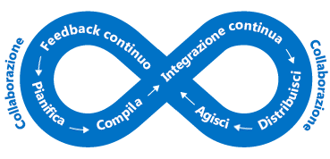

Gli utenti finali si aspettano di più dalle proprie applicazioni.End users are expecting more from their applications. Desiderano avere un'esperienza utente eccezionale e non trovarsi di fronte a problemi di prestazioni.They want to have a great user experience and not be impacted by performance issues. Come si integra, quindi, l'individuazione dei colli di bottiglia di prestazioni nell'architettura?How do you integrate performance bottleneck identification into your architecture? In questa unità verranno esaminati processi e strumenti utili per assicurare un funzionamento ottimale dell'applicazione e individuare gli eventuali problemi.In this unit, we will look at both processes and tools that can help ensure that your application performs well, and help you track down why if it doesn't.

## Importanza dei requisitiImportance of requirements

Prima di descrivere le prestazioni, è importante parlare dei requisiti.Before we talk about performance, it's important to talk about requirements. In teoria si potrebbe continuare a migliorare scalabilità e prestazioni all'infinito.In theory, we could keep improving scalability and performance further and further without end. Tuttavia, superato un certo punto, i miglioramenti assumono costi proibitivi e il loro limitato impatto aziendale non ne giustifica lo sviluppo.At some point, however, more improvement is prohibitively expensive, difficult, and doesn't have enough business impact to be worthwhile. 

I **requisiti non funzionali** aiutano a trovare tale punto.Our **non-functional requirements** help us find that point. Questi requisiti specifici non indicano le *funzioni* dell'app,These particular requirements don't tell us what our app must *do*. bensì i livelli di qualità che deve raggiungere.Instead, they tell us what quality levels it must meet. Ad esempio, è possibile definire questi requisiti non funzionali a indicare in modo che indichino:As examples, we can define these non-functional requirements to tell us:

- La velocità di ritorno di una transazione con un dato carico.How fast a transaction must return under a given load.
- Il numero di connessioni simultanee supportate superato il quale vengono restituiti errori.How many simultaneous connections we need to support before we start returning errors.
- In caso di errore del server, il tempo massimo per cui l'applicazione può rimanere offline prima di attivare un backup.In the event of server failure, what is the maximum amount of time our application is allowed be down before a back-up is online.

Definire questi requisiti prima di compilare la soluzione è fondamentale per assicurare che l'applicazione soddisfi le aspettative degli utenti ma non necessiti di sforzi o costi maggiori rispetto al necessario.Defining these requirements in advance of building your solution is critical to ensure that the application meets expectations but doesn't require more effort or expend more money than necessary. È anche possibile pianificare le regole di monitoraggio e delle operazioni basandosi sui requisiti non funzionali.We can also plan our monitoring and operations rules around these non-functional requirements. 

Esaminare i requisiti con parti interessate o clienti, documentarli e diffonderli per assicurarsi che tutti siano concordi sul significato di "prestazioni adeguate".Discuss requirements with your stakeholders or customers, document them, and communicate them broadly to ensure that everyone agrees on what "good performance" means.

## DevOps e prestazioni delle applicazioniDevOps and application performance

L'idea alla base di DevOps è di non disporre di silo di sviluppo e infrastruttura nell'organizzazione,The idea behind DevOps is that we don't have development and infrastructure silos in our organization. ma di collaborare per compilare, distribuire, monitorare e mantenere le app in modo efficace grazie a un processo semplificato.Instead, they work together to effectively build, deploy, monitor, and maintain apps in streamlined process.

Le fasi di pianificazione, sviluppo, test e monitoraggio vengono effettuate con un approccio iterativo.The planning, development, testing, and monitoring is carried out in an iterative approach. Prestazioni e qualità dell'applicazione entrano a far parte del ciclo di sviluppo del software e non sono più una fase secondaria e successiva alla distribuzione in un ambiente reale.Performance and quality of our application become a part of our software development life cycle, rather than an afterthought as we deploy into a live environment. La figura seguente mostra i punti del ciclo di vita di sviluppo del software in cui sono presenti opportunità di collaborazione.The following illustration shows where opportunities for collaboration exist in the software development lifecycle.

Questo approccio si allinea a un concetto di DevOps denominato "shift left", ossia spostamento a sinistra.This approach aligns with a DevOps concept called "shifting left". In altre parole, si tratta di anticipare i controlli di qualità, integrandoli nei processi di distribuzione e rilascio.In other words, bring your quality control checks earlier into your deployment and release process. In questo modo è possibile individuare prima i problemi che andrebbero a interessare gli utenti finali.This allows you to catch end-user impacting issues earlier in the process. Poiché si opera in un ciclo continuo, l'idea è limitare al massimo la quantità di interazioni manuali, automatizzando il più possibile le operazioni.As we operate in a continuous cycle, we limit the amount of manual interaction and automate as much as possible. 

Un modo per includere le prestazioni nel processo DevOps consiste nell'eseguire test di prestazioni o carico per accertarsi che l'applicazione soddisfi i requisiti non funzionali prima di distribuirla nell'ambiente di produzione.One way we make performance part of our DevOps process is to carry out performance or load tests to validate that the application meets the non-functional requirements prior to a deployment into production.

In teoria, è possibile eseguire questi test in un ambiente identico a quello di produzione senza influire sui server di produzione reali.Ideally, we could carry out performance and load tests in an environment that is exactly like production while not impacting our actual production servers. Sfruttando il cloud, si ha questa possibilità.When leveraging the cloud, you fully have this ability. È possibile automatizzare la creazione di un ambiente di simil-produzione, l'esecuzione dei test e la conseguente rimozione dell'ambiente al fine di ridurre al minimo i costi.You can automate the creation of a production-like environment, perform testing, and then destroy the environment to minimize cost. Questo approccio all'automazione può garantire che l'applicazione disponga di scalabilità sufficiente e possa adattarsi alla crescita futura.This approach to automation can provide reassurance that your application can handle the scale you require now, as well as respond to future growth.

Il monitoraggio delle prestazioni dell'applicazione diventa un componente essenziale di tutto questo.Application performance monitoring becomes a core part of this. Se si eseguono test di carico e prestazioni nell'applicazione o si vuole tenere sotto controllo le prestazioni di produzione, è necessario capire quali parti dell'applicazione non stanno funzionando al meglio.If we're running performance and load tests on our application or want to keep our production performance in check, we want to understand what parts of our application may be performing non-optimally. Verranno ora esaminati alcuni modi per farlo.Let's take a look at some ways to do this.

## Opzioni di monitoraggio delle prestazioni in AzurePerformance monitoring options in Azure

Il monitoraggio comporta la raccolta e l'analisi dei dati per determinare le prestazioni, l'integrità e la disponibilità dell'applicazione aziendale e delle risorse associate.Monitoring is the act of collecting and analyzing data to determine the performance, health, and availability of your business application and associated resources.

L'utente vuole rimanere informato in merito al corretto funzionamento di un'applicazione.We want to be kept informed that our application is running smoothly. È possibile usare le notifiche proattive per offrire informazioni sui problemi critici che si presentano.Proactive notifications can be used to inform about critical issues that arise. Esistono vari livelli di monitoraggio da tenere in considerazione, soprattutto il livello di infrastruttura e il livello dell'applicazione.There are many layers of monitoring to consider, mainly the infrastructure layer and the application layer.

### Monitoraggio di AzureAzure Monitor

Monitoraggio di Azure offre un singolo punto di gestione per i log a livello di infrastruttura e il monitoraggio della maggior parte dei servizi di Azure.Azure Monitor provides a single management point for infrastructure-level logs and monitoring for most of your Azure services. Il servizio raccoglie metriche, log attività, log di diagnostica e altro ancora.It collects metrics, activity logs, and diagnostic logs and more. Monitoraggio di Azure offre una gamma di funzionalità, tra cui:Azure Monitor provides us with a range of features including:

- Avvisi di Azure per inviare una notifica proattiva o intervenire in caso di violazioni di metriche o attività.Azure alerts to proactively notify or take action on any breaches to metrics or activities arising.
- Uso di dashboard di Azure per racchiudere varie origini di monitoraggio in un'unica vista dell'applicazione.Use Azure Dashboards to combine many monitoring sources into one view of our application.

Monitoraggio di Azure è il punto di partenza per tutte le informazioni dettagliate su metriche e risorse, praticamente in tempo reale.Azure Monitor is the place to start for all your near real-time resource metric insights. Molte risorse di Azure inizieranno automaticamente a fornire le metriche una volta distribuite.Many Azure resources will start outputting metrics automatically once deployed. Ad esempio, le istanze dell'app Web di Azure restituiranno le metriche delle richieste di calcolo e dell'applicazione.For example, Azure Web App instances will output compute and application request metrics. Le metriche da Application Insights vengono anch'esse incluse, oltre a quelle di diagnostica dell'host della macchina virtuale.Metrics from Application Insights are also collated here in addition to VM host diagnostic metrics. Una volta abilitata l'opzione, verranno visualizzate anche le metriche di diagnostica del guest della macchina virtuale.VM guest diagnostic metrics will also appear once you opt in.

### Log AnalyticsLog Analytics

La registrazione centralizzata può aiutare a rilevare problemi nascosti, altrimenti difficili da individuare.Centralized logging can help you uncover hidden issues that may be difficult to track down. Con Log Analytics è possibile eseguire query e aggregare i dati in log.With Log Analytics you can query and aggregate data across logs. Questa correlazione da origini incrociate consente di rilevare errori o problemi di prestazioni che altrimenti non sarebbero subito individuabili esaminando log o metriche singoli.This cross-source correlation can help you identify issues or performance problems that may not be evident when looking at logs or metrics individually. La figura seguente visualizza il ruolo di Log Analytics come hub centrale per il monitoraggio dei dati.The following illustration shows how Log Analytics acts as a central hub for monitoring data. Log Analytics riceve i dati di monitoraggio dalle risorse di Azure e li rende disponibile ai consumer per l'analisi o la visualizzazione.Log Analytics receives monitoring data from your Azure resources and makes it available to consumers for analysis or visualization.

È possibile raccogliere e unire un'ampia gamma di origini dati, log di sicurezza, log attività di Azure e log di server, reti e applicazioni.You can collate a wide range of data sources, security logs, Azure activity logs, server, network, and application logs. È anche possibile effettuare il push dei dati di System Center Operations Manager in locale a Log Analytics negli scenari di sviluppo ibridi e far sì che il database SQL di Azure invii le informazioni di diagnostica direttamente in Log Analytics per il monitoraggio dettagliato delle prestazioni.You can also push on-premises System Center Operations Manager data to Log Analytics in hybrid deployment scenarios and have Azure SQL Database send diagnostic information directly into Log Analytics for detailed performance monitoring.

La registrazione centralizzata può essere estremamente utile per la risoluzione di tutta una serie di problemi, inclusi quelli di prestazioni.Centralized logging can be massively beneficial for troubleshooting all types of scenarios, including performance issues. È una parte fondamentale di una buona strategia di monitoraggio per qualsiasi architettura.It's a key part of a good monitoring strategy for any architecture.

## Gestione delle prestazioni delle applicazioniApplication performance management

Possono verificarsi anche dei problemi più a fondo, più difficili da individuare.Deep application issues are often tricky to track down. Qui entra in gioco l'integrazione della telemetria in un'applicazione tramite una soluzione di gestione delle prestazioni delle applicazioni (APM) per tenere traccia delle prestazioni e del comportamento di basso livello dell'applicazione.This is where integrating telemetry into an application by using an application performance management solution (APM) to track down low-level application performance and behavior can be beneficial. Questi dati di telemetria possono includere tempi di richiesta delle singole pagine, eccezioni all'interno dell'applicazione e anche metriche personalizzate per tenere traccia della logica di business.This telemetry can include individual page request times, exceptions within your application, and even custom metrics to track business logic. Possono quindi offrire tutta una serie di informazioni dettagliate sul funzionamento dell'applicazione.This telemetry can provide a wealth of insight into what is going on within your application.

In Azure, Application Insights è un servizio che permette questa gestione approfondita delle prestazioni dell'applicazione.On Azure, Application Insights is a service that provides this deep application performance management. Si installa un piccolo pacchetto di strumentazione nell'applicazione e si configura una risorsa di Application Insights nel portale di Microsoft Azure.You install a small instrumentation package in your application, and set up an Application Insights resource in the Microsoft Azure portal. La strumentazione monitora l'app e invia i dati di telemetria al portale.The instrumentation monitors your app and sends telemetry data to the portal.

È anche possibile inserire i dati di telemetria dagli ambienti host, ad esempio i contatori delle prestazioni, la diagnostica di Azure o i log di Docker.Telemetry from the host environments, such as performance counters, Azure diagnostics, and Docker logs, can be ingested. È possibile configurare test Web che inviano periodicamente richieste sintetiche al servizio Web.You can also set up web tests that periodically send synthetic requests to your web service. Se lo si desidera, è anche possibile configurare l'applicazione per inviare metriche ed eventi personalizzati scritti dall'utente nel codice del client o del server.You could even configure your application to send custom events and metrics that you write yourself in the client or server code. Ad esempio, eventi specifici di un'applicazione, come gli articoli venduti o le partite vinte.For example, application-specific events such as items sold or games won.

Application Insights archivia i dati in un repository comune e le metriche vengono condivise con Monitoraggio di Azure.Application Insights stores its data in a common repository, and metrics are shared with Azure Monitor. Il servizio può trarre vantaggio da funzionalità condivise come avvisi, dashboard e analisi approfondite con il linguaggio di query di Log Analytics.It can take advantage of shared functionality such as alerts, dashboards, and deep analysis with the Log Analytics query language.

Un modello comune usato per determinare la disponibilità di un'applicazione Web è il modello di monitoraggio degli endpoint di integrità.A common pattern used in determining the availability of a web application is the health endpoint monitoring pattern. Questo modello viene usato per monitorare le applicazioni Web e i servizi back-end associati per verificare che siano disponibili e funzionino correttamente.This pattern is used to monitor web applications and associated back-end services, to ensure that they're available and performing correctly. Il modello viene implementato tramite la query a un URI specifico.The pattern is implemented by querying a particular uri. L'endpoint controlla lo stato di molti componenti, inclusi i servizi back-end da cui dipende l'app, e non solamente la disponibilità del front-end stesso.The endpoint checks on the status of many components, including the back-end services that the app depends on, rather than just the availability of the front end itself. Questa funzione agisce come un controllo di integrità a livello di servizio e restituisce un'indicazione dell'integrità complessiva del servizio.This acts as a service-level health check that returns an indication of the overall health of the service.

Usare una soluzione APM, ad esempio Application Insights, per comprendere più a fondo l'applicazione e le attività correlate.Use an APM solution such as Application Insights to gain a deep understanding of your application and correlate activity across your application. In questo modo è possibile comprendere il funzionamento di un'azione specifica nel browser client, nel server e fino ai servizi downstream.This can help you understand how a specific action works in the client browser, on the server, and through to downstream services. Si otterranno anche informazioni utili sulle tendenze e si riceveranno notifiche in caso di problemi, potendo così individuare più facilmente il problema e come risolverlo prima che vada a interessare gli utenti.It will also provide insight into trends, provide notifications when there is a problem, and help identify where the problem is and how to fix it, before your users are aware.

## Monitoraggio delle prestazioni in Lamna HealthcarePerformance monitoring at Lamna Healthcare

Lamna Healthcare ha implementato un sistema di prenotazione basato su Web per i pazienti, usando macchine virtuali e un database SQL di Azure in due aree di Azure.Lamna Healthcare has implemented a web-based patient booking system using virtual machines and an Azure SQL database across two Azure regions. L'azienda decide di usare l'agente di macchine virtuali e Log Analytics per monitorare le prestazioni delle macchine virtuali front-end sottostanti.They've decided to use the VM Agent and Log Analytics to monitor the performance of the underlying front-end virtual machines.

Viene usato Monitoraggio di Azure per comprendere le prestazioni dei database SQL di Azure e acquisire metriche di prestazioni chiave, tra cui la % di utilizzo della CPU e i deadlock.They use Azure Monitor to understand the performance of their Azure SQL databases and capture key performance metrics including CPU % and deadlocks.

Application Insights è stato configurato per acquisire le informazioni di disponibilità e di telemetria.Application Insights has been configured to capture availability and telemetry information. Il team ha modificato la nuova funzionalità di prenotazione per inviare telemetrie di eventi personalizzati ad Application Insights.The team has changed their new booking functionality to send custom event telemetry to Application Insights. Il team ora dispone di un approccio per comprendere il volume degli eventi aziendali presenti e può ottenere informazioni molto più dettagliate sul funzionamento dell'applicazione.The team now has an approach to understanding the volume of business-related events taking place, and they can get much better insight into what's going on within their application.

## RiepilogoSummary

Sono stati illustrati alcuni processi, strumenti e procedure consigliate per aiutare a individuare i problemi di prestazioni e assicurare il funzionamento ottimale dell'applicazione.We've taken a look at some processes, tools, and best practices to help you track down performance issues and ensure that your application is performing at its best. Ora viene fornito un riepilogo di quanto appreso nel modulo.Let's wrap up what we've learned throughout this module.
