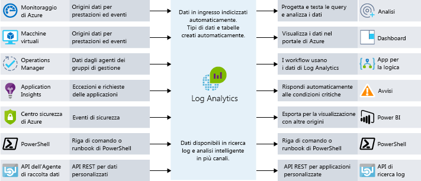

Gli utenti finali si aspettano di più dalle proprie applicazioni. Desiderano avere un'esperienza utente eccezionale e non trovarsi di fronte a problemi di prestazioni. Come si integra, quindi, l'individuazione dei colli di bottiglia di prestazioni nell'architettura? In questa unità verranno esaminati processi e strumenti utili per assicurare un funzionamento ottimale dell'applicazione e individuare gli eventuali problemi.

## Importanza dei requisiti

Prima di descrivere le prestazioni, è importante parlare dei requisiti. In teoria si potrebbe continuare a migliorare scalabilità e prestazioni all'infinito. Tuttavia, superato un certo punto, i miglioramenti assumono costi proibitivi e il loro limitato impatto aziendale non ne giustifica lo sviluppo. 

I **requisiti non funzionali** aiutano a trovare tale punto. Questi requisiti specifici non indicano le *funzioni* dell'app, bensì i livelli di qualità che deve raggiungere. Ad esempio, è possibile definire questi requisiti non funzionali a indicare in modo che indichino:

- La velocità di ritorno di una transazione con un dato carico.
- Il numero di connessioni simultanee supportate superato il quale vengono restituiti errori.
- In caso di errore del server, il tempo massimo per cui l'applicazione può rimanere offline prima di attivare un backup.

Definire questi requisiti prima di compilare la soluzione è fondamentale per assicurare che l'applicazione soddisfi le aspettative degli utenti ma non necessiti di sforzi o costi maggiori rispetto al necessario. È anche possibile pianificare le regole di monitoraggio e delle operazioni basandosi sui requisiti non funzionali. 

Esaminare i requisiti con parti interessate o clienti, documentarli e diffonderli per assicurarsi che tutti siano concordi sul significato di "prestazioni adeguate".

## DevOps e prestazioni delle applicazioni

L'idea alla base di DevOps è di non disporre di silo di sviluppo e infrastruttura nell'organizzazione, ma di collaborare per compilare, distribuire, monitorare e mantenere le app in modo efficace grazie a un processo semplificato.

Le fasi di pianificazione, sviluppo, test e monitoraggio vengono effettuate con un approccio iterativo. Prestazioni e qualità dell'applicazione entrano a far parte del ciclo di sviluppo del software e non sono più una fase secondaria e successiva alla distribuzione in un ambiente reale. La figura seguente mostra i punti del ciclo di vita di sviluppo del software in cui sono presenti opportunità di collaborazione.

Questo approccio si allinea a un concetto di DevOps denominato "shift left", ossia spostamento a sinistra. In altre parole, si tratta di anticipare i controlli di qualità, integrandoli nei processi di distribuzione e rilascio. In questo modo è possibile individuare prima i problemi che andrebbero a interessare gli utenti finali. Poiché si opera in un ciclo continuo, l'idea è limitare al massimo la quantità di interazioni manuali, automatizzando il più possibile le operazioni. 

Un modo per includere le prestazioni nel processo DevOps consiste nell'eseguire test di prestazioni o carico per accertarsi che l'applicazione soddisfi i requisiti non funzionali prima di distribuirla nell'ambiente di produzione.

In teoria, è possibile eseguire questi test in un ambiente identico a quello di produzione senza influire sui server di produzione reali. Sfruttando il cloud, si ha questa possibilità. È possibile automatizzare la creazione di un ambiente di simil-produzione, l'esecuzione dei test e la conseguente rimozione dell'ambiente al fine di ridurre al minimo i costi. Questo approccio all'automazione può garantire che l'applicazione disponga di scalabilità sufficiente e possa adattarsi alla crescita futura.

Il monitoraggio delle prestazioni dell'applicazione diventa un componente essenziale di tutto questo. Se si eseguono test di carico e prestazioni nell'applicazione o si vuole tenere sotto controllo le prestazioni di produzione, è necessario capire quali parti dell'applicazione non stanno funzionando al meglio. Verranno ora esaminati alcuni modi per farlo.

## Opzioni di monitoraggio delle prestazioni in Azure

Il monitoraggio comporta la raccolta e l'analisi dei dati per determinare le prestazioni, l'integrità e la disponibilità dell'applicazione aziendale e delle risorse associate.

L'utente vuole rimanere informato in merito al corretto funzionamento di un'applicazione. È possibile usare le notifiche proattive per offrire informazioni sui problemi critici che si presentano. Esistono vari livelli di monitoraggio da tenere in considerazione, soprattutto il livello di infrastruttura e il livello dell'applicazione.

### Monitoraggio di Azure

Monitoraggio di Azure offre un singolo punto di gestione per i log a livello di infrastruttura e il monitoraggio della maggior parte dei servizi di Azure. Il servizio raccoglie metriche, log attività, log di diagnostica e altro ancora. Monitoraggio di Azure offre una gamma di funzionalità, tra cui:

- Avvisi di Azure per inviare una notifica proattiva o intervenire in caso di violazioni di metriche o attività.
- Uso di dashboard di Azure per racchiudere varie origini di monitoraggio in un'unica vista dell'applicazione.

Monitoraggio di Azure è il punto di partenza per tutte le informazioni dettagliate su metriche e risorse, praticamente in tempo reale. Molte risorse di Azure inizieranno automaticamente a fornire le metriche una volta distribuite. Ad esempio, le istanze dell'app Web di Azure restituiranno le metriche delle richieste di calcolo e dell'applicazione. Le metriche da Application Insights vengono anch'esse incluse, oltre a quelle di diagnostica dell'host della macchina virtuale. Una volta abilitata l'opzione, verranno visualizzate anche le metriche di diagnostica del guest della macchina virtuale.

### Log Analytics

La registrazione centralizzata può aiutare a rilevare problemi nascosti, altrimenti difficili da individuare. Con Log Analytics è possibile eseguire query e aggregare i dati in log. Questa correlazione da origini incrociate consente di rilevare errori o problemi di prestazioni che altrimenti non sarebbero subito individuabili esaminando log o metriche singoli. La figura seguente visualizza il ruolo di Log Analytics come hub centrale per il monitoraggio dei dati. Log Analytics riceve i dati di monitoraggio dalle risorse di Azure e li rende disponibile ai consumer per l'analisi o la visualizzazione.

È possibile raccogliere e unire un'ampia gamma di origini dati, log di sicurezza, log attività di Azure e log di server, reti e applicazioni. È anche possibile effettuare il push dei dati di System Center Operations Manager in locale a Log Analytics negli scenari di sviluppo ibridi e far sì che il database SQL di Azure invii le informazioni di diagnostica direttamente in Log Analytics per il monitoraggio dettagliato delle prestazioni.

La registrazione centralizzata può essere estremamente utile per la risoluzione di tutta una serie di problemi, inclusi quelli di prestazioni. È una parte fondamentale di una buona strategia di monitoraggio per qualsiasi architettura.

## Gestione delle prestazioni delle applicazioni

Possono verificarsi anche dei problemi più a fondo, più difficili da individuare. Qui entra in gioco l'integrazione della telemetria in un'applicazione tramite una soluzione di gestione delle prestazioni delle applicazioni (APM) per tenere traccia delle prestazioni e del comportamento di basso livello dell'applicazione. Questi dati di telemetria possono includere tempi di richiesta delle singole pagine, eccezioni all'interno dell'applicazione e anche metriche personalizzate per tenere traccia della logica di business. Possono quindi offrire tutta una serie di informazioni dettagliate sul funzionamento dell'applicazione.

In Azure, Application Insights è un servizio che permette questa gestione approfondita delle prestazioni dell'applicazione. Si installa un piccolo pacchetto di strumentazione nell'applicazione e si configura una risorsa di Application Insights nel portale di Microsoft Azure. La strumentazione monitora l'app e invia i dati di telemetria al portale.

È anche possibile inserire i dati di telemetria dagli ambienti host, ad esempio i contatori delle prestazioni, la diagnostica di Azure o i log di Docker. È possibile configurare test Web che inviano periodicamente richieste sintetiche al servizio Web. Se lo si desidera, è anche possibile configurare l'applicazione per inviare metriche ed eventi personalizzati scritti dall'utente nel codice del client o del server. Ad esempio, eventi specifici di un'applicazione, come gli articoli venduti o le partite vinte.

Application Insights archivia i dati in un repository comune e le metriche vengono condivise con Monitoraggio di Azure. Il servizio può trarre vantaggio da funzionalità condivise come avvisi, dashboard e analisi approfondite con il linguaggio di query di Log Analytics.

Un modello comune usato per determinare la disponibilità di un'applicazione Web è il modello di monitoraggio degli endpoint di integrità. Questo modello viene usato per monitorare le applicazioni Web e i servizi back-end associati per verificare che siano disponibili e funzionino correttamente. Il modello viene implementato tramite la query a un URI specifico. L'endpoint controlla lo stato di molti componenti, inclusi i servizi back-end da cui dipende l'app, e non solamente la disponibilità del front-end stesso. Questa funzione agisce come un controllo di integrità a livello di servizio e restituisce un'indicazione dell'integrità complessiva del servizio.

Usare una soluzione APM, ad esempio Application Insights, per comprendere più a fondo l'applicazione e le attività correlate. In questo modo è possibile comprendere il funzionamento di un'azione specifica nel browser client, nel server e fino ai servizi downstream. Si otterranno anche informazioni utili sulle tendenze e si riceveranno notifiche in caso di problemi, potendo così individuare più facilmente il problema e come risolverlo prima che vada a interessare gli utenti.

## Monitoraggio delle prestazioni in Lamna Healthcare

Lamna Healthcare ha implementato un sistema di prenotazione basato su Web per i pazienti, usando macchine virtuali e un database SQL di Azure in due aree di Azure. L'azienda decide di usare l'agente di macchine virtuali e Log Analytics per monitorare le prestazioni delle macchine virtuali front-end sottostanti.

Viene usato Monitoraggio di Azure per comprendere le prestazioni dei database SQL di Azure e acquisire metriche di prestazioni chiave, tra cui la % di utilizzo della CPU e i deadlock.

Application Insights è stato configurato per acquisire le informazioni di disponibilità e di telemetria. Il team ha modificato la nuova funzionalità di prenotazione per inviare telemetrie di eventi personalizzati ad Application Insights. Il team ora dispone di un approccio per comprendere il volume degli eventi aziendali presenti e può ottenere informazioni molto più dettagliate sul funzionamento dell'applicazione.

## Riepilogo

Sono stati illustrati alcuni processi, strumenti e procedure consigliate per aiutare a individuare i problemi di prestazioni e assicurare il funzionamento ottimale dell'applicazione. Ora viene fornito un riepilogo di quanto appreso nel modulo.
