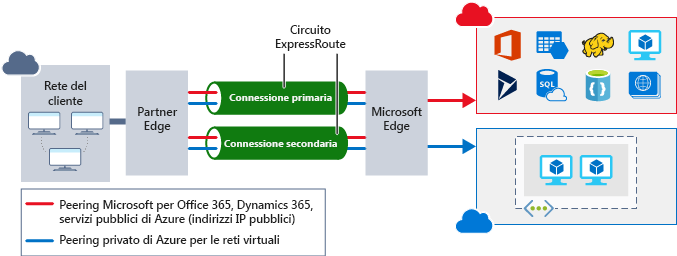

La protezione della rete da attacchi e da accessi non autorizzati è una parte importante di qualsiasi architettura.Securing your network from attacks and unauthorized access is an important part of any architecture. Nell'ambito della pianificazione della migrazione nel cloud, Lamna Healthcare si è impegnata a progettare la propria infrastruttura di rete per garantire la presenza di controlli di sicurezza di rete appropriati e proteggere l'infrastruttura di rete da attacchi.As part of the planning for its cloud migration, Lamna Healthcare took the time to plan out its network infrastructure to ensure it had the proper network security controls in place to protect its network infrastructure from attack. Si osserverà ora che cosa si intende per sicurezza di rete, come integrare un approccio a più livelli nell'architettura e in che modo Azure garantisce la sicurezza di rete per l'ambiente.Here, we'll take a look at what network security looks like, how to integrate a layered approach into your architecture, and how Azure can help you provide network security for your environment.

## Che cos'è la sicurezza di reteWhat is network security

La sicurezza di rete consiste nel proteggere le comunicazioni delle risorse all'interno e all'esterno della rete.Network security is protecting the communication of resources within and outside of your network. L'obiettivo è quello di limitare l'esposizione dei servizi e dei sistemi a livello di rete.The goal is to limit exposure at the network layer across your services and systems. Limitando l'esposizione, si riduce la probabilità che le risorse possano essere attaccate.By limiting this exposure, you decrease the likelihood that your resources can be attacked. Nell'ottica della sicurezza di rete, gli sforzi possono concentrarsi sugli ambiti seguenti:In the focus on network security, efforts can be focused on the following areas:

- Proteggere il flusso del traffico tra le applicazioni e InternetSecuring traffic flow between applications and the internet
- Proteggere il flusso del traffico tra un'applicazione e l'altraSecuring traffic flow amongst applications
- Proteggere il flusso del traffico tra gli utenti e l'applicazioneSecuring traffic flow between users and the application

Proteggere il flusso del traffico tra le applicazioni e Internet significa limitare l'esposizione all'esterno della rete.Securing traffic flow between applications and the internet focuses on limiting exposure outside your network. Poiché gli attacchi di rete iniziano prevalentemente al di fuori della rete, limitando l'esposizione su Internet e proteggendo il perimetro, è possibile ridurre il rischio di attacchi.Network attacks will most frequently start outside your network, so by limiting the internet exposure and securing the perimeter, the risk of being attacked can be reduced.

La protezione del traffico tra applicazioni deve essere incentrata sui dati tra le applicazioni e i rispettivi livelli, tra diversi ambienti e in altri servizi all'interno della rete.Securing traffic flow amongst applications focuses on  data between applications and their tiers, between different environments, and in other services within your network. Limitando l'esposizione tra queste risorse, si riduce il possibile effetto di una risorsa compromessa.By limiting exposure between these resources, you reduce the effect a compromised resource can have. Questo contribuisce a contenere l'ulteriore propagazione nella rete.This can help reduce further propagation within a network.

Proteggere il flusso del traffico tra utenti e l'applicazione significa proteggere il flusso di rete per gli utenti finali.Securing traffic flow between users and the application focuses on securing the network flow for your end users. Ciò limita l'esposizione delle risorse agli attacchi esterni e rappresenta un meccanismo che consente agli utenti di usare le risorse in sicurezza.This limits the exposure your resources have to outside attacks, and provides a secure mechanism for users to utilize your resources. 

## Sicurezza di rete basata su un approccio a più livelliA layered approach to network security

Il filo conduttore di questo modulo è l'impiego di un approccio alla sicurezza strutturato su più livelli e questo approccio vale anche per il livello di rete.A common thread throughout this module has been taking a layered approach to security, and this approach is no different at the network layer. Non è sufficiente concentrarsi sulla protezione del perimetro della rete oppure limitarsi a considerare la sicurezza tra servizi all'interno di una rete.It's not enough to just focus on securing the network perimeter, or focusing on the network security between services inside a network. Un approccio a più livelli significa predisporre vari livelli di protezione, in modo che, se un utente malintenzionato riesce a superare un livello, sono presenti ulteriori protezioni per contenere l'attacco.A layered approach provides multiple levels of protection, so that if an attacker gets through one layer, there are further protections in place to limit further attack.

Verranno ora presentati gli strumenti forniti da Azure per creare un approccio a più livelli in grado di proteggere la superficie della rete.Let's take a look at how Azure can provide the tools for a layered approach to securing your network footprint.

### Protezione di InternetInternet protection

Iniziando dal perimetro della rete, l'obiettivo è limitare ed eliminare gli attacchi provenienti da Internet.If we start on the perimeter of the network, we're focused on limiting and eliminating attacks from the internet. Un ottimo punto di partenza consiste nel valutare le risorse con connessione Internet e consentire solo la comunicazione in ingresso e in uscita necessaria.A great first place to start is to assess the resources that are internet-facing, and only allow inbound and outbound communication where necessary. Identificare tutte le risorse che consentono qualsiasi tipo di traffico di rete in ingresso, assicurarsi che siano necessarie e che usino unicamente le porte e i protocolli richiesti.Identify all resources that are allowing inbound network traffic of any type, and ensure they are necessary and restricted to only the ports/protocols required. Centro sicurezza di Azure offre tutte queste informazioni, perché individua le risorse con connessione Internet che non sono associate a gruppi di sicurezza di rete, nonché le risorse non protette da un firewall.Azure Security Center is a great place to look for this information, as it will identify internet-facing resources that don't have network security groups (NSG) associated with them, as well as resources that are not secured behind a firewall.

Esistono un paio di modi per garantire la protezione in ingresso nel perimetro.To provide inbound protection at the perimeter, there are a couple of ways to do this. Il gateway applicazione è un servizio di bilanciamento del carico di livello 7 che include anche un web application firewall (WAF) per garantire la sicurezza avanzata per i servizi basati su HTTP.Application Gateway is a Layer 7 load balancer that also includes a web application firewall (WAF) to provide advanced security for your HTTP-based services. WAF usa regole dei set di regole di base OWASP 3.0 o 2.2.9 e assicura la protezione dalle vulnerabilità più comunemente note, ad esempio gli attacchi cross-site scripting e SQL injection.The WAF is based on rules from the OWASP 3.0 or 2.2.9 core rule sets, and provides protection from commonly-known vulnerabilities such as cross-site scripting and SQL injection.

Per la protezione dei servizi non basati su HTTP o per una maggiore personalizzazione, è possibile proteggere le risorse di rete mediante appliance di rete virtuali.For protection of non-HTTP-based services or for increased customization, network virtual appliances (NVA) can be used to secure your network resources. Le appliance virtuali di rete sono simili alle appliance firewall che si possono trovare in reti locali e sono disponibili presso molti dei più noti fornitori di sicurezza di rete.NVAs are similar to firewall appliances you might find in on-premises networks, and are available from many of the most popular network security vendors. Le appliance virtuali di rete consentono una maggiore personalizzazione delle impostazioni di sicurezza per le applicazioni che la richiedono, ma possono comportare una maggiore complessità, pertanto è consigliabile valutare attentamente i requisiti.NVAs can provide greater customization of security for those applications that require it, but can come with increased complexity, so careful consideration of requirements is advised.

Per qualsiasi risorsa esposta a Internet, esiste il rischio di subire attacchi di tipo Denial of Service.Any resource exposed to the internet is at risk of being attacked by a denial-of-service attack. Questi tipi di attacchi tentano di sovraccaricare una risorsa di rete inviando talmente tante richieste da rallentare o addirittura bloccare la risorsa.These types of attacks attempt to overwhelm a network resource by sending so many requests that the resource becomes slow or unresponsive. Per mitigare questi attacchi, DDoS di Azure fornisce una protezione di base per tutti i servizi di Azure e una protezione avanzata ulteriormente personalizzabile per le proprie risorse.To mitigate these attacks, Azure DDoS provides basic protection across all Azure services and enhanced protection for further customization for your resources. La protezione DDoS blocca il traffico degli attacchi e inoltra il traffico rimanente alla destinazione prevista.DDoS protection blocks attack traffic and forwards the remaining traffic to its intended destination. Entro pochi minuti dal rilevamento degli attacchi, si riceve una notifica in base alle metriche di Monitoraggio di Azure.Within a few minutes of attack detection, you are notified using Azure Monitor metrics.

### Sicurezza della rete virtualeVirtual network security

All'interno di una rete virtuale (VNet) è importante limitare la comunicazione tra le risorse solo a quella davvero necessaria.Once inside a virtual network (VNet), it's important to limit communication between resources to only what is required.

Per la comunicazione tra macchine virtuali, i gruppi di sicurezza di rete (NSG) sono un elemento fondamentale per limitare la comunicazione non necessaria.For communication between virtual machines, network security groups (NSG) are a critical piece to restrict unnecessary communication. I gruppi di sicurezza di rete operano ai livelli 3 e 4 e comprendono un elenco dei tipi di comunicazione consentiti e negati da e verso interfacce di rete e subnet.NSGs operate at layers 3 & 4, and provide a list of allowed and denied communication to and from network interfaces and subnets. I gruppi di sicurezza di rete sono completamente personalizzabili e offrono la possibilità di bloccare completamente la comunicazione di rete da e verso le macchine virtuali.NSGs are fully customizable, and give you the ability to fully lock down network communication to and from your virtual machines. Usando gruppi di sicurezza di rete, è possibile isolare le applicazioni tra ambienti, livelli e servizi.By using NSGs, you can isolate applications between environments, tiers, and services.

![Figura che mostra l'utilizzo di un gruppo di sicurezza di rete per limitare la comunicazione diretta con Internet del back-end e del livello intermedio.An illustration showing usage of network security group to restrict backend and mid-tier from communicating directly with the Internet. Le richieste Internet vengono ricevute dal front-end, che quindi le passa al livello intermedio.The Internet requests are received by the frontend, which then passes them to the mid-tier. Il livello intermedio comunica con il back-end.The mid-tier communicates with the backend. ](../media/azure-network-security.png)

Per isolare i servizi di Azure e consentire unicamente la comunicazione da reti virtuali, usare endpoint di servizio di rete virtuale.To isolate Azure services to only allow communication from virtual networks, use VNet service endpoints. Con gli endpoint di servizio è possibile associare le risorse dei servizi di Azure alla propria rete virtuale.With service endpoints, Azure service resources can be secured to your virtual network. In questo modo si ottiene una maggiore sicurezza perché si rimuove completamente l'accesso Internet pubblico alle risorse, consentendo il traffico solo dalla rete virtuale.Securing service resources to a virtual network provides improved security by fully removing public internet access to resources, and allowing traffic only from your virtual network. Ciò riduce la superficie di attacco per il proprio ambiente e le attività di amministrazione per limitare la comunicazione tra la rete virtuale e i servizi di Azure e assicura il routing ottimale per questa comunicazione.This reduces the attack surface for your environment, reduces the administration required to limit communication between your VNet and Azure services, and provides optimal routing for this communication.

### Integrazione di reteNetwork integration

È una situazione comune quella in cui si dispone di un'infrastruttura di rete esistente che deve essere integrata per consentire la comunicazione da reti locali o per consentire una comunicazione migliore tra servizi in Azure.It's common to have existing network infrastructure that needs to be integrated to provide communication from on-premises networks, or to provide improved communication between services in Azure. Esistono vari modi per gestire questa integrazione e migliorare la sicurezza della rete.There are a few key ways to handle this integration and improve the security of your network.

Le connessioni di rete privata virtuale (VPN) sono un modo comune per stabilire canali di comunicazione sicura tra le reti e questo vale anche quando si lavora con una rete virtuale in Azure.Virtual private network (VPN) connections are a common way of establishing secure communication channels between networks, and this is no different when working with virtual networking on Azure. La connessione tra reti virtuali di Azure e un dispositivo VPN locale è un ottimo modo per garantire comunicazioni protette tra la propria rete e le macchine virtuali in Azure.Connection between Azure VNets and an on-premises VPN device is a great way to provide secure communication between your network and your virtual machines on Azure.

Per creare una connessione privata dedicata tra la rete e Azure, è possibile usare ExpressRoute.To provide a dedicated, private connection between your network and Azure, you can use ExpressRoute. ExpressRoute consente di estendere le reti locali nel cloud Microsoft tramite una connessione privata fornita da un provider di connettività.ExpressRoute lets you extend your on-premises networks into the Microsoft cloud over a private connection facilitated by a connectivity provider. Con ExpressRoute è possibile stabilire connessioni ai servizi cloud Microsoft, come Microsoft Azure, Office 365 e Dynamics 365.With ExpressRoute, you can establish connections to Microsoft cloud services, such as Microsoft Azure, Office 365, and Dynamics 365. Ciò migliora la sicurezza delle comunicazioni locali perché questo tipo di traffico viene inviato tramite il circuito privato anziché tramite Internet.This improves the security of your on-premises communication by sending this traffic over the private circuit instead of over the internet. Non è necessario consentire agli utenti finali l'accesso a questi servizi tramite Internet ed è possibile inviare il traffico tramite appliance per un ulteriore controllo.You don't need to allow access to these services for your end users over the internet, and you can send this traffic through appliances for further traffic inspection.

Per integrare facilmente più reti virtuali in Azure, il peering reti virtuali consente di stabilire una connessione diretta tra reti virtuali designate.To easily integrate multiple VNets in Azure, VNet peering establishes a direct connection between designated VNets. Una volta stabilita la connessione, è possibile usare i gruppi di sicurezza di rete per garantire l'isolamento tra le risorse nello stesso modo in cui si proteggono le risorse all'interno di una rete virtuale.Once established, you can use NSGs to provide isolation between resources in the same way you secure resources within a VNet. Questa integrazione offre la possibilità di fornire lo stesso livello di sicurezza di base in tutte le reti virtuali con peering.This integration gives you the ability to provide the same fundamental layer of security across any peered VNets. La comunicazione è consentita solo tra reti virtuali connesse direttamente.Communication is only allowed between directly connected VNets.

## Sicurezza di rete presso Lamna HealthcareNetwork security at Lamna Healthcare

Lamna Healthcare ha sfruttato molti di questi servizi per costruire un'infrastruttura di rete protetta.Lamna Healthcare has taken advantage of many of these services to build out a secure network infrastructure. La comunicazione tra le risorse è negata per impostazione predefinita e consentita solo quando necessario.Communication between resources is denied by default, and allowed only when required. La connettività in ingresso da Internet è abilitata solo per i servizi che la richiedono. I protocolli RDP e SSH non sono consentiti dagli endpoint Internet, ma solo da risorse interne attendibili.Inbound connectivity from the internet is enabled only for services that require it; RDP and SSH are not permitted from internet endpoints, only from trusted internal resources.

Per proteggere i servizi Web con connessione Internet, questi vengono posizionati dietro gateway applicazione con WAF abilitato.To secure their internet-facing web services, they place them behind Application Gateways with WAF enabled. Questo vale per i servizi in esecuzione sia in macchine virtuali che nel servizio app.This is true both for services running on virtual machines as well as on App Service. I gateway applicazione consentono all'azienda di mettersi al riparo da molte vulnerabilità comuni.By using Application Gateways, they have protection from many of the common vulnerabilities.

È abilitata la protezione DDoS standard per garantire la protezione degli endpoint con connessione Internet da attacchi Denial of Service.They have DDoS standard enabled, to provide protection for their internet-facing endpoints from denial-of-service attacks.

Tramite l'uso di gruppi di risorse di rete, è stato possibile isolare completamente la comunicazione tra i servizi dell'applicazione e tra gli ambienti.Through the use of NSGs, they are able to fully isolate communication between application services and between environments. Sono consentite esclusivamente le comunicazioni necessarie tra i servizi di un ambiente e non è consentito l'accesso tra ambienti di produzione e ambienti non di produzione.They only allow the necessary communication between services within an environment, and no access is allowed between production and non-production environments.

Per creare connettività dedicata tra gli utenti finali e le applicazioni in Azure, è stato effettuato il provisioning di un circuito ExpressRoute con connettività alla rete locale.To provide dedicated connectivity between their end users and applications in Azure, they have provisioned an ExpressRoute circuit with connectivity to their on-premises network. In questo modo il traffico verso Azure non transita da Internet e una connessione privata consente ai servizi in Azure di comunicare con i sistemi rimasti in locale.This keeps their traffic to Azure off the internet and a private connection for their services in Azure to communicate with systems remaining on-premises.

Con questo approccio, Lamna Healthcare ha sfruttato al meglio i servizi di Azure per garantire la sicurezza a più livelli della sua infrastruttura di rete.With this approach, Lamna Healthcare has leveraged Azure services to provide security at multiple layers of their network infrastructure.

## RiepilogoSummary

Un approccio alla sicurezza di rete strutturato su più livelli consente di ridurre il rischio di esposizione agli attacchi basati sulla rete.A layered approach to network security helps reduce your risk of exposure through network-based attacks. Azure offre diversi servizi e funzionalità per proteggere le risorse con connessione Internet, le risorse interne e la comunicazione tra reti locali.Azure provides several services and capabilities to secure your internet-facing resource, internal resources, and communication between on-premises networks. Queste funzionalità rendono possibile la creazione di soluzioni sicure in Azure.These features make it possible to create secure solutions on Azure.