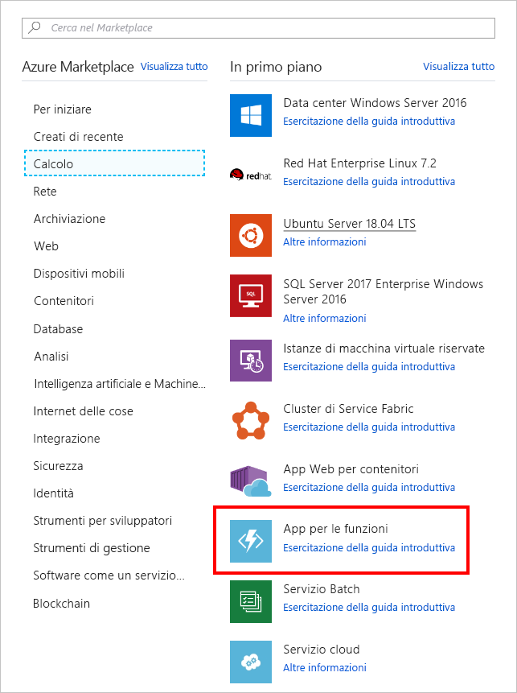

<span data-ttu-id="1e057-101">In questa unità viene creata un'app per le funzioni di Azure che verrà richiamata ogni 20 secondi con un trigger timer.</span><span class="sxs-lookup"><span data-stu-id="1e057-101">In this unit, we create an Azure function app that's invoked every 20 seconds using a timer trigger.</span></span>

[!include[](../../../includes/azure-sandbox-activate.md)]

## <a name="create-an-azure-function-app"></a><span data-ttu-id="1e057-102">Creare un'app per le funzioni di Azure</span><span class="sxs-lookup"><span data-stu-id="1e057-102">Create an Azure function app</span></span>

<span data-ttu-id="1e057-103">Per iniziare, creare un'app per le Funzioni di Azure nel portale.</span><span class="sxs-lookup"><span data-stu-id="1e057-103">Let’s start by creating an Azure Function app in the portal.</span></span>

1. <span data-ttu-id="1e057-104">Accedere al [portale di Azure](https://portal.azure.com/learn.docs.microsoft.com?azure-portal=true) usando lo stesso account con cui è stato attivato l'ambiente sandbox.</span><span class="sxs-lookup"><span data-stu-id="1e057-104">Sign into the [Azure portal](https://portal.azure.com/learn.docs.microsoft.com?azure-portal=true) using the same account you activated the sandbox with.</span></span>

1. <span data-ttu-id="1e057-105">Nel riquadro di spostamento a sinistra selezionare **Crea una risorsa**.</span><span class="sxs-lookup"><span data-stu-id="1e057-105">In the left navigation, select **Create a resource**.</span></span>

1. <span data-ttu-id="1e057-106">Selezionare **Calcolo**.</span><span class="sxs-lookup"><span data-stu-id="1e057-106">Select **Compute**.</span></span>

1. <span data-ttu-id="1e057-107">Individuare e selezionare **App per le funzioni**.</span><span class="sxs-lookup"><span data-stu-id="1e057-107">Locate and select **Function App**.</span></span> <span data-ttu-id="1e057-108">Facoltativamente, è anche possibile usare la barra di ricerca per individuare il modello.</span><span class="sxs-lookup"><span data-stu-id="1e057-108">You can also optionally use the search bar to locate the template.</span></span>

    

1. <span data-ttu-id="1e057-110">Scegliere un **Nome dell'app** globalmente univoco.</span><span class="sxs-lookup"><span data-stu-id="1e057-110">Enter a globally unique **App name**.</span></span>

1. <span data-ttu-id="1e057-111">Selezionare una **Sottoscrizione**.</span><span class="sxs-lookup"><span data-stu-id="1e057-111">Select a **Subscription**.</span></span>

1. <span data-ttu-id="1e057-112">Selezionare il **Gruppo di risorse** esistente <rgn>[nome gruppo di risorse sandbox]</rgn>.</span><span class="sxs-lookup"><span data-stu-id="1e057-112">Select the existing **Resource group** <rgn>[sandbox resource group name]</rgn>.</span></span>

1. <span data-ttu-id="1e057-113">Scegliere **Windows** come **sistema operativo**.</span><span class="sxs-lookup"><span data-stu-id="1e057-113">Choose **Windows** as your **OS**.</span></span>

1. <span data-ttu-id="1e057-114">Scegliere **Piano A consumo** in **Piano di hosting**.</span><span class="sxs-lookup"><span data-stu-id="1e057-114">Choose **Consumption Plan** for your **Hosting Plan**.</span></span> <span data-ttu-id="1e057-115">Verranno addebitati costi per ogni esecuzione della funzione.</span><span class="sxs-lookup"><span data-stu-id="1e057-115">You're charged for each execution of your function.</span></span> <span data-ttu-id="1e057-116">Le risorse verranno allocate automaticamente in base al carico di lavoro dell'applicazione.</span><span class="sxs-lookup"><span data-stu-id="1e057-116">Resources are automatically allocated based on your application workload.</span></span>

1. <span data-ttu-id="1e057-117">Selezionare una **Posizione** dall'elenco disponibile di seguito.</span><span class="sxs-lookup"><span data-stu-id="1e057-117">Select a **Location** from the available list below.</span></span>

    [!include[](../../../includes/azure-sandbox-regions-first-mention-note-friendly.md)]

1. <span data-ttu-id="1e057-118">Per **Stack di runtime**, lasciare il valore predefinito *.NET*, che identifica il linguaggio in cui si implementano gli esempi di funzione in questo esercizio.</span><span class="sxs-lookup"><span data-stu-id="1e057-118">For **Runtime Stack**, leave as default *.NET*, which is the language in which we implement the function examples in this exercise.</span></span>

1. <span data-ttu-id="1e057-119">Creare un nuovo account di **Archiviazione**. Per impostazione predefinita, il nome sarà una variante del nome dell'app, ma è possibile modificarlo.</span><span class="sxs-lookup"><span data-stu-id="1e057-119">Create a new **Storage** account, you can change the name if you like - it will default to a variation of the App name.</span></span>

1. <span data-ttu-id="1e057-120">Selezionare **Crea**.</span><span class="sxs-lookup"><span data-stu-id="1e057-120">Select **Create**.</span></span> <span data-ttu-id="1e057-121">Al completamento della distribuzione dell'app per le funzioni, accedere al portale e selezionare **Tutte le risorse**.</span><span class="sxs-lookup"><span data-stu-id="1e057-121">Once the function app is deployed, go to **All resources** in the portal.</span></span> <span data-ttu-id="1e057-122">L'app per le funzioni sarà inclusa nell'elenco con il tipo **Servizio app** e il nome che le è stato assegnato.</span><span class="sxs-lookup"><span data-stu-id="1e057-122">The function app will be listed with type **App Service** and has the name you gave it.</span></span>
 
<!-- Start temporary fix for issue #2498. -->
> [!IMPORTANT]
> <span data-ttu-id="1e057-123">Gli esercizi in questo modulo attualmente funzionano con Funzioni di Azure V1.</span><span class="sxs-lookup"><span data-stu-id="1e057-123">The exercises in this module currently work with Azure Functions V1.</span></span> <span data-ttu-id="1e057-124">Seguire questa procedura con attenzione per assicurarsi che l'app per le funzioni usi la versione del runtime V1.</span><span class="sxs-lookup"><span data-stu-id="1e057-124">Please follow these steps carefully to make sure your function app uses the V1 runtime version.</span></span> 

1. <span data-ttu-id="1e057-125">Una volta creata l'app per le funzioni, selezionare **Tutte le risorse** nel riquadro di spostamento a sinistra.</span><span class="sxs-lookup"><span data-stu-id="1e057-125">After the function app is created, select **All resources** from the left navigation.</span></span>

1. <span data-ttu-id="1e057-126">Selezionare l'app per le funzioni nell'elenco **App per le funzioni**.</span><span class="sxs-lookup"><span data-stu-id="1e057-126">Select your function app in the **Function Apps** list.</span></span>
1. <span data-ttu-id="1e057-127">Selezionare **Funzionalità della piattaforma**.</span><span class="sxs-lookup"><span data-stu-id="1e057-127">Select **Platform features**.</span></span>
1. <span data-ttu-id="1e057-128">Nella schermata **Funzionalità della piattaforma** selezionare **Impostazioni dell'app per le funzioni** in **Impostazioni generali**.</span><span class="sxs-lookup"><span data-stu-id="1e057-128">In the **Platform features** screen, select **Function app settings** under **General Settings**.</span></span>
1. <span data-ttu-id="1e057-129">Selezionare *~1* in **Versione runtime**.</span><span class="sxs-lookup"><span data-stu-id="1e057-129">Select *~1* in the **Runtime version** .</span></span>
1. <span data-ttu-id="1e057-130">Chiudere **Impostazioni dell'app per le funzioni**.</span><span class="sxs-lookup"><span data-stu-id="1e057-130">Close **Function app settings**.</span></span>

<span data-ttu-id="1e057-131">L'app per le funzioni è ora configurata per usare il runtime V1 di Funzioni di Azure.</span><span class="sxs-lookup"><span data-stu-id="1e057-131">Our function app is now configured to use the Azure Functions V1 runtime.</span></span> <span data-ttu-id="1e057-132">È ora possibile continuare a creare la prima funzione.</span><span class="sxs-lookup"><span data-stu-id="1e057-132">We can now continue to create our first function.</span></span>
<!-- End temporary fix for issue #2498. --> 

## <a name="create-a-timer-trigger"></a><span data-ttu-id="1e057-133">Creare un trigger timer</span><span class="sxs-lookup"><span data-stu-id="1e057-133">Create a timer trigger</span></span>

<span data-ttu-id="1e057-134">Verrà ora creato un trigger timer all'interno della funzione.</span><span class="sxs-lookup"><span data-stu-id="1e057-134">Now we're going to create a timer trigger inside our function.</span></span>


1. <span data-ttu-id="1e057-135">Nel nuovo pannello scegliere **Funzioni** e selezionare l'icona con il segno più (+).</span><span class="sxs-lookup"><span data-stu-id="1e057-135">On the new blade, point to **Functions** and select the plus (+) icon.</span></span>

    

1. <span data-ttu-id="1e057-137">Selezionare **Timer**.</span><span class="sxs-lookup"><span data-stu-id="1e057-137">Select **Timer**.</span></span>

1. <span data-ttu-id="1e057-138">Selezionare **Creare questa funzione**.</span><span class="sxs-lookup"><span data-stu-id="1e057-138">Select **Create this function**.</span></span>

## <a name="configure-the-timer-trigger"></a><span data-ttu-id="1e057-139">Configurare il trigger timer</span><span class="sxs-lookup"><span data-stu-id="1e057-139">Configure the timer trigger</span></span>

<span data-ttu-id="1e057-140">Si ha un'app per le funzioni di Azure la cui logica stampa un messaggio nella finestra di log.</span><span class="sxs-lookup"><span data-stu-id="1e057-140">We have an Azure function app with logic to print a message to the log window.</span></span> <span data-ttu-id="1e057-141">Ora verrà impostata la pianificazione del timer per l'esecuzione ogni 20 secondi.</span><span class="sxs-lookup"><span data-stu-id="1e057-141">We're going to set the schedule of the timer to execute every 20 seconds.</span></span>

1. <span data-ttu-id="1e057-142">Selezionare **Integrazione**.</span><span class="sxs-lookup"><span data-stu-id="1e057-142">Select **Integrate**.</span></span>

1. <span data-ttu-id="1e057-143">Immettere il valore seguente nella casella **Pianifica**:</span><span class="sxs-lookup"><span data-stu-id="1e057-143">Enter the following value into the **Schedule** box:</span></span>

    ```log
    */20 * * * * *
    ```

1. <span data-ttu-id="1e057-144">Selezionare **Salva**.</span><span class="sxs-lookup"><span data-stu-id="1e057-144">Select **Save**.</span></span>

## <a name="test-the-timer"></a><span data-ttu-id="1e057-145">Testare il timer</span><span class="sxs-lookup"><span data-stu-id="1e057-145">Test the timer</span></span>

<span data-ttu-id="1e057-146">Ora che è stato configurato, il timer richiama la funzione nell'intervallo definito.</span><span class="sxs-lookup"><span data-stu-id="1e057-146">Now that we've configured the timer, it will invoke the function on the interval we defined.</span></span>

1. <span data-ttu-id="1e057-147">Selezionare **TimerTriggerCSharp1**.</span><span class="sxs-lookup"><span data-stu-id="1e057-147">Select **TimerTriggerCSharp1**.</span></span>

    > [!NOTE]
    > <span data-ttu-id="1e057-148">**TimerTriggerCSharp1** è un nome predefinito.</span><span class="sxs-lookup"><span data-stu-id="1e057-148">**TimerTriggerCSharp1** is a default name.</span></span> <span data-ttu-id="1e057-149">Viene selezionato automaticamente quando si crea il trigger.</span><span class="sxs-lookup"><span data-stu-id="1e057-149">It's automatically selected when you create the trigger.</span></span>

1. <span data-ttu-id="1e057-150">Aprire il pannello **Log** nella parte inferiore della schermata.</span><span class="sxs-lookup"><span data-stu-id="1e057-150">Open the **Logs** panel at the bottom of the screen.</span></span>

1. <span data-ttu-id="1e057-151">Osservare che i nuovi messaggi arrivano ogni 20 secondi nella finestra del log.</span><span class="sxs-lookup"><span data-stu-id="1e057-151">Observe new messages arrive every 20 seconds in the log window.</span></span>

1. <span data-ttu-id="1e057-152">Per interrompere l'esecuzione della funzione, selezionare **Gestisci** e quindi impostare **Stato funzione** su *Disabilitato*.</span><span class="sxs-lookup"><span data-stu-id="1e057-152">To stop the function from running, select **Manage** and then switch **Function State** to *Disabled*.</span></span>
