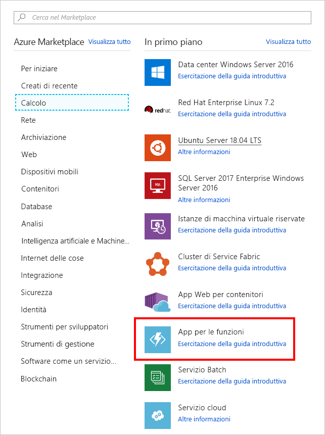

In questo esercizio si crea una funzione di Azure che verrà richiamata ogni 20 secondi con un trigger timer.

> [!NOTE] 
> Per completare l'esercizio, assicurarsi di aver eseguito l'accesso al [portale di Azure](https://portal.azure.com/) con un account valido.

## <a name="create-an-azure-function"></a>Creare una funzione di Azure

Per iniziare, creare una funzione di Azure nel portale.

1. Nel riquadro di spostamento a sinistra selezionare **Crea una risorsa**.

1. Selezionare **Calcolo**.

1. Individuare e selezionare **App per le funzioni**. Facoltativamente, è anche possibile usare la barra di ricerca per individuare il modello.

    

1. Immettere un **nome dell'app** univoco.

1. Selezionare una **sottoscrizione**.

1. Creare un nuovo **gruppo di risorse**.

1. Scegliere **Windows** come **sistema operativo**.

1. Scegliere **Piano A consumo** in **Piano di hosting**. Verranno addebitati costi per ogni esecuzione della funzione. Le risorse verranno allocate automaticamente in base al carico di lavoro dell'applicazione.

1. Selezionare una **località**.

1. Creare un nuovo account di **archiviazione**. Questo valore è obbligatorio, ma non verrà usato.

1. Disattivare **Application Insights**.

1. Selezionare **Crea**.

## <a name="create-a-timer-trigger"></a>Creare un trigger timer

Verrà ora creato un trigger timer all'interno della funzione di Azure.

1. Al termine della creazione della funzione di Azure, selezionare **Tutte le risorse** nel riquadro di spostamento a sinistra.

1. Individuare e selezionare la funzione di Azure.

1. Nel nuovo pannello scegliere **Funzioni** e selezionare l'icona con il segno più (+).

    

1. Selezionare **Timer**.

1. Selezionare **CSharp** come linguaggio.

1. Selezionare **Creare questa funzione**.

## <a name="configure-the-timer-trigger"></a>Configurare il trigger timer

Si ha una funzione di Azure la cui logica stampa un messaggio nella finestra di log. Si imposterà la pianificazione del timer per l'esecuzione ogni 20 secondi.

1. Selezionare **Integrazione**.

1. Immettere il valore seguente nella casella **Pianifica**:

    ```
    */20 * * * * *
    ```

1. Selezionare **Salva**.

## <a name="start-the-timer"></a>Avviare il timer

Dopo aver configurato il timer, è possibile avviarlo.

1. Selezionare **TimerTriggerCSharp1**. 

    > [!NOTE]
    > **TimerTriggerCSharp1** è un nome predefinito. Viene selezionato automaticamente quando si crea il trigger.

1. Selezionare **Esegui**. 

A questo punto, nella finestra di log dovrebbe essere visualizzato un messaggio ogni 20 secondi.

## <a name="clean-up"></a>Eseguire la pulizia

Per evitare che vengano addebitati costi per questa funzione, selezionare **Sospendi** sopra la finestra di log per arrestare il timer.


