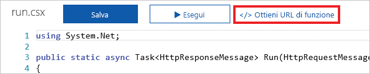

Una richiesta HTTP è un'operazione comune sulla maggior parte delle piattaforme e dei dispositivi.An HTTP request is a common operation on most platforms and devices. Indipendentemente se la richiesta riguarda la ricerca di una parola in un dizionario o informazioni sulle previsioni meteo locali, vengono continuamente inviate richieste HTTP.Whether it's a request to look up a word in a dictionary or to get the local weather, we send HTTP requests all the time. Funzioni di Azure consente di creare rapidamente una parte di logica da eseguire quando viene ricevuta una richiesta HTTP.Azure Functions allows us to quickly create a piece of logic to execute when an HTTP request is received.

In questo caso, si apprenderà come creare e richiamare una funzione di Azure tramite un trigger HTTP.Here, you'll learn how to create and invoke an Azure function using an HTTP trigger. Verranno inoltre illustrate alcune delle opzioni di personalizzazione disponibili.You'll also explore some of the customization options that are available.

## Cos'è un trigger HTTP?What is an HTTP trigger?

Un trigger HTTP è un trigger che esegue una funzione quando viene ricevuta una richiesta HTTP.An HTTP trigger is a trigger that executes a function when it receives an HTTP request. I trigger HTTP presentano molte funzionalità e personalizzazioni, tra cui:HTTP triggers have many capabilities and customizations, including:

- Fornire accesso autorizzato fornendo le chiavi.Provide authorized access by supplying keys.
- Limitare i verbi HTTP supportati.Restrict which HTTP verbs are supported.
- Restituire i dati al chiamante.Return data back to the caller.
- Ricevere i dati tramite i parametri della stringa di query o tramite il corpo della richiesta.Receive data through query string parameters or through the request body.
- Supportare i modelli di route dell'URL per modificare l'URL della funzione.Support URL route templates to modify the function URL.

Quando si crea un trigger HTTP, selezionare un linguaggio di programmazione, fornire un nome trigger e selezionare un livello di autorizzazione.When you create an HTTP trigger, select a programming language, provide a trigger name, and select an Authorization level.

## Cos'è un livello di autorizzazione del trigger HTTP?What is an HTTP trigger Authorization level?

Un livello di autorizzazione del trigger HTTP è un flag che indica se una richiesta HTTP in ingresso necessita di una chiave API per motivi di autenticazione.An HTTP trigger Authorization level is a flag that indicates if an incoming HTTP request needs an API key for authentication reasons.

Esistono tre livelli di autorizzazione:There are three Authorization levels:

1. FunzioneFunction
2. AnonimoAnonymous
3. AdminAdmin

I livelli **Funzione** e **Admin** sono basati sulla "chiave".The **Function** and **Admin** levels are "key" based. Per inviare una richiesta HTTP, è necessario fornire una chiave per l'autenticazione.To send an HTTP request, you must supply a key for authentication. Esistono due tipi di chiavi: *funzione* e *host*.There are two types of keys: *function* and *host*. Le differenze tra le due chiavi sono a livello di ambito.The differences between the two keys are their scope. Le chiavi *funzione* sono specifiche di una funzione.*Function* keys are specific to a function. Le chiavi *host* si applicano a tutte le funzioni all'interno dell'intera applicazione di funzioni di Azure.*Host* keys apply to all functions inside the entire Azure Functions application. Se il livello di autorizzazione è impostato su **Funzione**, è possibile usare una chiave *funzione* o *host*.If your Authorization level is set to **Function**, you can use either a *function* or a *host* key. Se il livello di autorizzazione è impostato su **Admin**, è necessario fornire una chiave *host*.If your Authorization level is set to **Admin**, you must supply a *host* key.

Il livello **Anonimo** indica che non è richiesta alcuna autenticazione.The **Anonymous** level means that there's no authentication required. Nell'esercizio viene usato questo livello.We use this level in our exercise.

## Come creare un trigger HTTPHow to create an HTTP trigger

Proprio come un trigger timer, è possibile creare un trigger HTTP tramite il portale di Azure.Just like a timer trigger, you can create an HTTP trigger through the Azure portal. All'interno della funzione di Azure, selezionare **Trigger HTTP** dall'elenco dei tipi di trigger predefiniti.Inside your Azure function, you select **HTTP trigger** from the list of predefined trigger types. Quindi immettere la logica da eseguire e apportare le eventuali personalizzazioni, ad esempio limitando l'uso di alcuni verbi HTTP.Then you enter the logic that you want to execute and make any customizations like restricting the use of certain HTTP verbs.

Un'impostazione importante da comprendere è **Richiedi nome parametro**.One setting that's important to understand is **Request parameter name**. Questa impostazione è una stringa che rappresenta il nome del parametro che contiene le informazioni relative a una richiesta HTTP in ingresso.This setting is a string that represents the name of the parameter that contains the information about an incoming HTTP request. Per impostazione predefinita, il nome del parametro è *req*.By default, the name of the parameter is *req*.

## Come richiamare un trigger HTTPHow to invoke an HTTP trigger

Per richiamare un trigger HTTP, inviare una richiesta HTTP all'URL per la funzione.To invoke an HTTP trigger, you send an HTTP request to the URL for your function. Per ottenere questo URL, passare alla tabella codici per la funzione e selezionare il collegamento **Get function URL** (Ottieni URL di funzione).To get this URL, go to the code page for your function and select the **Get function URL** link.

Dopo aver ottenuto l'URL per la funzione, è possibile inviare richieste HTTP.After you have the URL for your function, you can send HTTP requests. Se la funzione riceve i dati, tenere presente che è possibile usare i parametri della stringa di query o fornire i dati tramite il corpo della richiesta.If your function receives data, remember that you can use either query string parameters or supply the data through the request body.

## RiepilogoSummary

Un trigger HTTP richiama una funzione di Azure quando viene ricevuta una richiesta HTTP per l'URL della funzione.An HTTP trigger invokes an Azure function when it receives an HTTP request to its function URL. I trigger HTTP consentono di ricevere dati e di restituirli al chiamante.HTTP triggers allow you to receive data and return data back to the caller.
