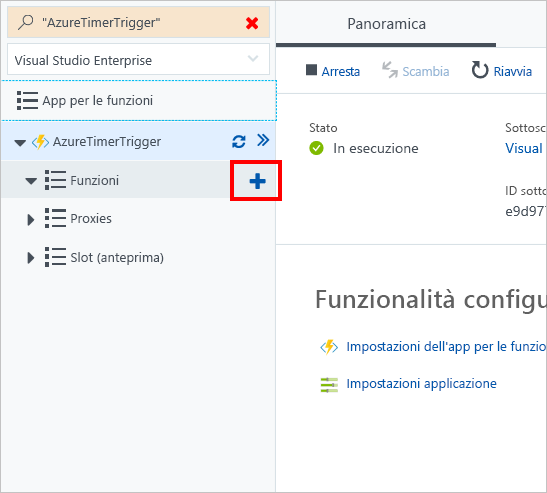

In questo esercizio verrà creata una funzione di Azure che accetta una richiesta HTTP con un'unica stringa. La funzione restituisce una stringa al chiamante per indicare l'esito positivo o negativo.

> [!NOTE]
> Per completare questo esercizio, assicurarsi di aver effettuato l'accesso al [portale di Azure](https://portal.azure.com/) con un account valido.

## <a name="create-an-http-trigger"></a>Creare un trigger HTTP

È possibile continuare a usare l'applicazione Funzioni di Azure esistente e aggiungere un trigger HTTP.

1. Selezionare **Funzioni**, quindi selezionare l'icona del segno più (+).

    

1. Selezionare **Trigger HTTP**.

1. Selezionare **C#** come linguaggio. 

1. Lasciare il **Nome** impostato sul valore predefinito.

1. Impostare il **livello di autorizzazione** su **Anonimo**.

1. Selezionare **Crea**.

1. Verificare rapidamente il codice generato automaticamente per capirne i contenuti. Il parametro *req* rappresenta la richiesta in ingresso e contiene un parametro *nome*. È possibile controllare se il *nome* ha un valore. In caso affermativo, viene restituito un messaggio di saluto. In caso contrario, viene restituito un messaggio di errore.

## <a name="get-your-function-url"></a>Ottenere l'URL della funzione

Dopo aver creato il trigger HTTP, è possibile ottenere l'URL della funzione così da poter iniziare a effettuare una richiesta.

1. Selezionare il trigger HTTP per aprire la schermata di codice.

1. A destra di **Esegui**, selezionare **Ottieni URL della funzione**.

1. Selezionare **Copia**.

1. Selezionare **Esegui** per avviare la funzione.

## <a name="issue-a-get-request-to-your-http-trigger"></a>Inviare una richiesta GET al trigger HTTP

L'URL della funzione è stato copiato negli appunti. È possibile inviare una richiesta GET per vedere se si ottiene una risposta.

1. Aprire una nuova scheda nel web browser.

1. Incollare l'URL nella barra degli indirizzi.

1. Aggiungere un parametro della stringa di query denominato *nome* con il nome, ad esempio:

    ```
    .../api/HttpTriggerCSharp1?name=Jesse
    ```

1. Premere INVIO per inviare la richiesta.

## <a name="clean-up"></a>Eseguire la pulizia

Per assicurarsi che non verranno applicati costi per questa funzione, selezionare **Sospendi** sopra la finestra del log.


