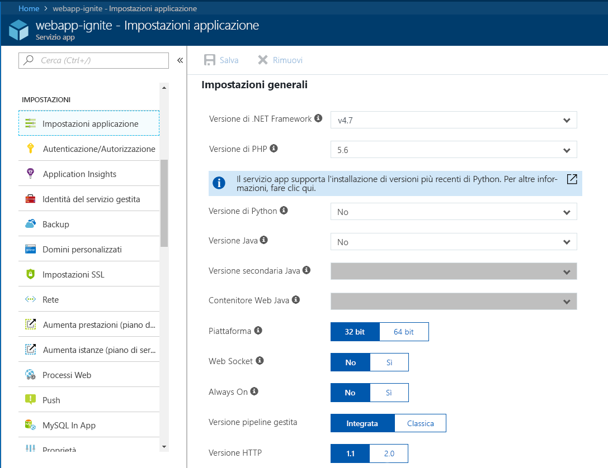
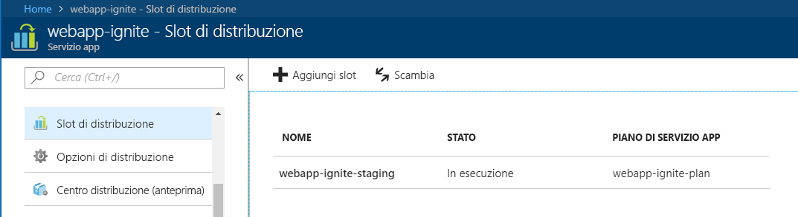
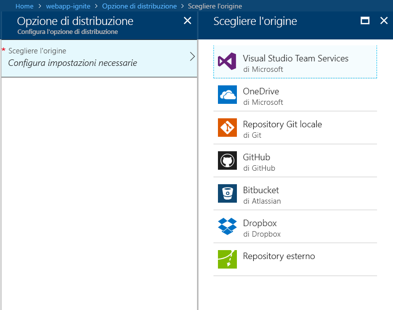

In questa unità si imparerà a creare un'app Web in Servizio app di Azure mediante il portale di Azure.Here, you'll learn how to create a web app in Azure App Service using the Azure portal.

## Perché usare il portale di Azure?Why use the Azure portal?

Il primo passaggio per ospitare un'applicazione Web consiste nel creare un'app Web (app del servizio app) all'interno della sottoscrizione di Azure.The first step in hosting your web application is to create a web app (an App Service app) inside your Azure subscription.

Ci sono diversi modi per creare un'app Web.There are several ways you can create a web app. È possibile usare il portale di Azure, l'interfaccia della riga di comando di Azure, uno script o un ambiente di sviluppo integrato (IDE).You can use the Azure portal, the Azure CLI, a script, or an IDE.

In questo caso verrà usato il portale, che offre un'esperienza grafica ideale per l'apprendimento.Here, we are going to use the portal because it's a graphical experience, which makes it a great learning tool. Il portale consente di individuare le funzionalità disponibili, aggiungere altre risorse e personalizzare le risorse esistenti.The portal helps you discover available features, add additional resources, and customize existing resources.

## Che cos'è Servizio app di Azure?What is Azure App Service?

Servizio app di Azure è una piattaforma di calcolo completamente gestita all'interno dell'ambiente Azure, ottimizzata per l'hosting di app Web, API REST e back-end per dispositivi mobili.Azure App Service is a fully managed computing platform within the Azure environment that is optimized for hosting web apps, REST APIs, and mobile back ends.

Questa piattaforma distribuita come servizio (PaaS, Platform as a Service), offerta da Microsoft Azure, consente di concentrarsi sulle attività di sviluppo, mentre Azure gestisce l'infrastruttura per l'esecuzione e il ridimensionamento delle applicazioni.This platform as a service (PaaS) offered by Microsoft Azure allows you to focus on the build side of things while Azure takes care of the infrastructure to run and scale your applications.

## Come creare un'app WebHow to create a web app

Quando è il momento di ospitare l'app, visitare il portale di Azure e creare un'**app Web**.When it's time to host your own app, you visit the Azure portal and create a **Web App**. Creando un'**app Web** nel portale di Azure, in realtà si crea un set di risorse di hosting in Servizio app, utilizzabili per ospitare qualsiasi applicazione basata su Web supportata da Azure, ad esempio ASP.NET Core, Node.js, PHP e così via. La figura seguente dimostra quanto sia facile configurare il linguaggio o il framework usato dall'app.By creating a **Web App** in the Azure portal, you are actually creating a set of hosting resources in App Service, which you can use to host any web-based application that is supported by Azure, whether it be ASP.NET Core, Node.js, PHP, etc. The figure below shows how easy it is to configure the framework/language used by the app.

Il portale di Azure offre un modello per creare un'app Web.The Azure portal provides a template to create a web app. Il modello richiede i campi seguenti:This template requires the following fields:

- **Nome app**: il nome dell'app Web.**App name**: The name of the web app.
- **Sottoscrizione**: una sottoscrizione valida e attiva.**Subscription**: A valid and active subscription.
- **Gruppo di risorse**: un gruppo di risorse valido.**Resource group**: A valid resource group. Le sezioni seguenti spiegano in dettaglio che cos'è un gruppo di risorse.The sections below explain in detail what a resource group is.
- **Sistema operativo**: il sistema operativo.**OS**: The operating system. Le opzioni sono: Windows, Linux e contenitori Docker.The options are: Windows, Linux, and Docker containers. In Windows è possibile ospitare qualsiasi tipo di applicazione con un'ampia gamma di tecnologie.On Windows, you can host any type of application from a variety of technologies. Lo stesso vale per l'hosting in Linux, anche se in Linux tutte le app ASP.NET devono essere ASP.Net Core nel framework .NET Core.The same applies to Linux hosting, though on Linux, any ASP.NET apps must be ASP.Net Core on the .NET Core framework. L'opzione finale è costituita dai contenitori Docker e consente di distribuire i contenitori direttamente in contenitori ospitati e gestiti da Azure.The final option is Docker containers, where you can deploy your containers directly over containers hosted and maintained by Azure. 
- **Piano di servizio app/Località**: un piano di servizio app di Azure valido.**App Service plan/location**: A valid Azure App Service plan. Le sezioni seguenti spiegano in dettaglio che cos'è un piano di servizio app.The sections below explain in detail what an App Service plan is.
- **Application Insights**: è possibile attivare l'opzione Azure Application Insights e usufruire degli strumenti per il monitoraggio e le metriche offerti dal portale di Azure per tenere sotto controllo le prestazioni delle app.**Applications Insights**: You can turn on the Azure Application Insights option and benefit from the monitoring and metric tools that the Azure portal offers to help you keep an eye on the performance of your apps.

Il portale di Azure offre un supporto ottimale in termini di gestione, monitoraggio e controllo dell'app Web attraverso i numerosi strumenti disponibili.The Azure portal gives you the upper hand in managing, monitoring, and controlling your web app through the many available tools.

### Slot di distribuzioneDeployment slots

Nel portale di Azure è possibile aggiungere facilmente **slot di distribuzione** a un'app Web di Servizio app.Using the Azure portal, you can easily add **deployment slots** to an App Service web app. È ad esempio possibile creare uno slot di distribuzione di **staging** in cui eseguire il push del codice da testare in Azure.For instance, you can create a **staging** deployment slot where you can push your code to test on Azure. Quando si è soddisfatti del codice, è possibile **scambiare** facilmente lo slot di distribuzione di staging con quello di produzione.Once you are happy with your code, you can easily **swap** the staging deployment slot with the production slot. Tutte queste operazioni si eseguono con pochi clic del mouse nel portale di Azure.You do all this with a few simple mouse clicks in the Azure portal.

### Supporto di integrazione e distribuzione continueContinuous integration/deployment support

Il portale di Azure offre opzioni predefinite di integrazione e distribuzione continue con Visual Studio Team Services, GitHub, Bitbucket, Dropbox, OneDrive o un repository Git locale nel computer di sviluppo.The Azure portal provides out-of-the-box continuous integration and deployment with Visual Studio Team Services, GitHub, Bitbucket, Dropbox, OneDrive, or a local Git repository on your development machine. Se si connette l'app Web a una qualsiasi delle origini precedenti, Servizio app eseguirà le altre operazioni per l'utente, sincronizzando automaticamente il codice ed eventuali modifiche apportate in futuro al codice nell'app Web.You connect your web app with any of the above sources and App Service will do the rest for you by auto-syncing code and any future changes on the code into the web app. Inoltre, con Visual Studio Team Services, è possibile definire un processo personalizzato di compilazione e rilascio che consente di compilare il codice sorgente, eseguire i test, creare una versione e infine eseguire il push della versione in un'app Web ogni volta che si esegue il commit del codice.Furthermore, with Visual Studio Team Services, you can define your own build and release process that ends up compiling your source code, running the tests, building a release, and finally pushing the release into a web app every time you commit the code. Tutto ciò avviene in modo implicito senza alcun intervento da parte dell'utente.All that happens implicitly without any need to intervene.

### Pubblicazione di Visual Studio e pubblicazione FTP integrateIntegrated Visual Studio publishing and FTP publishing

Oltre a configurare l'integrazione e la distribuzione continue per l'app Web, è sempre possibile usufruire della stretta integrazione con Visual Studio per pubblicare l'app Web in Azure usando la tecnologia Distribuzione Web.In addition to being able to set up continuous integration/deployment for your web app, you can always benefit from the tight integration with Visual Studio to publish your web app to Azure via Web Deploy technology. Azure supporta inoltre il protocollo FTP, anche se è preferibile non usare FTP per la pubblicazione perché mancano alcune funzionalità in Distribuzione Web per l'individuazione e la scelta solo dei file che sono stati modificati o aggiunti, invece di pubblicare tutto in Azure.Also, Azure supports FTP, although you are better off not using FTP for publishing because it lacks some capability in Web Deploy to pick and choose only those files that were changed or added, and not just publish everything to Azure!

### Supporto integrato per la scalabilità automatica (scalabilità orizzontale in base al carico di lavoro reale)Built-in auto scale support (automatic scale-out based on real-world load)

L'app Web offre capacità di scalabilità verticale e orizzontale. In base all'uso dell'app Web, è possibile aumentare o diminuire le prestazioni dell'app aumentando o diminuendo le risorse del computer sottostante che ospita l'app Web.Baked into the web app is the ability to scale up/down or scale out. Depending on the usage of the web app, you can scale your app up/down by increasing/decreasing the resources of the underlying machine that is hosting your web app. Le risorse possono essere rappresentate dal numero di core o dalla quantità di RAM disponibile.Resources can be number of cores or the amount of RAM available.

La scalabilità orizzontale è invece la possibilità di aumentare il numero di istanze di computer che eseguono l'app Web.Scaling out, on the other hand, is the ability to increase the number of machine instances that are running your web app.

## Che cos'è un gruppo di risorse?What is a resource group?

Un gruppo di risorse è un metodo di raggruppamento di risorse e servizi interdipendenti, ad esempio macchine virtuali, app Web, database e altro ancora, per un'applicazione e un ambiente specifici.A resource group is a method of grouping interdependent resources and services such as virtual machines, web apps, databases, and more for a given application and environment. Può essere considerato come una **cartella** o una posizione in cui raggruppare gli elementi dell'app.Think of it as a **folder**, a place to group elements of your app.

I gruppi di risorse consentono di gestire ed eliminare le risorse con facilità.Resource groups allow you to easily manage and delete resources. Consentono inoltre il monitoraggio, il controllo dell'accesso, il provisioning e la gestione della fatturazione per le raccolte di risorse necessarie per eseguire un'applicazione o usate da un client.They also provide a way to monitor, control access, provision, and manage billing for collections of resources that are required to run an application or are used by a client.

## Che cos'è un piano di servizio app?What is an App Service plan?

Un piano di servizio app è un set di risorse fisiche e capacità per la distribuzione delle app del servizio app.An App Service plan is a set of physical resources and capacity available to deploy your App Service apps into.

Il portale di Azure offre un modello per creare un nuovo piano di servizio app.The Azure portal provides a template to create a new App Service plan. Il modello richiede le seguenti informazioni di base:This template requires the following basic information:

- Area (Stati Uniti occidentali, Stati Uniti centrali, Europa settentrionale e così via)Region (West US, Central US, North Europe, etc.)
- Numero di scala (una, due, tre istanze e così via)Scale count (one, two, three instances, etc.)
- Dimensione dell'istanza (Small, Medium o Large)Instance size (Small, Medium, or Large)
- SKU o piano tariffario (Gratuito, Condiviso, Basic, Standard, Premium, PremiumV2 e Isolato)SKU, or pricing tier (Free, Shared, Basic, Standard, Premium, PremiumV2, and Isolated)

App Web, app per dispositivi mobili e app per le API ospitate in Servizio app di Azure e Funzioni di Azure, tutte eseguite in un piano di servizio app.Web apps, mobile apps, and API apps hosted in Azure App Service, as well as Azure Functions, all run in an App Service plan. Sebbene sia possibile distribuire un numero illimitato di applicazioni in un piano di servizio app, il numero varia notevolmente in base ai tipi di applicazioni distribuiti e alle relative risorse necessarie in termini di utilizzo della CPU.While you can deploy an unlimited number of applications into an App Service plan, the number you use greatly depends on the types of applications deployed and their required resources in CPU utilization.

È sempre possibile usare il piano di servizio app nel portale di Azure per visualizzare l'utilizzo della CPU e della memoria e determinare se è necessario ridimensionare o spostare le applicazioni in un altro piano di servizio app.You can always use your App Service plan in the Azure portal to visualize your CPU and memory utilization to help determine your needs for scaling or moving applications into another App Service plan.
